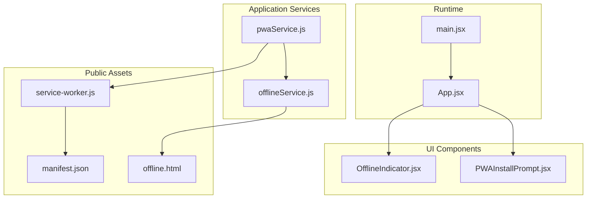
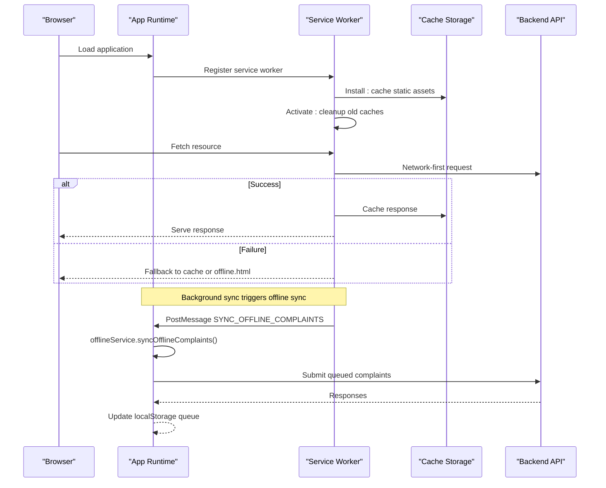
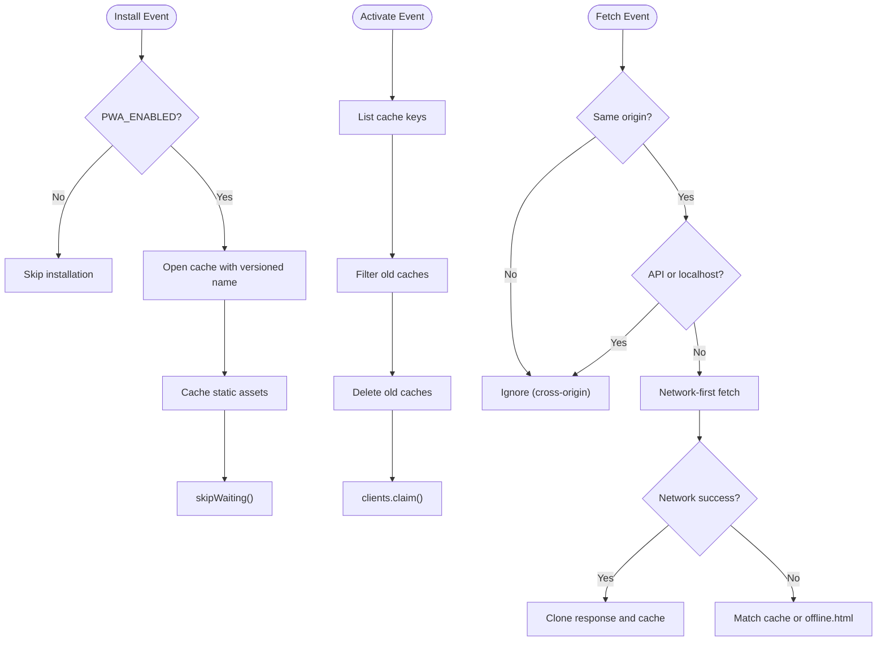
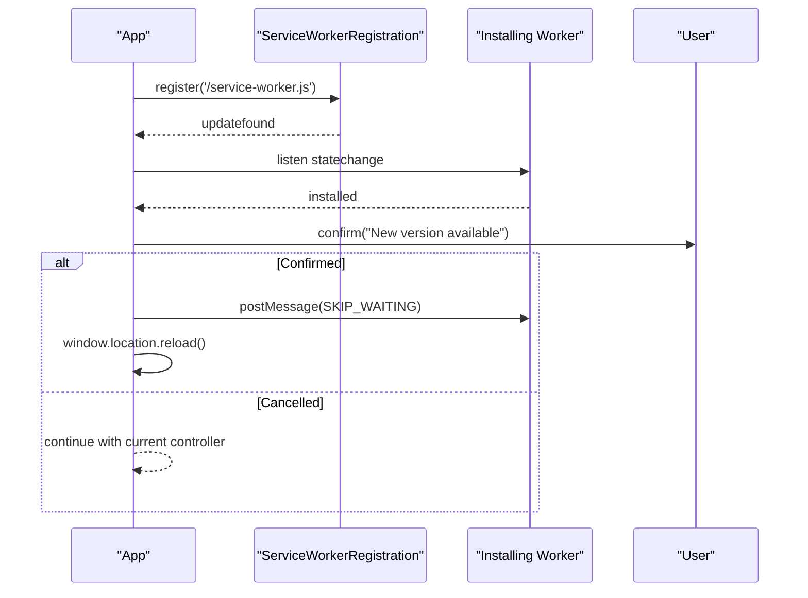
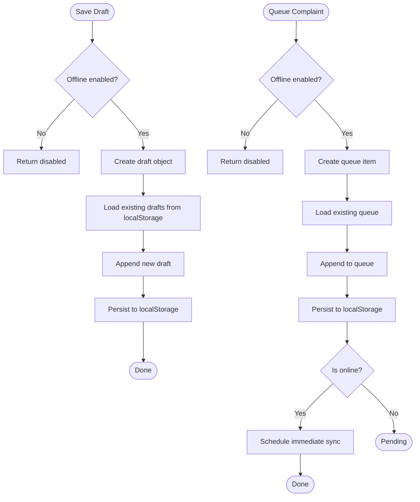
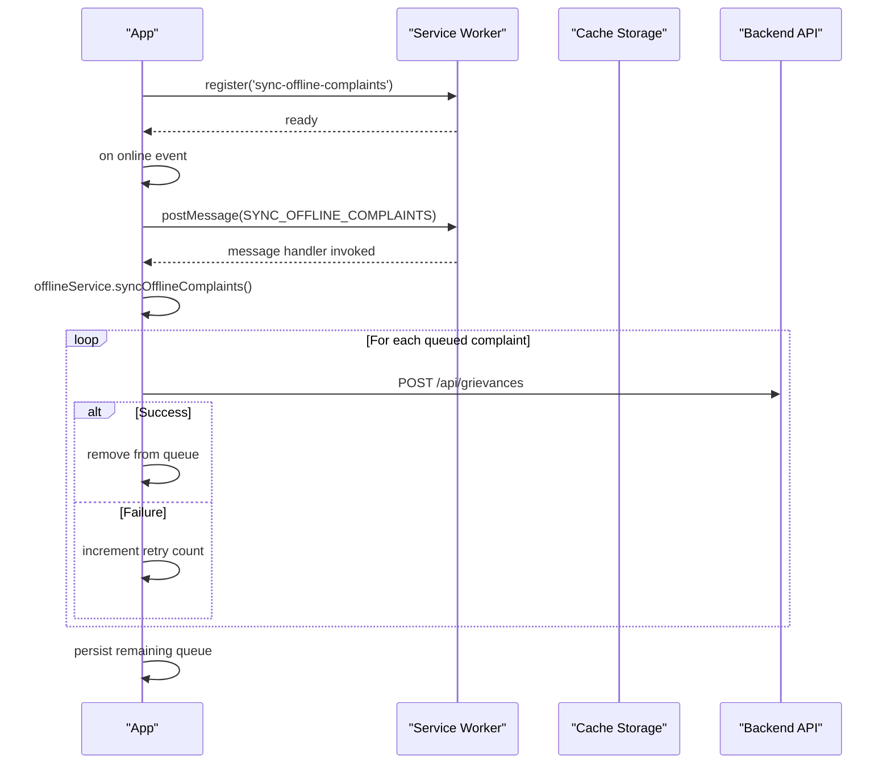
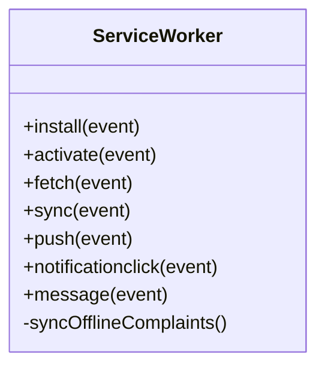
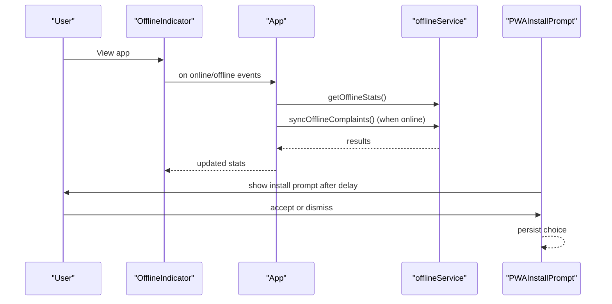
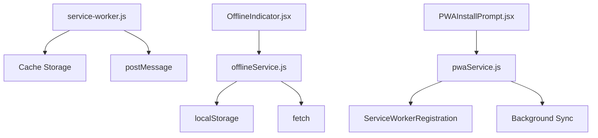

# PWA Service Worker & Offline Capabilities

<cite>
**Referenced Files in This Document**
- [service-worker.js](file://Frontend/public/service-worker.js)
- [pwaService.js](file://Frontend/src/services/pwaService.js)
- [offlineService.js](file://Frontend/src/services/offlineService.js)
- [OfflineIndicator.jsx](file://Frontend/src/components/mobile/OfflineIndicator.jsx)
- [PWAInstallPrompt.jsx](file://Frontend/src/components/mobile/PWAInstallPrompt.jsx)
- [manifest.json](file://Frontend/public/manifest.json)
- [offline.html](file://Frontend/public/offline.html)
- [main.jsx](file://Frontend/src/main.jsx)
- [App.jsx](file://Frontend/src/App.jsx)
- [vite.config.ts](file://Frontend/vite.config.ts)
- [package.json](file://Frontend/package.json)
</cite>

## Table of Contents
1. [Introduction](#introduction)
2. [Project Structure](#project-structure)
3. [Core Components](#core-components)
4. [Architecture Overview](#architecture-overview)
5. [Detailed Component Analysis](#detailed-component-analysis)
6. [Dependency Analysis](#dependency-analysis)
7. [Performance Considerations](#performance-considerations)
8. [Troubleshooting Guide](#troubleshooting-guide)
9. [Conclusion](#conclusion)

## Introduction
This document explains the Progressive Web App (PWA) service worker implementation and offline capabilities in the SmartCity GRS application. It covers service worker registration, lifecycle management, update mechanisms, offline caching strategies, background sync for complaint submissions, event handlers, message passing between worker and app, and error handling. It also documents configuration options, performance optimization techniques, and debugging approaches for service worker issues.

## Project Structure
The PWA implementation spans three primary areas:
- Service worker and static assets in the public folder
- Application-side services for PWA and offline functionality
- UI components that surface offline status and installation prompts

**Diagram sources**
- [service-worker.js:1-175](file://Frontend/public/service-worker.js#L1-L175)
- [pwaService.js:1-171](file://Frontend/src/services/pwaService.js#L1-L171)
- [offlineService.js:1-302](file://Frontend/src/services/offlineService.js#L1-L302)
- [OfflineIndicator.jsx:1-134](file://Frontend/src/components/mobile/OfflineIndicator.jsx#L1-L134)
- [PWAInstallPrompt.jsx:1-157](file://Frontend/src/components/mobile/PWAInstallPrompt.jsx#L1-L157)
- [manifest.json:1-69](file://Frontend/public/manifest.json#L1-L69)
- [offline.html:1-111](file://Frontend/public/offline.html#L1-L111)
- [main.jsx:1-24](file://Frontend/src/main.jsx#L1-L24)
- [App.jsx:1-218](file://Frontend/src/App.jsx#L1-L218)

**Section sources**
- [service-worker.js:1-175](file://Frontend/public/service-worker.js#L1-L175)
- [pwaService.js:1-171](file://Frontend/src/services/pwaService.js#L1-L171)
- [offlineService.js:1-302](file://Frontend/src/services/offlineService.js#L1-L302)
- [OfflineIndicator.jsx:1-134](file://Frontend/src/components/mobile/OfflineIndicator.jsx#L1-L134)
- [PWAInstallPrompt.jsx:1-157](file://Frontend/src/components/mobile/PWAInstallPrompt.jsx#L1-L157)
- [manifest.json:1-69](file://Frontend/public/manifest.json#L1-L69)
- [offline.html:1-111](file://Frontend/public/offline.html#L1-L111)
- [main.jsx:1-24](file://Frontend/src/main.jsx#L1-L24)
- [App.jsx:1-218](file://Frontend/src/App.jsx#L1-L218)

## Core Components
- Service Worker: Implements install, activate, fetch, sync, push, and notification handlers. Uses a feature flag to disable PWA features globally.
- PWA Service: Registers the service worker, handles updates, background sync registration, and install prompt orchestration.
- Offline Service: Manages offline complaint drafts and queue, persistence via localStorage, retry logic, and automatic sync on connectivity restore.
- UI Components: Offline indicator and PWA install prompt provide user feedback and actions.

**Section sources**
- [service-worker.js:1-175](file://Frontend/public/service-worker.js#L1-L175)
- [pwaService.js:1-171](file://Frontend/src/services/pwaService.js#L1-L171)
- [offlineService.js:1-302](file://Frontend/src/services/offlineService.js#L1-L302)
- [OfflineIndicator.jsx:1-134](file://Frontend/src/components/mobile/OfflineIndicator.jsx#L1-L134)
- [PWAInstallPrompt.jsx:1-157](file://Frontend/src/components/mobile/PWAInstallPrompt.jsx#L1-L157)

## Architecture Overview
The PWA architecture integrates the service worker with the application runtime and offline services. The service worker enforces a network-first fetch strategy for same-origin non-API resources, caches static assets during install, and serves offline.html when offline. Background sync triggers offline complaint submissions when online. The application registers the service worker, listens for updates, and coordinates offline data sync.

**Diagram sources**
- [service-worker.js:20-105](file://Frontend/public/service-worker.js#L20-L105)
- [pwaService.js:10-71](file://Frontend/src/services/pwaService.js#L10-L71)
- [offlineService.js:168-248](file://Frontend/src/services/offlineService.js#L168-L248)

## Detailed Component Analysis

### Service Worker Lifecycle and Fetch Strategy
- Install: Opens cache with a versioned name and caches static assets. Uses a feature flag to skip installation when disabled.
- Activate: Deletes old caches and claims clients to ensure new worker controls pages immediately.
- Fetch: Applies a network-first strategy for same-origin non-API requests, caches successful responses, and falls back to cache or offline.html.
- Background Sync: Listens for sync events with a specific tag and posts a message to the app to trigger offline sync.
- Push and Notification: Shows push notifications and opens the app on click.
- Message: Responds to SKIP_WAITING to accelerate activation.

**Diagram sources**
- [service-worker.js:20-105](file://Frontend/public/service-worker.js#L20-L105)

**Section sources**
- [service-worker.js:20-175](file://Frontend/public/service-worker.js#L20-L175)

### Service Worker Registration and Update Mechanisms
- Registration: Checks service worker support and a feature flag, then registers the worker with a scope.
- Update Detection: Listens for updatefound and statechange to detect new worker installation and prompts the user to reload.
- Message Handling: Receives SYNC_OFFLINE_COMPLAINTS and triggers offline sync.
- Controller Change: Logs controller changes for observability.

**Diagram sources**
- [pwaService.js:10-71](file://Frontend/src/services/pwaService.js#L10-L71)

**Section sources**
- [pwaService.js:10-71](file://Frontend/src/services/pwaService.js#L10-L71)

### Offline Caching Strategies and Data Persistence
- Static Assets: Cached during install for offline readiness.
- Dynamic Content: Network-first strategy ensures fresh content; successful responses are cached for reuse.
- Offline Fallback: offline.html is served when fetch fails and no cache match exists.
- Data Persistence: Complaint drafts and queued submissions are stored in localStorage with retry logic and auto-sync on reconnect.

**Diagram sources**
- [offlineService.js:31-144](file://Frontend/src/services/offlineService.js#L31-L144)

**Section sources**
- [offlineService.js:1-302](file://Frontend/src/services/offlineService.js#L1-L302)

### Background Sync for Offline Complaint Submissions
- Registration: Requests background sync permission and registers a sync tag.
- Trigger: On connectivity restore, the app attempts to sync queued complaints.
- Worker Coordination: The service worker posts a message to the app to initiate sync when online.

**Diagram sources**
- [pwaService.js:112-127](file://Frontend/src/services/pwaService.js#L112-L127)
- [offlineService.js:168-248](file://Frontend/src/services/offlineService.js#L168-L248)
- [service-worker.js:107-117](file://Frontend/public/service-worker.js#L107-L117)

**Section sources**
- [pwaService.js:112-127](file://Frontend/src/services/pwaService.js#L112-L127)
- [offlineService.js:168-248](file://Frontend/src/services/offlineService.js#L168-L248)
- [service-worker.js:107-117](file://Frontend/public/service-worker.js#L107-L117)

### Service Worker Event Handlers and Message Passing
- sync: Triggers offline complaint sync when online.
- push/notificationclick: Handles push notifications and opening the app.
- message: Responds to SKIP_WAITING to accelerate activation.
- fetch: Implements network-first strategy with caching and offline fallback.

**Diagram sources**
- [service-worker.js:20-175](file://Frontend/public/service-worker.js#L20-L175)

**Section sources**
- [service-worker.js:20-175](file://Frontend/public/service-worker.js#L20-L175)

### UI Components: Offline Indicator and PWA Install Prompt
- OfflineIndicator: Shows real-time offline status, queued/draft counts, and sync progress. Automatically attempts to sync when online.
- PWAInstallPrompt: Manages the beforeinstallprompt lifecycle, presents a custom install prompt, and records user choice.

**Diagram sources**
- [OfflineIndicator.jsx:11-61](file://Frontend/src/components/mobile/OfflineIndicator.jsx#L11-L61)
- [offlineService.js:289-301](file://Frontend/src/services/offlineService.js#L289-L301)
- [PWAInstallPrompt.jsx:12-77](file://Frontend/src/components/mobile/PWAInstallPrompt.jsx#L12-L77)

**Section sources**
- [OfflineIndicator.jsx:1-134](file://Frontend/src/components/mobile/OfflineIndicator.jsx#L1-L134)
- [PWAInstallPrompt.jsx:1-157](file://Frontend/src/components/mobile/PWAInstallPrompt.jsx#L1-L157)
- [offlineService.js:289-301](file://Frontend/src/services/offlineService.js#L289-L301)

## Dependency Analysis
- Service worker depends on Cache Storage APIs and the application’s offline service for data synchronization.
- PWA service depends on the service worker registration and background sync APIs.
- Offline service depends on localStorage for persistence and the network for sync.
- UI components depend on the services for state and actions.

**Diagram sources**
- [service-worker.js:1-175](file://Frontend/public/service-worker.js#L1-L175)
- [pwaService.js:1-171](file://Frontend/src/services/pwaService.js#L1-L171)
- [offlineService.js:1-302](file://Frontend/src/services/offlineService.js#L1-L302)
- [OfflineIndicator.jsx:1-134](file://Frontend/src/components/mobile/OfflineIndicator.jsx#L1-L134)
- [PWAInstallPrompt.jsx:1-157](file://Frontend/src/components/mobile/PWAInstallPrompt.jsx#L1-L157)

**Section sources**
- [service-worker.js:1-175](file://Frontend/public/service-worker.js#L1-L175)
- [pwaService.js:1-171](file://Frontend/src/services/pwaService.js#L1-L171)
- [offlineService.js:1-302](file://Frontend/src/services/offlineService.js#L1-L302)
- [OfflineIndicator.jsx:1-134](file://Frontend/src/components/mobile/OfflineIndicator.jsx#L1-L134)
- [PWAInstallPrompt.jsx:1-157](file://Frontend/src/components/mobile/PWAInstallPrompt.jsx#L1-L157)

## Performance Considerations
- Cache Busting: Build configuration adds content hashes to asset filenames to improve cache invalidation.
- Network Strategy: Network-first fetch reduces stale content risk; successful responses are cached for reuse.
- Background Sync: Queues submissions and retries with bounded attempts to avoid repeated failures.
- Feature Flags: PWA features can be disabled globally to prevent caching issues in all environments.
- IndexedDB Check: Offline features require localStorage availability; IndexedDB checks are present in code comments.

**Section sources**
- [vite.config.ts:28-36](file://Frontend/vite.config.ts#L28-L36)
- [service-worker.js:84-104](file://Frontend/public/service-worker.js#L84-L104)
- [offlineService.js:168-248](file://Frontend/src/services/offlineService.js#L168-L248)
- [pwaService.js:17-22](file://Frontend/src/services/pwaService.js#L17-L22)

## Troubleshooting Guide
Common issues and resolutions:
- Service Worker Not Installing
  - Cause: PWA_ENABLED is false or feature flag disabled.
  - Action: Enable PWA features and ensure registration succeeds.
- No Updates Detected
  - Cause: New worker not installed or user did not confirm reload.
  - Action: Confirm update prompt and reload; ensure SKIP_WAITING message is sent.
- Background Sync Not Working
  - Cause: Sync permission not granted or tag mismatch.
  - Action: Request sync permission and verify tag registration.
- Offline Mode Not Functioning
  - Cause: Cross-origin requests bypass caching; API requests are intentionally not cached.
  - Action: Ensure same-origin requests and verify offline.html availability.
- LocalStorage Persistence Issues
  - Cause: Disabled offline features or unsupported environment.
  - Action: Verify feature flags and localStorage availability.

Debugging steps:
- Inspect service worker lifecycle in browser devtools.
- Monitor console logs for PWA and offline operations.
- Verify manifest.json entries and icons.
- Test offline behavior by disabling network and reloading.

**Section sources**
- [service-worker.js:20-175](file://Frontend/public/service-worker.js#L20-L175)
- [pwaService.js:10-71](file://Frontend/src/services/pwaService.js#L10-L71)
- [offlineService.js:168-248](file://Frontend/src/services/offlineService.js#L168-L248)
- [manifest.json:1-69](file://Frontend/public/manifest.json#L1-L69)

## Conclusion
The SmartCity GRS PWA implementation provides robust offline capabilities through a network-first service worker strategy, background sync for complaint submissions, and user-facing indicators. The modular design separates concerns between the service worker, application services, and UI components, enabling maintainability and extensibility. With feature flags and resilient error handling, the system remains safe to deploy across diverse environments.