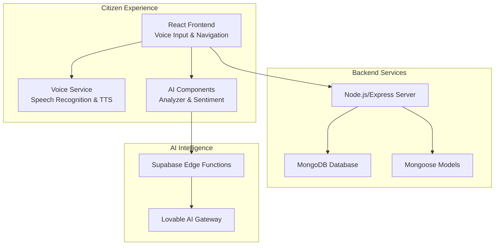
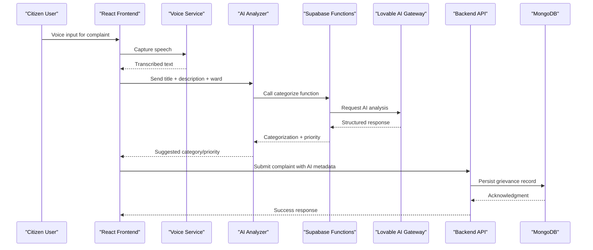
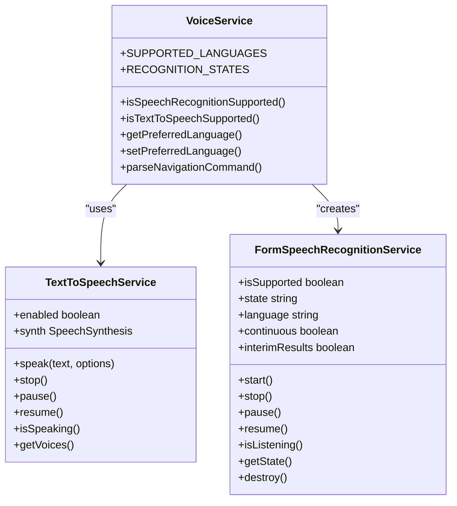
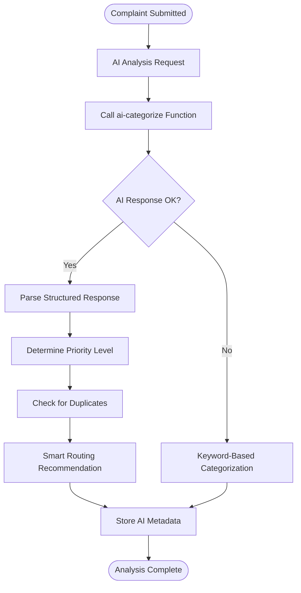
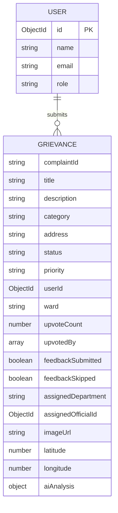

# Project Overview

<cite>
**Referenced Files in This Document**
- [README.md](file://Frontend/README.md)
- [App.jsx](file://Frontend/src/App.jsx)
- [SubmitComplaint.jsx](file://Frontend/src/pages/SubmitComplaint.jsx)
- [voiceService.js](file://Frontend/src/services/voiceService.js)
- [EnhancedVoiceInput.jsx](file://Frontend/src/components/voice/EnhancedVoiceInput.jsx)
- [AIComplaintAnalyzer.jsx](file://Frontend/src/components/ai/AIComplaintAnalyzer.jsx)
- [server.js](file://backend/server.js)
- [db.js](file://backend/src/config/db.js)
- [Grievance.js](file://backend/src/models/Grievance.js)
- [config.toml](file://Frontend/supabase/config.toml)
- [ai-categorize/index.ts](file://Frontend/supabase/functions/ai-categorize/index.ts)
- [ai-chatbot/index.ts](file://Frontend/supabase/functions/ai-chatbot/index.ts)
- [package.json](file://backend/package.json)
</cite>

## Table of Contents
1. [Introduction](#introduction)
2. [Project Structure](#project-structure)
3. [Core Components](#core-components)
4. [Architecture Overview](#architecture-overview)
5. [Detailed Component Analysis](#detailed-component-analysis)
6. [Dependency Analysis](#dependency-analysis)
7. [Performance Considerations](#performance-considerations)
8. [Troubleshooting Guide](#troubleshooting-guide)
9. [Conclusion](#conclusion)

## Introduction
Smart Voice Report is an intelligent voice-enabled complaint management system designed to modernize municipal governance. It empowers citizens to report issues through natural voice interactions while providing ward administrators and super administrators with AI-driven insights, analytics, and operational dashboards. The platform transforms traditional grievance redressal by combining conversational AI, multilingual voice recognition, automated categorization, sentiment analysis, and real-time analytics to improve responsiveness, transparency, and citizen engagement.

## Project Structure
The platform follows a modern full-stack architecture:
- Frontend: React application with TypeScript, Vite build tool, and Tailwind CSS styling
- Backend: Node.js/Express server with MongoDB for persistent data
- AI/ML: Supabase Edge Functions powered by Lovable AI Gateway for intelligent categorization and chatbot assistance
- Deployment: Container-ready with environment-based configuration

**Diagram sources**
- [App.jsx:83-216](file://Frontend/src/App.jsx#L83-L216)
- [server.js:1-22](file://backend/server.js#L1-L22)
- [db.js:1-18](file://backend/src/config/db.js#L1-L18)
- [Grievance.js:1-115](file://backend/src/models/Grievance.js#L1-L115)
- [config.toml:17-22](file://Frontend/supabase/config.toml#L17-L22)

**Section sources**
- [README.md:53-74](file://Frontend/README.md#L53-L74)
- [package.json:10-27](file://backend/package.json#L10-L27)

## Core Components
- Intelligent complaint submission with voice-first UX and AI-powered suggestions
- Multilingual voice recognition supporting English and Hindi/Marathi
- AI-driven categorization, priority assessment, and duplicate detection
- Real-time analytics and predictive insights for administrators
- Progressive web app (PWA) support for offline-capable mobile experiences
- Gamified engagement features including leaderboards and badges

**Section sources**
- [SubmitComplaint.jsx:48-341](file://Frontend/src/pages/SubmitComplaint.jsx#L48-L341)
- [voiceService.js:1-778](file://Frontend/src/services/voiceService.js#L1-L778)
- [AIComplaintAnalyzer.jsx:26-276](file://Frontend/src/components/ai/AIComplaintAnalyzer.jsx#L26-L276)

## Architecture Overview
The system integrates three primary layers:
- Frontend Layer: React SPA with voice controls, AI suggestions, and responsive UI
- Backend Layer: RESTful API serving complaint management, analytics, and administrative functions
- Intelligence Layer: Supabase Edge Functions leveraging Lovable AI for NLP tasks

**Diagram sources**
- [SubmitComplaint.jsx:161-199](file://Frontend/src/pages/SubmitComplaint.jsx#L161-L199)
- [ai-categorize/index.ts:117-150](file://Frontend/supabase/functions/ai-categorize/index.ts#L117-L150)
- [server.js:12-14](file://backend/server.js#L12-L14)
- [Grievance.js:68-79](file://backend/src/models/Grievance.js#L68-L79)

## Detailed Component Analysis

### Voice-First Submission Experience
The voice service provides robust speech recognition and text-to-speech capabilities across multiple languages, enabling hands-free complaint filing. It features continuous listening, error recovery, and multilingual support with automatic language detection.

**Diagram sources**
- [voiceService.js:8-22](file://Frontend/src/services/voiceService.js#L8-L22)
- [voiceService.js:114-214](file://Frontend/src/services/voiceService.js#L114-L214)
- [voiceService.js:327-758](file://Frontend/src/services/voiceService.js#L327-L758)

**Section sources**
- [voiceService.js:51-61](file://Frontend/src/services/voiceService.js#L51-L61)
- [voiceService.js:66-91](file://Frontend/src/services/voiceService.js#L66-L91)
- [voiceService.js:96-109](file://Frontend/src/services/voiceService.js#L96-L109)

### AI-Powered Complaint Intelligence
The AI analyzer provides automated categorization, priority scoring, duplicate detection, and smart routing recommendations. It integrates with Supabase Edge Functions to leverage advanced NLP capabilities.

**Diagram sources**
- [AIComplaintAnalyzer.jsx:45-74](file://Frontend/src/components/ai/AIComplaintAnalyzer.jsx#L45-L74)
- [ai-categorize/index.ts:117-222](file://Frontend/supabase/functions/ai-categorize/index.ts#L117-L222)

**Section sources**
- [AIComplaintAnalyzer.jsx:39-74](file://Frontend/src/components/ai/AIComplaintAnalyzer.jsx#L39-L74)
- [ai-categorize/index.ts:29-61](file://Frontend/supabase/functions/ai-categorize/index.ts#L29-L61)
- [ai-categorize/index.ts:197-205](file://Frontend/supabase/functions/ai-categorize/index.ts#L197-L205)

### Backend Data Model and API
The backend uses Mongoose models to represent grievances with comprehensive AI metadata, indexing for performance, and integration with the complaint submission workflow.

**Diagram sources**
- [Grievance.js:3-98](file://backend/src/models/Grievance.js#L3-L98)

**Section sources**
- [Grievance.js:102-112](file://backend/src/models/Grievance.js#L102-L112)
- [server.js:12-14](file://backend/server.js#L12-L14)

## Dependency Analysis
The system relies on a cohesive set of technologies that work together to deliver a seamless voice-enabled experience.

```mermaid
graph LR
subgraph "Frontend Dependencies"
React["React 18+"]
TS["TypeScript"]
Vite["Vite Build"]
Tailwind["Tailwind CSS"]
TanStack["TanStack Query"]
end
subgraph "Backend Dependencies"
Express["Express.js"]
Mongoose["Mongoose ODM"]
JWT["JSON Web Tokens"]
Bcrypt["Bcrypt"]
Morgan["HTTP Logging"]
end
subgraph "AI/ML Dependencies"
Supabase["Supabase Edge Functions"]
Lovable["Lovable AI Gateway"]
Deno["Deno Runtime"]
end
React --> Express
Express --> Mongoose
React --> Supabase
Supabase --> Lovable
```

**Diagram sources**
- [package.json:10-27](file://backend/package.json#L10-L27)
- [README.md:57-61](file://Frontend/README.md#L57-L61)

**Section sources**
- [package.json:10-27](file://backend/package.json#L10-L27)
- [README.md:53-74](file://Frontend/README.md#L53-L74)

## Performance Considerations
- Voice recognition optimization: Continuous listening with auto-restart and silence detection for reliable transcription
- AI response caching: Debounced categorization requests with 1.5-second delay to reduce API calls
- Database indexing: Strategic indexes on frequently queried fields (ward, status, priority, timestamps)
- Progressive loading: Lazy loading for heavy components and images
- Mobile optimization: PWA support with offline indicators and reduced resource usage

## Troubleshooting Guide
Common issues and resolutions:
- Voice recognition not working: Check microphone permissions and browser compatibility
- AI categorization failures: Network connectivity issues with Lovable AI Gateway
- Database connection errors: Verify MONGO_URI environment variable and MongoDB availability
- Authentication problems: Token expiration or invalid JWT format
- Mobile PWA installation: Ensure HTTPS deployment and proper service worker configuration

**Section sources**
- [voiceService.js:468-508](file://Frontend/src/services/voiceService.js#L468-L508)
- [ai-chatbot/index.ts:81-102](file://Frontend/supabase/functions/ai-chatbot/index.ts#L81-L102)
- [db.js:6-8](file://backend/src/config/db.js#L6-L8)

## Conclusion
Smart Voice Report represents a comprehensive digital transformation solution for municipal governance. By combining voice-first UX, AI-powered intelligence, and robust analytics, it creates a transparent, efficient, and engaging platform for citizens while providing administrators with actionable insights. The modular architecture ensures scalability, maintainability, and adaptability for future enhancements in smart city initiatives.