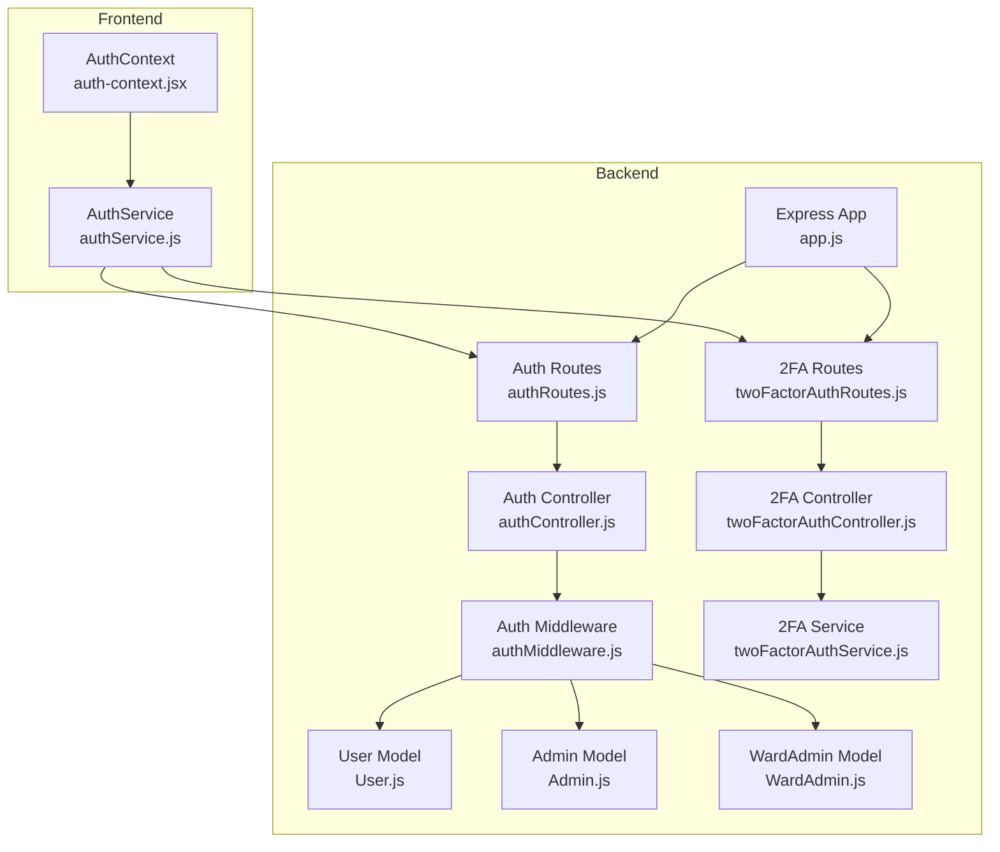
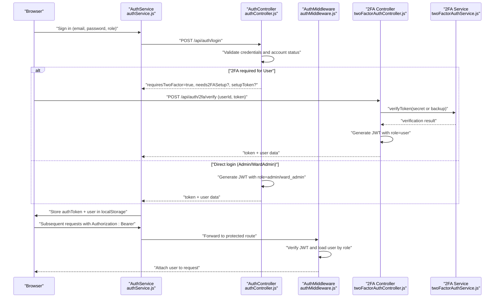
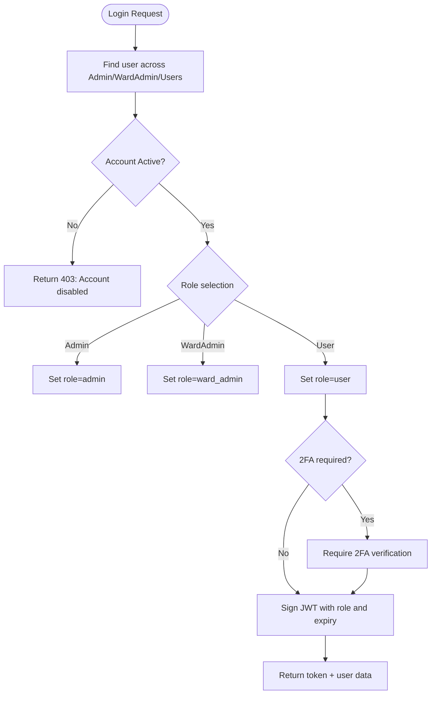
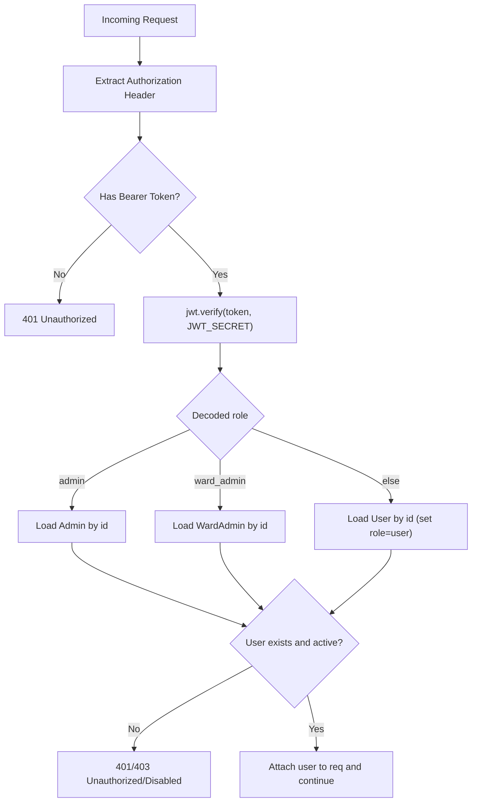
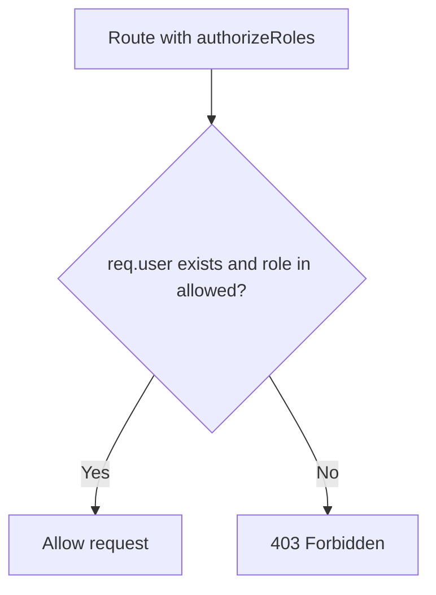
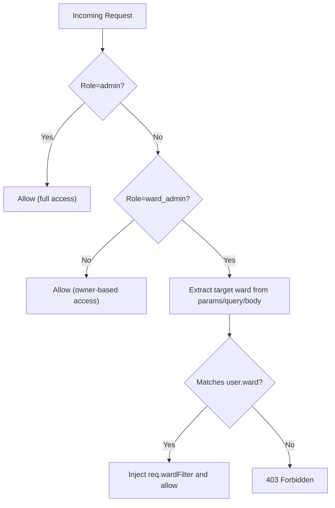
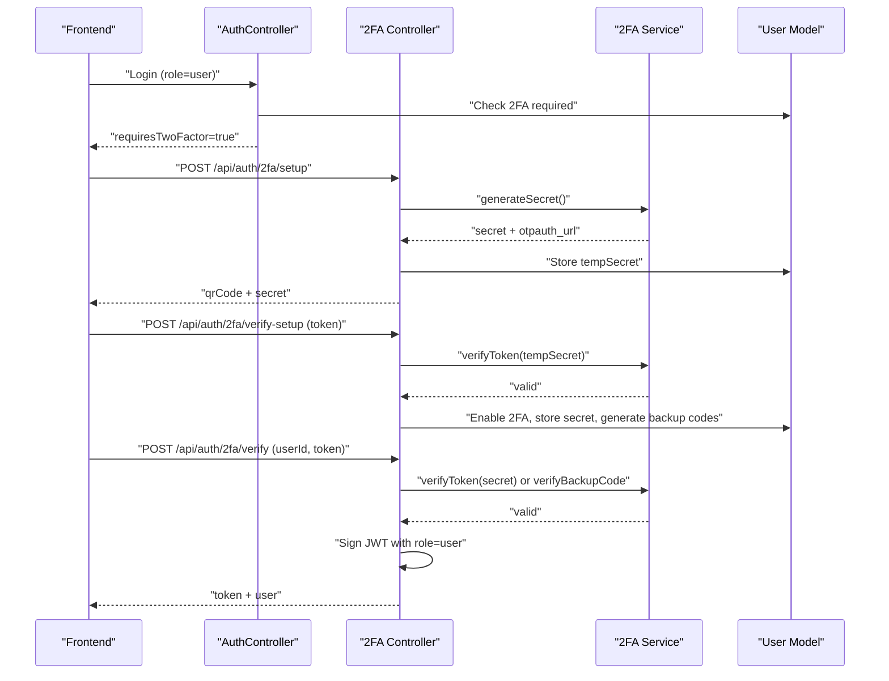
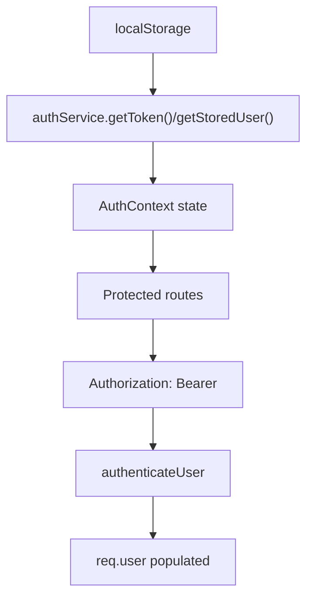
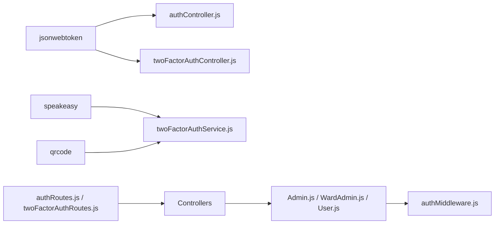

# Authentication Security & Access Control

<cite>
**Referenced Files in This Document**
- [authMiddleware.js](file://backend/src/middleware/authMiddleware.js)
- [authController.js](file://backend/src/controllers/authController.js)
- [twoFactorAuthController.js](file://backend/src/controllers/twoFactorAuthController.js)
- [twoFactorAuthService.js](file://backend/src/services/twoFactorAuthService.js)
- [Admin.js](file://backend/src/models/Admin.js)
- [WardAdmin.js](file://backend/src/models/WardAdmin.js)
- [User.js](file://backend/src/models/User.js)
- [authRoutes.js](file://backend/src/routes/authRoutes.js)
- [twoFactorAuthRoutes.js](file://backend/src/routes/twoFactorAuthRoutes.js)
- [auth-context.jsx](file://frontend/src/context/auth-context.jsx)
- [authService.js](file://frontend/src/services/authService.js)
- [app.js](file://backend/src/app.js)
- [package.json](file://backend/package.json)
</cite>

## Table of Contents
1. [Introduction](#introduction)
2. [Project Structure](#project-structure)
3. [Core Components](#core-components)
4. [Architecture Overview](#architecture-overview)
5. [Detailed Component Analysis](#detailed-component-analysis)
6. [Dependency Analysis](#dependency-analysis)
7. [Performance Considerations](#performance-considerations)
8. [Troubleshooting Guide](#troubleshooting-guide)
9. [Conclusion](#conclusion)
10. [Appendices](#appendices)

## Introduction
This document provides comprehensive authentication security documentation for the Smart City Grievance Redressal System. It covers JWT token implementation, multi-role access control across Admin, WardAdmin, and User collections, session management, two-factor authentication (2FA) security measures, token expiration handling, and account status validation. It also outlines best practices for JWT secret management, token refresh strategies, secure logout procedures, and common authentication vulnerabilities with their prevention strategies.

## Project Structure
The authentication system spans backend Express routes and controllers, middleware for JWT validation and role-based authorization, dedicated 2FA controllers and services, and frontend authentication context and service utilities. The backend mounts authentication endpoints under /api/auth and 2FA endpoints under /api/auth/2fa. The frontend stores tokens and user state in localStorage and exposes an AuthContext provider.

**Diagram sources**
- [app.js:1-71](file://backend/src/app.js#L1-L71)
- [authRoutes.js:1-10](file://backend/src/routes/authRoutes.js#L1-L10)
- [twoFactorAuthRoutes.js:1-63](file://backend/src/routes/twoFactorAuthRoutes.js#L1-L63)
- [authController.js:1-237](file://backend/src/controllers/authController.js#L1-L237)
- [twoFactorAuthController.js:1-453](file://backend/src/controllers/twoFactorAuthController.js#L1-L453)
- [authMiddleware.js:1-114](file://backend/src/middleware/authMiddleware.js#L1-L114)
- [twoFactorAuthService.js:1-152](file://backend/src/services/twoFactorAuthService.js#L1-L152)
- [User.js:1-165](file://backend/src/models/User.js#L1-L165)
- [Admin.js:1-55](file://backend/src/models/Admin.js#L1-L55)
- [WardAdmin.js:1-61](file://backend/src/models/WardAdmin.js#L1-L61)
- [auth-context.jsx:1-143](file://frontend/src/context/auth-context.jsx#L1-L143)
- [authService.js:1-99](file://frontend/src/services/authService.js#L1-L99)

**Section sources**
- [app.js:1-71](file://backend/src/app.js#L1-L71)
- [authRoutes.js:1-10](file://backend/src/routes/authRoutes.js#L1-L10)
- [twoFactorAuthRoutes.js:1-63](file://backend/src/routes/twoFactorAuthRoutes.js#L1-L63)
- [auth-context.jsx:1-143](file://frontend/src/context/auth-context.jsx#L1-L143)
- [authService.js:1-99](file://frontend/src/services/authService.js#L1-L99)

## Core Components
- JWT-based authentication with role-aware token validation across Admin, WardAdmin, and User collections.
- Role-based authorization middleware and ward-specific access control for WardAdmin.
- Mandatory two-factor authentication enforcement for all users during login, with QR-based setup, backup codes, and verification flows.
- Token expiration handling via JWT expiresIn configuration and account status checks.
- Secure session management using localStorage on the frontend and bearer token transport on the backend.

Key implementation references:
- JWT token creation and verification: [authController.js:58-68], [authController.js:192-202], [twoFactorAuthController.js:206-221]
- Multi-role authentication middleware: [authMiddleware.js:10-55]
- Role-based authorization: [authMiddleware.js:61-71]
- Ward-specific access control: [authMiddleware.js:77-104]
- 2FA service and enforcement: [twoFactorAuthService.js:125-135], [twoFactorAuthController.js:15-64], [twoFactorAuthController.js:143-265]

**Section sources**
- [authController.js:58-68](file://backend/src/controllers/authController.js#L58-L68)
- [authController.js:192-202](file://backend/src/controllers/authController.js#L192-L202)
- [twoFactorAuthController.js:206-221](file://backend/src/controllers/twoFactorAuthController.js#L206-L221)
- [authMiddleware.js:10-55](file://backend/src/middleware/authMiddleware.js#L10-L55)
- [authMiddleware.js:61-71](file://backend/src/middleware/authMiddleware.js#L61-L71)
- [authMiddleware.js:77-104](file://backend/src/middleware/authMiddleware.js#L77-L104)
- [twoFactorAuthService.js:125-135](file://backend/src/services/twoFactorAuthService.js#L125-L135)
- [twoFactorAuthController.js:15-64](file://backend/src/controllers/twoFactorAuthController.js#L15-L64)
- [twoFactorAuthController.js:143-265](file://backend/src/controllers/twoFactorAuthController.js#L143-L265)

## Architecture Overview
The authentication architecture integrates frontend and backend components to deliver secure, role-aware access with mandatory 2FA for citizens.

**Diagram sources**
- [authService.js:37-80](file://frontend/src/services/authService.js#L37-L80)
- [authController.js:90-237](file://backend/src/controllers/authController.js#L90-L237)
- [authMiddleware.js:10-55](file://backend/src/middleware/authMiddleware.js#L10-L55)
- [twoFactorAuthController.js:143-265](file://backend/src/controllers/twoFactorAuthController.js#L143-L265)
- [twoFactorAuthService.js:52-66](file://backend/src/services/twoFactorAuthService.js#L52-L66)

## Detailed Component Analysis

### JWT Token Implementation and Validation
- Token payload includes id, role, and ward for all roles. Expiration is configured to seven days for standard logins.
- Token verification uses a shared JWT_SECRET environment variable.
- Account status validation prevents access for disabled users.

**Diagram sources**
- [authController.js:90-237](file://backend/src/controllers/authController.js#L90-L237)
- [authController.js:58-68](file://backend/src/controllers/authController.js#L58-L68)
- [authController.js:192-202](file://backend/src/controllers/authController.js#L192-L202)

**Section sources**
- [authController.js:58-68](file://backend/src/controllers/authController.js#L58-L68)
- [authController.js:192-202](file://backend/src/controllers/authController.js#L192-L202)
- [authController.js:90-237](file://backend/src/controllers/authController.js#L90-L237)

### authenticateUser Middleware
- Extracts Bearer token from Authorization header.
- Verifies token using JWT_SECRET.
- Loads user from the appropriate collection based on role claim.
- Enforces account active status.
- Injects user object into request for downstream routes.

**Diagram sources**
- [authMiddleware.js:10-55](file://backend/src/middleware/authMiddleware.js#L10-L55)

**Section sources**
- [authMiddleware.js:10-55](file://backend/src/middleware/authMiddleware.js#L10-L55)

### authorizeRoles Middleware
- Validates that the authenticated user’s role is included in the allowed roles array.
- Returns 403 Forbidden if role mismatch.

**Diagram sources**
- [authMiddleware.js:61-71](file://backend/src/middleware/authMiddleware.js#L61-L71)

**Section sources**
- [authMiddleware.js:61-71](file://backend/src/middleware/authMiddleware.js#L61-L71)

### authorizeWardAccess Middleware
- Admin bypasses ward checks.
- WardAdmin requests must target their assigned ward; otherwise 403.
- Injects req.wardFilter for downstream filtering.

**Diagram sources**
- [authMiddleware.js:77-104](file://backend/src/middleware/authMiddleware.js#L77-L104)

**Section sources**
- [authMiddleware.js:77-104](file://backend/src/middleware/authMiddleware.js#L77-L104)

### Two-Factor Authentication (2FA)
- Mandatory 2FA enforcement for all users on every login attempt.
- Setup flow generates a secret and QR code for authenticator apps.
- Verification supports both TOTP tokens and backup codes.
- Backup codes are hashed and marked as used upon verification.

**Diagram sources**
- [twoFactorAuthService.js:15-28](file://backend/src/services/twoFactorAuthService.js#L15-L28)
- [twoFactorAuthService.js:52-66](file://backend/src/services/twoFactorAuthService.js#L52-L66)
- [twoFactorAuthService.js:73-84](file://backend/src/services/twoFactorAuthService.js#L73-L84)
- [twoFactorAuthService.js:91-105](file://backend/src/services/twoFactorAuthService.js#L91-L105)
- [twoFactorAuthService.js:125-135](file://backend/src/services/twoFactorAuthService.js#L125-L135)
- [twoFactorAuthController.js:15-64](file://backend/src/controllers/twoFactorAuthController.js#L15-L64)
- [twoFactorAuthController.js:71-136](file://backend/src/controllers/twoFactorAuthController.js#L71-L136)
- [twoFactorAuthController.js:143-265](file://backend/src/controllers/twoFactorAuthController.js#L143-L265)

**Section sources**
- [twoFactorAuthService.js:15-28](file://backend/src/services/twoFactorAuthService.js#L15-L28)
- [twoFactorAuthService.js:52-66](file://backend/src/services/twoFactorAuthService.js#L52-L66)
- [twoFactorAuthService.js:73-84](file://backend/src/services/twoFactorAuthService.js#L73-L84)
- [twoFactorAuthService.js:91-105](file://backend/src/services/twoFactorAuthService.js#L91-L105)
- [twoFactorAuthService.js:125-135](file://backend/src/services/twoFactorAuthService.js#L125-L135)
- [twoFactorAuthController.js:15-64](file://backend/src/controllers/twoFactorAuthController.js#L15-L64)
- [twoFactorAuthController.js:71-136](file://backend/src/controllers/twoFactorAuthController.js#L71-L136)
- [twoFactorAuthController.js:143-265](file://backend/src/controllers/twoFactorAuthController.js#L143-L265)

### Session Management
- Frontend stores authToken and user data in localStorage.
- AuthService provides login/signup/logout helpers and token retrieval.
- AuthContext hydrates user state on initial load and listens to storage changes.

**Diagram sources**
- [authService.js:82-99](file://frontend/src/services/authService.js#L82-L99)
- [auth-context.jsx:10-27](file://frontend/src/context/auth-context.jsx#L10-L27)
- [auth-context.jsx:87-97](file://frontend/src/context/auth-context.jsx#L87-L97)
- [authMiddleware.js:10-55](file://backend/src/middleware/authMiddleware.js#L10-L55)

**Section sources**
- [authService.js:82-99](file://frontend/src/services/authService.js#L82-L99)
- [auth-context.jsx:10-27](file://frontend/src/context/auth-context.jsx#L10-L27)
- [auth-context.jsx:87-97](file://frontend/src/context/auth-context.jsx#L87-L97)
- [authMiddleware.js:10-55](file://backend/src/middleware/authMiddleware.js#L10-L55)

### Token Expiration Handling
- Standard JWT tokens expire after seven days.
- Setup tokens for 2FA enablement have short expiry (e.g., 15 minutes).
- On invalid/expired tokens, middleware returns 401 Unauthorized.

**Section sources**
- [authController.js:58-68](file://backend/src/controllers/authController.js#L58-L68)
- [authController.js:192-202](file://backend/src/controllers/authController.js#L192-L202)
- [authController.js:160-164](file://backend/src/controllers/authController.js#L160-L164)
- [twoFactorAuthController.js:206-221](file://backend/src/controllers/twoFactorAuthController.js#L206-L221)
- [authMiddleware.js:52-54](file://backend/src/middleware/authMiddleware.js#L52-L54)

### Account Status Validation
- authenticateUser checks user.isActive and rejects disabled accounts.
- authController enforces isActive during login.

**Section sources**
- [authMiddleware.js:46-48](file://backend/src/middleware/authMiddleware.js#L46-L48)
- [authController.js:133-136](file://backend/src/controllers/authController.js#L133-L136)

## Dependency Analysis
- Backend depends on jsonwebtoken for JWT operations and speakeasy/qrcode for 2FA.
- Models define schema and password hashing for Admin, WardAdmin, and User collections.
- Routes mount controllers and middleware for authentication and 2FA.

**Diagram sources**
- [package.json:10-22](file://backend/package.json#L10-L22)
- [authController.js:1-5](file://backend/src/controllers/authController.js#L1-L5)
- [twoFactorAuthController.js:1-3](file://backend/src/controllers/twoFactorAuthController.js#L1-L3)
- [twoFactorAuthService.js:1-3](file://backend/src/services/twoFactorAuthService.js#L1-L3)
- [Admin.js:1-55](file://backend/src/models/Admin.js#L1-L55)
- [WardAdmin.js:1-61](file://backend/src/models/WardAdmin.js#L1-L61)
- [User.js:1-165](file://backend/src/models/User.js#L1-L165)
- [authRoutes.js:1-10](file://backend/src/routes/authRoutes.js#L1-L10)
- [twoFactorAuthRoutes.js:1-63](file://backend/src/routes/twoFactorAuthRoutes.js#L1-L63)

**Section sources**
- [package.json:10-22](file://backend/package.json#L10-L22)
- [Admin.js:1-55](file://backend/src/models/Admin.js#L1-L55)
- [WardAdmin.js:1-61](file://backend/src/models/WardAdmin.js#L1-L61)
- [User.js:1-165](file://backend/src/models/User.js#L1-L165)
- [authRoutes.js:1-10](file://backend/src/routes/authRoutes.js#L1-L10)
- [twoFactorAuthRoutes.js:1-63](file://backend/src/routes/twoFactorAuthRoutes.js#L1-L63)

## Performance Considerations
- JWT verification is O(1) and lightweight; avoid excessive token parsing.
- Use indexes on email and ward fields in User model to optimize login and analytics queries.
- Limit 2FA QR generation to setup flow to reduce cryptographic overhead.
- Consider implementing token blacklisting or short-lived access tokens with refresh token rotation for high-security scenarios.

[No sources needed since this section provides general guidance]

## Troubleshooting Guide
Common issues and resolutions:
- Invalid or expired token: Ensure JWT_SECRET consistency and correct token usage. [authMiddleware.js:52-54]
- Account disabled: Confirm isActive flag in Admin/WardAdmin/User documents. [authMiddleware.js:46-48]
- 2FA setup failures: Verify secret generation and token verification windows. [twoFactorAuthService.js:52-66]
- Backup code misuse: Ensure backup codes are hashed and marked used. [twoFactorAuthService.js:91-105]
- Frontend logout not clearing state: Use authService.logout() to remove authToken and user from localStorage. [authService.js:82-85]

**Section sources**
- [authMiddleware.js:52-54](file://backend/src/middleware/authMiddleware.js#L52-L54)
- [authMiddleware.js:46-48](file://backend/src/middleware/authMiddleware.js#L46-L48)
- [twoFactorAuthService.js:52-66](file://backend/src/services/twoFactorAuthService.js#L52-L66)
- [twoFactorAuthService.js:91-105](file://backend/src/services/twoFactorAuthService.js#L91-L105)
- [authService.js:82-85](file://frontend/src/services/authService.js#L82-L85)

## Conclusion
The authentication system implements robust JWT-based multi-role access control with mandatory 2FA for citizens, strict account status validation, and role-aware ward filtering. The frontend securely manages tokens and user state, while the backend enforces authorization and access policies consistently. Adhering to the best practices outlined below will further strengthen the system against common vulnerabilities.

## Appendices

### Security Best Practices
- JWT Secret Management
  - Store JWT_SECRET in environment variables and restrict access to deployment infrastructure.
  - Rotate secrets periodically and invalidate existing tokens via a controlled rollout.
- Token Refresh Strategies
  - Implement short-lived access tokens (e.g., minutes) with long-lived refresh tokens (e.g., days) stored securely (HttpOnly cookies).
  - Validate refresh tokens against revocation lists and enforce IP/agent binding where feasible.
- Secure Logout Procedures
  - Clear authToken from localStorage and invalidate server-side sessions or tokens.
  - Optionally maintain a server-side blacklist for issued tokens during the session window.
- Common Authentication Vulnerabilities and Prevention
  - Token Theft: Use HTTPS, HttpOnly cookies for tokens, and Content Security Policy. Avoid storing tokens in insecure locations.
  - Weak Passwords: Enforce strong password policies and consider multi-factor authentication.
  - Role Misassignment: Always verify role claims server-side and avoid client-side role manipulation.
  - 2FA Bypass: Enforce mandatory 2FA for all users and validate backup codes securely.
  - Insecure Direct Object References: Apply authorizeWardAccess for WardAdmin and owner-based checks for Users.

[No sources needed since this section provides general guidance]