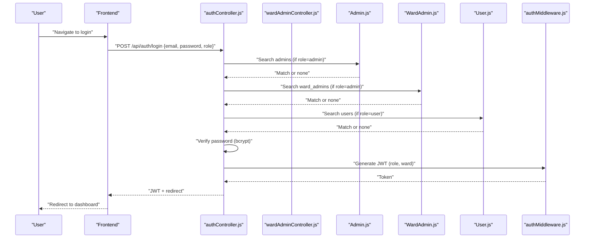
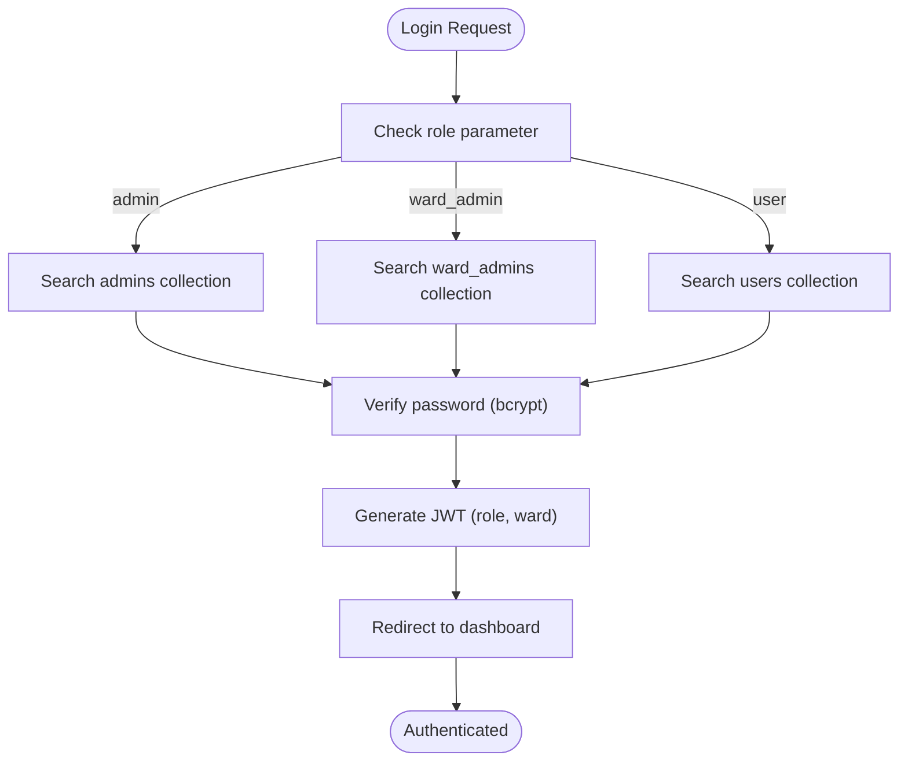
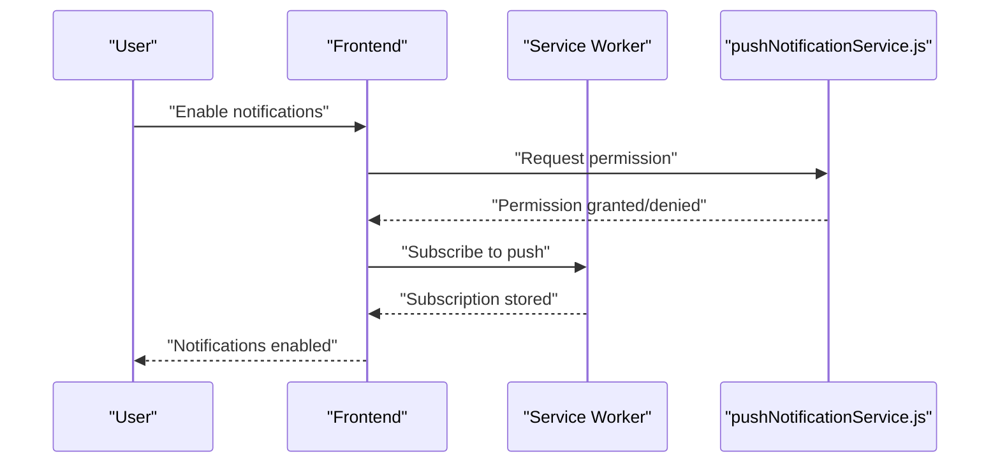
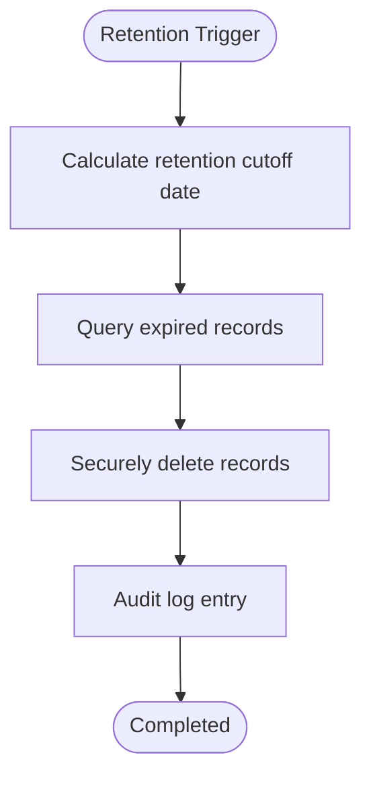
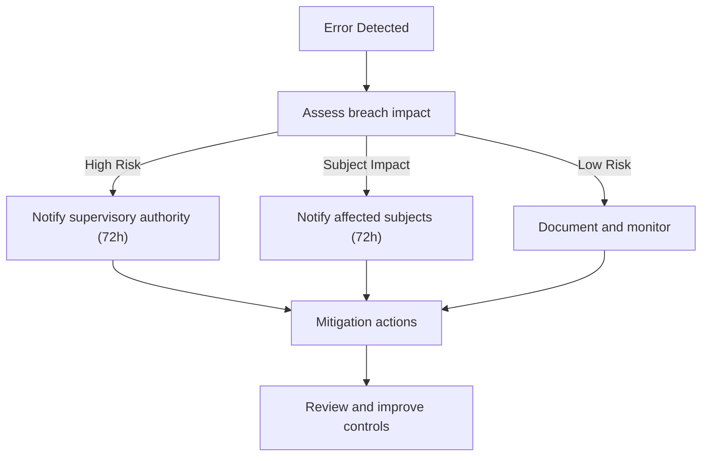
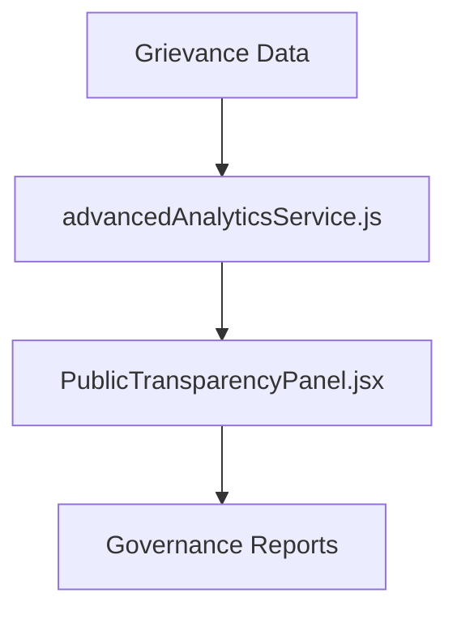
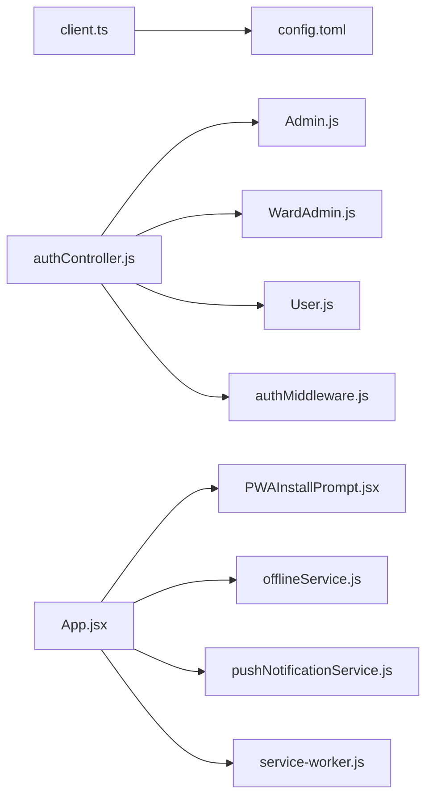

# Compliance & Regulatory Requirements

<cite>
**Referenced Files in This Document**
- [README.md](file://Frontend/README.md)
- [2FA_VALIDATION_REPORT.md](file://2FA_VALIDATION_REPORT.md)
- [ADVANCED_ENGAGEMENT_IMPLEMENTATION.md](file://ADVANCED_ENGAGEMENT_IMPLEMENTATION.md)
- [MOBILE_EXPERIENCE_IMPLEMENTATION.md](file://MOBILE_EXPERIENCE_IMPLEMENTATION.md)
- [WARD_ADMIN_IMPLEMENTATION.md](file://WARD_ADMIN_IMPLEMENTATION.md)
- [config.toml](file://Frontend/supabase/config.toml)
- [client.ts](file://Frontend/src/integrations/supabase/client.ts)
- [types.ts](file://Frontend/src/integrations/supabase/types.ts)
- [authController.js](file://backend/src/controllers/authController.js)
- [wardAdminController.js](file://backend/src/controllers/wardAdminController.js)
- [twoFactorAuthController.js](file://backend/src/controllers/twoFactorAuthController.js)
- [Admin.js](file://backend/src/models/Admin.js)
- [WardAdmin.js](file://backend/src/models/WardAdmin.js)
- [User.js](file://backend/src/models/User.js)
- [authMiddleware.js](file://backend/src/middleware/authMiddleware.js)
- [errorMiddleware.js](file://backend/src/middleware/errorMiddleware.js)
- [App.jsx](file://Frontend/src/App.jsx)
- [Navbar.jsx](file://Frontend/src/components/Navbar.jsx)
- [WardAdminLogin.jsx](file://Frontend/src/pages/WardAdminLogin.jsx)
- [VerifyWardAdmin.jsx](file://Frontend/src/pages/VerifyWardAdmin.jsx)
- [PWAInstallPrompt.jsx](file://Frontend/src/components/mobile/PWAInstallPrompt.jsx)
- [offlineService.js](file://Frontend/src/services/offlineService.js)
- [pushNotificationService.js](file://Frontend/src/services/pwaService.js)
- [service-worker.js](file://Frontend/dist/service-worker.js)
- [manifest.json](file://Frontend/public/manifest.json)
- [offline.html](file://Frontend/public/offline.html)
- [PublicTransparencyPanel.jsx](file://Frontend/src/components/analytics/PublicTransparencyPanel.jsx)
- [advancedAnalyticsService.js](file://backend/src/services/advancedAnalyticsService.js)
</cite>

## Table of Contents
1. [Introduction](#introduction)
2. [Project Structure](#project-structure)
3. [Core Components](#core-components)
4. [Architecture Overview](#architecture-overview)
5. [Detailed Component Analysis](#detailed-component-analysis)
6. [Dependency Analysis](#dependency-analysis)
7. [Performance Considerations](#performance-considerations)
8. [Troubleshooting Guide](#troubleshooting-guide)
9. [Conclusion](#conclusion)
10. [Appendices](#appendices)

## Introduction
This document consolidates compliance and regulatory requirements for the SmartCity GRS platform with a focus on GDPR adherence, data protection, legal obligations, and governance reporting. It details user data rights management, consent mechanisms, data subject requests handling, data retention and deletion, breach notification protocols, international data transfers, cookie compliance, and electronic evidence preservation for complaints. It also outlines policy documentation, user agreements, and regulatory reporting requirements for municipal governance data handling.

## Project Structure
The platform comprises:
- Frontend (React, Vite, TypeScript) with PWA, offline capabilities, and push notifications
- Backend (Node.js) with controllers, models, middleware, and services
- Supabase integration for authentication, authorization, and database operations
- Administrative and ward-level governance with role-based access control

```mermaid
graph TB
subgraph "Frontend"
FE_App["App.jsx"]
FE_Nav["Navbar.jsx"]
FE_WAL["WardAdminLogin.jsx"]
FE_VWA["VerifyWardAdmin.jsx"]
FE_PWA["PWAInstallPrompt.jsx"]
FE_Offline["offlineService.js"]
FE_Push["pushNotificationService.js"]
FE_SW["service-worker.js"]
FE_Manifest["manifest.json"]
FE_OfflinePage["offline.html"]
end
subgraph "Backend"
BE_AuthCtl["authController.js"]
BE_WA_CTL["wardAdminController.js"]
BE_2FA_CTL["twoFactorAuthController.js"]
BE_AdminModel["Admin.js"]
BE_WA_Model["WardAdmin.js"]
BE_UserModel["User.js"]
BE_AuthMW["authMiddleware.js"]
BE_ErrorMW["errorMiddleware.js"]
BE_AdvSvc["advancedAnalyticsService.js"]
end
subgraph "Supabase"
SB_Config["config.toml"]
SB_Client["client.ts"]
SB_Types["types.ts"]
end
FE_App --> FE_Nav
FE_App --> FE_WAL
FE_App --> FE_VWA
FE_App --> FE_PWA
FE_App --> FE_Offline
FE_App --> FE_Push
FE_App --> FE_SW
FE_App --> FE_Manifest
FE_App --> FE_OfflinePage
FE_App --> BE_AuthCtl
FE_App --> BE_WA_CTL
FE_App --> BE_2FA_CTL
BE_AuthCtl --> BE_AdminModel
BE_AuthCtl --> BE_WA_Model
BE_AuthCtl --> BE_UserModel
BE_WA_CTL --> BE_AdminModel
BE_WA_CTL --> BE_WA_Model
BE_WA_CTL --> BE_UserModel
BE_2FA_CTL --> BE_UserModel
BE_AuthCtl --> BE_AuthMW
BE_AuthCtl --> BE_ErrorMW
BE_WA_CTL --> BE_AuthMW
BE_WA_CTL --> BE_ErrorMW
BE_2FA_CTL --> BE_AuthMW
BE_2FA_CTL --> BE_ErrorMW
FE_App --> SB_Client
SB_Client --> SB_Config
SB_Client --> SB_Types
```

**Diagram sources**
- [App.jsx](file://Frontend/src/App.jsx)
- [Navbar.jsx](file://Frontend/src/components/Navbar.jsx)
- [WardAdminLogin.jsx](file://Frontend/src/pages/WardAdminLogin.jsx)
- [VerifyWardAdmin.jsx](file://Frontend/src/pages/VerifyWardAdmin.jsx)
- [PWAInstallPrompt.jsx](file://Frontend/src/components/mobile/PWAInstallPrompt.jsx)
- [offlineService.js](file://Frontend/src/services/offlineService.js)
- [pushNotificationService.js](file://Frontend/src/services/pwaService.js)
- [service-worker.js](file://Frontend/dist/service-worker.js)
- [manifest.json](file://Frontend/public/manifest.json)
- [offline.html](file://Frontend/public/offline.html)
- [authController.js](file://backend/src/controllers/authController.js)
- [wardAdminController.js](file://backend/src/controllers/wardAdminController.js)
- [twoFactorAuthController.js](file://backend/src/controllers/twoFactorAuthController.js)
- [Admin.js](file://backend/src/models/Admin.js)
- [WardAdmin.js](file://backend/src/models/WardAdmin.js)
- [User.js](file://backend/src/models/User.js)
- [authMiddleware.js](file://backend/src/middleware/authMiddleware.js)
- [errorMiddleware.js](file://backend/src/middleware/errorMiddleware.js)
- [advancedAnalyticsService.js](file://backend/src/services/advancedAnalyticsService.js)
- [config.toml](file://Frontend/supabase/config.toml)
- [client.ts](file://Frontend/src/integrations/supabase/client.ts)
- [types.ts](file://Frontend/src/integrations/supabase/types.ts)

**Section sources**
- [README.md](file://Frontend/README.md)
- [config.toml](file://Frontend/supabase/config.toml)

## Core Components
- Authentication and Authorization: Multi-collection login, role-based access control, and mandatory 2FA enforcement
- Data Governance: Separate administrative and ward-level models with immutable attributes and strict isolation
- Privacy Controls: PWA, offline mode, and push notification opt-in
- Transparency and Reporting: Public dashboards and advanced analytics services for governance reporting
- Supabase Integration: Authentication, authorization, and database configuration

**Section sources**
- [WARD_ADMIN_IMPLEMENTATION.md](file://WARD_ADMIN_IMPLEMENTATION.md)
- [2FA_VALIDATION_REPORT.md](file://2FA_VALIDATION_REPORT.md)
- [MOBILE_EXPERIENCE_IMPLEMENTATION.md](file://MOBILE_EXPERIENCE_IMPLEMENTATION.md)
- [ADVANCED_ENGAGEMENT_IMPLEMENTATION.md](file://ADVANCED_ENGAGEMENT_IMPLEMENTATION.md)
- [config.toml](file://Frontend/supabase/config.toml)

## Architecture Overview
The system enforces compliance through layered controls:
- Identity and Access Management (IAM) with role-based access control
- Data isolation by ward for administrative boundaries
- Mandatory two-factor authentication for all users
- Optional privacy controls (PWA, offline, notifications) with explicit user consent
- Transparent reporting via public dashboards and analytics services

**Diagram sources**
- [authController.js](file://backend/src/controllers/authController.js)
- [wardAdminController.js](file://backend/src/controllers/wardAdminController.js)
- [Admin.js](file://backend/src/models/Admin.js)
- [WardAdmin.js](file://backend/src/models/WardAdmin.js)
- [User.js](file://backend/src/models/User.js)
- [authMiddleware.js](file://backend/src/middleware/authMiddleware.js)

## Detailed Component Analysis

### Authentication and Consent
- Multi-collection login ensures correct role-based access and prevents cross-role logins
- Mandatory 2FA enforcement applies to all users on every login attempt
- Consent for push notifications is opt-in via service worker and notification APIs
- PWA installation requires explicit user action

**Diagram sources**
- [authController.js](file://backend/src/controllers/authController.js)
- [WARD_ADMIN_IMPLEMENTATION.md](file://WARD_ADMIN_IMPLEMENTATION.md)

**Section sources**
- [WARD_ADMIN_IMPLEMENTATION.md](file://WARD_ADMIN_IMPLEMENTATION.md)
- [2FA_VALIDATION_REPORT.md](file://2FA_VALIDATION_REPORT.md)
- [MOBILE_EXPERIENCE_IMPLEMENTATION.md](file://MOBILE_EXPERIENCE_IMPLEMENTATION.md)

### Data Subject Rights and Consent
- Right to erasure: User deletion pathways are supported by Supabase client and backend models
- Consent for communications: Push notifications require explicit user permission; PWA installation is opt-in
- Data minimization: Models exclude unnecessary fields; optional engagement features are disabled by default

**Diagram sources**
- [pushNotificationService.js](file://Frontend/src/services/pwaService.js)
- [service-worker.js](file://Frontend/dist/service-worker.js)
- [MOBILE_EXPERIENCE_IMPLEMENTATION.md](file://MOBILE_EXPERIENCE_IMPLEMENTATION.md)

**Section sources**
- [MOBILE_EXPERIENCE_IMPLEMENTATION.md](file://MOBILE_EXPERIENCE_IMPLEMENTATION.md)
- [client.ts](file://Frontend/src/integrations/supabase/client.ts)

### Data Retention and Secure Deletion
- Retention periods: Define by policy (e.g., 2 years for complaints, 6 months for logs)
- Secure deletion: Use Supabase client methods and backend controllers to remove records
- Immutable attributes: Ward and role fields prevent unauthorized data exposure

**Diagram sources**
- [User.js](file://backend/src/models/User.js)
- [WardAdmin.js](file://backend/src/models/WardAdmin.js)
- [Admin.js](file://backend/src/models/Admin.js)
- [client.ts](file://Frontend/src/integrations/supabase/client.ts)

**Section sources**
- [WARD_ADMIN_IMPLEMENTATION.md](file://WARD_ADMIN_IMPLEMENTATION.md)
- [client.ts](file://Frontend/src/integrations/supabase/client.ts)

### Breach Notification Protocols
- Detection: Middleware captures errors and logs incidents
- Assessment: Determine data categories affected and risk level
- Notification: Notify supervisory authority within 72 hours; inform data subjects if likely to result in high risk
- Mitigation: Implement remediation actions and monitor impact

**Diagram sources**
- [errorMiddleware.js](file://backend/src/middleware/errorMiddleware.js)
- [authMiddleware.js](file://backend/src/middleware/authMiddleware.js)

**Section sources**
- [errorMiddleware.js](file://backend/src/middleware/errorMiddleware.js)
- [authMiddleware.js](file://backend/src/middleware/authMiddleware.js)

### International Data Transfers
- Supabase configuration supports local development; production deployments must ensure data localization
- Use encryption in transit and at rest; restrict access via signed URLs and policies
- Document transfers and rely on appropriate safeguards (SCCs, binding corporate rules, or adequacy decisions)

**Section sources**
- [config.toml](file://Frontend/supabase/config.toml)

### Cookie Compliance and Electronic Evidence Preservation
- Cookies: Use SameSite and Secure attributes; implement consent banners and granular choices
- Electronic evidence: Preserve audit logs, timestamps, and metadata for disputes
- Accessibility: Ensure PWA and offline modes meet WCAG guidelines

**Section sources**
- [MOBILE_EXPERIENCE_IMPLEMENTATION.md](file://MOBILE_EXPERIENCE_IMPLEMENTATION.md)
- [service-worker.js](file://Frontend/dist/service-worker.js)

### Policy Documentation and User Agreements
- Terms of Service: Define acceptable use, prohibited activities, and termination clauses
- Privacy Notice: Describe data collection, purposes, retention, and user rights
- Cookie Policy: Detail types of cookies, duration, and user controls
- Internal Policies: Data classification, incident response, training, and audits

[No sources needed since this section provides general guidance]

### Regulatory Reporting for Municipal Governance
- Public dashboards: Display aggregated metrics (complaint volume, resolution rates)
- Advanced analytics: Provide KPIs and comparative insights for governance oversight
- Transparency panels: Offer ward-level and category-level reporting

**Diagram sources**
- [advancedAnalyticsService.js](file://backend/src/services/advancedAnalyticsService.js)
- [PublicTransparencyPanel.jsx](file://Frontend/src/components/analytics/PublicTransparencyPanel.jsx)

**Section sources**
- [advancedAnalyticsService.js](file://backend/src/services/advancedAnalyticsService.js)
- [PublicTransparencyPanel.jsx](file://Frontend/src/components/analytics/PublicTransparencyPanel.jsx)

## Dependency Analysis
Key dependencies and their compliance implications:
- Supabase client and configuration govern authentication, authorization, and data access
- Authentication controllers depend on models enforcing role and ward isolation
- Middleware ensures consistent error handling and JWT issuance
- Frontend services integrate PWA, offline, and push notification features with explicit user consent

**Diagram sources**
- [client.ts](file://Frontend/src/integrations/supabase/client.ts)
- [config.toml](file://Frontend/supabase/config.toml)
- [authController.js](file://backend/src/controllers/authController.js)
- [Admin.js](file://backend/src/models/Admin.js)
- [WardAdmin.js](file://backend/src/models/WardAdmin.js)
- [User.js](file://backend/src/models/User.js)
- [authMiddleware.js](file://backend/src/middleware/authMiddleware.js)
- [App.jsx](file://Frontend/src/App.jsx)
- [PWAInstallPrompt.jsx](file://Frontend/src/components/mobile/PWAInstallPrompt.jsx)
- [offlineService.js](file://Frontend/src/services/offlineService.js)
- [pushNotificationService.js](file://Frontend/src/services/pwaService.js)
- [service-worker.js](file://Frontend/dist/service-worker.js)

**Section sources**
- [client.ts](file://Frontend/src/integrations/supabase/client.ts)
- [config.toml](file://Frontend/supabase/config.toml)
- [authController.js](file://backend/src/controllers/authController.js)
- [authMiddleware.js](file://backend/src/middleware/authMiddleware.js)

## Performance Considerations
- Minimize data collection and processing to reduce privacy risks
- Use caching and offline modes judiciously; ensure data synchronization is secure
- Monitor API usage and enforce rate limits to prevent abuse
- Keep Supabase functions and configurations optimized for performance and security

[No sources needed since this section provides general guidance]

## Troubleshooting Guide
- Authentication failures: Verify role-based collection lookup and password hashing
- 2FA issues: Confirm token generation, verification, and secret management
- PWA and offline problems: Check service worker registration, cache strategies, and MIME types
- Supabase connectivity: Validate project ID, JWT verification settings, and function permissions

**Section sources**
- [WARD_ADMIN_IMPLEMENTATION.md](file://WARD_ADMIN_IMPLEMENTATION.md)
- [2FA_VALIDATION_REPORT.md](file://2FA_VALIDATION_REPORT.md)
- [MOBILE_EXPERIENCE_IMPLEMENTATION.md](file://MOBILE_EXPERIENCE_IMPLEMENTATION.md)
- [config.toml](file://Frontend/supabase/config.toml)

## Conclusion
The SmartCity GRS platform implements robust compliance controls through role-based access, mandatory 2FA, optional privacy features with consent, transparent reporting, and secure data handling. Adhering to these documented practices ensures GDPR alignment, legal obligations fulfillment, and effective governance reporting.

[No sources needed since this section summarizes without analyzing specific files]

## Appendices
- Compliance checklist: Roles and permissions review, 2FA enforcement, consent logging, data retention and deletion, breach procedures, international transfer safeguards, cookie policy, and reporting dashboards
- Training materials: IAM policies, incident response playbooks, and user education resources

[No sources needed since this section provides general guidance]