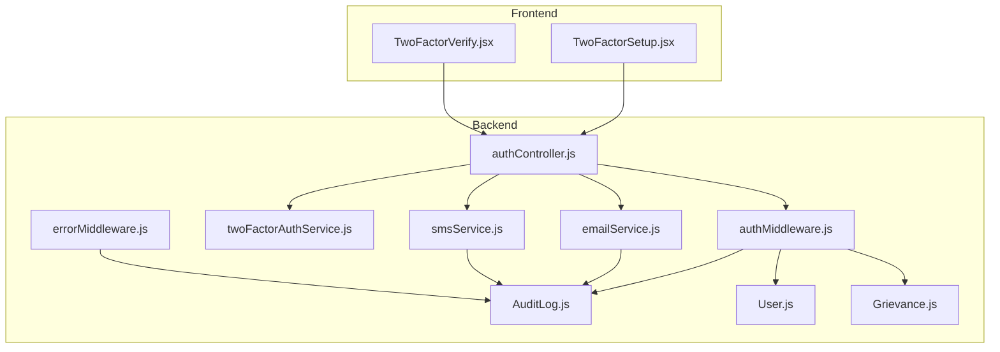
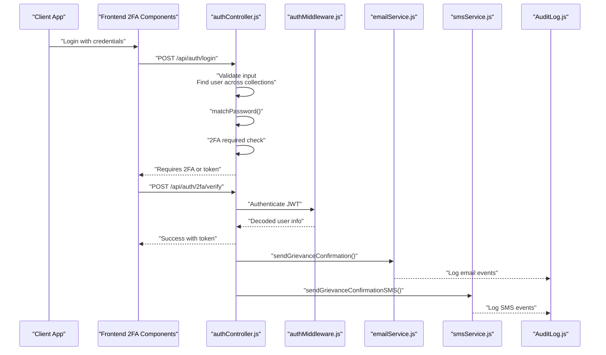
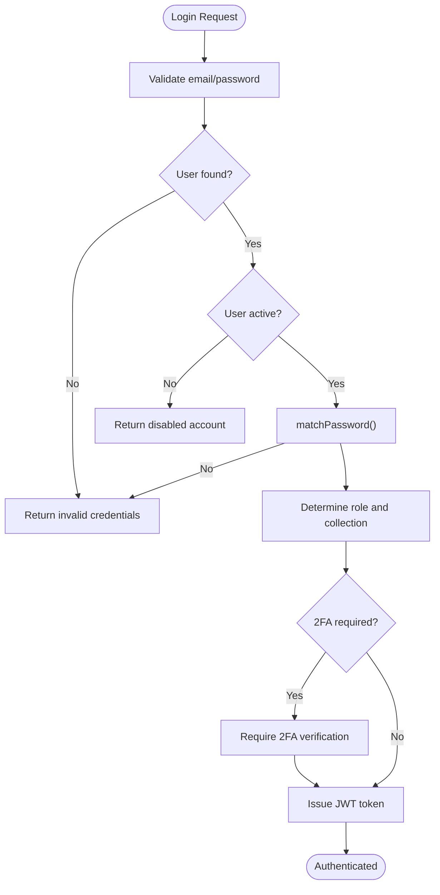
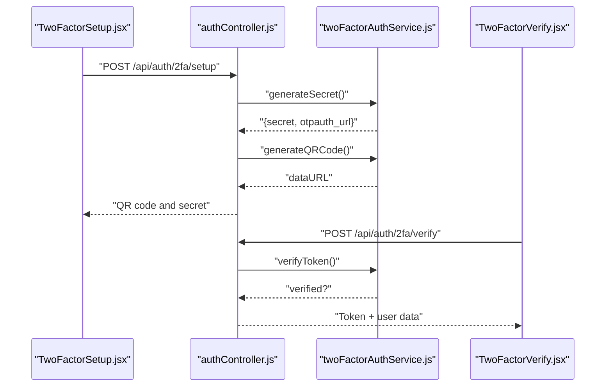
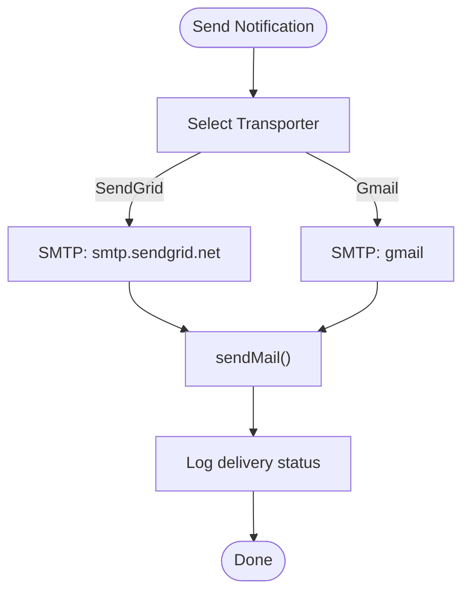
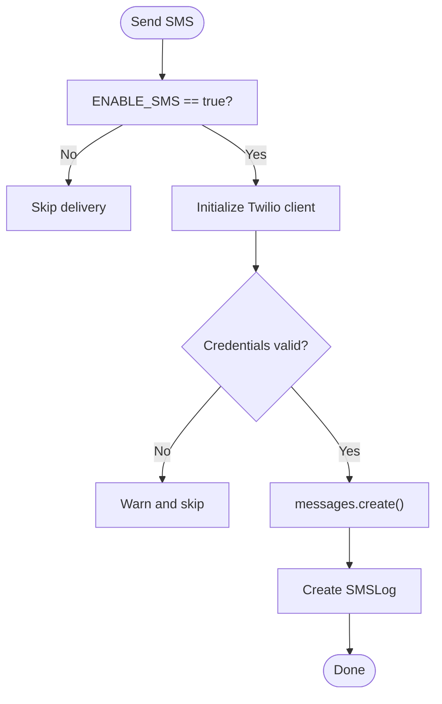
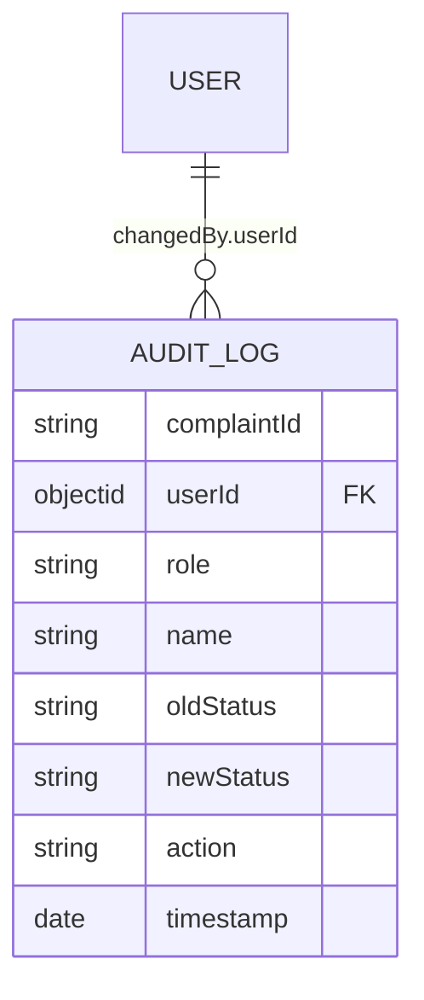
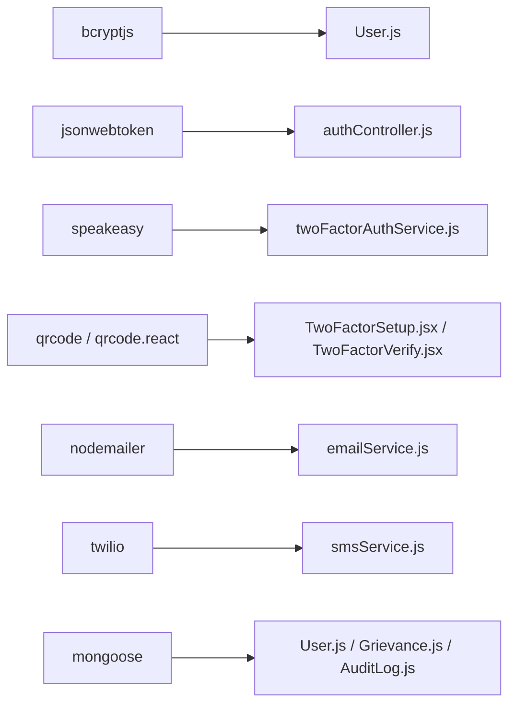

# Data Protection & Privacy

<cite>
**Referenced Files in This Document**
- [authController.js](file://backend/src/controllers/authController.js)
- [authMiddleware.js](file://backend/src/middleware/authMiddleware.js)
- [twoFactorAuthService.js](file://backend/src/services/twoFactorAuthService.js)
- [emailService.js](file://backend/src/services/emailService.js)
- [smsService.js](file://backend/src/services/smsService.js)
- [AuditLog.js](file://backend/src/models/AuditLog.js)
- [User.js](file://backend/src/models/User.js)
- [Grievance.js](file://backend/src/models/Grievance.js)
- [errorMiddleware.js](file://backend/src/middleware/errorMiddleware.js)
- [TwoFactorSetup.jsx](file://Frontend/src/components/security/TwoFactorSetup.jsx)
- [TwoFactorVerify.jsx](file://Frontend/src/components/security/TwoFactorVerify.jsx)
- [package.json](file://backend/package.json)
</cite>

## Table of Contents
1. [Introduction](#introduction)
2. [Project Structure](#project-structure)
3. [Core Components](#core-components)
4. [Architecture Overview](#architecture-overview)
5. [Detailed Component Analysis](#detailed-component-analysis)
6. [Dependency Analysis](#dependency-analysis)
7. [Performance Considerations](#performance-considerations)
8. [Troubleshooting Guide](#troubleshooting-guide)
9. [Conclusion](#conclusion)
10. [Appendices](#appendices)

## Introduction
This document provides comprehensive data protection and privacy guidance for the Smart City Grievance Redressal System. It focuses on encryption, input validation, sensitive data handling, password hashing, sanitization, SQL injection and XSS protections, secure email and SMS transmission, data retention and consent, error handling security, audit logging, and secure deletion. It also outlines policies for protecting citizen personal information, complaint data privacy, and administrative access logs.

## Project Structure
Security-relevant components span the backend Node.js/Express application and the React frontend:
- Backend: Controllers, middleware, services, and models implement authentication, authorization, 2FA, email/SMS delivery, audit logging, and data models.
- Frontend: React components implement 2FA enrollment and verification flows.



**Diagram sources**
- [authController.js:1-237](file://backend/src/controllers/authController.js#L1-L237)
- [authMiddleware.js:1-114](file://backend/src/middleware/authMiddleware.js#L1-L114)
- [twoFactorAuthService.js:1-152](file://backend/src/services/twoFactorAuthService.js#L1-L152)
- [emailService.js:1-760](file://backend/src/services/emailService.js#L1-L760)
- [smsService.js:1-162](file://backend/src/services/smsService.js#L1-L162)
- [AuditLog.js:1-42](file://backend/src/models/AuditLog.js#L1-L42)
- [User.js:1-165](file://backend/src/models/User.js#L1-L165)
- [Grievance.js:1-115](file://backend/src/models/Grievance.js#L1-L115)
- [errorMiddleware.js:1-21](file://backend/src/middleware/errorMiddleware.js#L1-L21)
- [TwoFactorSetup.jsx:1-395](file://Frontend/src/components/security/TwoFactorSetup.jsx#L1-L395)
- [TwoFactorVerify.jsx:1-200](file://Frontend/src/components/security/TwoFactorVerify.jsx#L1-L200)

**Section sources**
- [authController.js:1-237](file://backend/src/controllers/authController.js#L1-L237)
- [authMiddleware.js:1-114](file://backend/src/middleware/authMiddleware.js#L1-L114)
- [twoFactorAuthService.js:1-152](file://backend/src/services/twoFactorAuthService.js#L1-L152)
- [emailService.js:1-760](file://backend/src/services/emailService.js#L1-L760)
- [smsService.js:1-162](file://backend/src/services/smsService.js#L1-L162)
- [AuditLog.js:1-42](file://backend/src/models/AuditLog.js#L1-L42)
- [User.js:1-165](file://backend/src/models/User.js#L1-L165)
- [Grievance.js:1-115](file://backend/src/models/Grievance.js#L1-L115)
- [errorMiddleware.js:1-21](file://backend/src/middleware/errorMiddleware.js#L1-L21)
- [TwoFactorSetup.jsx:1-395](file://Frontend/src/components/security/TwoFactorSetup.jsx#L1-L395)
- [TwoFactorVerify.jsx:1-200](file://Frontend/src/components/security/TwoFactorVerify.jsx#L1-L200)

## Core Components
- Authentication and Authorization: JWT-based authentication with role-based access control and ward-based filters for administrators.
- Password Security: bcrypt-based hashing with pre-save hooks and password validation rules.
- Two-Factor Authentication (2FA): Mandatory 2FA enforcement for all users, TOTP secrets, QR code generation, backup codes, and backup code hashing.
- Communication Channels: Secure email delivery via SendGrid or Gmail SMTP and SMS via Twilio with logging.
- Audit Logging: Structured audit trail for complaint status changes and administrative actions.
- Data Models: Schemas for users, grievances, and audit logs with indexes for performance and compliance.

**Section sources**
- [authController.js:90-237](file://backend/src/controllers/authController.js#L90-L237)
- [authMiddleware.js:10-114](file://backend/src/middleware/authMiddleware.js#L10-L114)
- [User.js:146-156](file://backend/src/models/User.js#L146-L156)
- [twoFactorAuthService.js:15-152](file://backend/src/services/twoFactorAuthService.js#L15-L152)
- [emailService.js:203-458](file://backend/src/services/emailService.js#L203-L458)
- [smsService.js:24-161](file://backend/src/services/smsService.js#L24-L161)
- [AuditLog.js:3-39](file://backend/src/models/AuditLog.js#L3-L39)

## Architecture Overview
The system enforces layered security:
- Transport security: HTTPS deployment and environment variable protection.
- Identity and access: JWT tokens, role checks, and ward-scoped access.
- Secrets and cryptography: bcrypt for passwords, SHA-256 for backup codes, TOTP verification.
- Data channels: SendGrid/Gmail SMTP for emails, Twilio for SMS with logs.
- Observability: Audit logs and error middleware for incident visibility.



**Diagram sources**
- [authController.js:90-237](file://backend/src/controllers/authController.js#L90-L237)
- [authMiddleware.js:10-55](file://backend/src/middleware/authMiddleware.js#L10-L55)
- [emailService.js:356-407](file://backend/src/services/emailService.js#L356-L407)
- [smsService.js:82-100](file://backend/src/services/smsService.js#L82-L100)
- [AuditLog.js:3-39](file://backend/src/models/AuditLog.js#L3-L39)

## Detailed Component Analysis

### Authentication and Authorization
- Input validation: Controllers validate presence and format of required fields and enforce password rules.
- Multi-collection lookup: Login searches across Admin, WardAdmin, and User collections.
- JWT issuance: Tokens include role and ward for downstream authorization.
- Middleware enforcement: Authentication verifies tokens and loads user profiles; authorization restricts routes by role; ward access control scopes data access for ward administrators.



**Diagram sources**
- [authController.js:90-237](file://backend/src/controllers/authController.js#L90-L237)
- [authMiddleware.js:10-55](file://backend/src/middleware/authMiddleware.js#L10-L55)

**Section sources**
- [authController.js:90-237](file://backend/src/controllers/authController.js#L90-L237)
- [authMiddleware.js:10-114](file://backend/src/middleware/authMiddleware.js#L10-L114)

### Password Hashing Implementation
- bcrypt hashing: Pre-save hook hashes passwords before saving to the database.
- Password comparison: Verified using bcrypt compare during authentication.
- Validation rules: Minimum length and character requirements enforced at registration.

```mermaid
classDiagram
class User {
+string name
+string email
+string password
+string ward
+boolean isActive
+twoFactorAuth
+matchPassword(entered) bool
}
User : "pre('save') : hashPassword()"
```

**Diagram sources**
- [User.js:146-156](file://backend/src/models/User.js#L146-L156)

**Section sources**
- [User.js:146-156](file://backend/src/models/User.js#L146-L156)
- [authController.js:15-40](file://backend/src/controllers/authController.js#L15-L40)

### Two-Factor Authentication (2FA)
- Mandatory 2FA: Enforced on every login attempt for all users.
- Secret generation: Speakeasy-based TOTP secret with QR code creation.
- Backup codes: 8-character alphanumeric codes generated and securely hashed for storage.
- Frontend components: Guided setup and verification flows with copy/download capabilities.



**Diagram sources**
- [authController.js:153-190](file://backend/src/controllers/authController.js#L153-L190)
- [twoFactorAuthService.js:15-66](file://backend/src/services/twoFactorAuthService.js#L15-L66)
- [TwoFactorSetup.jsx:32-75](file://Frontend/src/components/security/TwoFactorSetup.jsx#L32-L75)
- [TwoFactorVerify.jsx:21-100](file://Frontend/src/components/security/TwoFactorVerify.jsx#L21-L100)

**Section sources**
- [authController.js:153-190](file://backend/src/controllers/authController.js#L153-L190)
- [twoFactorAuthService.js:15-152](file://backend/src/services/twoFactorAuthService.js#L15-L152)
- [TwoFactorSetup.jsx:32-170](file://Frontend/src/components/security/TwoFactorSetup.jsx#L32-L170)
- [TwoFactorVerify.jsx:21-100](file://Frontend/src/components/security/TwoFactorVerify.jsx#L21-L100)

### Secure Email Transmission
- Transporters: SendGrid SMTP or Gmail SMTP with environment-based selection.
- Templates: HTML templates with dynamic content and safe placeholders.
- Delivery logging: Errors and statuses recorded for auditability.
- Consent and privacy: Email content avoids exposing sensitive fields beyond necessary complaint metadata.



**Diagram sources**
- [emailService.js:206-235](file://backend/src/services/emailService.js#L206-L235)
- [emailService.js:356-407](file://backend/src/services/emailService.js#L356-L407)

**Section sources**
- [emailService.js:206-235](file://backend/src/services/emailService.js#L206-L235)
- [emailService.js:356-458](file://backend/src/services/emailService.js#L356-L458)

### Secure SMS Transmission
- Provider: Twilio client initialization with environment credentials.
- Feature flag: SMS delivery controlled by environment variable.
- Logging: SMSLog captures message SID, status, and errors for audit trails.
- Localization: Messages support multiple languages based on user preference.



**Diagram sources**
- [smsService.js:24-77](file://backend/src/services/smsService.js#L24-L77)

**Section sources**
- [smsService.js:24-161](file://backend/src/services/smsService.js#L24-L161)

### Audit Logging for Data Access
- AuditLog model: Tracks complaintId, actor (userId, role, name), old/new status, action type, and timestamp.
- Usage: Integrated with email/SMS services to record delivery attempts and outcomes.
- Compliance: Provides immutable records for accountability and forensic analysis.



**Diagram sources**
- [AuditLog.js:3-39](file://backend/src/models/AuditLog.js#L3-L39)
- [User.js:12-14](file://backend/src/models/User.js#L12-L14)

**Section sources**
- [AuditLog.js:3-39](file://backend/src/models/AuditLog.js#L3-L39)

### Data Retention Policies and Consent Management
- Retention: Define policy for automatic deletion of resolved complaints and user data upon request. Align with jurisdictional regulations.
- Consent: Obtain explicit consent for email/SMS communications; honor opt-out preferences and provide granular controls.
- Transparency: Display retention periods and consent choices in user settings.

[No sources needed since this section provides general guidance]

### Protection Against SQL Injection and XSS
- SQL injection: MongoDB ODM usage prevents raw SQL queries; avoid dynamic aggregation pipelines with untrusted input.
- XSS: Frontend rendering uses controlled components; sanitize any user-generated content before display. Avoid innerHTML with untrusted strings.

[No sources needed since this section provides general guidance]

### Data Sanitization Techniques
- Input sanitization: Trim whitespace, enforce minimum/maximum lengths, and disallow prohibited patterns (e.g., password containing email).
- Output encoding: Render dynamic content in HTML templates with safe placeholders; avoid concatenating user input into HTML attributes or scripts.

**Section sources**
- [authController.js:15-40](file://backend/src/controllers/authController.js#L15-L40)
- [emailService.js:238-351](file://backend/src/services/emailService.js#L238-L351)

### Secure Deletion Procedures
- Logical deletion: Mark records as inactive rather than immediate removal to preserve audit trails.
- Physical deletion: Schedule batch jobs to purge inactive records after policy-defined retention period.
- Immutable logs: Preserve audit logs even after data deletion for compliance.

[No sources needed since this section provides general guidance]

### Guidelines for Protecting Citizen Personal Information
- Minimization: Collect only necessary fields; avoid storing sensitive identifiers beyond requirement.
- Encryption: Encrypt at rest using platform defaults; protect in transit with TLS.
- Access: Enforce least privilege; log all access to sensitive data.

[No sources needed since this section provides general guidance]

### Administrative Access Logs
- Scope: Record all administrative actions, including user management, complaint routing, and system configuration changes.
- Integrity: Store logs immutably; prevent tampering and ensure non-repudiation.

**Section sources**
- [AuditLog.js:3-39](file://backend/src/models/AuditLog.js#L3-L39)

## Dependency Analysis
External libraries and their roles:
- bcryptjs: Password hashing and verification.
- jsonwebtoken: JWT signing and verification.
- speakeasy: TOTP secret generation and token verification.
- qrcode/qrcode.react: QR code rendering for 2FA setup.
- nodemailer: Email transport via SendGrid or Gmail.
- twilio: SMS delivery with logging.
- mongoose: MongoDB ODM for models and indexes.



**Diagram sources**
- [package.json:10-26](file://backend/package.json#L10-L26)
- [User.js:1-3](file://backend/src/models/User.js#L1-L3)
- [authController.js:1-6](file://backend/src/controllers/authController.js#L1-L6)
- [twoFactorAuthService.js:1-3](file://backend/src/services/twoFactorAuthService.js#L1-L3)
- [emailService.js:203-203](file://backend/src/services/emailService.js#L203-L203)
- [smsService.js:1-2](file://backend/src/services/smsService.js#L1-L2)

**Section sources**
- [package.json:10-26](file://backend/package.json#L10-L26)

## Performance Considerations
- Indexes: User and Grievance models include indexes to optimize role-based and ward-based queries.
- Hashing cost: bcrypt salt rounds are balanced for security vs. performance.
- Transporters: Email/SMS delivery is asynchronous; consider queueing for high volume.

**Section sources**
- [User.js:159-164](file://backend/src/models/User.js#L159-L164)
- [Grievance.js:103-112](file://backend/src/models/Grievance.js#L103-L112)

## Troubleshooting Guide
- Authentication failures: Check JWT secret, token expiration, and user activation status.
- 2FA issues: Verify secret validity, QR code generation, and backup code hashing.
- Email/SMS delivery: Confirm environment variables, feature flags, and provider credentials.
- Audit gaps: Ensure logging is invoked on success and failure paths.

**Section sources**
- [authMiddleware.js:10-55](file://backend/src/middleware/authMiddleware.js#L10-L55)
- [twoFactorAuthService.js:15-66](file://backend/src/services/twoFactorAuthService.js#L15-L66)
- [emailService.js:206-235](file://backend/src/services/emailService.js#L206-L235)
- [smsService.js:24-77](file://backend/src/services/smsService.js#L24-L77)
- [errorMiddleware.js:8-18](file://backend/src/middleware/errorMiddleware.js#L8-L18)

## Conclusion
The system implements robust identity and access controls, mandatory 2FA, secure cryptographic practices, and comprehensive audit logging. To strengthen privacy and security posture, deploy strict data retention and consent policies, harden transport and storage configurations, and continuously monitor logs for anomalies.

## Appendices
- Environment variables to configure:
  - JWT_SECRET for token signing
  - SENDGRID_API_KEY or EMAIL_USER/EMAIL_PASS for email
  - TWILIO_ACCOUNT_SID, TWILIO_AUTH_TOKEN, TWILIO_PHONE_NUMBER for SMS
  - ENABLE_SMS to control SMS delivery
  - FRONTEND_URL for email links

[No sources needed since this section provides general guidance]