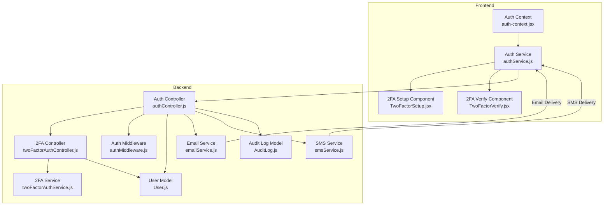
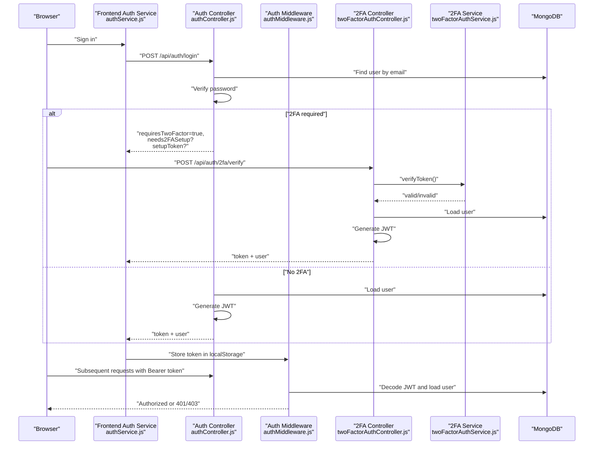
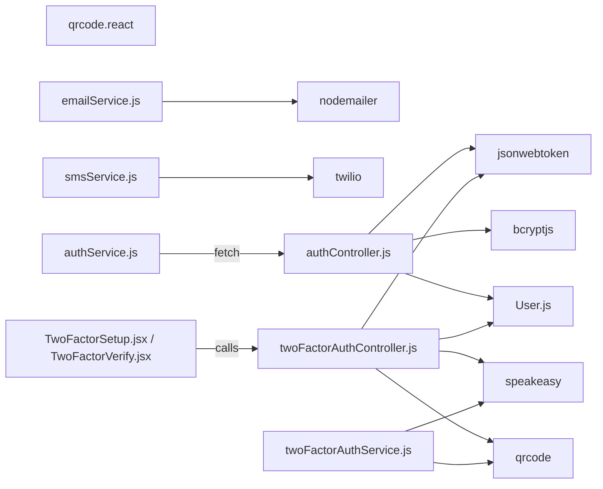

# Security & Compliance

<cite>
**Referenced Files in This Document**
- [authController.js](file://backend/src/controllers/authController.js)
- [twoFactorAuthController.js](file://backend/src/controllers/twoFactorAuthController.js)
- [authMiddleware.js](file://backend/src/middleware/authMiddleware.js)
- [errorMiddleware.js](file://backend/src/middleware/errorMiddleware.js)
- [twoFactorAuthService.js](file://backend/src/services/twoFactorAuthService.js)
- [User.js](file://backend/src/models/User.js)
- [emailService.js](file://backend/src/services/emailService.js)
- [smsService.js](file://backend/src/services/smsService.js)
- [AuditLog.js](file://backend/src/models/AuditLog.js)
- [auth-context.jsx](file://Frontend/src/context/auth-context.jsx)
- [authService.js](file://Frontend/src/services/authService.js)
- [TwoFactorSetup.jsx](file://Frontend/src/components/security/TwoFactorSetup.jsx)
- [TwoFactorVerify.jsx](file://Frontend/src/components/security/TwoFactorVerify.jsx)
- [package.json](file://backend/package.json)
- [config.toml](file://Frontend/supabase/config.toml)
</cite>

## Table of Contents
1. [Introduction](#introduction)
2. [Project Structure](#project-structure)
3. [Core Components](#core-components)
4. [Architecture Overview](#architecture-overview)
5. [Detailed Component Analysis](#detailed-component-analysis)
6. [Dependency Analysis](#dependency-analysis)
7. [Performance Considerations](#performance-considerations)
8. [Troubleshooting Guide](#troubleshooting-guide)
9. [Conclusion](#conclusion)
10. [Appendices](#appendices)

## Introduction
This document provides comprehensive security and compliance documentation for the Smart City Grievance Redressal System (SC-GRS). It covers authentication security, data protection, and regulatory adherence, focusing on JWT token security, password hashing, session management, two-factor authentication (2FA), email and SMS verification, input validation, SQL injection prevention, cross-site scripting (XSS) protection, GDPR compliance, audit logging, error handling security, and secure deployment practices. The goal is to make the security posture understandable for both technical and non-technical stakeholders.

## Project Structure
The SC-GRS follows a layered backend (Node.js/Express) and a modern React frontend. Security controls are implemented across:
- Backend controllers and services for authentication and 2FA
- Middleware for JWT authentication and role-based authorization
- Models for password hashing and 2FA fields
- Services for email and SMS delivery
- Frontend authentication context and components for 2FA flows
- Audit logging model for compliance and monitoring

**Diagram sources**
- [auth-context.jsx](file://Frontend/src/context/auth-context.jsx)
- [authService.js](file://Frontend/src/services/authService.js)
- [TwoFactorSetup.jsx](file://Frontend/src/components/security/TwoFactorSetup.jsx)
- [TwoFactorVerify.jsx](file://Frontend/src/components/security/TwoFactorVerify.jsx)
- [authController.js](file://backend/src/controllers/authController.js)
- [twoFactorAuthController.js](file://backend/src/controllers/twoFactorAuthController.js)
- [authMiddleware.js](file://backend/src/middleware/authMiddleware.js)
- [twoFactorAuthService.js](file://backend/src/services/twoFactorAuthService.js)
- [User.js](file://backend/src/models/User.js)
- [emailService.js](file://backend/src/services/emailService.js)
- [smsService.js](file://backend/src/services/smsService.js)
- [AuditLog.js](file://backend/src/models/AuditLog.js)

**Section sources**
- [authController.js](file://backend/src/controllers/authController.js)
- [twoFactorAuthController.js](file://backend/src/controllers/twoFactorAuthController.js)
- [authMiddleware.js](file://backend/src/middleware/authMiddleware.js)
- [twoFactorAuthService.js](file://backend/src/services/twoFactorAuthService.js)
- [User.js](file://backend/src/models/User.js)
- [emailService.js](file://backend/src/services/emailService.js)
- [smsService.js](file://backend/src/services/smsService.js)
- [AuditLog.js](file://backend/src/models/AuditLog.js)
- [auth-context.jsx](file://Frontend/src/context/auth-context.jsx)
- [authService.js](file://Frontend/src/services/authService.js)
- [TwoFactorSetup.jsx](file://Frontend/src/components/security/TwoFactorSetup.jsx)
- [TwoFactorVerify.jsx](file://Frontend/src/components/security/TwoFactorVerify.jsx)

## Core Components
- JWT-based authentication with role-aware token decoding and enforcement
- Mandatory 2FA for all users during login with TOTP and backup codes
- Secure password hashing using bcrypt with pre-save hooks
- Email and SMS notification services with transport abstraction
- Audit logging for complaint status changes
- Frontend authentication context and 2FA components for seamless UX

Key implementation highlights:
- JWT signing and verification with a secret from environment variables
- Password hashing on user creation/update
- 2FA secret generation, QR code provisioning, and backup code hashing
- Email/SMS transport selection with fallbacks and logging
- Audit trail capturing who changed complaint status and when

**Section sources**
- [authController.js](file://backend/src/controllers/authController.js)
- [twoFactorAuthController.js](file://backend/src/controllers/twoFactorAuthController.js)
- [authMiddleware.js](file://backend/src/middleware/authMiddleware.js)
- [twoFactorAuthService.js](file://backend/src/services/twoFactorAuthService.js)
- [User.js](file://backend/src/models/User.js)
- [emailService.js](file://backend/src/services/emailService.js)
- [smsService.js](file://backend/src/services/smsService.js)
- [AuditLog.js](file://backend/src/models/AuditLog.js)
- [auth-context.jsx](file://Frontend/src/context/auth-context.jsx)
- [authService.js](file://Frontend/src/services/authService.js)
- [TwoFactorSetup.jsx](file://Frontend/src/components/security/TwoFactorSetup.jsx)
- [TwoFactorVerify.jsx](file://Frontend/src/components/security/TwoFactorVerify.jsx)

## Architecture Overview
The authentication and 2FA flow integrates frontend components with backend controllers and services. The frontend handles user interactions and stores tokens locally, while the backend enforces JWT-based authentication, role-based access control, and mandatory 2FA.

**Diagram sources**
- [authService.js](file://Frontend/src/services/authService.js)
- [authController.js](file://backend/src/controllers/authController.js)
- [authMiddleware.js](file://backend/src/middleware/authMiddleware.js)
- [twoFactorAuthController.js](file://backend/src/controllers/twoFactorAuthController.js)
- [twoFactorAuthService.js](file://backend/src/services/twoFactorAuthService.js)

## Detailed Component Analysis

### JWT Token Security
- Token payload includes user id, role, and ward for ward admins
- Signed with a secret from environment variables and expires in seven days
- Middleware validates token signature and decodes role-specific user record
- Role-based authorization middleware restricts access to resources
- Ward-based access control ensures ward admins operate within their assigned ward

Security controls:
- Secret rotation policy should be enforced at deployment level
- Tokens are transmitted via Authorization header and stored in browser storage
- Consider short-lived access tokens with refresh token strategy for higher security

**Section sources**
- [authController.js](file://backend/src/controllers/authController.js)
- [authMiddleware.js](file://backend/src/middleware/authMiddleware.js)

### Password Hashing Implementation
- Pre-save hook hashes passwords using bcrypt with a salt round of 10
- Password comparison uses bcrypt compare for verification
- User model defines minimum password length and other constraints

Security controls:
- Strong hashing prevents rainbow table attacks
- Enforce strong password policies at registration

**Section sources**
- [User.js](file://backend/src/models/User.js)

### Session Management
- Stateless JWT-based session model
- No server-side session store; authentication relies on signed tokens
- Frontend stores token in local storage and attaches Authorization header on requests
- Middleware enforces active account checks and role-based access

Recommendations:
- Consider HttpOnly cookies for production to mitigate XSS risks
- Implement token refresh mechanisms and logout invalidation

**Section sources**
- [auth-context.jsx](file://Frontend/src/context/auth-context.jsx)
- [authService.js](file://Frontend/src/services/authService.js)
- [authMiddleware.js](file://backend/src/middleware/authMiddleware.js)

### Two-Factor Authentication (2FA)
Mandatory 2FA for all users during login:
- Secret generation using speakeasy with QR provisioning
- Backup codes generated and hashed for secure storage
- Verification supports both TOTP and backup codes
- Setup flow initiates with a short-lived setup token when 2FA is required but not configured

Frontend components:
- TwoFactorSetup.jsx guides users through QR scanning and verification
- TwoFactorVerify.jsx accepts 6-digit TOTP or 8-digit backup codes

Security controls:
- Backup codes are hashed before storage
- 2FA enforced on every login attempt
- Warning issued when backup code is used

**Section sources**
- [twoFactorAuthController.js](file://backend/src/controllers/twoFactorAuthController.js)
- [twoFactorAuthService.js](file://backend/src/services/twoFactorAuthService.js)
- [User.js](file://backend/src/models/User.js)
- [TwoFactorSetup.jsx](file://Frontend/src/components/security/TwoFactorSetup.jsx)
- [TwoFactorVerify.jsx](file://Frontend/src/components/security/TwoFactorVerify.jsx)

### Email and SMS Verification Processes
Email:
- Transport selection: SendGrid preferred, Gmail SMTP supported
- Templates for grievance confirmation, status updates, invitations, and critical alerts
- Logging indicates whether transport is available and delivery outcomes

SMS:
- Twilio integration with feature flag and credential validation
- Multi-language messages for grievance confirmations, status updates, and critical alerts
- SMS logs capture delivery status and errors

Security controls:
- Environment variables for credentials
- Logging failures without exposing secrets

**Section sources**
- [emailService.js](file://backend/src/services/emailService.js)
- [smsService.js](file://backend/src/services/smsService.js)

### Input Validation, SQL Injection Prevention, and XSS Protection
Input validation:
- Registration enforces password length and composition rules
- Login validates presence of credentials and role constraints
- 2FA endpoints validate token formats and lengths

SQL injection prevention:
- MongoDB ODM usage avoids raw SQL queries
- No direct SQL statements observed in the backend

XSS protection:
- Email templates use templating with dynamic content; ensure frontend rendering does not inject untrusted HTML
- Frontend components sanitize user inputs and avoid innerHTML misuse

Recommendations:
- Implement Content-Security-Policy headers
- Sanitize and escape all user-generated content in emails and UI
- Use strict DOMPurify for any HTML rendering

**Section sources**
- [authController.js](file://backend/src/controllers/authController.js)
- [twoFactorAuthController.js](file://backend/src/controllers/twoFactorAuthController.js)
- [emailService.js](file://backend/src/services/emailService.js)

### GDPR Compliance Requirements
Data protection measures:
- Passwords hashed with bcrypt
- Backup codes hashed for storage
- Minimal personal data collected (name, email, optional phone)
- Consent management: email and SMS preferences stored per user
- Data retention: no explicit retention policies defined in models; implement organizational policies aligned with GDPR

Recommendations:
- Define data retention periods and automatic deletion policies
- Implement right to erasure and data portability mechanisms
- Add cookie consent banners and privacy policy links
- Encrypt sensitive data at rest and in transit

**Section sources**
- [User.js](file://backend/src/models/User.js)
- [emailService.js](file://backend/src/services/emailService.js)
- [smsService.js](file://backend/src/services/smsService.js)

### Security Audit Logging
- AuditLog model captures complaintId, actor (userId, role, name), old/new status, action type, and timestamp
- Supports compliance reporting and incident investigations

Recommendations:
- Expand audit scope to include sensitive actions (password changes, role promotions)
- Add IP address and user agent for enhanced attribution
- Implement log retention and archival policies

**Section sources**
- [AuditLog.js](file://backend/src/models/AuditLog.js)

### Error Handling Security
- Centralized error handler returns generic messages except in development
- Stack traces suppressed in production to prevent information disclosure
- 404 handler for unknown routes

Recommendations:
- Implement structured logging with correlation IDs
- Add rate limiting and DDoS protections
- Monitor and alert on repeated error patterns

**Section sources**
- [errorMiddleware.js](file://backend/src/middleware/errorMiddleware.js)

### Secure Deployment Practices
- Environment variables for secrets (JWT, email, SMS)
- Package dependencies include bcrypt, jsonwebtoken, speakeasy, nodemailer, twilio
- Supabase local configuration for development functions

Recommendations:
- Use secrets management (e.g., Vault, AWS Secrets Manager)
- Enforce HTTPS/TLS termination at ingress
- Regular dependency audits and vulnerability scans
- Principle of least privilege for service accounts

**Section sources**
- [package.json](file://backend/package.json)
- [config.toml](file://Frontend/supabase/config.toml)

## Dependency Analysis

**Diagram sources**
- [authController.js](file://backend/src/controllers/authController.js)
- [twoFactorAuthController.js](file://backend/src/controllers/twoFactorAuthController.js)
- [twoFactorAuthService.js](file://backend/src/services/twoFactorAuthService.js)
- [User.js](file://backend/src/models/User.js)
- [emailService.js](file://backend/src/services/emailService.js)
- [smsService.js](file://backend/src/services/smsService.js)
- [authService.js](file://Frontend/src/services/authService.js)
- [TwoFactorSetup.jsx](file://Frontend/src/components/security/TwoFactorSetup.jsx)
- [TwoFactorVerify.jsx](file://Frontend/src/components/security/TwoFactorVerify.jsx)

**Section sources**
- [authController.js](file://backend/src/controllers/authController.js)
- [twoFactorAuthController.js](file://backend/src/controllers/twoFactorAuthController.js)
- [twoFactorAuthService.js](file://backend/src/services/twoFactorAuthService.js)
- [User.js](file://backend/src/models/User.js)
- [emailService.js](file://backend/src/services/emailService.js)
- [smsService.js](file://backend/src/services/smsService.js)
- [authService.js](file://Frontend/src/services/authService.js)
- [TwoFactorSetup.jsx](file://Frontend/src/components/security/TwoFactorSetup.jsx)
- [TwoFactorVerify.jsx](file://Frontend/src/components/security/TwoFactorVerify.jsx)

## Performance Considerations
- JWT verification is lightweight; ensure minimal payload to reduce overhead
- 2FA verification uses speakeasy with configurable time windows
- Email/SMS delivery depends on external providers; implement retries and circuit breakers
- Database indexing on email, ward, and leaderboard fields improves query performance

## Troubleshooting Guide
Common issues and mitigations:
- Invalid or expired JWT: Verify secret consistency and token expiration
- 2FA verification failures: Confirm time sync on authenticator app; check backup code usage
- Email/SMS delivery failures: Validate provider credentials and feature flags
- Account disabled: Ensure user.isActive is true in the database
- Route not found: Confirm endpoint paths and middleware chain

**Section sources**
- [authMiddleware.js](file://backend/src/middleware/authMiddleware.js)
- [twoFactorAuthController.js](file://backend/src/controllers/twoFactorAuthController.js)
- [emailService.js](file://backend/src/services/emailService.js)
- [smsService.js](file://backend/src/services/smsService.js)
- [errorMiddleware.js](file://backend/src/middleware/errorMiddleware.js)

## Conclusion
The SC-GRS implements robust authentication and 2FA controls, secure password handling, and notification services. To strengthen compliance and resilience, deploy environment-based secrets management, adopt HTTPS/TLS, implement comprehensive audit trails, and establish data retention and consent policies aligned with GDPR. Regular security assessments and dependency hygiene will further enhance the system’s security posture.

## Appendices
- Recommended enhancements:
  - Refresh token strategy and logout invalidation
  - CSP headers and XSS sanitization
  - Data retention and erasure procedures
  - Incident response and breach notification procedures