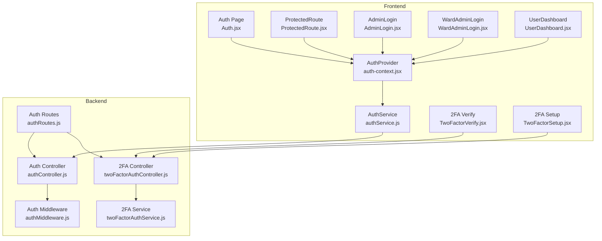
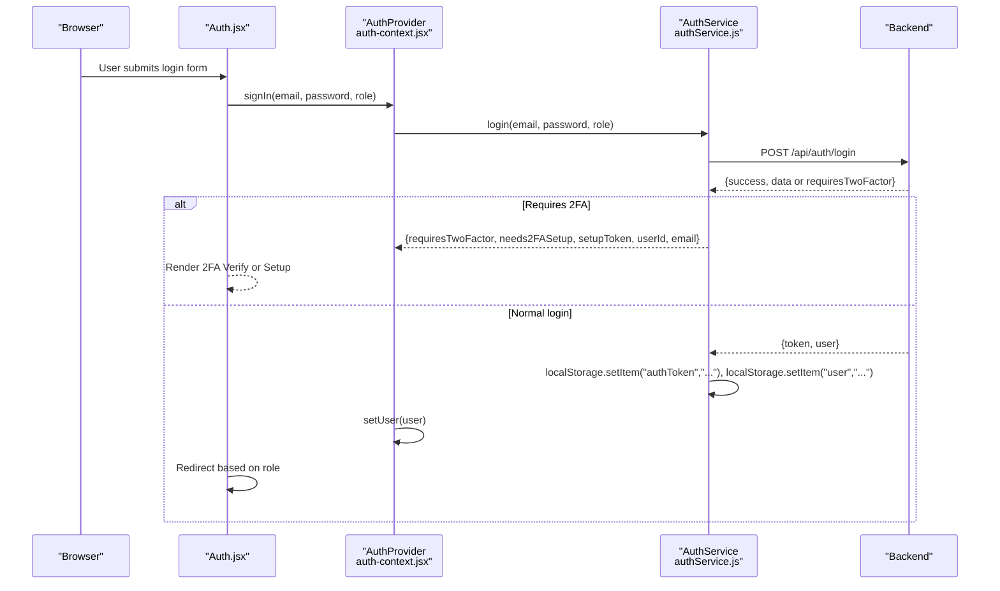
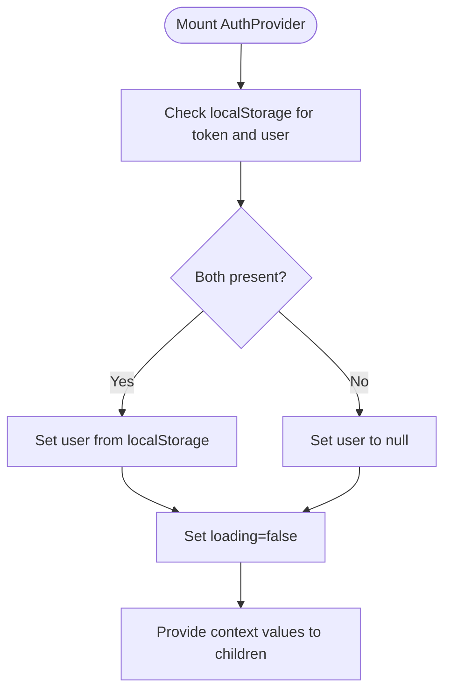
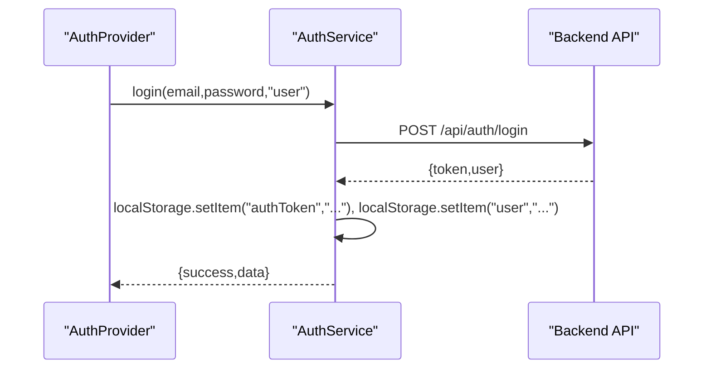
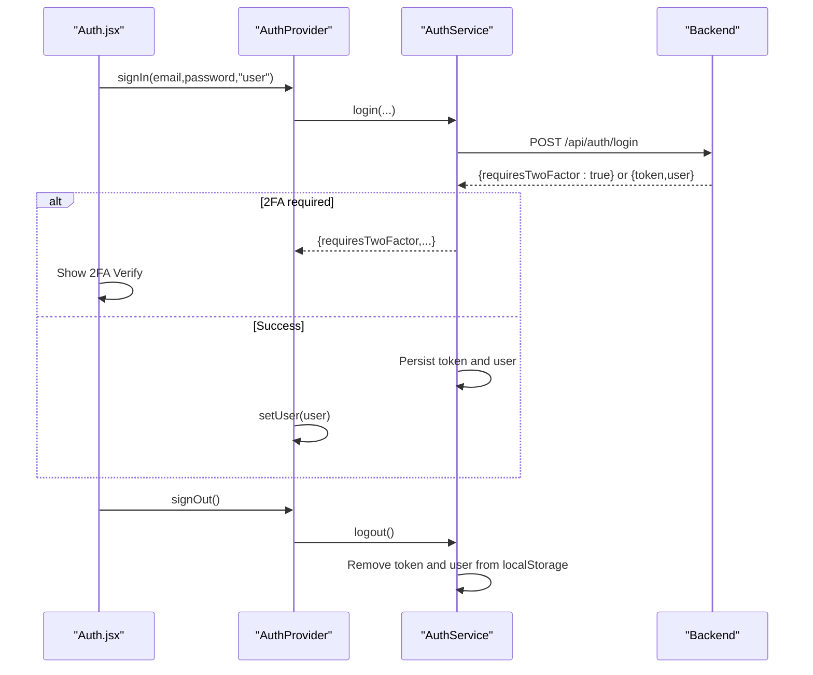
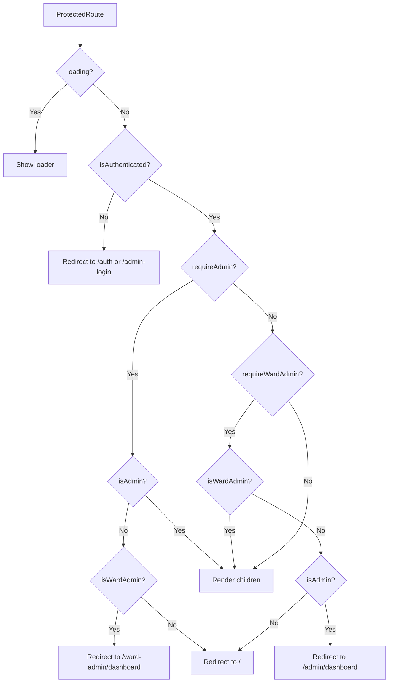
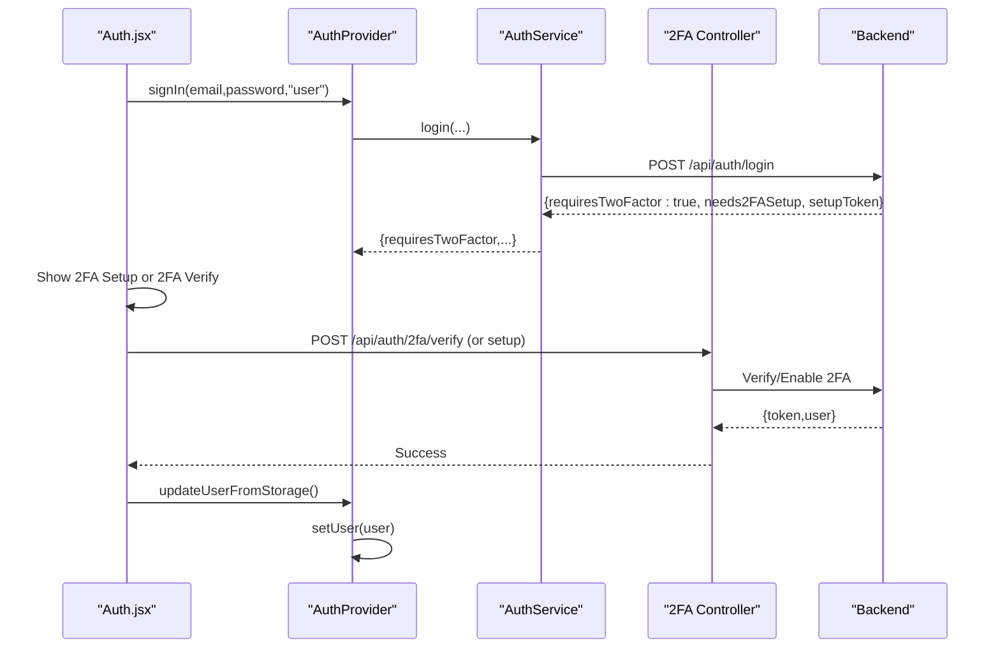
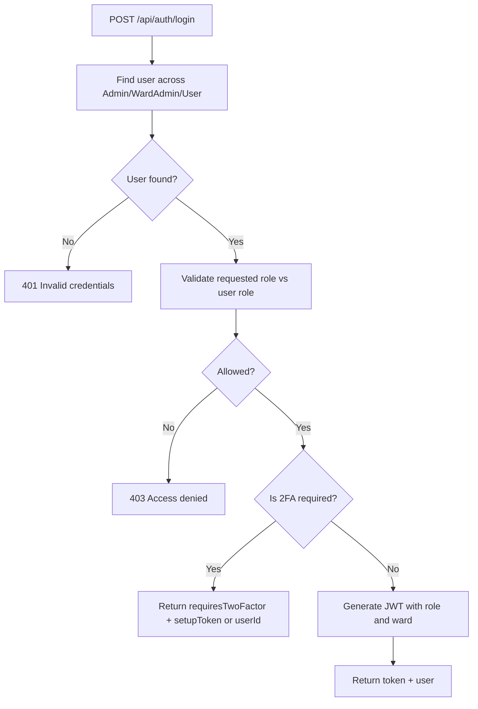
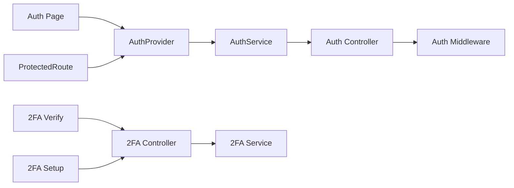

# Authentication & User State

<cite>
**Referenced Files in This Document**
- [auth-context.jsx](file://Frontend/src/context/auth-context.jsx)
- [authService.js](file://Frontend/src/services/authService.js)
- [Auth.jsx](file://Frontend/src/pages/Auth.jsx)
- [ProtectedRoute.jsx](file://Frontend/src/components/ProtectedRoute.jsx)
- [TwoFactorVerify.jsx](file://Frontend/src/components/security/TwoFactorVerify.jsx)
- [TwoFactorSetup.jsx](file://Frontend/src/components/security/TwoFactorSetup.jsx)
- [AdminLogin.jsx](file://Frontend/src/pages/AdminLogin.jsx)
- [WardAdminLogin.jsx](file://Frontend/src/pages/WardAdminLogin.jsx)
- [UserDashboard.jsx](file://Frontend/src/pages/UserDashboard.jsx)
- [authController.js](file://backend/src/controllers/authController.js)
- [twoFactorAuthController.js](file://backend/src/controllers/twoFactorAuthController.js)
- [authMiddleware.js](file://backend/src/middleware/authMiddleware.js)
- [twoFactorAuthService.js](file://backend/src/services/twoFactorAuthService.js)
- [authRoutes.js](file://backend/src/routes/authRoutes.js)
- [client.ts](file://Frontend/src/integrations/supabase/client.ts)
</cite>

## Table of Contents
1. [Introduction](#introduction)
2. [Project Structure](#project-structure)
3. [Core Components](#core-components)
4. [Architecture Overview](#architecture-overview)
5. [Detailed Component Analysis](#detailed-component-analysis)
6. [Dependency Analysis](#dependency-analysis)
7. [Performance Considerations](#performance-considerations)
8. [Troubleshooting Guide](#troubleshooting-guide)
9. [Conclusion](#conclusion)

## Introduction
This document explains the authentication and user state management system. It covers the AuthProvider context, user session handling, multi-role authentication (citizen, ward admin, super admin), the end-to-end authentication flow (login, signup, logout), 2FA integration, state persistence with localStorage, cross-tab synchronization via storage events, and loading states during initialization. It also provides practical examples for protected routes, role-based rendering, and authentication guards, along with error handling, token management, and security considerations.

## Project Structure
The authentication system spans the frontend React application and the backend Express server:
- Frontend context and services manage user state, localStorage persistence, and UI flows.
- Backend controllers and middleware handle JWT-based authentication, role-based access control, and 2FA enforcement.
- Dedicated 2FA controllers and services implement TOTP and backup codes.

**Diagram sources**
- [auth-context.jsx:1-143](file://Frontend/src/context/auth-context.jsx#L1-L143)
- [authService.js:1-99](file://Frontend/src/services/authService.js#L1-L99)
- [Auth.jsx:1-443](file://Frontend/src/pages/Auth.jsx#L1-L443)
- [ProtectedRoute.jsx:1-47](file://Frontend/src/components/ProtectedRoute.jsx#L1-L47)
- [TwoFactorVerify.jsx:1-200](file://Frontend/src/components/security/TwoFactorVerify.jsx#L1-L200)
- [TwoFactorSetup.jsx:1-395](file://Frontend/src/components/security/TwoFactorSetup.jsx#L1-L395)
- [AdminLogin.jsx:1-199](file://Frontend/src/pages/AdminLogin.jsx#L1-L199)
- [WardAdminLogin.jsx:1-170](file://Frontend/src/pages/WardAdminLogin.jsx#L1-L170)
- [UserDashboard.jsx:1-254](file://Frontend/src/pages/UserDashboard.jsx#L1-L254)
- [authController.js:1-237](file://backend/src/controllers/authController.js#L1-L237)
- [twoFactorAuthController.js:1-453](file://backend/src/controllers/twoFactorAuthController.js#L1-L453)
- [authMiddleware.js:1-114](file://backend/src/middleware/authMiddleware.js#L1-L114)
- [twoFactorAuthService.js:1-152](file://backend/src/services/twoFactorAuthService.js#L1-L152)
- [authRoutes.js:1-10](file://backend/src/routes/authRoutes.js#L1-L10)

**Section sources**
- [auth-context.jsx:1-143](file://Frontend/src/context/auth-context.jsx#L1-L143)
- [authService.js:1-99](file://Frontend/src/services/authService.js#L1-L99)
- [authController.js:1-237](file://backend/src/controllers/authController.js#L1-L237)
- [authMiddleware.js:1-114](file://backend/src/middleware/authMiddleware.js#L1-L114)
- [twoFactorAuthService.js:1-152](file://backend/src/services/twoFactorAuthService.js#L1-L152)

## Core Components
- AuthProvider and useAuth: Centralized user state, role flags, and auth actions. Initializes from localStorage and synchronizes across tabs via storage events.
- AuthService: Encapsulates network requests to backend auth endpoints and manages localStorage tokens and user data.
- Auth Page: Orchestrates login/signup, redirects based on role, and handles 2FA flows.
- ProtectedRoute: Guards routes and enforces role-based access.
- 2FA Components: Setup and verification flows for mandatory 2FA.
- Admin and Ward Admin Login Pages: Separate portals with role-specific redirections.
- Backend Controllers and Middleware: JWT verification, role-based authorization, and 2FA enforcement.

Key responsibilities:
- State initialization and persistence using localStorage.
- Cross-tab synchronization via storage event listeners.
- Role detection and derived flags (isAuthenticated, isAdmin, isWardAdmin, isManagement).
- 2FA enforcement policy and UI transitions.

**Section sources**
- [auth-context.jsx:6-134](file://Frontend/src/context/auth-context.jsx#L6-L134)
- [authService.js:3-99](file://Frontend/src/services/authService.js#L3-L99)
- [Auth.jsx:31-65](file://Frontend/src/pages/Auth.jsx#L31-L65)
- [ProtectedRoute.jsx:5-44](file://Frontend/src/components/ProtectedRoute.jsx#L5-L44)
- [TwoFactorVerify.jsx:16-100](file://Frontend/src/components/security/TwoFactorVerify.jsx#L16-L100)
- [TwoFactorSetup.jsx:17-75](file://Frontend/src/components/security/TwoFactorSetup.jsx#L17-L75)
- [AdminLogin.jsx:22-36](file://Frontend/src/pages/AdminLogin.jsx#L22-L36)
- [WardAdminLogin.jsx:17-25](file://Frontend/src/pages/WardAdminLogin.jsx#L17-L25)
- [authController.js:90-237](file://backend/src/controllers/authController.js#L90-L237)
- [authMiddleware.js:10-55](file://backend/src/middleware/authMiddleware.js#L10-L55)
- [twoFactorAuthService.js:125-135](file://backend/src/services/twoFactorAuthService.js#L125-L135)

## Architecture Overview
The system follows a layered architecture:
- Frontend presentation and state management (React context and services).
- Backend REST endpoints for authentication and 2FA.
- JWT-based session tokens stored in localStorage.
- Mandatory 2FA enforced for all users on login attempts.

**Diagram sources**
- [Auth.jsx:102-136](file://Frontend/src/pages/Auth.jsx#L102-L136)
- [auth-context.jsx:43-72](file://Frontend/src/context/auth-context.jsx#L43-L72)
- [authService.js:37-80](file://Frontend/src/services/authService.js#L37-L80)
- [authController.js:90-237](file://backend/src/controllers/authController.js#L90-L237)

## Detailed Component Analysis

### AuthProvider and Context
- Initializes state from localStorage on mount.
- Provides derived flags: isAuthenticated, isAdmin, isWardAdmin, isManagement.
- Exposes actions: signUp, signIn, signOut, updateUserFromStorage.
- Listens to storage events to synchronize state across browser tabs.
- Renders a loading spinner while initializing.

**Diagram sources**
- [auth-context.jsx:10-27](file://Frontend/src/context/auth-context.jsx#L10-L27)

**Section sources**
- [auth-context.jsx:6-134](file://Frontend/src/context/auth-context.jsx#L6-L134)

### AuthService and Token Management
- Encapsulates network calls to backend auth endpoints.
- Persists tokens and user data in localStorage upon successful login/register.
- Retrieves tokens and stored user for downstream components.
- Provides isAuthenticated and getToken helpers.

**Diagram sources**
- [authService.js:37-80](file://Frontend/src/services/authService.js#L37-L80)
- [authController.js:90-237](file://backend/src/controllers/authController.js#L90-L237)

**Section sources**
- [authService.js:3-99](file://Frontend/src/services/authService.js#L3-L99)

### Authentication Flow: Login, Signup, Logout
- Login: Validates role, calls backend login, handles 2FA-required responses, persists token/user, sets context.
- Signup: Calls backend register, persists token/user on success.
- Logout: Removes tokens from localStorage and clears context.

**Diagram sources**
- [Auth.jsx:102-136](file://Frontend/src/pages/Auth.jsx#L102-L136)
- [auth-context.jsx:74-78](file://Frontend/src/context/auth-context.jsx#L74-L78)
- [authService.js:82-85](file://Frontend/src/services/authService.js#L82-L85)
- [authController.js:90-237](file://backend/src/controllers/authController.js#L90-L237)

**Section sources**
- [Auth.jsx:92-190](file://Frontend/src/pages/Auth.jsx#L92-L190)
- [auth-context.jsx:29-78](file://Frontend/src/context/auth-context.jsx#L29-L78)
- [authService.js:3-99](file://Frontend/src/services/authService.js#L3-L99)

### Multi-Role Authentication and Access Control
- Roles: user (citizen), ward_admin, admin (super admin).
- Role-based redirections:
  - Admin login portal redirects to /admin/dashboard for admin/ward_admin.
  - Citizen login redirects to /dashboard.
  - Ward admin login portal redirects to /ward-admin/dashboard.
- ProtectedRoute enforces:
  - Unauthenticated users redirected to /auth or /admin-login depending on route.
  - requireAdmin and requireWardAdmin props enforce role gates.
  - Cross-role redirects: admin -> /admin/dashboard, ward_admin -> /ward-admin/dashboard.

**Diagram sources**
- [ProtectedRoute.jsx:5-44](file://Frontend/src/components/ProtectedRoute.jsx#L5-L44)
- [AdminLogin.jsx:22-36](file://Frontend/src/pages/AdminLogin.jsx#L22-L36)
- [WardAdminLogin.jsx:17-25](file://Frontend/src/pages/WardAdminLogin.jsx#L17-L25)

**Section sources**
- [ProtectedRoute.jsx:5-44](file://Frontend/src/components/ProtectedRoute.jsx#L5-L44)
- [AdminLogin.jsx:22-36](file://Frontend/src/pages/AdminLogin.jsx#L22-L36)
- [WardAdminLogin.jsx:17-25](file://Frontend/src/pages/WardAdminLogin.jsx#L17-L25)

### 2FA Integration
- Policy: Mandatory 2FA for all users on every login attempt.
- Setup flow:
  - Initialize 2FA setup via backend endpoint, receive secret and otpauth URL.
  - Scan QR code or enter secret manually.
  - Verify and enable 2FA; backend generates backup codes.
- Verification flow:
  - On login, if 2FA required, show 2FA Verify component.
  - Accept 6-digit TOTP or backup code.
  - On success, backend returns token and user; frontend persists and updates context.

**Diagram sources**
- [Auth.jsx:102-136](file://Frontend/src/pages/Auth.jsx#L102-L136)
- [auth-context.jsx:80-97](file://Frontend/src/context/auth-context.jsx#L80-L97)
- [TwoFactorVerify.jsx:38-100](file://Frontend/src/components/security/TwoFactorVerify.jsx#L38-L100)
- [TwoFactorSetup.jsx:36-127](file://Frontend/src/components/security/TwoFactorSetup.jsx#L36-L127)
- [twoFactorAuthController.js:14-64](file://backend/src/controllers/twoFactorAuthController.js#L14-L64)
- [twoFactorAuthService.js:125-135](file://backend/src/services/twoFactorAuthService.js#L125-L135)

**Section sources**
- [TwoFactorVerify.jsx:16-100](file://Frontend/src/components/security/TwoFactorVerify.jsx#L16-L100)
- [TwoFactorSetup.jsx:17-127](file://Frontend/src/components/security/TwoFactorSetup.jsx#L17-L127)
- [twoFactorAuthController.js:14-136](file://backend/src/controllers/twoFactorAuthController.js#L14-L136)
- [twoFactorAuthService.js:125-135](file://backend/src/services/twoFactorAuthService.js#L125-L135)

### Protected Route Implementation and Role-Based Rendering
- ProtectedRoute:
  - Blocks unauthenticated users and redirects appropriately.
  - Enforces requireAdmin and requireWardAdmin props.
  - Redirects cross-role users to their respective dashboards.
- Role-based rendering:
  - UseAuth flags (isAdmin, isWardAdmin, isManagement) to conditionally render UI elements.
  - Example: Admin-only menus, ward admin dashboards, citizen dashboards.

Practical examples:
- Wrap routes with ProtectedRoute and pass requireAdmin or requireWardAdmin as needed.
- Conditionally render admin-only components using isAdmin or isManagement.

**Section sources**
- [ProtectedRoute.jsx:5-44](file://Frontend/src/components/ProtectedRoute.jsx#L5-L44)
- [UserDashboard.jsx:20-56](file://Frontend/src/pages/UserDashboard.jsx#L20-L56)

### State Persistence and Cross-Tab Synchronization
- localStorage keys: "authToken" and "user".
- Initialization: AuthProvider reads localStorage on mount and sets state accordingly.
- Cross-tab sync: Storage event listener watches for "user" key changes and updates context.
- Logout: Clears both keys from localStorage.

**Section sources**
- [auth-context.jsx:10-27](file://Frontend/src/context/auth-context.jsx#L10-L27)
- [auth-context.jsx:80-97](file://Frontend/src/context/auth-context.jsx#L80-L97)
- [authService.js:82-94](file://Frontend/src/services/authService.js#L82-L94)

### Backend Authentication and Authorization
- Login:
  - Searches admins → ward_admins → users by email.
  - Enforces role-based access control based on requested role.
  - Enforces mandatory 2FA for citizens; returns setupToken if not enabled.
- JWT:
  - Tokens include id, role, and optional ward.
  - Middleware verifies tokens and loads user from the correct collection.
- 2FA:
  - Service enforces 2FA on every login attempt.
  - Controllers handle setup, verification, backup codes, and status queries.

**Diagram sources**
- [authController.js:90-237](file://backend/src/controllers/authController.js#L90-L237)
- [authMiddleware.js:10-55](file://backend/src/middleware/authMiddleware.js#L10-L55)
- [twoFactorAuthService.js:125-135](file://backend/src/services/twoFactorAuthService.js#L125-L135)

**Section sources**
- [authController.js:90-237](file://backend/src/controllers/authController.js#L90-L237)
- [authMiddleware.js:10-55](file://backend/src/middleware/authMiddleware.js#L10-L55)
- [twoFactorAuthService.js:125-135](file://backend/src/services/twoFactorAuthService.js#L125-L135)

## Dependency Analysis
- Frontend dependencies:
  - AuthProvider depends on AuthService for network operations.
  - Auth page depends on AuthProvider and 2FA components.
  - ProtectedRoute depends on AuthProvider flags.
  - 2FA components depend on backend 2FA endpoints.
- Backend dependencies:
  - Auth controller depends on User/Admin/WardAdmin models and 2FA service.
  - 2FA controller depends on 2FA service and User model.
  - Auth middleware depends on JWT and models to verify and authorize.

**Diagram sources**
- [auth-context.jsx:1-143](file://Frontend/src/context/auth-context.jsx#L1-L143)
- [authService.js:1-99](file://Frontend/src/services/authService.js#L1-L99)
- [Auth.jsx:1-443](file://Frontend/src/pages/Auth.jsx#L1-L443)
- [ProtectedRoute.jsx:1-47](file://Frontend/src/components/ProtectedRoute.jsx#L1-L47)
- [twoFactorAuthController.js:1-453](file://backend/src/controllers/twoFactorAuthController.js#L1-L453)
- [authController.js:1-237](file://backend/src/controllers/authController.js#L1-L237)
- [authMiddleware.js:1-114](file://backend/src/middleware/authMiddleware.js#L1-L114)
- [twoFactorAuthService.js:1-152](file://backend/src/services/twoFactorAuthService.js#L1-L152)

**Section sources**
- [auth-context.jsx:1-143](file://Frontend/src/context/auth-context.jsx#L1-L143)
- [authService.js:1-99](file://Frontend/src/services/authService.js#L1-L99)
- [authController.js:1-237](file://backend/src/controllers/authController.js#L1-L237)
- [twoFactorAuthController.js:1-453](file://backend/src/controllers/twoFactorAuthController.js#L1-L453)

## Performance Considerations
- Minimize re-renders by memoizing derived values and route parameters in pages.
- Debounce or throttle repeated storage events if needed.
- Avoid unnecessary localStorage writes; batch updates when possible.
- Use lazy loading for heavy components behind ProtectedRoute.

## Troubleshooting Guide
Common issues and resolutions:
- Cannot connect to server:
  - Frontend shows a specific message when network errors occur during login/signup.
  - Ensure backend is running on the expected port.
- Invalid or expired token:
  - Middleware responds with 401; clear localStorage and re-authenticate.
- 2FA verification failures:
  - Verify correct 6-digit code or backup code; ensure time sync for authenticator apps.
  - Backup codes are single-use; regenerate if exhausted.
- Cross-tab desync:
  - Storage event listener updates context; if not triggered, manually refresh or trigger update via updateUserFromStorage.
- Role mismatches:
  - Admin login should use admin credentials; user login should not attempt admin routes.

**Section sources**
- [Auth.jsx:118-132](file://Frontend/src/pages/Auth.jsx#L118-L132)
- [authMiddleware.js:52-54](file://backend/src/middleware/authMiddleware.js#L52-L54)
- [TwoFactorVerify.jsx:82-89](file://Frontend/src/components/security/TwoFactorVerify.jsx#L82-L89)
- [auth-context.jsx:88-97](file://Frontend/src/context/auth-context.jsx#L88-L97)

## Conclusion
The authentication system combines a React context for state management with backend JWT-based authentication and mandatory 2FA enforcement. It supports multi-role access with clear role flags, robust protected routing, and resilient cross-tab synchronization via localStorage and storage events. The design emphasizes security, user experience, and maintainability, with clear separation of concerns between frontend services and backend controllers.