# Custom Hooks & Utilities

<cite>
**Referenced Files in This Document**
- [use-mobile.jsx](file://Frontend/src/hooks/use-mobile.jsx)
- [use-toast.js](file://Frontend/src/hooks/use-toast.js)
- [useFeedback.js](file://Frontend/src/hooks/useFeedback.js)
- [useMobileOptimization.js](file://Frontend/src/hooks/useMobileOptimization.js)
- [useNotificationPreferences.js](file://Frontend/src/hooks/useNotificationPreferences.js)
- [useNotificationSound.js](file://Frontend/src/hooks/useNotificationSound.js)
- [usePushNotifications.js](file://Frontend/src/hooks/usePushNotifications.js)
- [useUpvoteBadges.js](file://Frontend/src/hooks/useUpvoteBadges.js)
- [PWAInstallPrompt.jsx](file://Frontend/src/components/mobile/PWAInstallPrompt.jsx)
- [OfflineIndicator.jsx](file://Frontend/src/components/mobile/OfflineIndicator.jsx)
- [pwaService.js](file://Frontend/src/services/pwaService.js)
- [offlineService.js](file://Frontend/src/services/offlineService.js)
- [auth-context.jsx](file://Frontend/src/context/auth-context.jsx)
- [badges-context.jsx](file://Frontend/src/context/badges-context.jsx)
- [toaster.jsx](file://Frontend/src/components/ui/toaster.jsx)
- [toast.jsx](file://Frontend/src/components/ui/toast.jsx)
</cite>

## Table of Contents
1. [Introduction](#introduction)
2. [Project Structure](#project-structure)
3. [Core Components](#core-components)
4. [Architecture Overview](#architecture-overview)
5. [Detailed Component Analysis](#detailed-component-analysis)
6. [Dependency Analysis](#dependency-analysis)
7. [Performance Considerations](#performance-considerations)
8. [Troubleshooting Guide](#troubleshooting-guide)
9. [Conclusion](#conclusion)
10. [Appendices](#appendices)

## Introduction
This document provides comprehensive documentation for custom React hooks and utility functions focused on mobile responsiveness, toast notifications, feedback collection, PWA/mobile optimization, notification preferences, and user experience enhancements. It covers hook APIs, internal behavior, integration patterns, performance considerations, and best practices for building robust custom hooks.

## Project Structure
The hooks and supporting utilities live under the Frontend/src/hooks directory, with complementary UI components under Frontend/src/components and services under Frontend/src/services. Context providers supply shared state for authentication and badges, enabling hooks to coordinate with global application state.

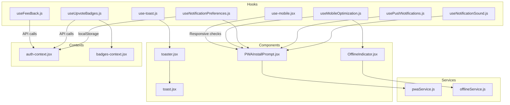

**Diagram sources**
- [use-mobile.jsx:1-20](file://Frontend/src/hooks/use-mobile.jsx#L1-L20)
- [use-toast.js:1-151](file://Frontend/src/hooks/use-toast.js#L1-L151)
- [useFeedback.js:1-89](file://Frontend/src/hooks/useFeedback.js#L1-L89)
- [useMobileOptimization.js:1-116](file://Frontend/src/hooks/useMobileOptimization.js#L1-L116)
- [useNotificationPreferences.js:1-69](file://Frontend/src/hooks/useNotificationPreferences.js#L1-L69)
- [useNotificationSound.js:1-65](file://Frontend/src/hooks/useNotificationSound.js#L1-L65)
- [usePushNotifications.js:1-71](file://Frontend/src/hooks/usePushNotifications.js#L1-L71)
- [useUpvoteBadges.js:1-82](file://Frontend/src/hooks/useUpvoteBadges.js#L1-L82)
- [PWAInstallPrompt.jsx:1-157](file://Frontend/src/components/mobile/PWAInstallPrompt.jsx#L1-L157)
- [OfflineIndicator.jsx:1-134](file://Frontend/src/components/mobile/OfflineIndicator.jsx#L1-L134)
- [pwaService.js:1-171](file://Frontend/src/services/pwaService.js#L1-L171)
- [offlineService.js:1-302](file://Frontend/src/services/offlineService.js#L1-L302)
- [auth-context.jsx:1-143](file://Frontend/src/context/auth-context.jsx#L1-L143)
- [badges-context.jsx:1-143](file://Frontend/src/context/badges-context.jsx#L1-L143)
- [toaster.jsx:1-24](file://Frontend/src/components/ui/toaster.jsx#L1-L24)
- [toast.jsx:1-87](file://Frontend/src/components/ui/toast.jsx#L1-L87)

**Section sources**
- [use-mobile.jsx:1-20](file://Frontend/src/hooks/use-mobile.jsx#L1-L20)
- [use-toast.js:1-151](file://Frontend/src/hooks/use-toast.js#L1-L151)
- [useFeedback.js:1-89](file://Frontend/src/hooks/useFeedback.js#L1-L89)
- [useMobileOptimization.js:1-116](file://Frontend/src/hooks/useMobileOptimization.js#L1-L116)
- [useNotificationPreferences.js:1-69](file://Frontend/src/hooks/useNotificationPreferences.js#L1-L69)
- [useNotificationSound.js:1-65](file://Frontend/src/hooks/useNotificationSound.js#L1-L65)
- [usePushNotifications.js:1-71](file://Frontend/src/hooks/usePushNotifications.js#L1-L71)
- [useUpvoteBadges.js:1-82](file://Frontend/src/hooks/useUpvoteBadges.js#L1-L82)
- [PWAInstallPrompt.jsx:1-157](file://Frontend/src/components/mobile/PWAInstallPrompt.jsx#L1-L157)
- [OfflineIndicator.jsx:1-134](file://Frontend/src/components/mobile/OfflineIndicator.jsx#L1-L134)
- [pwaService.js:1-171](file://Frontend/src/services/pwaService.js#L1-L171)
- [offlineService.js:1-302](file://Frontend/src/services/offlineService.js#L1-L302)
- [auth-context.jsx:1-143](file://Frontend/src/context/auth-context.jsx#L1-L143)
- [badges-context.jsx:1-143](file://Frontend/src/context/badges-context.jsx#L1-L143)
- [toaster.jsx:1-24](file://Frontend/src/components/ui/toaster.jsx#L1-L24)
- [toast.jsx:1-87](file://Frontend/src/components/ui/toast.jsx#L1-L87)

## Core Components
This section documents the primary hooks and utilities, their responsibilities, and usage patterns.

- useIsMobile: Detects mobile width and updates on resize/matchMedia changes.
- useToast: Centralized toast manager with state, listeners, and lifecycle controls.
- useFeedback: Fetches single-complaint or aggregated feedback with stats and pending checks.
- useMobileOptimization: Device/touch/orientation detection plus PWA capability and mobile UX helpers.
- useNotificationPreferences: Loads/stores per-user notification preferences in localStorage.
- useNotificationSound: Plays a pleasant notification sound via Web Audio API with resume on user gesture.
- usePushNotifications: Requests and displays browser push notifications with permission gating.
- useUpvoteBadges: Checks and awards badges based on upvote thresholds using backend stats.

**Section sources**
- [use-mobile.jsx:5-19](file://Frontend/src/hooks/use-mobile.jsx#L5-L19)
- [use-toast.js:129-148](file://Frontend/src/hooks/use-toast.js#L129-L148)
- [useFeedback.js:4-85](file://Frontend/src/hooks/useFeedback.js#L4-L85)
- [useMobileOptimization.js:12-112](file://Frontend/src/hooks/useMobileOptimization.js#L12-L112)
- [useNotificationPreferences.js:13-67](file://Frontend/src/hooks/useNotificationPreferences.js#L13-L67)
- [useNotificationSound.js:3-63](file://Frontend/src/hooks/useNotificationSound.js#L3-L63)
- [usePushNotifications.js:3-69](file://Frontend/src/hooks/usePushNotifications.js#L3-L69)
- [useUpvoteBadges.js:16-78](file://Frontend/src/hooks/useUpvoteBadges.js#L16-L78)

## Architecture Overview
The hooks integrate with UI components and services to deliver a cohesive mobile-first experience. Toasts are rendered by a dedicated Toaster component that subscribes to the toast store. PWA and offline features are coordinated via service worker registration and offline queues.

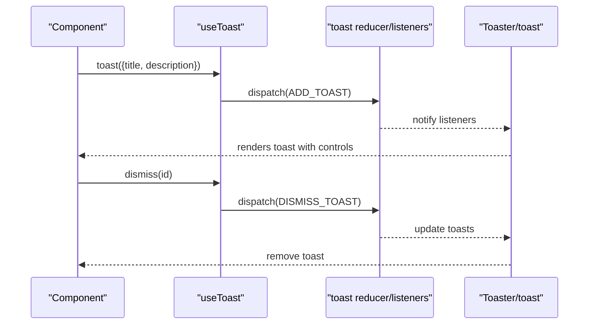

**Diagram sources**
- [use-toast.js:100-127](file://Frontend/src/hooks/use-toast.js#L100-L127)
- [use-toast.js:129-148](file://Frontend/src/hooks/use-toast.js#L129-L148)
- [toaster.jsx:4-23](file://Frontend/src/components/ui/toaster.jsx#L4-L23)
- [toast.jsx:1-87](file://Frontend/src/components/ui/toast.jsx#L1-L87)

## Detailed Component Analysis

### Mobile Detection Hook: useIsMobile
- Purpose: Lightweight media query-based detection for responsive layouts.
- Behavior:
  - Initializes state from matchMedia and window.innerWidth.
  - Subscribes to media query change events and cleans up on unmount.
  - Returns boolean for mobile viewport.
- Dependencies: React, matchMedia API.
- Cleanup: Removes event listener in useEffect return.

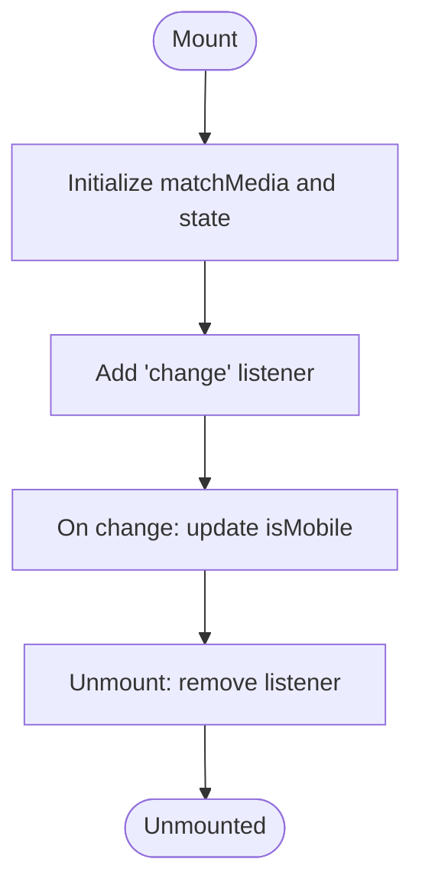

**Diagram sources**
- [use-mobile.jsx:8-16](file://Frontend/src/hooks/use-mobile.jsx#L8-L16)

**Section sources**
- [use-mobile.jsx:5-19](file://Frontend/src/hooks/use-mobile.jsx#L5-L19)

### Toast Notification Utility: useToast
- Purpose: Global toast state management with a finite queue and dismissal timers.
- Key behaviors:
  - Maintains a listener array and memory state for immediate reactivity.
  - Generates unique IDs and enforces a toast limit.
  - Adds timeouts to remove toasts after a long delay; dismiss toggles visibility.
  - Provides imperative toast() and imperative dismiss() functions.
- UI integration:
  - Toaster component maps over toasts and renders toast.jsx primitives.
- Best practices:
  - Keep toasts concise; avoid excessive concurrent toasts.
  - Use dismiss callbacks to clean up resources if needed.

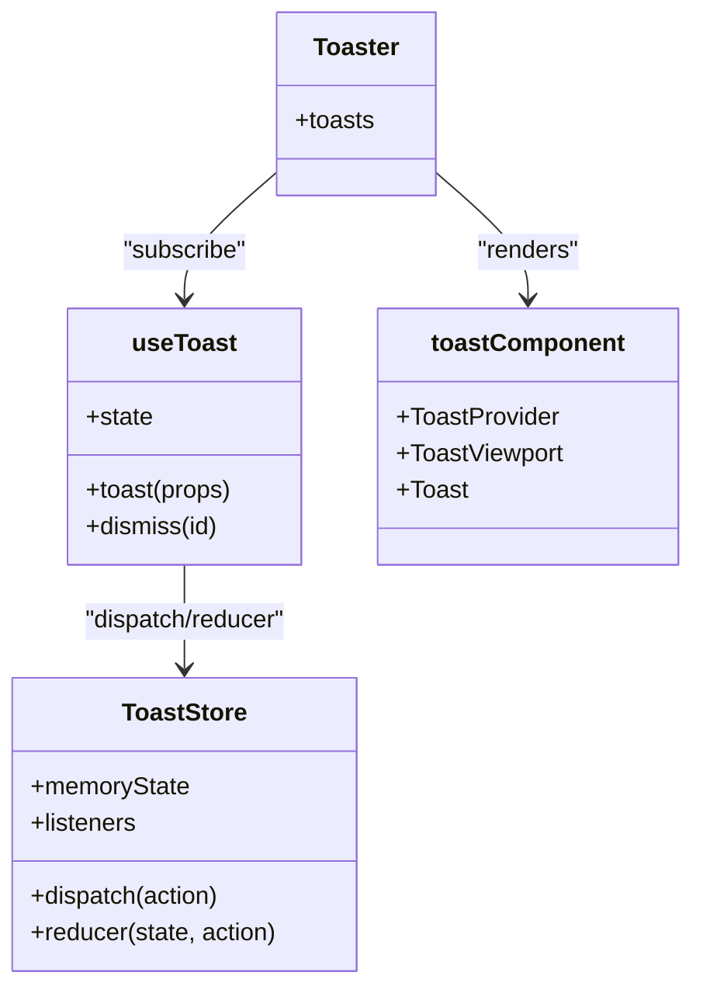

**Diagram sources**
- [use-toast.js:89-148](file://Frontend/src/hooks/use-toast.js#L89-L148)
- [toaster.jsx:4-23](file://Frontend/src/components/ui/toaster.jsx#L4-L23)
- [toast.jsx:8-20](file://Frontend/src/components/ui/toast.jsx#L8-L20)

**Section sources**
- [use-toast.js:1-151](file://Frontend/src/hooks/use-toast.js#L1-L151)
- [toaster.jsx:1-24](file://Frontend/src/components/ui/toaster.jsx#L1-L24)
- [toast.jsx:1-87](file://Frontend/src/components/ui/toast.jsx#L1-L87)

### Feedback Collection Hook: useFeedback
- Purpose: Fetches feedback for a specific complaint or aggregates all feedback with stats.
- Key behaviors:
  - Uses apiService to fetch complaint-specific feedback or all feedback.
  - Maps user info for display and computes stats.
  - Exposes refetch and pending feedback check functions.
- Dependencies: apiService, React hooks.
- Cleanup: None required; relies on component unmount to stop effects.

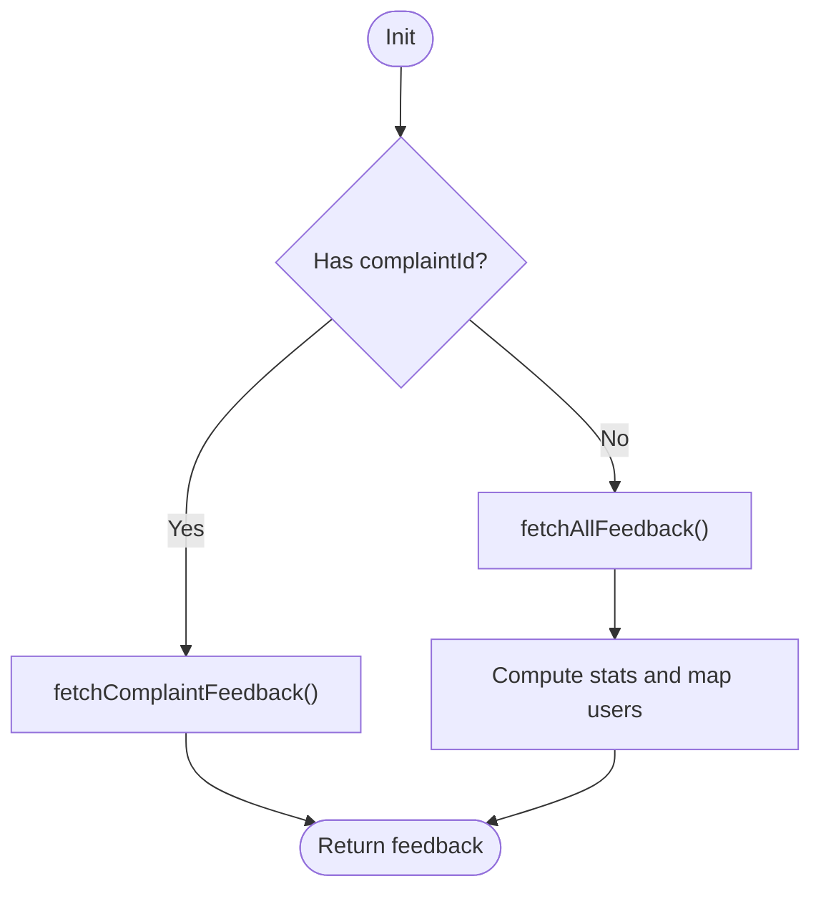

**Diagram sources**
- [useFeedback.js:16-57](file://Frontend/src/hooks/useFeedback.js#L16-L57)

**Section sources**
- [useFeedback.js:1-89](file://Frontend/src/hooks/useFeedback.js#L1-L89)

### Mobile Optimization Hook: useMobileOptimization
- Purpose: Comprehensive mobile device detection and UX helpers.
- Capabilities:
  - Device type detection (mobile/tablet), touch support, orientation, viewport height.
  - PWA detection via matchMedia and navigator.standalone.
  - Helpers: getTouchFriendlyProps, getTouchButtonSize, getMobileSpacing.
- Cleanup: Removes orientationchange and resize listeners on unmount.

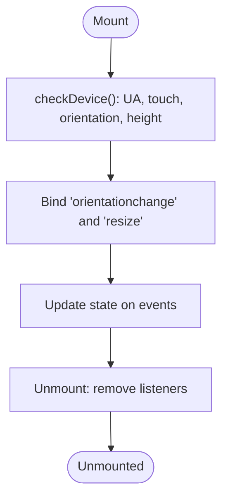

**Diagram sources**
- [useMobileOptimization.js:19-56](file://Frontend/src/hooks/useMobileOptimization.js#L19-L56)

**Section sources**
- [useMobileOptimization.js:1-116](file://Frontend/src/hooks/useMobileOptimization.js#L1-L116)

### Notification Preference Management: useNotificationPreferences
- Purpose: Manages per-user notification preferences persisted in localStorage.
- Behavior:
  - Defaults to sensible defaults when no user is present.
  - On user presence, loads or seeds preferences keyed by user ID.
  - Optimistically updates state before persisting to localStorage.
  - Provides refetch and updatePreference functions.
- Dependencies: localStorage, auth context.

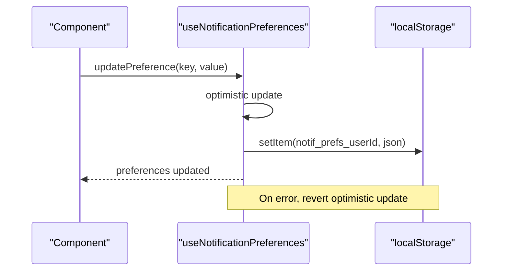

**Diagram sources**
- [useNotificationPreferences.js:42-56](file://Frontend/src/hooks/useNotificationPreferences.js#L42-L56)

**Section sources**
- [useNotificationPreferences.js:1-69](file://Frontend/src/hooks/useNotificationPreferences.js#L1-L69)

### Notification Sound Utility: useNotificationSound
- Purpose: Plays a pleasant notification sound using Web Audio API.
- Behavior:
  - Lazily creates an AudioContext and resumes if suspended.
  - Creates oscillators with envelopes for a soft chime.
  - Handles errors gracefully without blocking.
- Dependencies: Web Audio API.

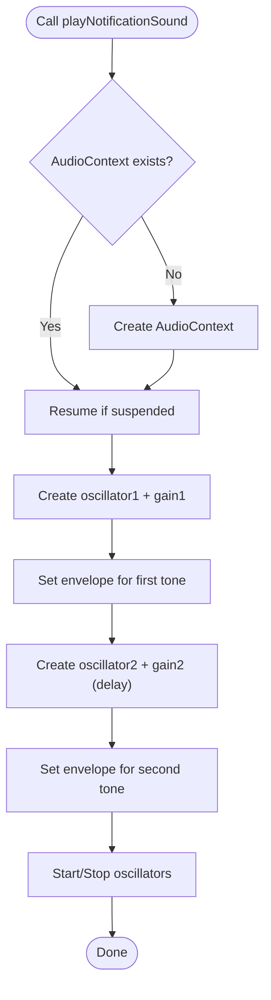

**Diagram sources**
- [useNotificationSound.js:6-61](file://Frontend/src/hooks/useNotificationSound.js#L6-L61)

**Section sources**
- [useNotificationSound.js:1-65](file://Frontend/src/hooks/useNotificationSound.js#L1-L65)

### Push Notifications Hook: usePushNotifications
- Purpose: Requests and displays browser push notifications with permission gating.
- Behavior:
  - Detects Notification API support and current permission.
  - Requests permission and shows notifications with click handling and auto-close.
- Dependencies: Browser Notification API.

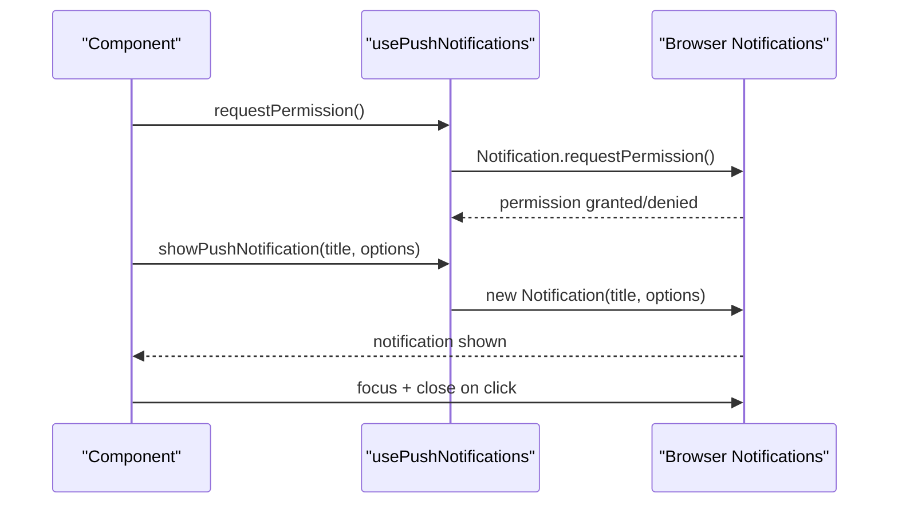

**Diagram sources**
- [usePushNotifications.js:15-62](file://Frontend/src/hooks/usePushNotifications.js#L15-L62)

**Section sources**
- [usePushNotifications.js:1-71](file://Frontend/src/hooks/usePushNotifications.js#L1-L71)

### Upvote Badges Hook: useUpvoteBadges
- Purpose: Awards badges based on upvote thresholds by querying backend stats.
- Behavior:
  - Fetches user stats and compares against available badges.
  - Periodically polls for badge eligibility (no realtime without Supabase).
- Dependencies: apiService, auth and badges contexts.

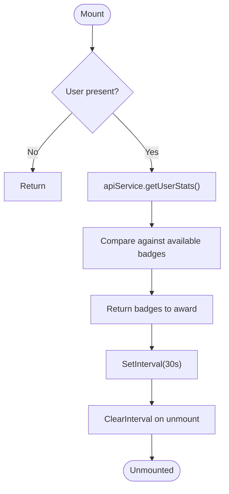

**Diagram sources**
- [useUpvoteBadges.js:20-76](file://Frontend/src/hooks/useUpvoteBadges.js#L20-L76)

**Section sources**
- [useUpvoteBadges.js:1-82](file://Frontend/src/hooks/useUpvoteBadges.js#L1-L82)

### PWA and Offline Integration
- PWAInstallPrompt: Encourages installation via beforeinstallprompt, stores deferred prompt, and persists dismissal.
- OfflineIndicator: Shows offline status, queued items, and sync progress; auto-syncs when online.
- pwaService: Registers service worker, handles updates, background sync registration, and install prompt.
- offlineService: Drafts and queue management, sync logic with retry and failure handling.

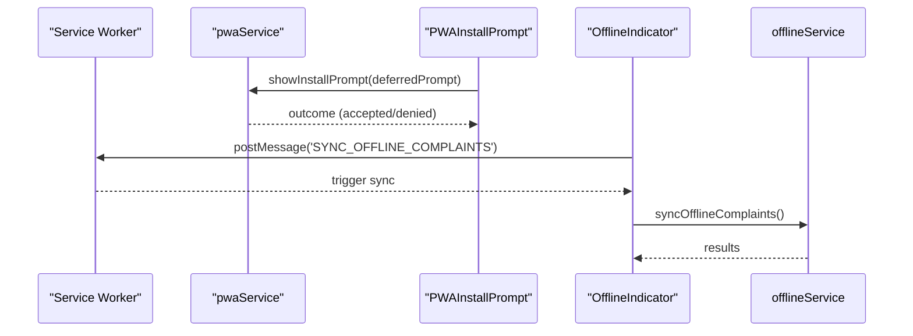

**Diagram sources**
- [PWAInstallPrompt.jsx:47-68](file://Frontend/src/components/mobile/PWAInstallPrompt.jsx#L47-L68)
- [pwaService.js:50-58](file://Frontend/src/services/pwaService.js#L50-L58)
- [offlineService.js:168-248](file://Frontend/src/services/offlineService.js#L168-L248)

**Section sources**
- [PWAInstallPrompt.jsx:1-157](file://Frontend/src/components/mobile/PWAInstallPrompt.jsx#L1-L157)
- [OfflineIndicator.jsx:1-134](file://Frontend/src/components/mobile/OfflineIndicator.jsx#L1-L134)
- [pwaService.js:1-171](file://Frontend/src/services/pwaService.js#L1-L171)
- [offlineService.js:1-302](file://Frontend/src/services/offlineService.js#L1-L302)

## Dependency Analysis
- Hook-to-context dependencies:
  - useNotificationPreferences depends on auth-context for user identity.
  - useUpvoteBadges depends on auth-context and badges-context for user and badge state.
- Hook-to-service dependencies:
  - useFeedback uses apiService for data fetching.
  - useMobileOptimization integrates with PWA and offline services indirectly via components.
- UI integration:
  - Toaster consumes useToast to render Radix toast components.

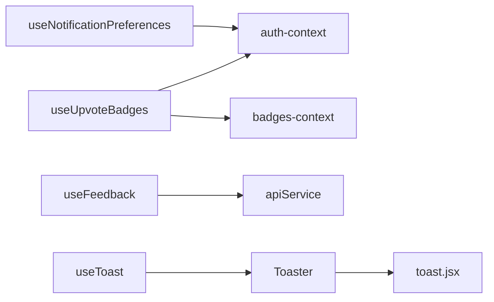

**Diagram sources**
- [useNotificationPreferences.js:16-16](file://Frontend/src/hooks/useNotificationPreferences.js#L16-L16)
- [useUpvoteBadges.js:17-18](file://Frontend/src/hooks/useUpvoteBadges.js#L17-L18)
- [useFeedback.js:2-2](file://Frontend/src/hooks/useFeedback.js#L2-L2)
- [use-toast.js:129-148](file://Frontend/src/hooks/use-toast.js#L129-L148)
- [toaster.jsx:1-1](file://Frontend/src/components/ui/toaster.jsx#L1-L1)
- [toast.jsx:1-1](file://Frontend/src/components/ui/toast.jsx#L1-L1)

**Section sources**
- [useNotificationPreferences.js:1-69](file://Frontend/src/hooks/useNotificationPreferences.js#L1-L69)
- [useUpvoteBadges.js:1-82](file://Frontend/src/hooks/useUpvoteBadges.js#L1-L82)
- [useFeedback.js:1-89](file://Frontend/src/hooks/useFeedback.js#L1-L89)
- [use-toast.js:1-151](file://Frontend/src/hooks/use-toast.js#L1-L151)
- [toaster.jsx:1-24](file://Frontend/src/components/ui/toaster.jsx#L1-L24)
- [toast.jsx:1-87](file://Frontend/src/components/ui/toast.jsx#L1-L87)
- [auth-context.jsx:1-143](file://Frontend/src/context/auth-context.jsx#L1-L143)
- [badges-context.jsx:1-143](file://Frontend/src/context/badges-context.jsx#L1-L143)

## Performance Considerations
- useToast
  - Limit concurrent toasts to reduce DOM churn.
  - Avoid heavy content in toasts; keep titles and descriptions concise.
- useMobileOptimization
  - Debounce resize handlers if extending with additional logic.
  - Cache computed styles and sizes when possible.
- useNotificationPreferences
  - Persist only minimal necessary fields; avoid large payloads.
- usePushNotifications
  - Gate expensive operations behind permission checks.
- useUpvoteBadges
  - Keep polling intervals reasonable; consider throttling during inactivity.
- PWA and offline
  - Batch IndexedDB writes; minimize localStorage writes.
  - Use exponential backoff for retries in offline sync.

## Troubleshooting Guide
- Toasts not appearing
  - Ensure Toaster is mounted and subscribed via useToast.
  - Verify toast() is called with required props and not immediately dismissed.
- Notification permissions blocked
  - Use requestPermission and guide users to browser settings.
  - Respect denied state and avoid repeated prompts.
- PWA install prompt not showing
  - Confirm beforeinstallprompt fires and deferredPrompt is stored.
  - Check isPWA() and dismissal flags in localStorage.
- Offline sync failures
  - Inspect retry counts and error messages; surface actionable feedback.
  - Validate authToken presence for authenticated endpoints.

**Section sources**
- [use-toast.js:100-127](file://Frontend/src/hooks/use-toast.js#L100-L127)
- [usePushNotifications.js:15-62](file://Frontend/src/hooks/usePushNotifications.js#L15-L62)
- [PWAInstallPrompt.jsx:17-45](file://Frontend/src/components/mobile/PWAInstallPrompt.jsx#L17-L45)
- [offlineService.js:168-248](file://Frontend/src/services/offlineService.js#L168-L248)

## Conclusion
These hooks and utilities provide a solid foundation for responsive design, consistent messaging, feedback collection, and mobile/PWA experiences. By following the integration patterns, performance tips, and best practices outlined here, teams can build scalable, user-friendly interfaces that adapt seamlessly across devices and network conditions.

## Appendices
- Practical usage examples
  - Toasts: Call toast({ title, description }) from any component and render Toaster at the app root.
  - Mobile detection: Use useIsMobile to conditionally render mobile-optimized layouts.
  - Feedback: Pass complaintId to fetch per-complaint feedback; omit to fetch all with stats.
  - Preferences: Toggle preferences via updatePreference and persist across sessions.
  - PWA: Mount PWAInstallPrompt and OfflineIndicator for enhanced mobile UX.
- Best practices
  - Always clean up event listeners and intervals in useEffect returns.
  - Use optimistic updates with rollback on errors for preference/state toggles.
  - Keep hook responsibilities focused; compose multiple hooks in components.
  - Test hooks in isolation with mocked services and contexts.