# Notification & Preference State

<cite>
**Referenced Files in This Document**
- [notifications-context.jsx](file://Frontend/src/context/notifications-context.jsx)
- [use-toast.js](file://Frontend/src/hooks/use-toast.js)
- [useNotificationPreferences.js](file://Frontend/src/hooks/useNotificationPreferences.js)
- [usePushNotifications.js](file://Frontend/src/hooks/usePushNotifications.js)
- [useNotificationSound.js](file://Frontend/src/hooks/useNotificationSound.js)
- [toaster.jsx](file://Frontend/src/components/ui/toaster.jsx)
- [toaster.tsx](file://Frontend/src/components/ui/toaster.tsx)
- [UserSettings.jsx](file://Frontend/src/pages/UserSettings.jsx)
- [pushNotificationService.js](file://Frontend/src/services/pushNotificationService.js)
- [App.jsx](file://Frontend/src/App.jsx)
- [notificationManager.js](file://backend/src/services/notificationManager.js)
- [digestNotificationService.js](file://backend/src/services/digestNotificationService.js)
- [emergencyBroadcastService.js](file://backend/src/services/emergencyBroadcastService.js)
</cite>

## Table of Contents
1. [Introduction](#introduction)
2. [Project Structure](#project-structure)
3. [Core Components](#core-components)
4. [Architecture Overview](#architecture-overview)
5. [Detailed Component Analysis](#detailed-component-analysis)
6. [Dependency Analysis](#dependency-analysis)
7. [Performance Considerations](#performance-considerations)
8. [Troubleshooting Guide](#troubleshooting-guide)
9. [Conclusion](#conclusion)
10. [Appendices](#appendices)

## Introduction
This document explains the notification and user preference state management in the frontend and backend. It covers:
- The notification context provider for toast notifications, push notification subscriptions, and user preference settings
- The toast hook implementation for displaying alerts, success messages, and error notifications
- Notification sound preferences, push notification permissions, and subscription management
- Examples of notification triggers, custom toast configurations, and preference persistence
- Notification delivery mechanisms, user consent handling, and cross-device synchronization of preferences

## Project Structure
The notification and preference system spans React context and hooks in the frontend and backend services for email/SMS delivery and scheduling.

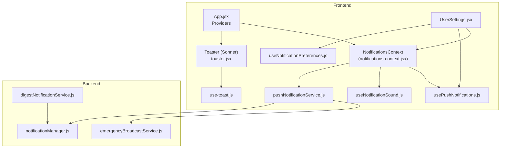

**Diagram sources**
- [App.jsx:1-218](file://Frontend/src/App.jsx#L1-L218)
- [notifications-context.jsx:1-244](file://Frontend/src/context/notifications-context.jsx#L1-L244)
- [toaster.jsx:1-25](file://Frontend/src/components/ui/toaster.jsx#L1-L25)
- [use-toast.js:1-151](file://Frontend/src/hooks/use-toast.js#L1-L151)
- [usePushNotifications.js:1-71](file://Frontend/src/hooks/usePushNotifications.js#L1-L71)
- [useNotificationSound.js:1-65](file://Frontend/src/hooks/useNotificationSound.js#L1-L65)
- [useNotificationPreferences.js:1-69](file://Frontend/src/hooks/useNotificationPreferences.js#L1-L69)
- [UserSettings.jsx:1-1043](file://Frontend/src/pages/UserSettings.jsx#L1-L1043)
- [pushNotificationService.js:1-304](file://Frontend/src/services/pushNotificationService.js#L1-L304)
- [notificationManager.js:1-93](file://backend/src/services/notificationManager.js#L1-L93)
- [digestNotificationService.js:1-441](file://backend/src/services/digestNotificationService.js#L1-L441)
- [emergencyBroadcastService.js:1-430](file://backend/src/services/emergencyBroadcastService.js#L1-L430)

**Section sources**
- [App.jsx:1-218](file://Frontend/src/App.jsx#L1-L218)
- [notifications-context.jsx:1-244](file://Frontend/src/context/notifications-context.jsx#L1-L244)

## Core Components
- Notifications Provider: Manages in-app notifications, preferences, and delivery orchestration (toasts, sounds, browser push).
- Toast Hook: Provides a lightweight, in-memory toast manager with a capped queue and lifecycle controls.
- Push Notifications Hook: Handles browser permission checks and controlled push notification display.
- Notification Sound Hook: Generates pleasant notification tones via Web Audio API.
- Notification Preferences Hook: Loads/stores user preferences locally with optimistic updates.
- User Settings Page: Exposes toggles for notification channels and manages consent flows.
- Push Notification Service (frontend): Optional browser push subscription and delivery helpers.
- Backend Notification Manager: Coordinates email/SMS delivery based on user preferences.
- Digest Notification Service: Periodic aggregation of notifications to reduce noise.
- Emergency Broadcast Service: Critical mass notification system with targeting and batching.

**Section sources**
- [notifications-context.jsx:10-244](file://Frontend/src/context/notifications-context.jsx#L10-L244)
- [use-toast.js:1-151](file://Frontend/src/hooks/use-toast.js#L1-L151)
- [usePushNotifications.js:1-71](file://Frontend/src/hooks/usePushNotifications.js#L1-L71)
- [useNotificationSound.js:1-65](file://Frontend/src/hooks/useNotificationSound.js#L1-L65)
- [useNotificationPreferences.js:1-69](file://Frontend/src/hooks/useNotificationPreferences.js#L1-L69)
- [UserSettings.jsx:132-147](file://Frontend/src/pages/UserSettings.jsx#L132-L147)
- [pushNotificationService.js:1-304](file://Frontend/src/services/pushNotificationService.js#L1-L304)
- [notificationManager.js:1-93](file://backend/src/services/notificationManager.js#L1-L93)
- [digestNotificationService.js:1-441](file://backend/src/services/digestNotificationService.js#L1-L441)
- [emergencyBroadcastService.js:1-430](file://backend/src/services/emergencyBroadcastService.js#L1-L430)

## Architecture Overview
The frontend composes a layered notification pipeline:
- UI settings drive preference updates persisted to localStorage keyed by user ID.
- Incoming events trigger the provider’s handler to emit toasts, play sounds, and show browser push notifications.
- Optional browser push subscriptions integrate with backend APIs for persistent delivery.
- Backend services deliver email/SMS based on user preferences and support scheduling and emergency broadcasts.

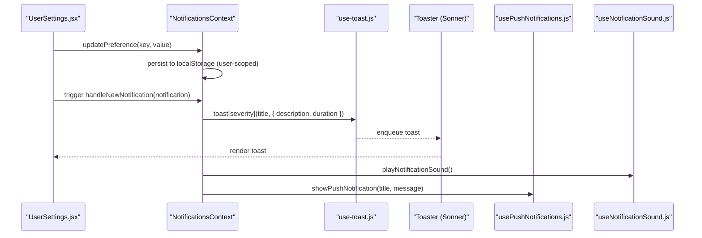

**Diagram sources**
- [UserSettings.jsx:132-147](file://Frontend/src/pages/UserSettings.jsx#L132-L147)
- [notifications-context.jsx:98-118](file://Frontend/src/context/notifications-context.jsx#L98-L118)
- [use-toast.js:100-127](file://Frontend/src/hooks/use-toast.js#L100-L127)
- [usePushNotifications.js:31-62](file://Frontend/src/hooks/usePushNotifications.js#L31-L62)
- [useNotificationSound.js:6-61](file://Frontend/src/hooks/useNotificationSound.js#L6-L61)

## Detailed Component Analysis

### Notifications Context Provider
Responsibilities:
- Stores per-user preferences and notifications in memory and persists them to localStorage.
- Emits toast notifications via a toast library.
- Plays notification sounds using Web Audio API.
- Shows browser push notifications when permitted.
- Exposes CRUD operations for notifications and preference updates.

Key behaviors:
- Preference keys include in-app, email, push, and sound toggles.
- On preference changes, updates state and localStorage atomically.
- On notification events, conditionally renders toasts, plays sounds, and shows browser push notifications.

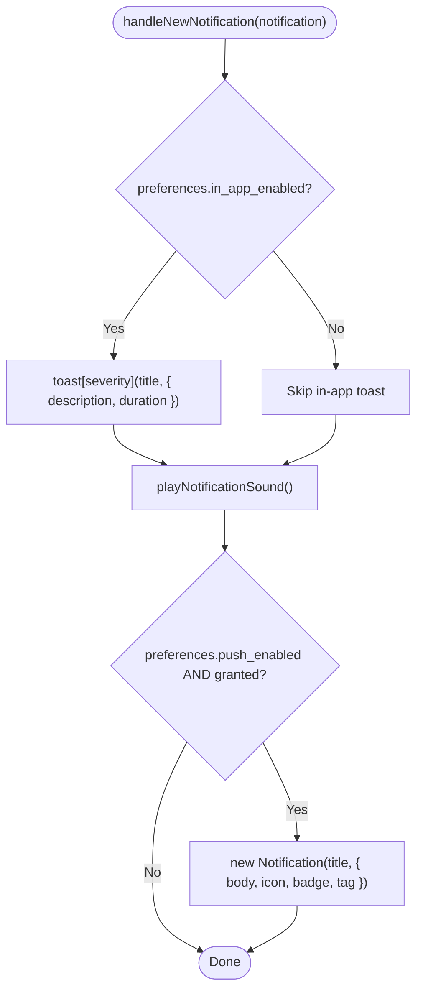

**Diagram sources**
- [notifications-context.jsx:98-118](file://Frontend/src/context/notifications-context.jsx#L98-L118)
- [notifications-context.jsx:23-73](file://Frontend/src/context/notifications-context.jsx#L23-L73)
- [notifications-context.jsx:76-96](file://Frontend/src/context/notifications-context.jsx#L76-L96)

**Section sources**
- [notifications-context.jsx:10-244](file://Frontend/src/context/notifications-context.jsx#L10-L244)

### Toast Hook Implementation
Responsibilities:
- Maintains a capped queue of toasts.
- Provides actions to add, update, dismiss, and remove toasts.
- Integrates with a toast renderer to display notifications.

Behavior highlights:
- Limits concurrent toasts and schedules removal after a long delay.
- Dismissal triggers a timed removal to keep the UI responsive.

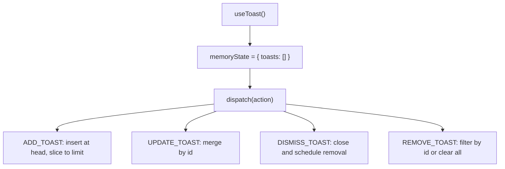

**Diagram sources**
- [use-toast.js:38-87](file://Frontend/src/hooks/use-toast.js#L38-L87)
- [use-toast.js:93-98](file://Frontend/src/hooks/use-toast.js#L93-L98)
- [use-toast.js:129-148](file://Frontend/src/hooks/use-toast.js#L129-L148)

**Section sources**
- [use-toast.js:1-151](file://Frontend/src/hooks/use-toast.js#L1-L151)

### Push Notifications Hook
Responsibilities:
- Detects browser support for notifications.
- Requests permission and exposes current permission state.
- Displays browser push notifications with safe defaults and auto-close behavior.

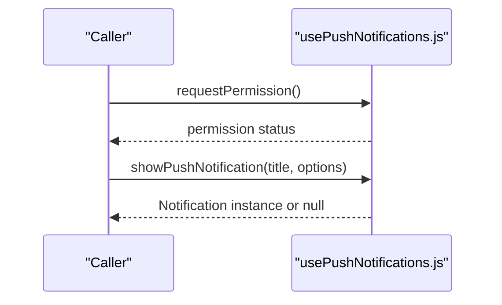

**Diagram sources**
- [usePushNotifications.js:15-29](file://Frontend/src/hooks/usePushNotifications.js#L15-L29)
- [usePushNotifications.js:31-62](file://Frontend/src/hooks/usePushNotifications.js#L31-L62)

**Section sources**
- [usePushNotifications.js:1-71](file://Frontend/src/hooks/usePushNotifications.js#L1-L71)

### Notification Sound Hook
Responsibilities:
- Lazily initializes an AudioContext and resumes it if suspended.
- Generates a pleasant dual-tone chime using oscillators and gain envelopes.

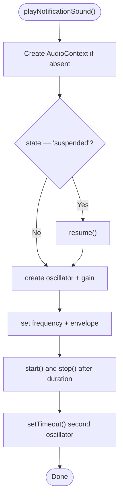

**Diagram sources**
- [useNotificationSound.js:6-61](file://Frontend/src/hooks/useNotificationSound.js#L6-L61)

**Section sources**
- [useNotificationSound.js:1-65](file://Frontend/src/hooks/useNotificationSound.js#L1-L65)

### Notification Preferences Hook
Responsibilities:
- Loads default preferences for anonymous users and persists them to localStorage.
- Optimistically updates preferences and reverts on errors.
- Exposes a refetch function to reload preferences.

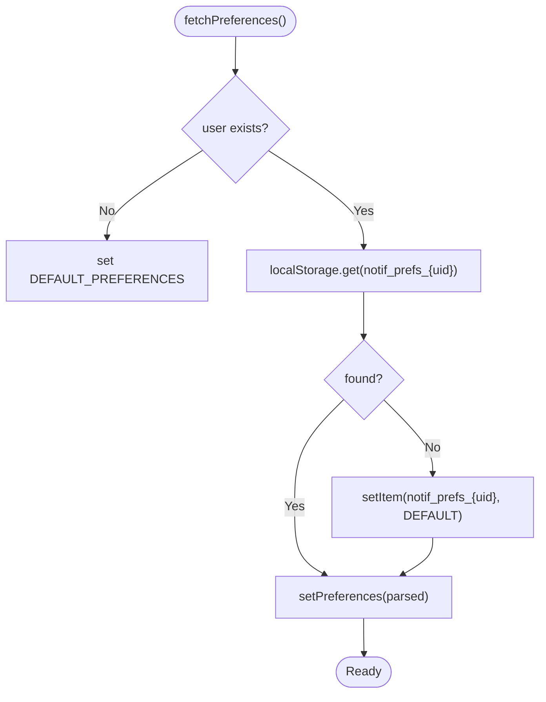

**Diagram sources**
- [useNotificationPreferences.js:18-40](file://Frontend/src/hooks/useNotificationPreferences.js#L18-L40)

**Section sources**
- [useNotificationPreferences.js:1-69](file://Frontend/src/hooks/useNotificationPreferences.js#L1-L69)

### User Settings Page
Responsibilities:
- Presents toggles for in-app, email, SMS, push, and sound preferences.
- Requests push permission when enabling push notifications.
- Validates phone numbers before enabling SMS.
- Persists preferences to localStorage via the provider and backend.

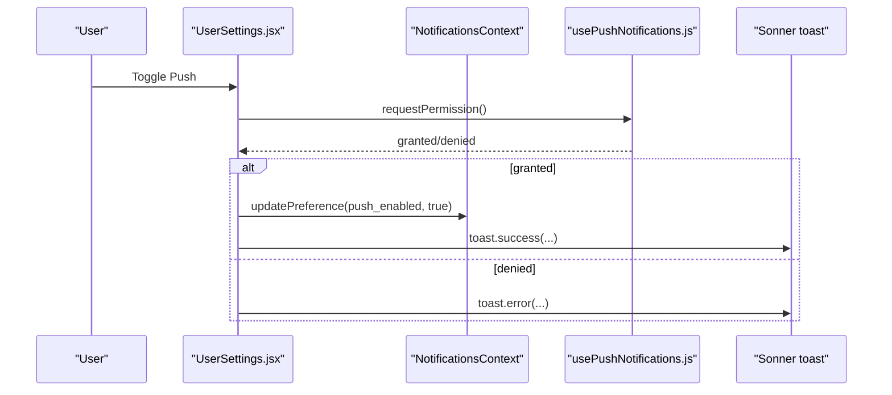

**Diagram sources**
- [UserSettings.jsx:132-147](file://Frontend/src/pages/UserSettings.jsx#L132-L147)
- [usePushNotifications.js:15-29](file://Frontend/src/hooks/usePushNotifications.js#L15-L29)
- [notifications-context.jsx:135-148](file://Frontend/src/context/notifications-context.jsx#L135-L148)

**Section sources**
- [UserSettings.jsx:510-798](file://Frontend/src/pages/UserSettings.jsx#L510-L798)

### Push Notification Service (Browser-based)
Responsibilities:
- Feature-flagged push support via environment variable.
- Requests permission and shows local notifications.
- Optional push subscription/unsubscription and saving to backend.
- Helpers for common notification types (complaint status, offline sync, badge earned).

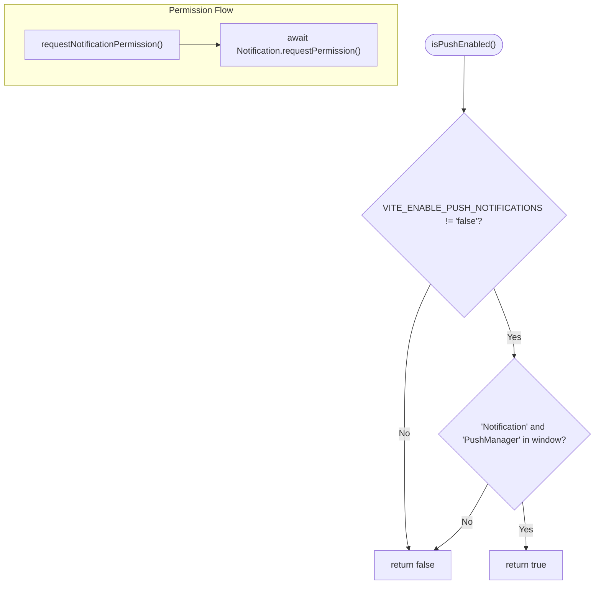

**Diagram sources**
- [pushNotificationService.js:10-44](file://Frontend/src/services/pushNotificationService.js#L10-L44)

**Section sources**
- [pushNotificationService.js:1-304](file://Frontend/src/services/pushNotificationService.js#L1-L304)

### Backend Notification Delivery
Responsibilities:
- Compose and send email/SMS notifications based on user preferences.
- Support critical alerts that bypass certain preferences.
- Coordinate with templating and external services.

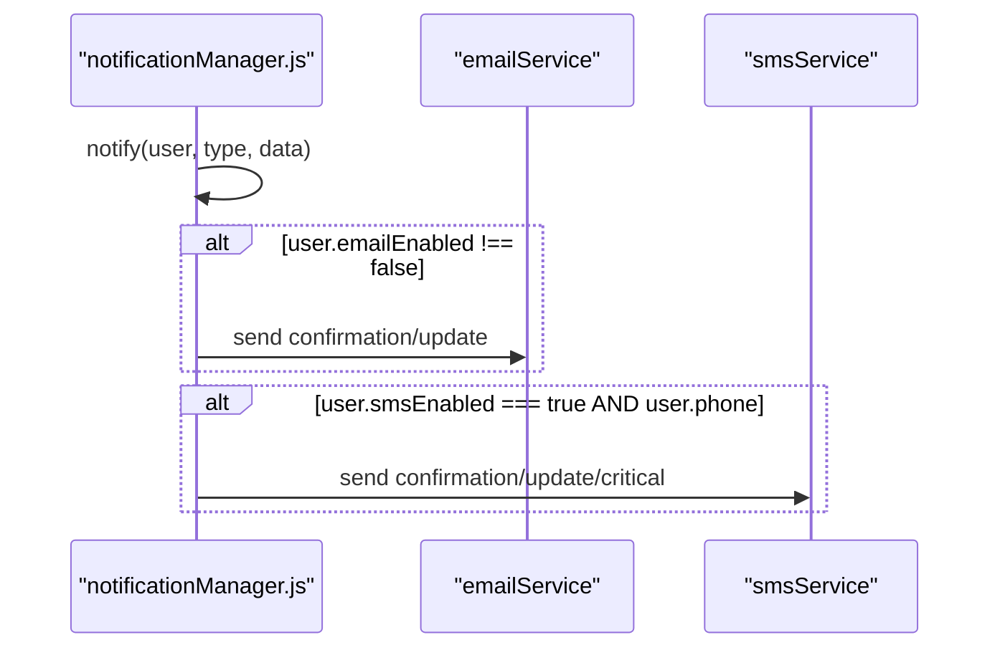

**Diagram sources**
- [notificationManager.js:7-54](file://backend/src/services/notificationManager.js#L7-L54)

**Section sources**
- [notificationManager.js:1-93](file://backend/src/services/notificationManager.js#L1-L93)

### Digest Notification Service
Responsibilities:
- Schedule daily and weekly digests.
- Group notifications by type and send aggregated emails.
- Mark notifications as digested and track timestamps.

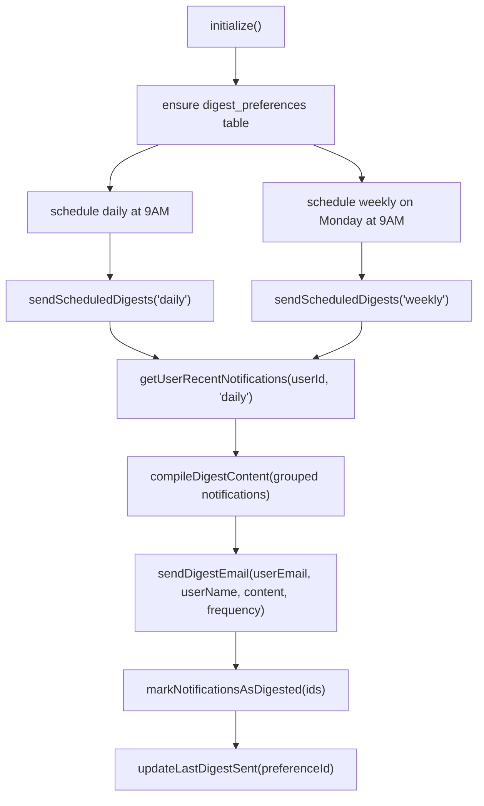

**Diagram sources**
- [digestNotificationService.js:20-99](file://backend/src/services/digestNotificationService.js#L20-L99)
- [digestNotificationService.js:104-154](file://backend/src/services/digestNotificationService.js#L104-L154)
- [digestNotificationService.js:257-300](file://backend/src/services/digestNotificationService.js#L257-L300)

**Section sources**
- [digestNotificationService.js:1-441](file://backend/src/services/digestNotificationService.js#L1-L441)

### Emergency Broadcast Service
Responsibilities:
- Targeted mass notifications with severity and channel selection.
- Batch processing to avoid rate limits.
- Record delivery attempts and aggregate statistics.

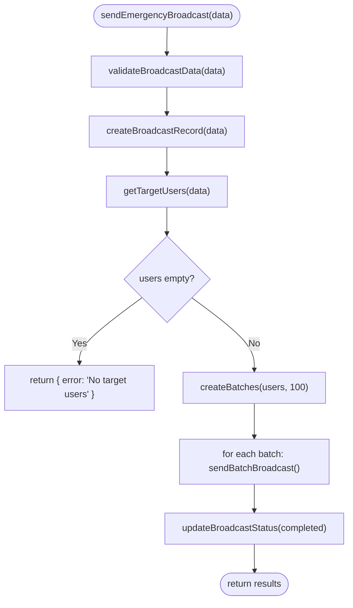

**Diagram sources**
- [emergencyBroadcastService.js:29-90](file://backend/src/services/emergencyBroadcastService.js#L29-L90)
- [emergencyBroadcastService.js:210-263](file://backend/src/services/emergencyBroadcastService.js#L210-L263)

**Section sources**
- [emergencyBroadcastService.js:1-430](file://backend/src/services/emergencyBroadcastService.js#L1-L430)

## Dependency Analysis
- Frontend providers depend on React context and hooks; preferences and notifications are scoped to the user ID via localStorage keys.
- The provider integrates with toast and push hooks and uses the push notification service for optional browser push flows.
- Backend services are independent and accessed via API calls from the push notification service and other parts of the system.

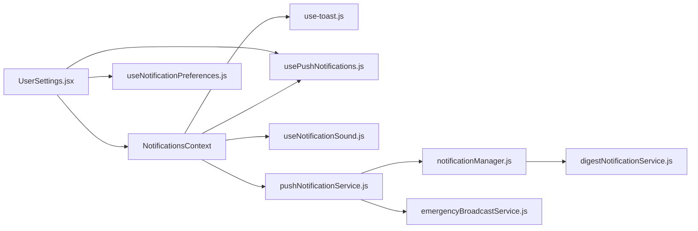

**Diagram sources**
- [notifications-context.jsx:10-244](file://Frontend/src/context/notifications-context.jsx#L10-L244)
- [use-toast.js:1-151](file://Frontend/src/hooks/use-toast.js#L1-L151)
- [usePushNotifications.js:1-71](file://Frontend/src/hooks/usePushNotifications.js#L1-L71)
- [useNotificationSound.js:1-65](file://Frontend/src/hooks/useNotificationSound.js#L1-L65)
- [pushNotificationService.js:1-304](file://Frontend/src/services/pushNotificationService.js#L1-L304)
- [UserSettings.jsx:17-31](file://Frontend/src/pages/UserSettings.jsx#L17-L31)
- [notificationManager.js:1-93](file://backend/src/services/notificationManager.js#L1-L93)
- [digestNotificationService.js:1-441](file://backend/src/services/digestNotificationService.js#L1-L441)
- [emergencyBroadcastService.js:1-430](file://backend/src/services/emergencyBroadcastService.js#L1-L430)

**Section sources**
- [App.jsx:45-102](file://Frontend/src/App.jsx#L45-L102)

## Performance Considerations
- Toast queue caps prevent memory bloat; ensure consumers dismiss or let toasts expire naturally.
- Web Audio initialization is lazy; suspend/resume policies avoid autoplay restrictions.
- Browser push subscriptions are optional and gated behind feature flags and permissions.
- Backend digest and emergency broadcast services use batching and asynchronous processing to avoid overload.

## Troubleshooting Guide
Common issues and resolutions:
- Push notifications not appearing:
  - Verify browser support and permission status.
  - Ensure the feature flag allows push notifications.
  - Confirm the user granted permission in the browser.
- Notification sounds not playing:
  - Check that the audio context is resumed after user interaction.
  - Confirm sound preference is enabled.
- Preferences not persisting:
  - Ensure the user is logged in so the provider can key localStorage by user ID.
  - Confirm localStorage availability and absence of quota errors.
- Backend delivery failures:
  - Review email/SMS service logs and templates.
  - Validate user preferences and contact information.

**Section sources**
- [usePushNotifications.js:7-29](file://Frontend/src/hooks/usePushNotifications.js#L7-L29)
- [pushNotificationService.js:10-44](file://Frontend/src/services/pushNotificationService.js#L10-L44)
- [useNotificationSound.js:6-20](file://Frontend/src/hooks/useNotificationSound.js#L6-L20)
- [notifications-context.jsx:120-148](file://Frontend/src/context/notifications-context.jsx#L120-L148)
- [notificationManager.js:10-54](file://backend/src/services/notificationManager.js#L10-L54)

## Conclusion
The notification and preference system combines a flexible frontend context and hooks with backend-driven delivery and scheduling. It supports granular user preferences, multiple channels, and robust consent handling. Optional browser push integration complements traditional in-app and audible notifications, while backend services ensure reliable email/SMS delivery and advanced features like digests and emergency broadcasts.

## Appendices

### Example Scenarios
- Triggering a toast with a custom severity and description:
  - Use the provider’s handler to emit a notification; the toast hook enqueues it automatically.
  - Reference: [notifications-context.jsx:98-118](file://Frontend/src/context/notifications-context.jsx#L98-L118), [use-toast.js:100-127](file://Frontend/src/hooks/use-toast.js#L100-L127)
- Enabling push notifications with user consent:
  - Toggle the push preference; if not granted, request permission and update state accordingly.
  - Reference: [UserSettings.jsx:132-147](file://Frontend/src/pages/UserSettings.jsx#L132-L147), [usePushNotifications.js:15-29](file://Frontend/src/hooks/usePushNotifications.js#L15-L29)
- Persisting preferences across devices:
  - Preferences are stored under a user-scoped key in localStorage; ensure the same user is authenticated on each device.
  - Reference: [notifications-context.jsx:120-148](file://Frontend/src/context/notifications-context.jsx#L120-L148), [useNotificationPreferences.js:18-40](file://Frontend/src/hooks/useNotificationPreferences.js#L18-L40)