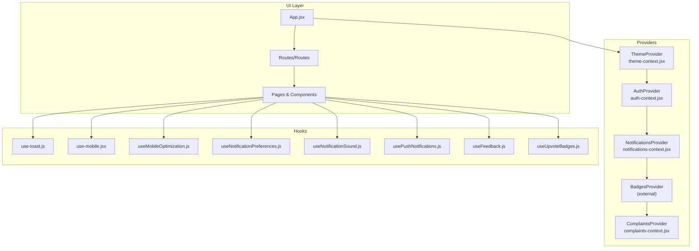
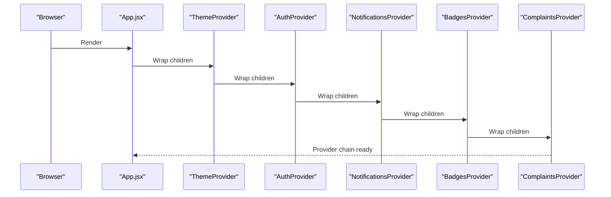
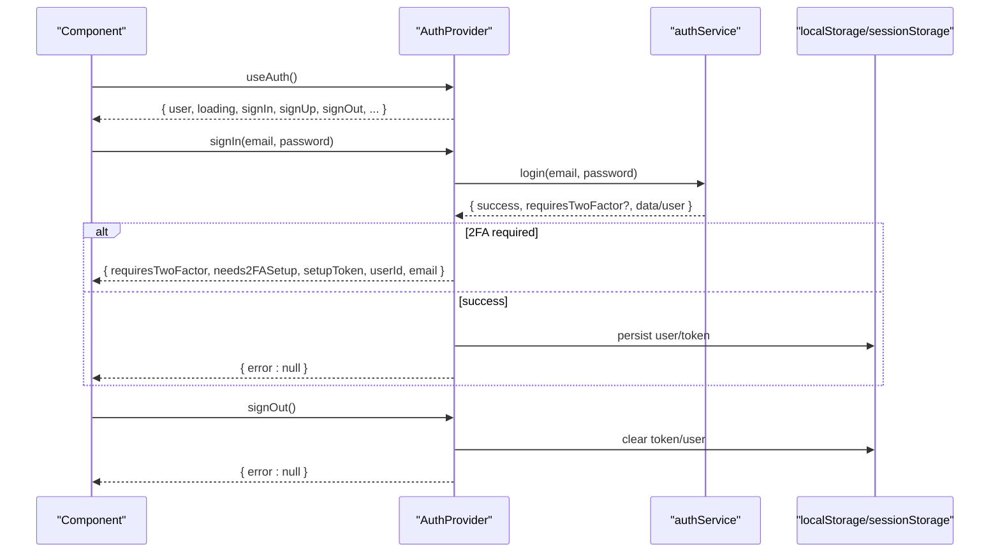
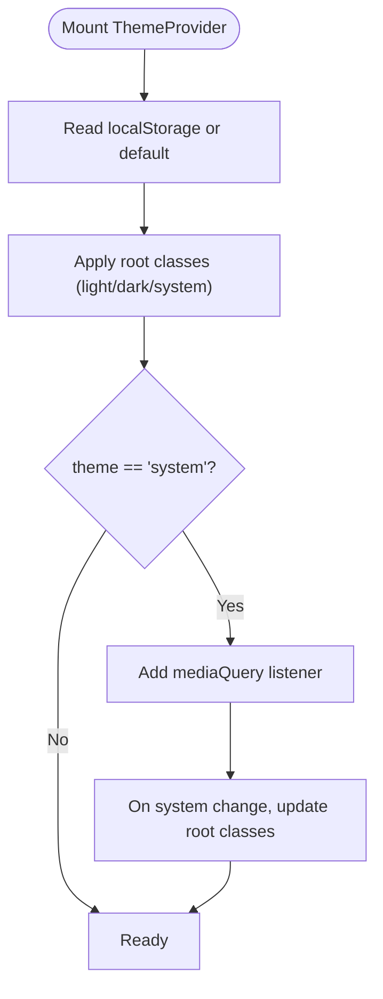
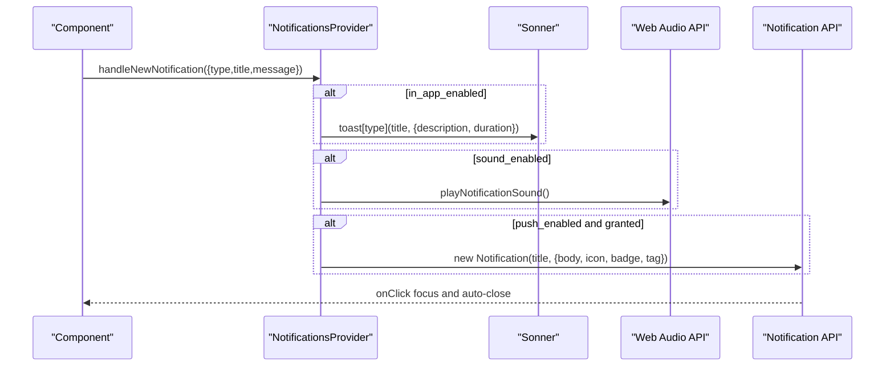
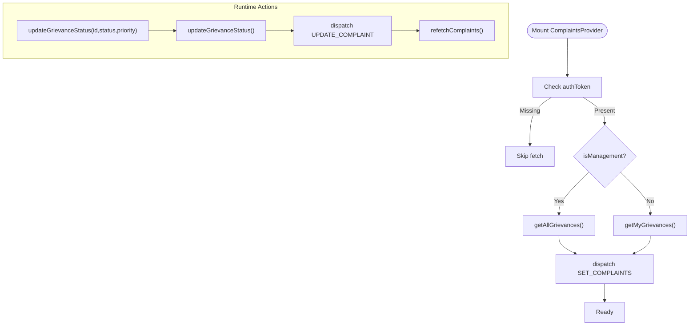
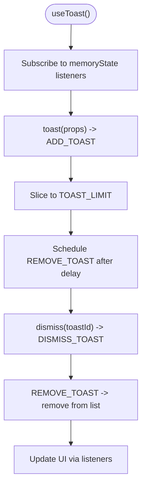
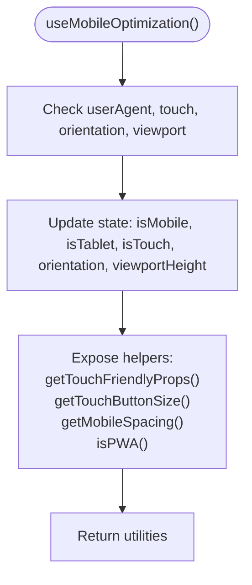
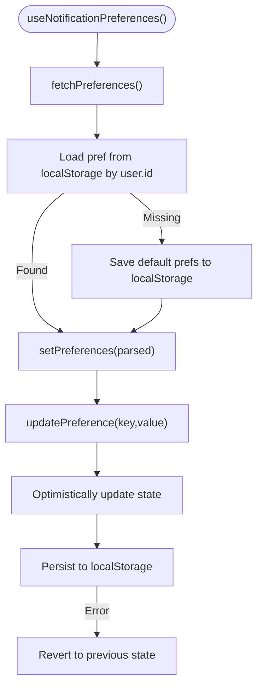
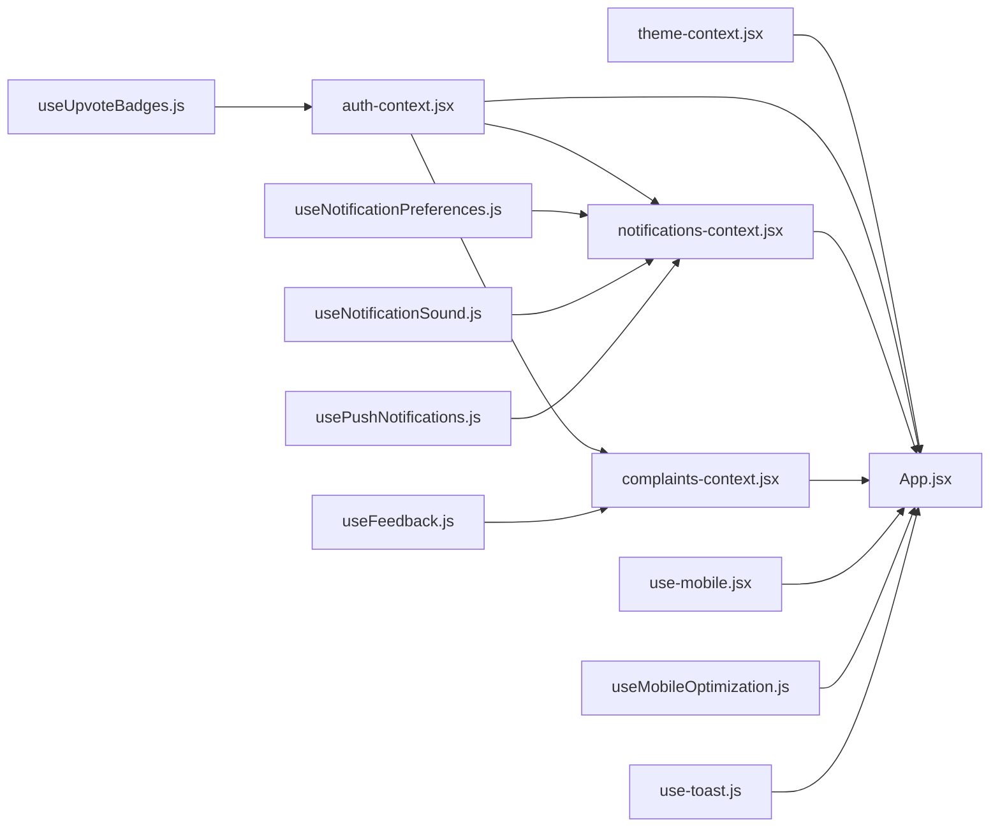

# State Management & Context

<cite>
**Referenced Files in This Document**
- [auth-context.jsx](file://Frontend/src/context/auth-context.jsx)
- [theme-context.jsx](file://Frontend/src/context/theme-context.jsx)
- [notifications-context.jsx](file://Frontend/src/context/notifications-context.jsx)
- [complaints-context.jsx](file://Frontend/src/context/complaints-context.jsx)
- [use-toast.js](file://Frontend/src/hooks/use-toast.js)
- [use-mobile.jsx](file://Frontend/src/hooks/use-mobile.jsx)
- [useMobileOptimization.js](file://Frontend/src/hooks/useMobileOptimization.js)
- [useNotificationPreferences.js](file://Frontend/src/hooks/useNotificationPreferences.js)
- [useNotificationSound.js](file://Frontend/src/hooks/useNotificationSound.js)
- [usePushNotifications.js](file://Frontend/src/hooks/usePushNotifications.js)
- [useFeedback.js](file://Frontend/src/hooks/useFeedback.js)
- [useUpvoteBadges.js](file://Frontend/src/hooks/useUpvoteBadges.js)
- [App.jsx](file://Frontend/src/App.jsx)
- [ErrorBoundary.jsx](file://Frontend/src/components/analytics/ErrorBoundary.jsx)
</cite>

## Table of Contents
1. [Introduction](#introduction)
2. [Project Structure](#project-structure)
3. [Core Components](#core-components)
4. [Architecture Overview](#architecture-overview)
5. [Detailed Component Analysis](#detailed-component-analysis)
6. [Dependency Analysis](#dependency-analysis)
7. [Performance Considerations](#performance-considerations)
8. [Troubleshooting Guide](#troubleshooting-guide)
9. [Conclusion](#conclusion)

## Introduction
This document explains the state management architecture for the frontend, focusing on React Context providers and custom hooks. It covers:
- Authentication state management and role-based access
- Notification state handling with in-app, sound, and push integrations
- Theme switching with system preference awareness
- Complaints context for data fetching and state synchronization
- Custom hooks for toast notifications, mobile optimization, and user preferences
- Integration between context providers, React hooks, and component state
- State persistence strategies, error boundary implementation, and performance optimization

## Project Structure
The state management stack is organized around four primary Context providers and several custom hooks. Providers are composed in App.jsx to wrap the routing and page components. Hooks encapsulate reusable logic for notifications, mobile experience, and preferences.

**Diagram sources**
- [App.jsx:83-216](file://Frontend/src/App.jsx#L83-L216)
- [theme-context.jsx:17-79](file://Frontend/src/context/theme-context.jsx#L17-L79)
- [auth-context.jsx:6-134](file://Frontend/src/context/auth-context.jsx#L6-L134)
- [notifications-context.jsx:10-235](file://Frontend/src/context/notifications-context.jsx#L10-L235)
- [complaints-context.jsx:37-146](file://Frontend/src/context/complaints-context.jsx#L37-L146)
- [use-toast.js:129-151](file://Frontend/src/hooks/use-toast.js#L129-L151)
- [use-mobile.jsx:5-19](file://Frontend/src/hooks/use-mobile.jsx#L5-L19)
- [useMobileOptimization.js:12-113](file://Frontend/src/hooks/useMobileOptimization.js#L12-L113)
- [useNotificationPreferences.js:13-68](file://Frontend/src/hooks/useNotificationPreferences.js#L13-L68)
- [useNotificationSound.js:3-64](file://Frontend/src/hooks/useNotificationSound.js#L3-L64)
- [usePushNotifications.js:3-70](file://Frontend/src/hooks/usePushNotifications.js#L3-L70)
- [useFeedback.js:4-88](file://Frontend/src/hooks/useFeedback.js#L4-L88)
- [useUpvoteBadges.js:16-81](file://Frontend/src/hooks/useUpvoteBadges.js#L16-L81)

**Section sources**
- [App.jsx:83-216](file://Frontend/src/App.jsx#L83-L216)

## Core Components
- Authentication Context: Manages user session, roles, and 2FA flow. Persists user data and reacts to storage changes.
- Theme Context: Manages theme selection with system preference fallback and DOM class updates.
- Notifications Context: Centralizes in-app, sound, and push notification orchestration with local persistence for preferences and notifications.
- Complaints Context: Provides CRUD-like operations and synchronization for grievance records with backend APIs.

**Section sources**
- [auth-context.jsx:6-134](file://Frontend/src/context/auth-context.jsx#L6-L134)
- [theme-context.jsx:17-79](file://Frontend/src/context/theme-context.jsx#L17-L79)
- [notifications-context.jsx:10-235](file://Frontend/src/context/notifications-context.jsx#L10-L235)
- [complaints-context.jsx:37-146](file://Frontend/src/context/complaints-context.jsx#L37-L146)

## Architecture Overview
The provider hierarchy ensures that child components receive consistent state and actions via hooks. The App.jsx composes providers around routing, enabling protected routes and global UI enhancements.

**Diagram sources**
- [App.jsx:95-214](file://Frontend/src/App.jsx#L95-L214)
- [theme-context.jsx:74-78](file://Frontend/src/context/theme-context.jsx#L74-L78)
- [auth-context.jsx:131-133](file://Frontend/src/context/auth-context.jsx#L131-L133)
- [notifications-context.jsx:232-234](file://Frontend/src/context/notifications-context.jsx#L232-L234)
- [complaints-context.jsx:142-145](file://Frontend/src/context/complaints-context.jsx#L142-L145)

## Detailed Component Analysis

### Authentication State Management
Responsibilities:
- Initialize from persisted tokens/users
- Handle sign-up/sign-in flows, including 2FA gating
- Expose role-aware booleans and logout
- Synchronize state across tabs via storage events

Key behaviors:
- On mount, reads token and stored user; sets loading state until resolved
- Storage event listener updates context when another tab writes user data
- Returns computed flags: isAuthenticated, isAdmin, isWardAdmin, isManagement

**Diagram sources**
- [auth-context.jsx:43-78](file://Frontend/src/context/auth-context.jsx#L43-L78)
- [auth-context.jsx:88-97](file://Frontend/src/context/auth-context.jsx#L88-L97)

**Section sources**
- [auth-context.jsx:6-134](file://Frontend/src/context/auth-context.jsx#L6-L134)

### Theme Switching
Responsibilities:
- Persist selected theme to localStorage
- Apply theme to document root classes
- React to system preference changes when configured for "system"
- Toggle between light/dark

Implementation highlights:
- Reads stored theme or falls back to default
- Updates DOM classes on theme change
- Listens to system color-scheme media queries when theme equals "system"

**Diagram sources**
- [theme-context.jsx:17-79](file://Frontend/src/context/theme-context.jsx#L17-L79)

**Section sources**
- [theme-context.jsx:17-79](file://Frontend/src/context/theme-context.jsx#L17-L79)

### Notification State Handling
Responsibilities:
- Manage in-app notifications array and unread counts
- Orchestrate sound and push notifications
- Persist preferences and notifications per user via localStorage
- Provide CRUD-like operations for notifications

Key behaviors:
- Preferences include in-app, email, push, and sound toggles
- Sound playback uses Web Audio API with two-tone envelope
- Push notifications use browser Notification API with click focus behavior
- Local persistence keyed by user ID

**Diagram sources**
- [notifications-context.jsx:99-118](file://Frontend/src/context/notifications-context.jsx#L99-L118)
- [notifications-context.jsx:23-73](file://Frontend/src/context/notifications-context.jsx#L23-L73)
- [notifications-context.jsx:76-96](file://Frontend/src/context/notifications-context.jsx#L76-L96)

**Section sources**
- [notifications-context.jsx:10-235](file://Frontend/src/context/notifications-context.jsx#L10-L235)

### Complaints Context: Data Fetching and State Synchronization
Responsibilities:
- Fetch grievances for authenticated users
- Role-aware filtering: management sees all; regular users see their own
- Local state updates via reducer for immediate UI feedback
- Backend-driven status updates with optimistic local updates and refetch

**Diagram sources**
- [complaints-context.jsx:42-69](file://Frontend/src/context/complaints-context.jsx#L42-L69)
- [complaints-context.jsx:82-110](file://Frontend/src/context/complaints-context.jsx#L82-L110)
- [complaints-context.jsx:115-128](file://Frontend/src/context/complaints-context.jsx#L115-L128)

**Section sources**
- [complaints-context.jsx:37-146](file://Frontend/src/context/complaints-context.jsx#L37-L146)

### Custom Hooks: Toast Notifications
Responsibilities:
- Provide a lightweight toast manager with queue limits and removal timers
- Expose toast creation, dismissal, and updates
- Maintain internal listener-based state for UI subscribers

Highlights:
- Single toast limit enforced by slicing
- Global remove delay timer per toast ID
- Listener pattern to propagate state updates

**Diagram sources**
- [use-toast.js:38-87](file://Frontend/src/hooks/use-toast.js#L38-L87)
- [use-toast.js:129-151](file://Frontend/src/hooks/use-toast.js#L129-L151)

**Section sources**
- [use-toast.js:129-151](file://Frontend/src/hooks/use-toast.js#L129-L151)

### Custom Hooks: Mobile Optimization
Responsibilities:
- Detect mobile/tablet/touch capability and orientation
- Provide PWA detection and viewport height adjustments
- Offer mobile-friendly UI helpers (touch targets, button sizes, spacing)

**Diagram sources**
- [useMobileOptimization.js:12-113](file://Frontend/src/hooks/useMobileOptimization.js#L12-L113)

**Section sources**
- [useMobileOptimization.js:12-113](file://Frontend/src/hooks/useMobileOptimization.js#L12-L113)

### Custom Hooks: User Preferences (Notifications)
Responsibilities:
- Fetch and update notification preferences per user via localStorage
- Provide optimistic updates with rollback on failure
- Default preferences applied when missing

**Diagram sources**
- [useNotificationPreferences.js:18-60](file://Frontend/src/hooks/useNotificationPreferences.js#L18-L60)

**Section sources**
- [useNotificationPreferences.js:13-68](file://Frontend/src/hooks/useNotificationPreferences.js#L13-L68)

### Additional Hooks
- useNotificationSound: Web Audio API-based sound playback for notifications
- usePushNotifications: Browser Notification API wrapper with permission management
- useFeedback: Fetches feedback for a complaint or aggregates all feedback with stats
- useUpvoteBadges: Periodic badge eligibility checks against backend user stats

**Section sources**
- [useNotificationSound.js:3-64](file://Frontend/src/hooks/useNotificationSound.js#L3-L64)
- [usePushNotifications.js:3-70](file://Frontend/src/hooks/usePushNotifications.js#L3-L70)
- [useFeedback.js:4-88](file://Frontend/src/hooks/useFeedback.js#L4-L88)
- [useUpvoteBadges.js:16-81](file://Frontend/src/hooks/useUpvoteBadges.js#L16-L81)

## Dependency Analysis
Provider-to-hook relationships and cross-cutting concerns:

**Diagram sources**
- [App.jsx:95-214](file://Frontend/src/App.jsx#L95-L214)
- [auth-context.jsx:117-133](file://Frontend/src/context/auth-context.jsx#L117-L133)
- [notifications-context.jsx:220-235](file://Frontend/src/context/notifications-context.jsx#L220-L235)
- [complaints-context.jsx:141-146](file://Frontend/src/context/complaints-context.jsx#L141-L146)
- [use-mobile.jsx:5-19](file://Frontend/src/hooks/use-mobile.jsx#L5-L19)
- [useMobileOptimization.js:12-113](file://Frontend/src/hooks/useMobileOptimization.js#L12-L113)
- [use-toast.js:129-151](file://Frontend/src/hooks/use-toast.js#L129-L151)
- [useNotificationPreferences.js:13-68](file://Frontend/src/hooks/useNotificationPreferences.js#L13-L68)
- [useNotificationSound.js:3-64](file://Frontend/src/hooks/useNotificationSound.js#L3-L64)
- [usePushNotifications.js:3-70](file://Frontend/src/hooks/usePushNotifications.js#L3-L70)
- [useFeedback.js:4-88](file://Frontend/src/hooks/useFeedback.js#L4-L88)
- [useUpvoteBadges.js:16-81](file://Frontend/src/hooks/useUpvoteBadges.js#L16-L81)

**Section sources**
- [App.jsx:95-214](file://Frontend/src/App.jsx#L95-L214)

## Performance Considerations
- Context granularity: Keep providers focused to minimize re-renders. Current composition is appropriate for the app’s scope.
- Memoization: ComplaintsProvider uses useMemo to avoid recreating bound methods on each render.
- Reducer updates: ComplaintsContext reducer updates are deterministic and localized, reducing unnecessary propagation.
- Toast manager: Limits queue size and schedules removal to prevent unbounded growth.
- Audio initialization: AudioContext is lazily created and resumed to satisfy autoplay policies.
- Polling vs. real-time: useUpvoteBadges uses periodic polling instead of real-time subscriptions to avoid external dependencies.
- Local storage: Notifications and preferences rely on localStorage to avoid network overhead during frequent reads/writes.

[No sources needed since this section provides general guidance]

## Troubleshooting Guide
Common issues and resolutions:
- Authentication not persisting across tabs
  - Ensure storage events are handled and user data is written to storage on successful auth
  - Verify token presence and user restoration on mount
- Theme not applying system preference
  - Confirm theme is set to "system" and media query listener is attached
  - Check that document root classes reflect current theme
- Notifications not audible or visible
  - Verify sound preference and browser autoplay policy; resume AudioContext if suspended
  - Confirm push permission is granted and Notification API is supported
- Complaints not updating after status change
  - Ensure backend update succeeds and local reducer patch is dispatched
  - Trigger refetch to synchronize dashboards
- Toasts stacking or not removing
  - Confirm single-toast limit and remove delay timers are active
  - Ensure listeners are subscribed and unmounted properly

**Section sources**
- [auth-context.jsx:88-97](file://Frontend/src/context/auth-context.jsx#L88-L97)
- [theme-context.jsx:43-56](file://Frontend/src/context/theme-context.jsx#L43-L56)
- [notifications-context.jsx:23-73](file://Frontend/src/context/notifications-context.jsx#L23-L73)
- [notifications-context.jsx:76-96](file://Frontend/src/context/notifications-context.jsx#L76-L96)
- [complaints-context.jsx:82-110](file://Frontend/src/context/complaints-context.jsx#L82-L110)
- [use-toast.js:38-87](file://Frontend/src/hooks/use-toast.js#L38-L87)

## Conclusion
The state management system combines focused Context providers with purpose-built hooks to deliver robust authentication, theme switching, notifications, and complaints handling. Persistence is achieved via localStorage and backend APIs, while error boundaries isolate failures in specialized components. The architecture balances simplicity and scalability, with clear separation of concerns and predictable update flows.