# API Integration & Authentication Testing

<cite>
**Referenced Files in This Document**
- [backend/test-api-integration.js](file://backend/test-api-integration.js)
- [backend/test-login.js](file://backend/test-login.js)
- [backend/test-2fa-auth.js](file://backend/test-2fa-auth.js)
- [backend/test-core-2fa.js](file://backend/test-core-2fa.js)
- [backend/test-2fa-consistency.js](file://backend/test-2fa-consistency.js)
- [backend/test-2fa-role-fix.js](file://backend/test-2fa-role-fix.js)
- [backend/src/controllers/authController.js](file://backend/src/controllers/authController.js)
- [backend/src/controllers/twoFactorAuthController.js](file://backend/src/controllers/twoFactorAuthController.js)
- [backend/src/services/twoFactorAuthService.js](file://backend/src/services/twoFactorAuthService.js)
- [backend/src/middleware/authMiddleware.js](file://backend/src/middleware/authMiddleware.js)
- [backend/src/routes/authRoutes.js](file://backend/src/routes/authRoutes.js)
- [2FA_VALIDATION_REPORT.md](file://2FA_VALIDATION_REPORT.md)
- [validation-suite.js](file://validation-suite.js)
- [login-data.json](file://login-data.json)
</cite>

## Table of Contents
1. [Introduction](#introduction)
2. [Project Structure](#project-structure)
3. [Core Components](#core-components)
4. [Architecture Overview](#architecture-overview)
5. [Detailed Component Analysis](#detailed-component-analysis)
6. [Dependency Analysis](#dependency-analysis)
7. [Performance Considerations](#performance-considerations)
8. [Troubleshooting Guide](#troubleshooting-guide)
9. [Conclusion](#conclusion)
10. [Appendices](#appendices)

## Introduction
This document provides comprehensive guidance for API integration testing and authentication validation processes. It covers:
- API integration test suite for endpoint validation, request/response testing, and service integration verification
- Authentication testing framework including login validation, session management testing, and role-based access control verification
- Multi-factor authentication (2FA) testing procedures, validation workflows, and security testing protocols
- 2FA validation report analysis, authentication flow testing, and multi-factor authentication validation processes
- Test data preparation, mock service integration, and testing against different user roles
- Debugging strategies for authentication failures, API endpoint issues, and integration problems

## Project Structure
The authentication and 2FA testing spans backend controllers, services, middleware, routes, and dedicated test scripts. The frontend integrates with these endpoints via HTTP requests.

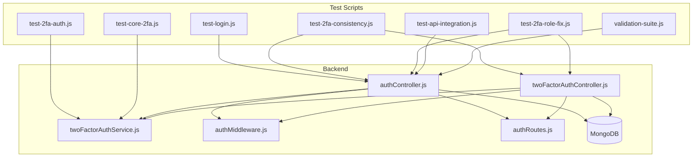

**Diagram sources**
- [backend/src/controllers/authController.js:90-237](file://backend/src/controllers/authController.js#L90-L237)
- [backend/src/controllers/twoFactorAuthController.js:1-453](file://backend/src/controllers/twoFactorAuthController.js#L1-L453)
- [backend/src/services/twoFactorAuthService.js:1-152](file://backend/src/services/twoFactorAuthService.js#L1-L152)
- [backend/src/middleware/authMiddleware.js:10-114](file://backend/src/middleware/authMiddleware.js#L10-L114)
- [backend/src/routes/authRoutes.js:1-10](file://backend/src/routes/authRoutes.js#L1-L10)
- [backend/test-login.js:1-44](file://backend/test-login.js#L1-L44)
- [backend/test-2fa-auth.js:1-161](file://backend/test-2fa-auth.js#L1-L161)
- [backend/test-core-2fa.js:1-111](file://backend/test-core-2fa.js#L1-L111)
- [backend/test-2fa-consistency.js:1-85](file://backend/test-2fa-consistency.js#L1-L85)
- [backend/test-2fa-role-fix.js:1-97](file://backend/test-2fa-role-fix.js#L1-L97)
- [backend/test-api-integration.js:1-113](file://backend/test-api-integration.js#L1-L113)
- [validation-suite.js:1-181](file://validation-suite.js#L1-L181)

**Section sources**
- [backend/src/controllers/authController.js:90-237](file://backend/src/controllers/authController.js#L90-L237)
- [backend/src/controllers/twoFactorAuthController.js:1-453](file://backend/src/controllers/twoFactorAuthController.js#L1-L453)
- [backend/src/services/twoFactorAuthService.js:1-152](file://backend/src/services/twoFactorAuthService.js#L1-L152)
- [backend/src/middleware/authMiddleware.js:10-114](file://backend/src/middleware/authMiddleware.js#L10-L114)
- [backend/src/routes/authRoutes.js:1-10](file://backend/src/routes/authRoutes.js#L1-L10)
- [backend/test-login.js:1-44](file://backend/test-login.js#L1-L44)
- [backend/test-2fa-auth.js:1-161](file://backend/test-2fa-auth.js#L1-L161)
- [backend/test-core-2fa.js:1-111](file://backend/test-core-2fa.js#L1-L111)
- [backend/test-2fa-consistency.js:1-85](file://backend/test-2fa-consistency.js#L1-L85)
- [backend/test-2fa-role-fix.js:1-97](file://backend/test-2fa-role-fix.js#L1-L97)
- [backend/test-api-integration.js:1-113](file://backend/test-api-integration.js#L1-L113)
- [validation-suite.js:1-181](file://validation-suite.js#L1-L181)

## Core Components
- Authentication Controller: Handles registration and login, including role-based access control and 2FA gating for citizen users.
- 2FA Controller: Manages 2FA setup, verification, disabling, status checks, and backup code regeneration.
- 2FA Service: Provides secret generation, QR code creation, TOTP token verification, backup code hashing/verification, and enforcement logic.
- Authentication Middleware: Validates JWT tokens and authorizes roles and ward-specific access.
- Routes: Expose authentication and 2FA endpoints.

Key responsibilities:
- Validate credentials across Admin, WardAdmin, and User collections
- Enforce mandatory 2FA for citizen users on every login
- Support backup codes and QR-based setup
- Provide robust RBAC and ward-level authorization

**Section sources**
- [backend/src/controllers/authController.js:90-237](file://backend/src/controllers/authController.js#L90-L237)
- [backend/src/controllers/twoFactorAuthController.js:1-453](file://backend/src/controllers/twoFactorAuthController.js#L1-L453)
- [backend/src/services/twoFactorAuthService.js:1-152](file://backend/src/services/twoFactorAuthService.js#L1-L152)
- [backend/src/middleware/authMiddleware.js:10-114](file://backend/src/middleware/authMiddleware.js#L10-L114)
- [backend/src/routes/authRoutes.js:1-10](file://backend/src/routes/authRoutes.js#L1-L10)

## Architecture Overview
The authentication and 2FA flow integrates HTTP endpoints, controllers, services, and middleware. The 2FA enforcement is centralized in the 2FA service and invoked by the authentication controller.

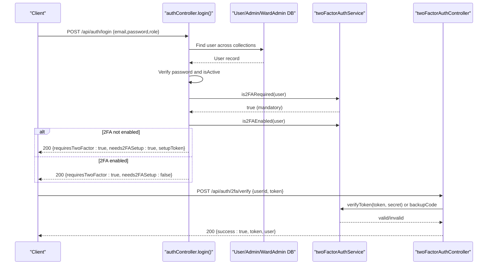

**Diagram sources**
- [backend/src/controllers/authController.js:90-237](file://backend/src/controllers/authController.js#L90-L237)
- [backend/src/services/twoFactorAuthService.js:125-135](file://backend/src/services/twoFactorAuthService.js#L125-L135)
- [backend/src/controllers/twoFactorAuthController.js:143-265](file://backend/src/controllers/twoFactorAuthController.js#L143-L265)

## Detailed Component Analysis

### Authentication Controller Analysis
The authentication controller orchestrates login, role resolution, and 2FA gating:
- Searches Admin, WardAdmin, and User collections
- Enforces password policies and prevents email reuse
- Applies role-based access control
- Triggers 2FA for citizen users unconditionally

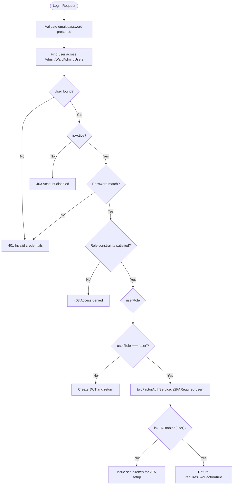

**Diagram sources**
- [backend/src/controllers/authController.js:90-237](file://backend/src/controllers/authController.js#L90-L237)
- [backend/src/services/twoFactorAuthService.js:125-135](file://backend/src/services/twoFactorAuthService.js#L125-L135)

**Section sources**
- [backend/src/controllers/authController.js:90-237](file://backend/src/controllers/authController.js#L90-L237)

### 2FA Service Analysis
The 2FA service encapsulates cryptographic operations and policy enforcement:
- Secret generation and QR code creation
- TOTP token verification with configurable time window
- Backup code generation and verification
- Mandatory 2FA enforcement logic

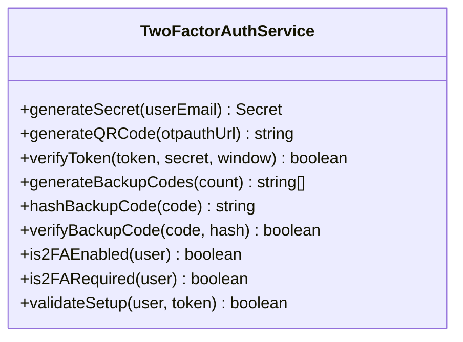

**Diagram sources**
- [backend/src/services/twoFactorAuthService.js:1-152](file://backend/src/services/twoFactorAuthService.js#L1-L152)

**Section sources**
- [backend/src/services/twoFactorAuthService.js:1-152](file://backend/src/services/twoFactorAuthService.js#L1-L152)

### 2FA Controller Analysis
The 2FA controller manages lifecycle operations:
- Setup initiation and verification
- Token verification during login
- Disabling 2FA with password and token confirmation
- Status reporting and backup code regeneration

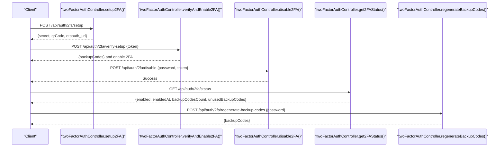

**Diagram sources**
- [backend/src/controllers/twoFactorAuthController.js:15-453](file://backend/src/controllers/twoFactorAuthController.js#L15-L453)

**Section sources**
- [backend/src/controllers/twoFactorAuthController.js:1-453](file://backend/src/controllers/twoFactorAuthController.js#L1-L453)

### Authentication Middleware Analysis
Authentication middleware validates JWTs and enforces role-based and ward-based access:
- Decodes token and resolves user from appropriate collection
- Enforces active account checks
- Authorizes roles and restricts ward_admin access to assigned ward

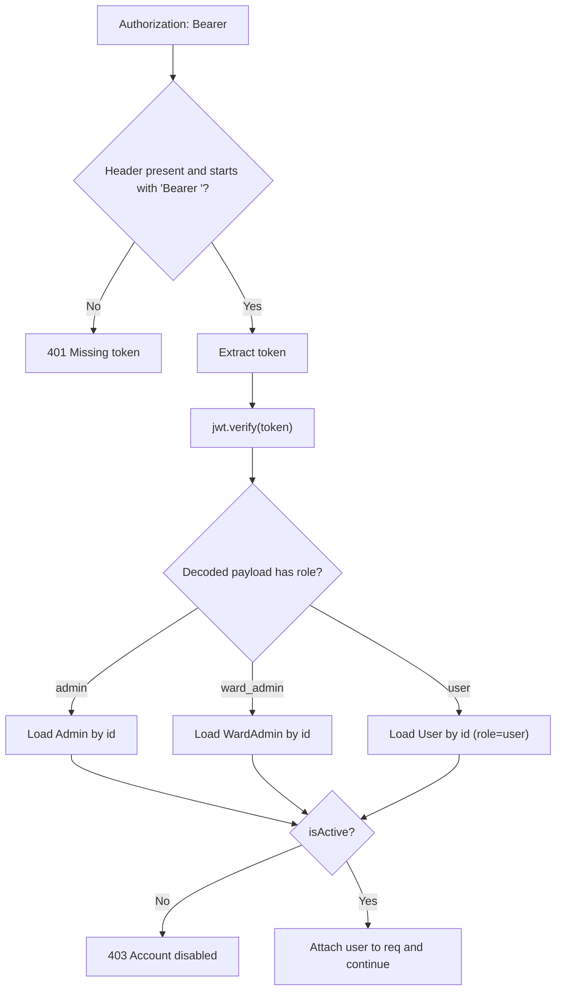

**Diagram sources**
- [backend/src/middleware/authMiddleware.js:10-114](file://backend/src/middleware/authMiddleware.js#L10-L114)

**Section sources**
- [backend/src/middleware/authMiddleware.js:10-114](file://backend/src/middleware/authMiddleware.js#L10-L114)

### API Integration Test Suite
The API integration test suite validates endpoint behavior and request/response handling:
- Tests complete 2FA login flow including requirement detection
- Exercises login endpoints and parses responses
- Verifies 2FA enforcement logic and user state independence

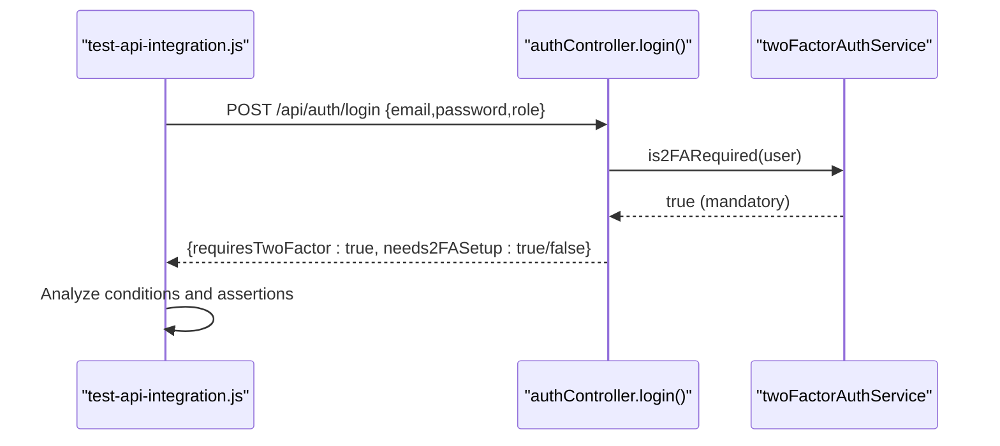

**Diagram sources**
- [backend/test-api-integration.js:38-113](file://backend/test-api-integration.js#L38-L113)
- [backend/src/controllers/authController.js:153-190](file://backend/src/controllers/authController.js#L153-L190)
- [backend/src/services/twoFactorAuthService.js:125-135](file://backend/src/services/twoFactorAuthService.js#L125-L135)

**Section sources**
- [backend/test-api-integration.js:1-113](file://backend/test-api-integration.js#L1-L113)

### Authentication Testing Framework
Authentication testing encompasses:
- Login validation against multiple user collections
- Session management testing (simulated logout and re-login)
- Role-based access control verification
- 2FA requirement enforcement across login attempts

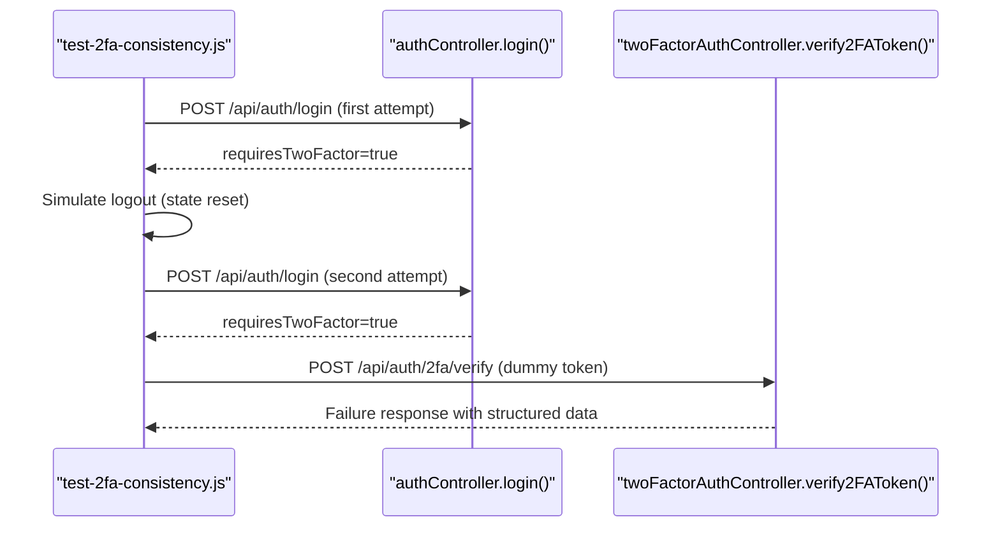

**Diagram sources**
- [backend/test-2fa-consistency.js:6-49](file://backend/test-2fa-consistency.js#L6-L49)
- [backend/src/controllers/authController.js:153-190](file://backend/src/controllers/authController.js#L153-L190)
- [backend/src/controllers/twoFactorAuthController.js:143-265](file://backend/src/controllers/twoFactorAuthController.js#L143-L265)

**Section sources**
- [backend/test-2fa-consistency.js:1-85](file://backend/test-2fa-consistency.js#L1-L85)
- [backend/test-2fa-role-fix.js:1-97](file://backend/test-2fa-role-fix.js#L1-L97)

### 2FA Authentication Testing Procedures
2FA testing procedures include:
- Core functionality validation (secret generation, TOTP verification, backup codes)
- End-to-end login simulation with password verification and 2FA gating
- Backup code verification and regeneration
- Consistency checks ensuring 2FA is enforced on every login

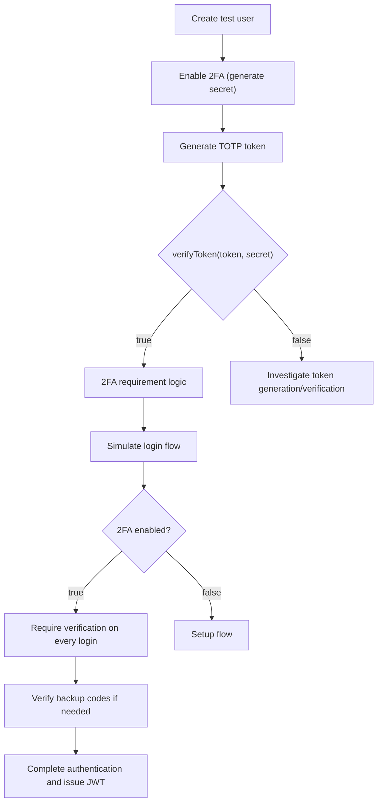

**Diagram sources**
- [backend/test-2fa-auth.js:13-161](file://backend/test-2fa-auth.js#L13-L161)
- [backend/test-core-2fa.js:7-111](file://backend/test-core-2fa.js#L7-L111)
- [backend/src/services/twoFactorAuthService.js:52-105](file://backend/src/services/twoFactorAuthService.js#L52-L105)

**Section sources**
- [backend/test-2fa-auth.js:1-161](file://backend/test-2fa-auth.js#L1-L161)
- [backend/test-core-2fa.js:1-111](file://backend/test-core-2fa.js#L1-L111)

### 2FA Validation Report Analysis
The 2FA validation report confirms:
- Mandatory 2FA enforcement returns true for all users
- TOTP token generation and verification working
- Backup codes generation and verification functional
- Integration notes indicate correct API responses and sound authentication flow logic

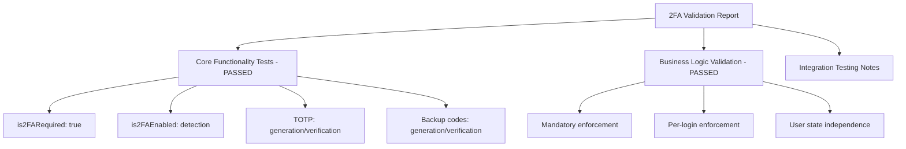

**Diagram sources**
- [2FA_VALIDATION_REPORT.md:1-85](file://2FA_VALIDATION_REPORT.md#L1-L85)

**Section sources**
- [2FA_VALIDATION_REPORT.md:1-85](file://2FA_VALIDATION_REPORT.md#L1-L85)

### Test Data Preparation and Mock Integration
Test data preparation includes:
- Using JSON fixtures for login credentials
- Creating test users programmatically with hashed passwords
- Generating secrets and backup codes for validation
- Simulating database connections and cleanup

Practical tips:
- Prepare distinct test users for each scenario (new user, existing user with 2FA enabled)
- Use environment variables for database URIs and JWT secrets
- Clean up test data after execution to avoid conflicts

**Section sources**
- [login-data.json:1-5](file://login-data.json#L1-L5)
- [backend/test-2fa-auth.js:19-47](file://backend/test-2fa-auth.js#L19-L47)
- [backend/test-core-2fa.js:16-37](file://backend/test-core-2fa.js#L16-L37)

### Testing Against Different User Roles
Testing should cover:
- Admin login and role-based access control
- Ward admin login and ward-level authorization
- Citizen user login with mandatory 2FA enforcement
- Mixed scenarios to ensure RBAC and 2FA policies apply correctly

Validation strategies:
- Use role-specific credentials and assert appropriate responses
- Verify that access-denied errors are returned for mismatched roles
- Confirm that 2FA is enforced consistently for citizen users regardless of prior sessions

**Section sources**
- [backend/src/controllers/authController.js:144-151](file://backend/src/controllers/authController.js#L144-L151)
- [backend/src/middleware/authMiddleware.js:61-71](file://backend/src/middleware/authMiddleware.js#L61-L71)

## Dependency Analysis
The authentication and 2FA system exhibits clear separation of concerns:
- Controllers depend on services for 2FA logic
- Services rely on cryptographic libraries for token verification and backup code hashing
- Middleware depends on JWT and user models for authorization
- Routes bind endpoints to controllers

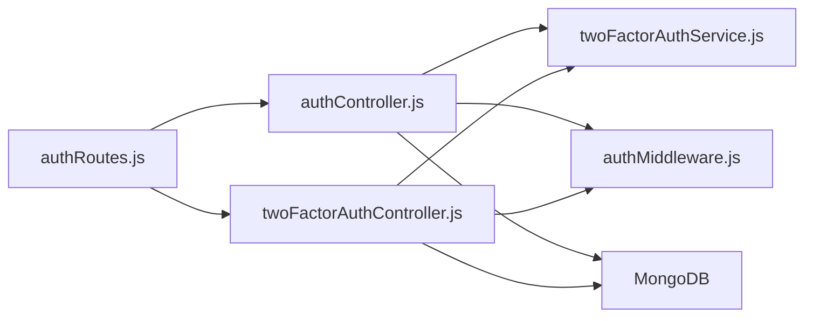

**Diagram sources**
- [backend/src/routes/authRoutes.js:1-10](file://backend/src/routes/authRoutes.js#L1-L10)
- [backend/src/controllers/authController.js:1-237](file://backend/src/controllers/authController.js#L1-L237)
- [backend/src/controllers/twoFactorAuthController.js:1-453](file://backend/src/controllers/twoFactorAuthController.js#L1-L453)
- [backend/src/services/twoFactorAuthService.js:1-152](file://backend/src/services/twoFactorAuthService.js#L1-L152)
- [backend/src/middleware/authMiddleware.js:1-114](file://backend/src/middleware/authMiddleware.js#L1-L114)

**Section sources**
- [backend/src/routes/authRoutes.js:1-10](file://backend/src/routes/authRoutes.js#L1-L10)
- [backend/src/controllers/authController.js:1-237](file://backend/src/controllers/authController.js#L1-L237)
- [backend/src/controllers/twoFactorAuthController.js:1-453](file://backend/src/controllers/twoFactorAuthController.js#L1-L453)
- [backend/src/services/twoFactorAuthService.js:1-152](file://backend/src/services/twoFactorAuthService.js#L1-L152)
- [backend/src/middleware/authMiddleware.js:1-114](file://backend/src/middleware/authMiddleware.js#L1-L114)

## Performance Considerations
- Minimize synchronous operations in controllers and services
- Use connection pooling for database operations
- Cache frequently accessed configuration (JWT secret, 2FA settings) where safe
- Optimize QR code generation and token verification windows
- Monitor endpoint latency and implement circuit breakers if needed

## Troubleshooting Guide
Common issues and resolutions:
- Invalid credentials: Ensure email and password are provided and match records across Admin, WardAdmin, and User collections
- 2FA requirement not detected: Verify that the 2FA enforcement logic returns true and that user has 2FA enabled or needs setup
- Token verification failures: Confirm token generation and verification use the same secret and encoding; adjust time window if necessary
- Role-based access denied: Check role constraints and ensure the user’s role matches the requested resource
- Session management problems: Simulate logout by clearing client-side tokens and ensure middleware correctly rejects stale tokens
- Database connectivity: Validate MongoDB connection string and ensure collections exist and are accessible

Debugging strategies:
- Log decoded JWT payloads and user roles in middleware
- Capture raw request/response bodies in test scripts
- Use validation suites to confirm endpoint availability and basic responses
- Inspect 2FA service logs for enforcement decisions and verification outcomes

**Section sources**
- [backend/src/controllers/authController.js:128-151](file://backend/src/controllers/authController.js#L128-L151)
- [backend/src/services/twoFactorAuthService.js:52-66](file://backend/src/services/twoFactorAuthService.js#L52-L66)
- [backend/src/middleware/authMiddleware.js:19-54](file://backend/src/middleware/authMiddleware.js#L19-L54)
- [validation-suite.js:14-95](file://validation-suite.js#L14-L95)

## Conclusion
The authentication and 2FA testing framework provides comprehensive coverage of login validation, role-based access control, and multi-factor authentication enforcement. The modular design of controllers, services, and middleware enables robust testing and reliable integration. The validation reports and test suites confirm that mandatory 2FA enforcement, TOTP verification, and backup code functionality operate as intended. Adopting the recommended debugging strategies and performance considerations will further strengthen the system’s reliability and security posture.

## Appendices

### API Endpoints Reference
- POST /api/auth/register: Register a new user
- POST /api/auth/login: Authenticate user and enforce 2FA for citizens
- POST /api/auth/2fa/setup: Initiate 2FA setup and return QR data
- POST /api/auth/2fa/verify-setup: Verify and enable 2FA
- POST /api/auth/2fa/verify: Verify 2FA token during login
- POST /api/auth/2fa/disable: Disable 2FA with password and token confirmation
- GET /api/auth/2fa/status: Retrieve 2FA status
- POST /api/auth/2fa/regenerate-backup-codes: Regenerate backup codes

**Section sources**
- [backend/src/routes/authRoutes.js:1-10](file://backend/src/routes/authRoutes.js#L1-L10)
- [backend/src/controllers/twoFactorAuthController.js:15-453](file://backend/src/controllers/twoFactorAuthController.js#L15-L453)