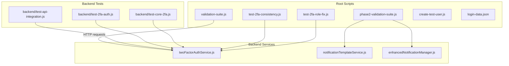
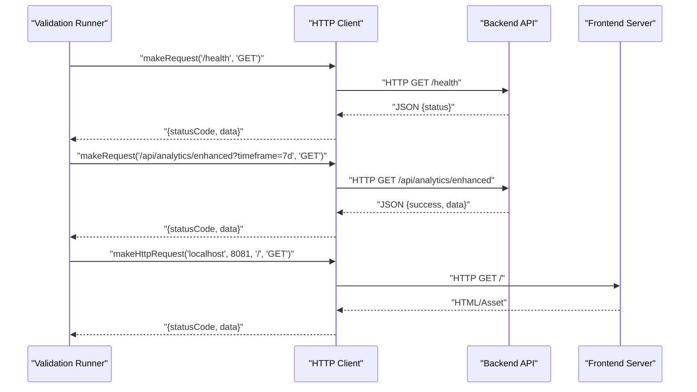
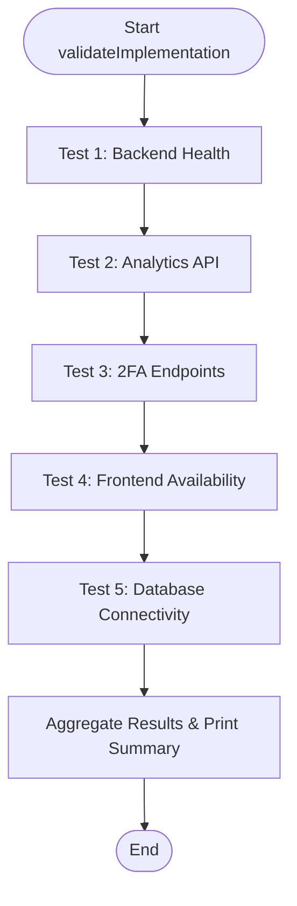
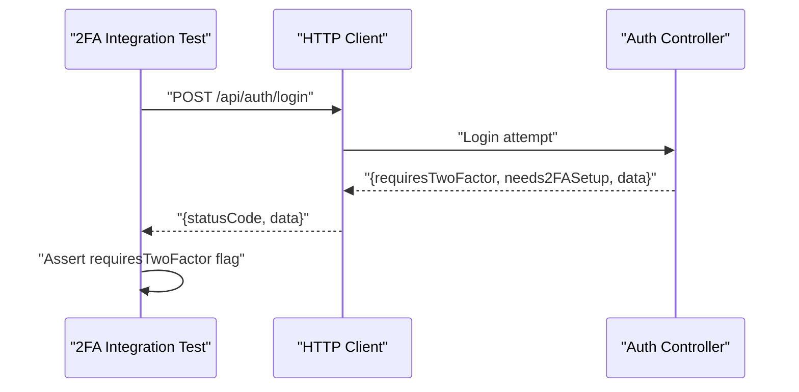
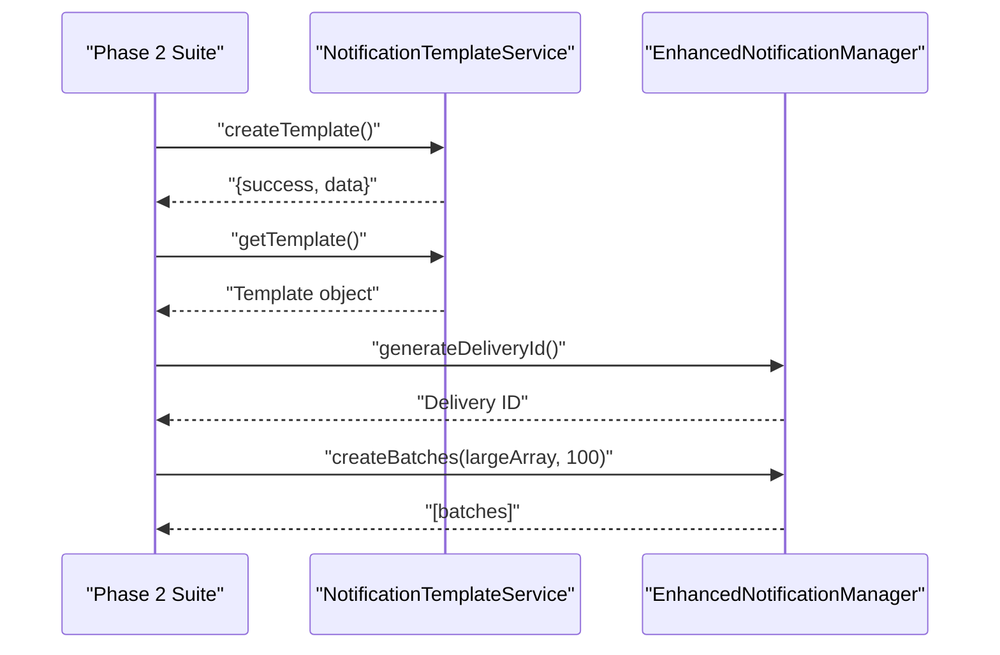
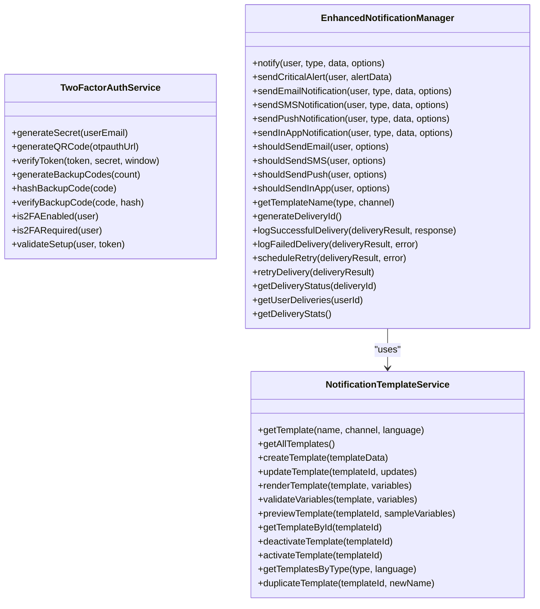
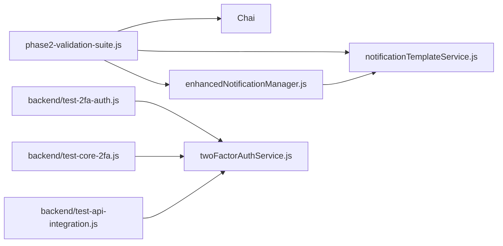

# Automated Testing Framework

<cite>
**Referenced Files in This Document**
- [validation-suite.js](file://validation-suite.js)
- [phase2-validation-suite.js](file://phase2-validation-suite.js)
- [backend/test-api-integration.js](file://backend/test-api-integration.js)
- [backend/test-2fa-auth.js](file://backend/test-2fa-auth.js)
- [backend/test-core-2fa.js](file://backend/test-core-2fa.js)
- [test-2fa-consistency.js](file://test-2fa-consistency.js)
- [test-2fa-role-fix.js](file://test-2fa-role-fix.js)
- [backend/src/services/twoFactorAuthService.js](file://backend/src/services/twoFactorAuthService.js)
- [backend/src/services/notificationTemplateService.js](file://backend/src/services/notificationTemplateService.js)
- [backend/src/services/enhancedNotificationManager.js](file://backend/src/services/enhancedNotificationManager.js)
- [backend/package.json](file://backend/package.json)
- [create-test-user.js](file://create-test-user.js)
- [login-data.json](file://login-data.json)
</cite>

## Table of Contents
1. [Introduction](#introduction)
2. [Project Structure](#project-structure)
3. [Core Components](#core-components)
4. [Architecture Overview](#architecture-overview)
5. [Detailed Component Analysis](#detailed-component-analysis)
6. [Dependency Analysis](#dependency-analysis)
7. [Performance Considerations](#performance-considerations)
8. [Troubleshooting Guide](#troubleshooting-guide)
9. [Conclusion](#conclusion)
10. [Appendices](#appendices)

## Introduction
This document describes the automated testing framework used in the Smart Voice Report platform. It covers the validation suite architecture, test execution flows, and methodologies. It documents the core validation script (validation-suite.js) with its five-category testing approach, the HTTP client utilities, and error handling strategies. It also details the Phase 2 validation suite for advanced testing scenarios, including setup instructions, test data management, and continuous integration practices. Finally, it provides examples for extending the framework and adding new test cases.

## Project Structure
The testing framework spans both backend and root-level scripts:
- Root-level validation scripts for smoke and health checks
- Backend-specific integration and unit tests for 2FA and API flows
- Phase 2 suite leveraging Chai assertions for advanced notification system features

**Diagram sources**
- [validation-suite.js:1-181](file://validation-suite.js#L1-L181)
- [phase2-validation-suite.js:1-236](file://phase2-validation-suite.js#L1-L236)
- [backend/test-api-integration.js:1-113](file://backend/test-api-integration.js#L1-L113)
- [backend/test-2fa-auth.js:1-161](file://backend/test-2fa-auth.js#L1-L161)
- [backend/test-core-2fa.js:1-111](file://backend/test-core-2fa.js#L1-L111)
- [backend/src/services/twoFactorAuthService.js:1-152](file://backend/src/services/twoFactorAuthService.js#L1-L152)
- [backend/src/services/notificationTemplateService.js:1-302](file://backend/src/services/notificationTemplateService.js#L1-L302)
- [backend/src/services/enhancedNotificationManager.js:1-442](file://backend/src/services/enhancedNotificationManager.js#L1-L442)

**Section sources**
- [validation-suite.js:1-181](file://validation-suite.js#L1-L181)
- [phase2-validation-suite.js:1-236](file://phase2-validation-suite.js#L1-L236)
- [backend/test-api-integration.js:1-113](file://backend/test-api-integration.js#L1-L113)
- [backend/test-2fa-auth.js:1-161](file://backend/test-2fa-auth.js#L1-L161)
- [backend/test-core-2fa.js:1-111](file://backend/test-core-2fa.js#L1-L111)

## Core Components
- Five-category validation suite:
  - Backend health checks
  - Analytics API validation
  - 2FA authentication flow testing
  - Frontend availability checks
  - Database connectivity verification
- HTTP client utilities:
  - Generic JSON request builder
  - Separate HTTP request builder for frontend
- Error handling:
  - Try/catch around each test block
  - Structured result logging with pass/fail/warn/error
  - Aggregated summary and overall status

Key implementation references:
- Validation runner and categories: [validation-suite.js:3-127](file://validation-suite.js#L3-L127)
- HTTP clients: [validation-suite.js:129-178](file://validation-suite.js#L129-L178)

**Section sources**
- [validation-suite.js:1-181](file://validation-suite.js#L1-L181)

## Architecture Overview
The validation suite orchestrates tests across backend, analytics, 2FA, frontend, and database domains. It uses a lightweight HTTP client to probe endpoints and parse JSON responses. Phase 2 tests shift to unit/integration testing with Chai assertions, validating services that manage notification templates and orchestrate multi-channel notifications.

**Diagram sources**
- [validation-suite.js:129-178](file://validation-suite.js#L129-L178)

## Detailed Component Analysis

### Core Validation Script (validation-suite.js)
- Purpose: End-to-end smoke and health checks across backend, analytics, 2FA, frontend, and database.
- Methodology:
  - Iterative category-based tests with structured logging
  - JSON parsing for API responses
  - Status aggregation and overall pass/fail determination
- HTTP Utilities:
  - makeRequest: generic JSON request builder with hostname/port/path/method and optional body
  - makeHttpRequest: separate HTTP client for frontend on localhost:8081
- Error Handling:
  - Catch-all try/catch blocks
  - Append errors to test results
  - Summary prints pass/fail counts and overall status

**Diagram sources**
- [validation-suite.js:3-127](file://validation-suite.js#L3-L127)

**Section sources**
- [validation-suite.js:1-181](file://validation-suite.js#L1-L181)

### HTTP Client Utilities
- makeRequest:
  - Accepts path, method, optional JSON body
  - Returns Promise resolving to { statusCode, data }
  - Parses JSON when possible; otherwise returns raw data
- makeHttpRequest:
  - Dedicated client for frontend on port 8081
  - Returns { statusCode, data }

Usage references:
- [validation-suite.js:129-178](file://validation-suite.js#L129-L178)

**Section sources**
- [validation-suite.js:129-178](file://validation-suite.js#L129-L178)

### 2FA Testing Suite
- Integration flow test:
  - Validates 2FA enforcement via login response flags
  - Analyzes conditions that trigger 2FA
  - References backend auth controller logic
- Unit tests:
  - Core 2FA functionality: secret generation, token verification, backup codes
  - Full 2FA auth test: user creation, enabling 2FA, password matching, login flow simulation
- Consistency and role fix tests:
  - Ensures 2FA is enforced on every login attempt
  - Verifies role presence in 2FA verification responses

**Diagram sources**
- [backend/test-api-integration.js:38-111](file://backend/test-api-integration.js#L38-L111)

**Section sources**
- [backend/test-api-integration.js:1-113](file://backend/test-api-integration.js#L1-L113)
- [backend/test-2fa-auth.js:1-161](file://backend/test-2fa-auth.js#L1-L161)
- [backend/test-core-2fa.js:1-111](file://backend/test-core-2fa.js#L1-L111)
- [test-2fa-consistency.js:1-85](file://test-2fa-consistency.js#L1-L85)
- [test-2fa-role-fix.js:1-97](file://test-2fa-role-fix.js#L1-L97)

### Phase 2 Validation Suite
- Focus: Notification system enhancement with Chai assertions
- Coverage:
  - Notification template management (create, retrieve, render, validate variables)
  - Enhanced notification manager (channel selection, delivery tracking IDs, batching)
  - Digest notification service (grouping, time conversion)
  - Emergency broadcast service (validation, severity)
  - Integration and performance tests
- Execution:
  - Uses Chai’s expect
  - Runs via Mocha-compatible describe.run()

**Diagram sources**
- [phase2-validation-suite.js:12-230](file://phase2-validation-suite.js#L12-L230)
- [backend/src/services/notificationTemplateService.js:60-84](file://backend/src/services/notificationTemplateService.js#L60-L84)
- [backend/src/services/enhancedNotificationManager.js:362-364](file://backend/src/services/enhancedNotificationManager.js#L362-L364)

**Section sources**
- [phase2-validation-suite.js:1-236](file://phase2-validation-suite.js#L1-L236)
- [backend/src/services/notificationTemplateService.js:1-302](file://backend/src/services/notificationTemplateService.js#L1-L302)
- [backend/src/services/enhancedNotificationManager.js:1-442](file://backend/src/services/enhancedNotificationManager.js#L1-L442)

### Backend Services Under Test
- Two-Factor Authentication Service:
  - Secret generation, QR code generation, token verification, backup codes
  - Mandatory 2FA enforcement policy
- Notification Template Service:
  - CRUD operations, variable interpolation, validation, preview
- Enhanced Notification Manager:
  - Multi-channel notifications, delivery tracking, retry logic, statistics

**Diagram sources**
- [backend/src/services/twoFactorAuthService.js:1-152](file://backend/src/services/twoFactorAuthService.js#L1-L152)
- [backend/src/services/notificationTemplateService.js:1-302](file://backend/src/services/notificationTemplateService.js#L1-L302)
- [backend/src/services/enhancedNotificationManager.js:1-442](file://backend/src/services/enhancedNotificationManager.js#L1-L442)

**Section sources**
- [backend/src/services/twoFactorAuthService.js:1-152](file://backend/src/services/twoFactorAuthService.js#L1-L152)
- [backend/src/services/notificationTemplateService.js:1-302](file://backend/src/services/notificationTemplateService.js#L1-L302)
- [backend/src/services/enhancedNotificationManager.js:1-442](file://backend/src/services/enhancedNotificationManager.js#L1-L442)

## Dependency Analysis
- Runtime dependencies (backend):
  - bcryptjs, jsonwebtoken, mongoose, speakeasy, qrcode, twilio, nodemailer
  - Express, cors, morgan for server stack
- Test-time dependencies:
  - Chai for Phase 2 suite assertions
  - Supabase client for template service
  - MongoDB/Mongoose for 2FA unit tests

**Diagram sources**
- [phase2-validation-suite.js:6-11](file://phase2-validation-suite.js#L6-L11)
- [backend/test-2fa-auth.js:1-8](file://backend/test-2fa-auth.js#L1-L8)
- [backend/test-core-2fa.js:1-4](file://backend/test-core-2fa.js#L1-L4)
- [backend/test-api-integration.js:1-1](file://backend/test-api-integration.js#L1-L1)
- [backend/src/services/enhancedNotificationManager.js:1-2](file://backend/src/services/enhancedNotificationManager.js#L1-L2)
- [backend/src/services/notificationTemplateService.js:1-2](file://backend/src/services/notificationTemplateService.js#L1-L2)

**Section sources**
- [backend/package.json:1-28](file://backend/package.json#L1-L28)

## Performance Considerations
- Validation suite:
  - Sequential HTTP requests; consider parallelizing independent checks for faster feedback
  - JSON parsing overhead negligible for typical payloads
- Phase 2 suite:
  - Concurrent template creation under load tested; ensure database and Supabase can handle bursts
  - Delivery retry uses exponential backoff; tune maxRetries and delays based on provider SLAs

[No sources needed since this section provides general guidance]

## Troubleshooting Guide
Common issues and remedies:
- Backend not reachable:
  - Confirm backend is running on port 3000
  - Verify firewall and CORS settings
- Frontend not served:
  - Ensure frontend dev server runs on port 8081
- 2FA tests failing:
  - Validate test user exists and 2FA is enabled
  - Check password variations and database connectivity
- Template service errors:
  - Confirm Supabase table exists and credentials configured
- Assertion failures in Phase 2:
  - Review service method signatures and return shapes
  - Ensure mocks and test data align with service expectations

**Section sources**
- [validation-suite.js:1-181](file://validation-suite.js#L1-L181)
- [backend/test-2fa-auth.js:1-161](file://backend/test-2fa-auth.js#L1-L161)
- [backend/src/services/notificationTemplateService.js:1-302](file://backend/src/services/notificationTemplateService.js#L1-L302)

## Conclusion
The testing framework combines a concise validation suite for smoke checks with a comprehensive Phase 2 suite for advanced notification features. It leverages lightweight HTTP clients for backend and frontend probing and Chai-based assertions for service-level validation. The framework supports incremental expansion with clear separation of concerns across backend services and test scripts.

[No sources needed since this section summarizes without analyzing specific files]

## Appendices

### Setup Instructions
- Install backend dependencies:
  - Navigate to backend directory and install dependencies
  - Reference: [backend/package.json:1-28](file://backend/package.json#L1-L28)
- Environment configuration:
  - Ensure MONGO_URI and other environment variables are set for 2FA tests
- Running tests:
  - Root validation: execute validation-suite.js
  - Phase 2: execute phase2-validation-suite.js
  - Backend 2FA tests: run backend/test-2fa-auth.js, backend/test-core-2fa.js, backend/test-api-integration.js
  - Utility scripts: create-test-user.js, login-data.json

**Section sources**
- [backend/package.json:1-28](file://backend/package.json#L1-L28)
- [create-test-user.js:1-12](file://create-test-user.js#L1-L12)
- [login-data.json:1-5](file://login-data.json#L1-L5)

### Test Data Management
- Test user creation:
  - Use create-test-user.js to generate test-user.json
- Login data:
  - Predefined credentials in login-data.json for quick login tests
- 2FA test users:
  - Backend tests create or locate test users and enable 2FA

**Section sources**
- [create-test-user.js:1-12](file://create-test-user.js#L1-L12)
- [login-data.json:1-5](file://login-data.json#L1-L5)
- [backend/test-2fa-auth.js:19-47](file://backend/test-2fa-auth.js#L19-L47)

### Continuous Integration Practices
- Recommended pipeline stages:
  - Build backend
  - Seed test data (users, templates)
  - Run validation-suite.js
  - Run Phase 2 suite
  - Collect logs and artifacts
- Parallelization:
  - Run independent backend and frontend checks concurrently
  - Limit concurrent template creation to avoid provider throttling

[No sources needed since this section provides general guidance]

### Extending the Testing Framework
- Adding a new validation category:
  - Define a new test block in validation-suite.js
  - Add a new category to the results structure and summary logic
  - Reference: [validation-suite.js:7-127](file://validation-suite.js#L7-L127)
- Adding a new HTTP utility:
  - Extend makeRequest or introduce specialized helpers
  - Reference: [validation-suite.js:129-178](file://validation-suite.js#L129-L178)
- Extending Phase 2 tests:
  - Add new describe blocks for additional services
  - Integrate with existing service modules
  - Reference: [phase2-validation-suite.js:12-230](file://phase2-validation-suite.js#L12-L230)
- Example: New 2FA scenario
  - Add a new test file similar to test-2fa-consistency.js or test-2fa-role-fix.js
  - Reuse twoFactorAuthService and backend endpoints

**Section sources**
- [validation-suite.js:1-181](file://validation-suite.js#L1-L181)
- [phase2-validation-suite.js:1-236](file://phase2-validation-suite.js#L1-L236)
- [backend/test-2fa-consistency.js:1-85](file://test-2fa-consistency.js#L1-L85)
- [backend/test-2fa-role-fix.js:1-97](file://test-2fa-role-fix.js#L1-L97)