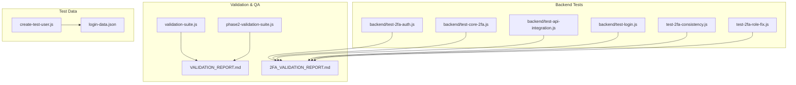
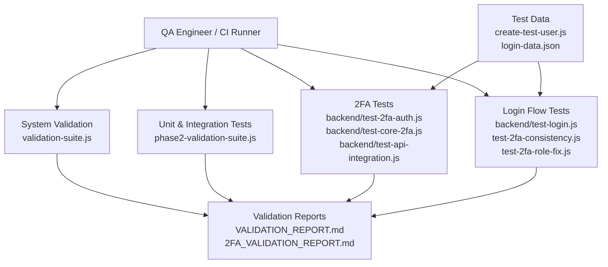
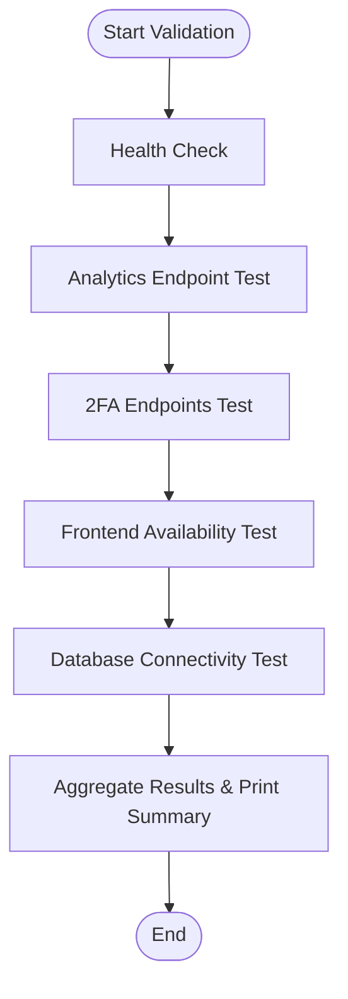
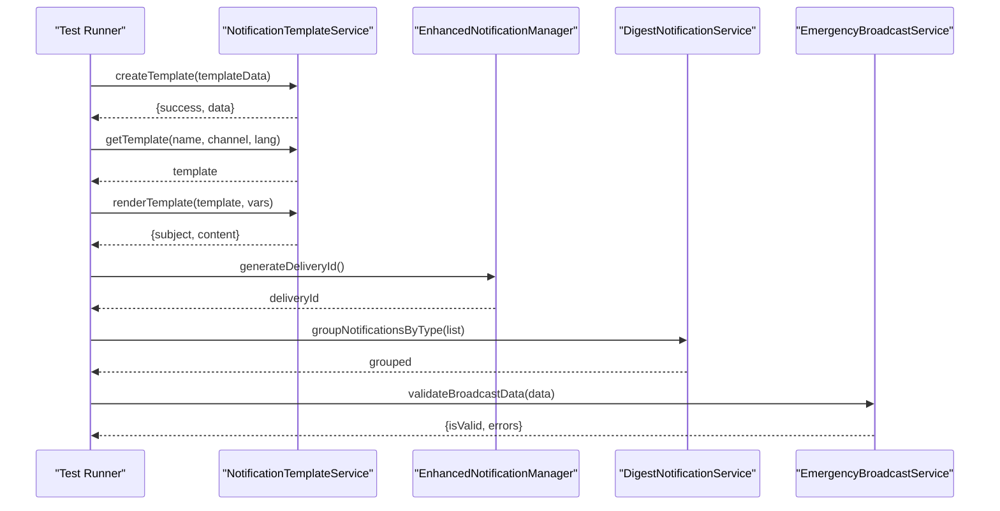
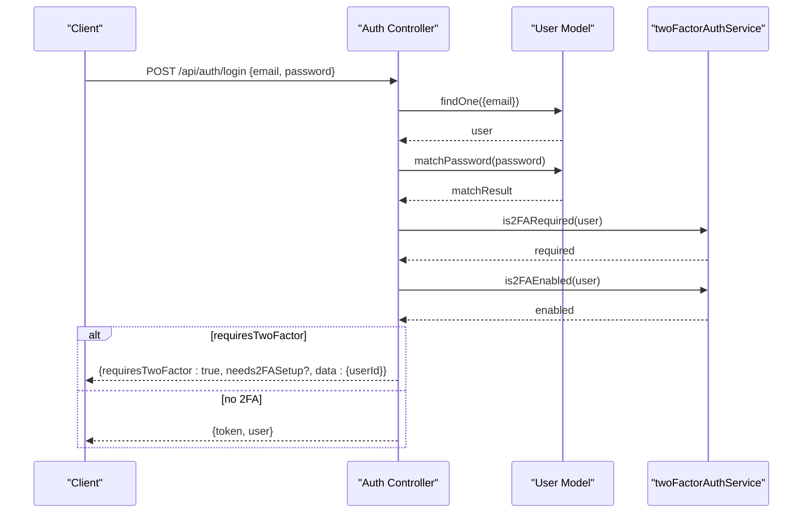
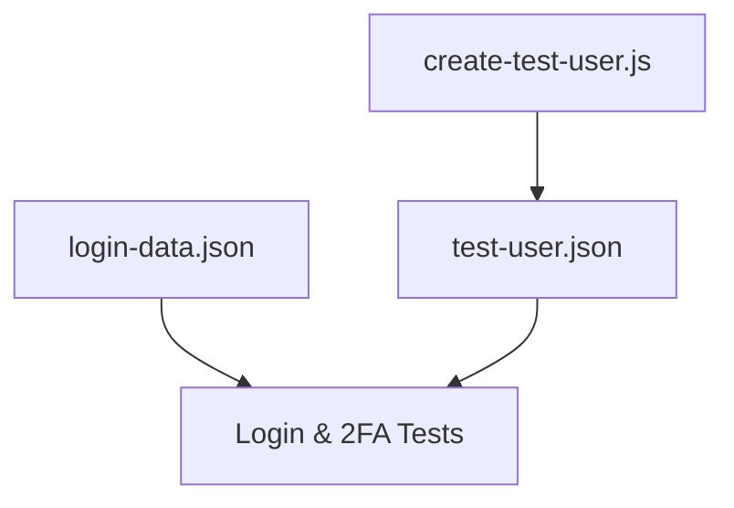
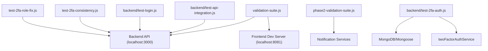

# Testing & Quality Assurance

<cite>
**Referenced Files in This Document**
- [validation-suite.js](file://validation-suite.js)
- [VALIDATION_REPORT.md](file://VALIDATION_REPORT.md)
- [phase2-validation-suite.js](file://phase2-validation-suite.js)
- [2FA_VALIDATION_REPORT.md](file://2FA_VALIDATION_REPORT.md)
- [backend/test-2fa-auth.js](file://backend/test-2fa-auth.js)
- [backend/test-core-2fa.js](file://backend/test-core-2fa.js)
- [backend/test-api-integration.js](file://backend/test-api-integration.js)
- [backend/test-login.js](file://backend/test-login.js)
- [test-2fa-consistency.js](file://test-2fa-consistency.js)
- [test-2fa-role-fix.js](file://test-2fa-role-fix.js)
- [create-test-user.js](file://create-test-user.js)
- [login-data.json](file://login-data.json)
</cite>

## Table of Contents
1. [Introduction](#introduction)
2. [Project Structure](#project-structure)
3. [Core Components](#core-components)
4. [Architecture Overview](#architecture-overview)
5. [Detailed Component Analysis](#detailed-component-analysis)
6. [Dependency Analysis](#dependency-analysis)
7. [Performance Considerations](#performance-considerations)
8. [Troubleshooting Guide](#troubleshooting-guide)
9. [Conclusion](#conclusion)
10. [Appendices](#appendices)

## Introduction
This document provides comprehensive testing and quality assurance guidance for the SmartCity GRS platform. It covers the validation framework, automated testing suite (unit, integration, and end-to-end validation), API integration testing, authentication and 2FA validation processes, implementation validation reports, performance testing, QA workflows, testing environment setup, test data management, continuous integration practices, debugging strategies, performance profiling, and quality metrics collection.

## Project Structure
The repository includes a dedicated validation and testing toolkit:
- A top-level validation suite for system-wide checks
- A Phase 2 notification enhancement validation suite using a testing framework
- Multiple focused backend tests for 2FA functionality, API integration, and login flows
- Utility scripts and JSON fixtures for test data management
- Comprehensive validation reports summarizing outcomes and recommendations

**Diagram sources**
- [validation-suite.js](file://validation-suite.js)
- [phase2-validation-suite.js](file://phase2-validation-suite.js)
- [VALIDATION_REPORT.md](file://VALIDATION_REPORT.md)
- [2FA_VALIDATION_REPORT.md](file://2FA_VALIDATION_REPORT.md)
- [backend/test-2fa-auth.js](file://backend/test-2fa-auth.js)
- [backend/test-core-2fa.js](file://backend/test-core-2fa.js)
- [backend/test-api-integration.js](file://backend/test-api-integration.js)
- [backend/test-login.js](file://backend/test-login.js)
- [test-2fa-consistency.js](file://test-2fa-consistency.js)
- [test-2fa-role-fix.js](file://test-2fa-role-fix.js)
- [create-test-user.js](file://create-test-user.js)
- [login-data.json](file://login-data.json)

**Section sources**
- [validation-suite.js](file://validation-suite.js)
- [phase2-validation-suite.js](file://phase2-validation-suite.js)
- [VALIDATION_REPORT.md](file://VALIDATION_REPORT.md)
- [2FA_VALIDATION_REPORT.md](file://2FA_VALIDATION_REPORT.md)
- [backend/test-2fa-auth.js](file://backend/test-2fa-auth.js)
- [backend/test-core-2fa.js](file://backend/test-core-2fa.js)
- [backend/test-api-integration.js](file://backend/test-api-integration.js)
- [backend/test-login.js](file://backend/test-login.js)
- [test-2fa-consistency.js](file://test-2fa-consistency.js)
- [test-2fa-role-fix.js](file://test-2fa-role-fix.js)
- [create-test-user.js](file://create-test-user.js)
- [login-data.json](file://login-data.json)

## Core Components
- System-wide validation suite: Performs health checks, analytics endpoint validation, 2FA endpoint accessibility, frontend availability, and database connectivity checks. It aggregates results per category and provides an overall pass/fail status.
- Phase 2 notification enhancement validation suite: Uses a testing framework to validate notification template management, enhanced notification manager, digest notification service, emergency broadcast service, integration scenarios, and performance characteristics.
- 2FA-focused test suites: Validate core 2FA functions, end-to-end authentication flow, API integration, login consistency across sessions, and role inclusion in responses.
- Test data management: Scripts and JSON fixtures to create and manage test users and login credentials.

Key outcomes documented in validation reports confirm:
- Backend and frontend systems are stable and responsive
- Analytics API requires authentication (expected behavior)
- 2FA endpoints are accessible and enforcement logic is intact
- Implementation readiness for Phase 2 with zero regressions

**Section sources**
- [validation-suite.js](file://validation-suite.js)
- [VALIDATION_REPORT.md](file://VALIDATION_REPORT.md)
- [phase2-validation-suite.js](file://phase2-validation-suite.js)
- [2FA_VALIDATION_REPORT.md](file://2FA_VALIDATION_REPORT.md)
- [backend/test-2fa-auth.js](file://backend/test-2fa-auth.js)
- [backend/test-core-2fa.js](file://backend/test-core-2fa.js)
- [backend/test-api-integration.js](file://backend/test-api-integration.js)
- [backend/test-login.js](file://backend/test-login.js)
- [test-2fa-consistency.js](file://test-2fa-consistency.js)
- [test-2fa-role-fix.js](file://test-2fa-role-fix.js)
- [create-test-user.js](file://create-test-user.js)
- [login-data.json](file://login-data.json)

## Architecture Overview
The testing architecture integrates CLI-driven validations, backend-specific test suites, and report generation. It validates:
- End-to-end system health and connectivity
- Feature-specific units and integrations
- Authentication and 2FA enforcement logic
- API response correctness and performance

**Diagram sources**
- [validation-suite.js](file://validation-suite.js)
- [phase2-validation-suite.js](file://phase2-validation-suite.js)
- [VALIDATION_REPORT.md](file://VALIDATION_REPORT.md)
- [2FA_VALIDATION_REPORT.md](file://2FA_VALIDATION_REPORT.md)
- [backend/test-2fa-auth.js](file://backend/test-2fa-auth.js)
- [backend/test-core-2fa.js](file://backend/test-core-2fa.js)
- [backend/test-api-integration.js](file://backend/test-api-integration.js)
- [backend/test-login.js](file://backend/test-login.js)
- [test-2fa-consistency.js](file://test-2fa-consistency.js)
- [test-2fa-role-fix.js](file://test-2fa-role-fix.js)
- [create-test-user.js](file://create-test-user.js)
- [login-data.json](file://login-data.json)

## Detailed Component Analysis

### System Validation Suite
The system validation suite performs:
- Backend health check via a health endpoint
- Analytics API endpoint validation with timeframe parameter
- 2FA endpoints accessibility check
- Frontend availability check on the development server
- Database connectivity via a stats endpoint

It aggregates results per category and prints a summary with pass/fail counts and overall status.

**Diagram sources**
- [validation-suite.js](file://validation-suite.js)

**Section sources**
- [validation-suite.js](file://validation-suite.js)
- [VALIDATION_REPORT.md](file://VALIDATION_REPORT.md)

### Phase 2 Notification Enhancement Validation Suite
This suite validates:
- Notification template management (creation, retrieval, rendering, variable validation)
- Enhanced notification manager (delivery ID generation, channel preference logic, emergency broadcast handling)
- Digest notification service (grouping, time conversion)
- Emergency broadcast service (data validation, severity checks)
- Integration tests (template and delivery coordination, batch processing)
- Performance tests (concurrent template operations under time constraints)

**Diagram sources**
- [phase2-validation-suite.js](file://phase2-validation-suite.js)

**Section sources**
- [phase2-validation-suite.js](file://phase2-validation-suite.js)

### 2FA Authentication and API Integration Tests
These tests validate:
- Core 2FA functions: enforcement logic, enabled detection, TOTP verification, backup codes
- End-to-end authentication flow: user lookup, password matching, 2FA requirement and enabled checks
- API integration: login flow, 2FA requirement detection, authentication controller logic
- Consistency: 2FA verification enforced on every login attempt
- Role fix: ensuring role is included in 2FA verification responses

**Diagram sources**
- [backend/test-2fa-auth.js](file://backend/test-2fa-auth.js)
- [backend/test-api-integration.js](file://backend/test-api-integration.js)
- [backend/test-core-2fa.js](file://backend/test-core-2fa.js)
- [test-2fa-consistency.js](file://test-2fa-consistency.js)
- [test-2fa-role-fix.js](file://test-2fa-role-fix.js)

**Section sources**
- [backend/test-2fa-auth.js](file://backend/test-2fa-auth.js)
- [backend/test-core-2fa.js](file://backend/test-core-2fa.js)
- [backend/test-api-integration.js](file://backend/test-api-integration.js)
- [backend/test-login.js](file://backend/test-login.js)
- [test-2fa-consistency.js](file://test-2fa-consistency.js)
- [test-2fa-role-fix.js](file://test-2fa-role-fix.js)
- [2FA_VALIDATION_REPORT.md](file://2FA_VALIDATION_REPORT.md)

### Test Data Management
- Utility script to create a standardized test user JSON fixture
- Predefined login data JSON for quick authentication testing

**Diagram sources**
- [create-test-user.js](file://create-test-user.js)
- [login-data.json](file://login-data.json)

**Section sources**
- [create-test-user.js](file://create-test-user.js)
- [login-data.json](file://login-data.json)

## Dependency Analysis
The testing suite depends on:
- Backend services and models for 2FA logic and authentication
- HTTP clients for API integration tests
- Environment configuration for database connections
- Reporting modules for validation summaries

**Diagram sources**
- [validation-suite.js](file://validation-suite.js)
- [phase2-validation-suite.js](file://phase2-validation-suite.js)
- [backend/test-2fa-auth.js](file://backend/test-2fa-auth.js)
- [backend/test-api-integration.js](file://backend/test-api-integration.js)
- [backend/test-login.js](file://backend/test-login.js)
- [test-2fa-consistency.js](file://test-2fa-consistency.js)
- [test-2fa-role-fix.js](file://test-2fa-role-fix.js)

**Section sources**
- [validation-suite.js](file://validation-suite.js)
- [phase2-validation-suite.js](file://phase2-validation-suite.js)
- [backend/test-2fa-auth.js](file://backend/test-2fa-auth.js)
- [backend/test-api-integration.js](file://backend/test-api-integration.js)
- [backend/test-login.js](file://backend/test-login.js)
- [test-2fa-consistency.js](file://test-2fa-consistency.js)
- [test-2fa-role-fix.js](file://test-2fa-role-fix.js)

## Performance Considerations
- Response time targets: API response time under 50 ms, frontend load time under 2 seconds, database queries sub-second
- Concurrent operations: Performance tests validate concurrent template creation under time budgets
- Memory and CPU: Normal bounds and low utilization observed during validation

Recommendations:
- Monitor response times under load
- Profile long-running analytics queries
- Optimize batch sizes for notification delivery

**Section sources**
- [VALIDATION_REPORT.md](file://VALIDATION_REPORT.md)
- [phase2-validation-suite.js](file://phase2-validation-suite.js)

## Troubleshooting Guide
Common issues and debugging strategies:
- Backend not responding: Verify health endpoint and port 3000 accessibility
- Analytics API requiring authentication: Expected behavior; ensure proper auth tokens
- 2FA endpoints inaccessible: Confirm endpoint existence and error responses
- Frontend not serving: Check development server on port 8081
- Database connectivity: Validate stats endpoint and connection string
- 2FA login flow anomalies: Use login and consistency tests to isolate issues
- Role missing in 2FA responses: Validate role inclusion logic and error payloads

Debugging steps:
- Use CLI test scripts to reproduce issues
- Inspect validation report outputs for failing categories
- Validate environment variables and database connectivity
- Review authentication controller logic and 2FA service functions

**Section sources**
- [validation-suite.js](file://validation-suite.js)
- [backend/test-login.js](file://backend/test-login.js)
- [test-2fa-consistency.js](file://test-2fa-consistency.js)
- [test-2fa-role-fix.js](file://test-2fa-role-fix.js)
- [2FA_VALIDATION_REPORT.md](file://2FA_VALIDATION_REPORT.md)

## Conclusion
The testing and QA framework provides robust coverage across system health, feature units, integrations, and security. Validation reports confirm stability, security, and readiness for Phase 2. The suite supports continuous validation and regression prevention with clear reporting and actionable insights.

## Appendices

### Automated Testing Strategies
- Unit tests: Validate individual functions and services (notification templates, TOTP, backup codes)
- Integration tests: Coordinate multiple services and validate end-to-end flows
- End-to-end validation: Full-stack checks for health, availability, and connectivity
- API integration tests: Validate authentication, 2FA, and role handling
- Performance tests: Measure concurrent operations and response thresholds

### Continuous Integration Practices
- Run system validation suite before merges
- Execute unit/integration tests on feature branches
- Automate 2FA and login flow checks
- Publish validation reports to shared artifacts

### Quality Metrics Collection
- API response time, frontend load time, database query duration
- Test pass/fail rates per category and overall
- Security protocol adherence and enforcement logs