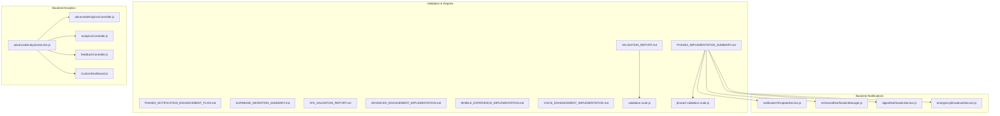
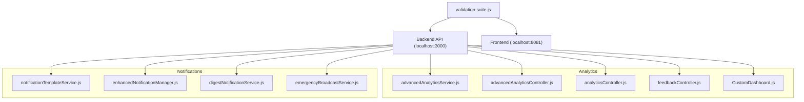
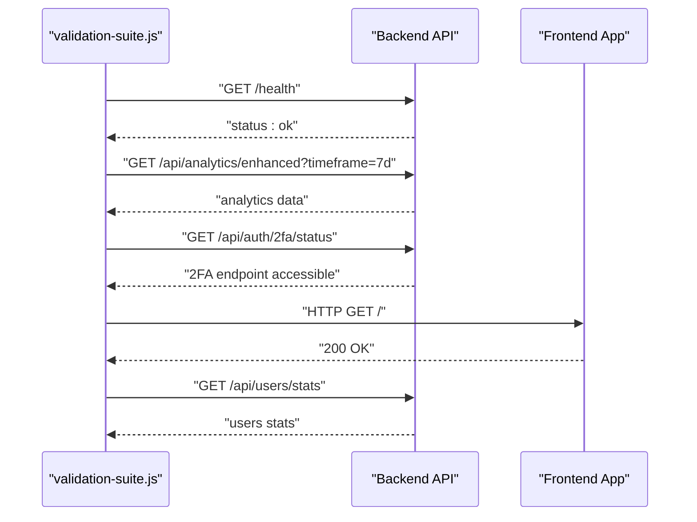
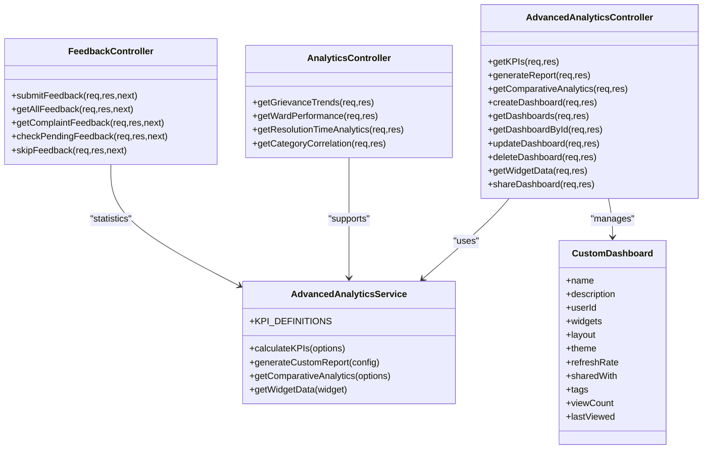
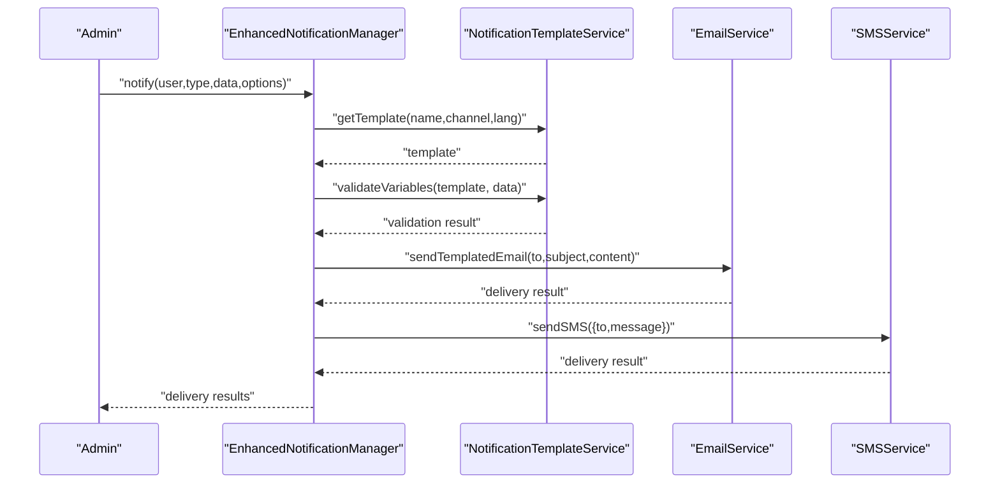
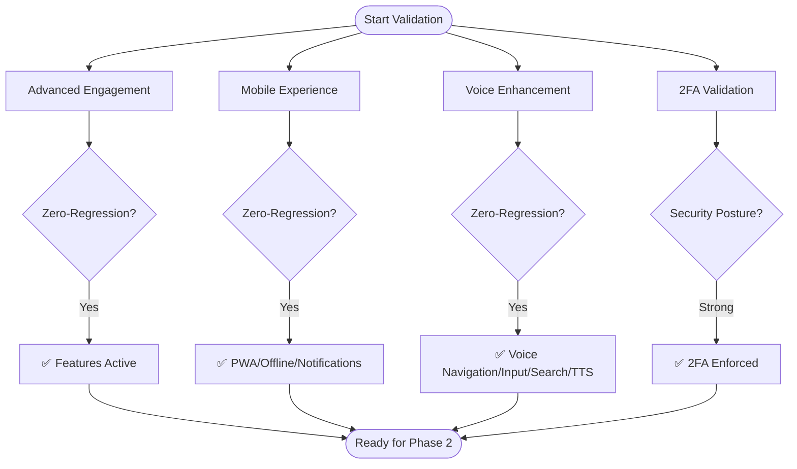
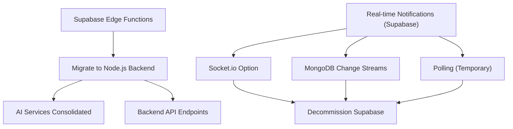
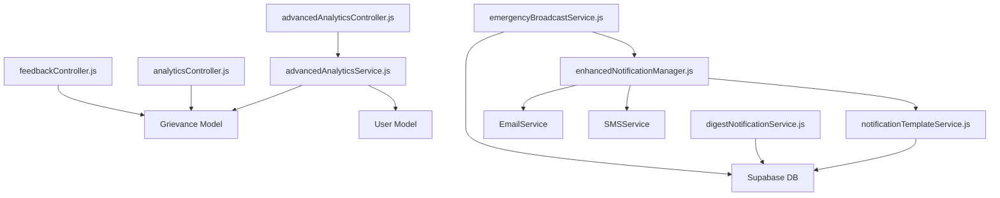

# Validation Reports & Quality Metrics

<cite>
**Referenced Files in This Document**
- [VALIDATION_REPORT.md](file://VALIDATION_REPORT.md)
- [PHASE2_IMPLEMENTATION_SUMMARY.md](file://PHASE2_IMPLEMENTATION_SUMMARY.md)
- [PHASE2_NOTIFICATION_ENHANCEMENT_PLAN.md](file://PHASE2_NOTIFICATION_ENHANCEMENT_PLAN.md)
- [SUPABASE_MIGRATION_SUMMARY.md](file://SUPABASE_MIGRATION_SUMMARY.md)
- [2FA_VALIDATION_REPORT.md](file://2FA_VALIDATION_REPORT.md)
- [ADVANCED_ENGAGEMENT_IMPLEMENTATION.md](file://ADVANCED_ENGAGEMENT_IMPLEMENTATION.md)
- [MOBILE_EXPERIENCE_IMPLEMENTATION.md](file://MOBILE_EXPERIENCE_IMPLEMENTATION.md)
- [VOICE_ENHANCEMENT_IMPLEMENTATION.md](file://VOICE_ENHANCEMENT_IMPLEMENTATION.md)
- [validation-suite.js](file://validation-suite.js)
- [phase2-validation-suite.js](file://phase2-validation-suite.js)
- [advancedAnalyticsService.js](file://backend/src/services/advancedAnalyticsService.js)
- [advancedAnalyticsController.js](file://backend/src/controllers/advancedAnalyticsController.js)
- [analyticsController.js](file://backend/src/controllers/analyticsController.js)
- [feedbackController.js](file://backend/src/controllers/feedbackController.js)
- [notificationTemplateService.js](file://backend/src/services/notificationTemplateService.js)
- [enhancedNotificationManager.js](file://backend/src/services/enhancedNotificationManager.js)
- [digestNotificationService.js](file://backend/src/services/digestNotificationService.js)
- [emergencyBroadcastService.js](file://backend/src/services/emergencyBroadcastService.js)
- [CustomDashboard.js](file://backend/src/models/CustomDashboard.js)
</cite>

## Table of Contents
1. [Introduction](#introduction)
2. [Project Structure](#project-structure)
3. [Core Components](#core-components)
4. [Architecture Overview](#architecture-overview)
5. [Detailed Component Analysis](#detailed-component-analysis)
6. [Dependency Analysis](#dependency-analysis)
7. [Performance Considerations](#performance-considerations)
8. [Troubleshooting Guide](#troubleshooting-guide)
9. [Conclusion](#conclusion)
10. [Appendices](#appendices)

## Introduction
This document consolidates validation reports and quality metrics collection systems across the SmartCity GRS platform. It covers:
- Feature completeness assessment and zero-regression validation
- Performance benchmarking and security posture verification
- Quality assurance metrics for analytics, notifications, and user experience
- Phase 2 implementation summary for notification enhancements
- Notification enhancement plan validation, migration summaries, and technical debt assessments
- Reporting processes, data analysis methodologies, and stakeholder formats
- Guidance for interpreting results, identifying improvement areas, and maintaining quality standards

## Project Structure
The repository organizes validation artifacts and implementation summaries alongside backend analytics and notification services. Key areas:
- Validation reports and suites for backend, frontend, analytics, and security
- Phase 2 notification enhancement plan and implementation summary
- Migration summary for Supabase to MongoDB
- Feature-specific implementation documents for advanced engagement, mobile experience, and voice enhancements
- Backend analytics services and controllers for KPIs, dashboards, and feedback
- Notification services for templates, enhanced delivery tracking, digest scheduling, and emergency broadcasts

**Diagram sources**
- [VALIDATION_REPORT.md:1-136](file://VALIDATION_REPORT.md#L1-L136)
- [PHASE2_IMPLEMENTATION_SUMMARY.md:1-212](file://PHASE2_IMPLEMENTATION_SUMMARY.md#L1-L212)
- [PHASE2_NOTIFICATION_ENHANCEMENT_PLAN.md:1-205](file://PHASE2_NOTIFICATION_ENHANCEMENT_PLAN.md#L1-L205)
- [SUPABASE_MIGRATION_SUMMARY.md:1-337](file://SUPABASE_MIGRATION_SUMMARY.md#L1-L337)
- [2FA_VALIDATION_REPORT.md:1-85](file://2FA_VALIDATION_REPORT.md#L1-L85)
- [ADVANCED_ENGAGEMENT_IMPLEMENTATION.md:1-223](file://ADVANCED_ENGAGEMENT_IMPLEMENTATION.md#L1-L223)
- [MOBILE_EXPERIENCE_IMPLEMENTATION.md:1-335](file://MOBILE_EXPERIENCE_IMPLEMENTATION.md#L1-L335)
- [VOICE_ENHANCEMENT_IMPLEMENTATION.md:1-478](file://VOICE_ENHANCEMENT_IMPLEMENTATION.md#L1-L478)
- [validation-suite.js:1-181](file://validation-suite.js#L1-L181)
- [phase2-validation-suite.js:1-236](file://phase2-validation-suite.js#L1-L236)
- [advancedAnalyticsService.js:1-532](file://backend/src/services/advancedAnalyticsService.js#L1-L532)
- [advancedAnalyticsController.js:1-397](file://backend/src/controllers/advancedAnalyticsController.js#L1-L397)
- [analyticsController.js:1-203](file://backend/src/controllers/analyticsController.js#L1-L203)
- [feedbackController.js:1-225](file://backend/src/controllers/feedbackController.js#L1-L225)
- [CustomDashboard.js:1-160](file://backend/src/models/CustomDashboard.js#L1-L160)
- [notificationTemplateService.js:1-302](file://backend/src/services/notificationTemplateService.js#L1-L302)
- [enhancedNotificationManager.js:1-442](file://backend/src/services/enhancedNotificationManager.js#L1-L442)
- [digestNotificationService.js:1-441](file://backend/src/services/digestNotificationService.js#L1-L441)
- [emergencyBroadcastService.js:1-430](file://backend/src/services/emergencyBroadcastService.js#L1-L430)

**Section sources**
- [VALIDATION_REPORT.md:1-136](file://VALIDATION_REPORT.md#L1-L136)
- [PHASE2_IMPLEMENTATION_SUMMARY.md:1-212](file://PHASE2_IMPLEMENTATION_SUMMARY.md#L1-L212)
- [PHASE2_NOTIFICATION_ENHANCEMENT_PLAN.md:1-205](file://PHASE2_NOTIFICATION_ENHANCEMENT_PLAN.md#L1-L205)
- [SUPABASE_MIGRATION_SUMMARY.md:1-337](file://SUPABASE_MIGRATION_SUMMARY.md#L1-L337)
- [2FA_VALIDATION_REPORT.md:1-85](file://2FA_VALIDATION_REPORT.md#L1-L85)
- [ADVANCED_ENGAGEMENT_IMPLEMENTATION.md:1-223](file://ADVANCED_ENGAGEMENT_IMPLEMENTATION.md#L1-L223)
- [MOBILE_EXPERIENCE_IMPLEMENTATION.md:1-335](file://MOBILE_EXPERIENCE_IMPLEMENTATION.md#L1-L335)
- [VOICE_ENHANCEMENT_IMPLEMENTATION.md:1-478](file://VOICE_ENHANCEMENT_IMPLEMENTATION.md#L1-L478)
- [validation-suite.js:1-181](file://validation-suite.js#L1-L181)
- [phase2-validation-suite.js:1-236](file://phase2-validation-suite.js#L1-L236)

## Core Components
This section outlines the validation and quality metrics components that collectively ensure feature completeness, performance, and security.

- Validation Suites
  - Backend/Frontend/Analytics/Security smoke tests and automated checks
  - Phase 2 notification feature validation with unit and integration tests
- Analytics Services and Controllers
  - KPI calculation, custom reports, comparative analytics, and dashboard management
  - Feedback collection and statistics
- Notification Services
  - Template management, enhanced delivery tracking, digest scheduling, and emergency broadcasts
- Feature Implementation Summaries
  - Advanced engagement, mobile experience, voice enhancements, and Supabase migration

Key implementation highlights:
- Zero-regression strategy across all new features
- Extensive error handling and graceful degradation
- Feature flags and additive integrations
- Comprehensive testing and validation approaches

**Section sources**
- [validation-suite.js:1-181](file://validation-suite.js#L1-L181)
- [phase2-validation-suite.js:1-236](file://phase2-validation-suite.js#L1-L236)
- [advancedAnalyticsService.js:1-532](file://backend/src/services/advancedAnalyticsService.js#L1-L532)
- [advancedAnalyticsController.js:1-397](file://backend/src/controllers/advancedAnalyticsController.js#L1-L397)
- [analyticsController.js:1-203](file://backend/src/controllers/analyticsController.js#L1-L203)
- [feedbackController.js:1-225](file://backend/src/controllers/feedbackController.js#L1-L225)
- [notificationTemplateService.js:1-302](file://backend/src/services/notificationTemplateService.js#L1-L302)
- [enhancedNotificationManager.js:1-442](file://backend/src/services/enhancedNotificationManager.js#L1-L442)
- [digestNotificationService.js:1-441](file://backend/src/services/digestNotificationService.js#L1-L441)
- [emergencyBroadcastService.js:1-430](file://backend/src/services/emergencyBroadcastService.js#L1-L430)

## Architecture Overview
The validation and quality system spans three layers:
- Validation Layer: Automated suites and manual checklists
- Backend Services Layer: Analytics, feedback, and notification services
- Reporting and Dashboards: Custom dashboards, KPIs, and export capabilities

**Diagram sources**
- [validation-suite.js:129-181](file://validation-suite.js#L129-L181)
- [advancedAnalyticsService.js:1-532](file://backend/src/services/advancedAnalyticsService.js#L1-L532)
- [advancedAnalyticsController.js:1-397](file://backend/src/controllers/advancedAnalyticsController.js#L1-L397)
- [analyticsController.js:1-203](file://backend/src/controllers/analyticsController.js#L1-L203)
- [feedbackController.js:1-225](file://backend/src/controllers/feedbackController.js#L1-L225)
- [CustomDashboard.js:1-160](file://backend/src/models/CustomDashboard.js#L1-L160)
- [notificationTemplateService.js:1-302](file://backend/src/services/notificationTemplateService.js#L1-L302)
- [enhancedNotificationManager.js:1-442](file://backend/src/services/enhancedNotificationManager.js#L1-L442)
- [digestNotificationService.js:1-441](file://backend/src/services/digestNotificationService.js#L1-L441)
- [emergencyBroadcastService.js:1-430](file://backend/src/services/emergencyBroadcastService.js#L1-L430)

## Detailed Component Analysis

### Validation Reports and Suites
- Automated validation suite performs health checks, analytics endpoint verification, 2FA endpoint accessibility, frontend availability, and database connectivity.
- Phase 2 validation suite validates template management, enhanced notification orchestration, digest grouping, emergency broadcast validation, integration batches, and concurrent template operations.

**Diagram sources**
- [validation-suite.js:14-95](file://validation-suite.js#L14-L95)

**Section sources**
- [validation-suite.js:1-181](file://validation-suite.js#L1-L181)
- [phase2-validation-suite.js:1-236](file://phase2-validation-suite.js#L1-L236)

### Advanced Analytics and Quality Metrics Collection
- KPI definitions include resolution rates, average resolution time, first response time, complaint volume, growth rate, citizen satisfaction, reopen rate, staff productivity, and SLA compliance.
- Comparative analytics across wards/categories with ranking and benchmark insights.
- Custom dashboard model supports rich widget configurations, layouts, sharing, and refresh intervals.
- Feedback controller collects ratings, timeliness scores, and generates statistics.

**Diagram sources**
- [advancedAnalyticsService.js:1-532](file://backend/src/services/advancedAnalyticsService.js#L1-L532)
- [advancedAnalyticsController.js:1-397](file://backend/src/controllers/advancedAnalyticsController.js#L1-L397)
- [analyticsController.js:1-203](file://backend/src/controllers/analyticsController.js#L1-L203)
- [feedbackController.js:1-225](file://backend/src/controllers/feedbackController.js#L1-L225)
- [CustomDashboard.js:1-160](file://backend/src/models/CustomDashboard.js#L1-L160)

**Section sources**
- [advancedAnalyticsService.js:14-82](file://backend/src/services/advancedAnalyticsService.js#L14-L82)
- [advancedAnalyticsService.js:87-207](file://backend/src/services/advancedAnalyticsService.js#L87-L207)
- [advancedAnalyticsService.js:322-418](file://backend/src/services/advancedAnalyticsService.js#L322-L418)
- [advancedAnalyticsController.js:15-85](file://backend/src/controllers/advancedAnalyticsController.js#L15-L85)
- [analyticsController.js:8-53](file://backend/src/controllers/analyticsController.js#L8-L53)
- [feedbackController.js:8-82](file://backend/src/controllers/feedbackController.js#L8-L82)
- [CustomDashboard.js:87-150](file://backend/src/models/CustomDashboard.js#L87-L150)

### Notification Enhancement System
- Template management centralizes multi-channel, multi-language templates with variable interpolation and validation.
- Enhanced notification manager orchestrates delivery across email, SMS, push, and in-app channels with tracking, retries, and analytics.
- Digest notification service compiles and schedules daily/weekly digests with deduplication and preference handling.
- Emergency broadcast service enables targeted, priority broadcasts with segmentation, analytics, and cancellation.

**Diagram sources**
- [enhancedNotificationManager.js:25-82](file://backend/src/services/enhancedNotificationManager.js#L25-L82)
- [notificationTemplateService.js:16-33](file://backend/src/services/notificationTemplateService.js#L16-L33)
- [notificationTemplateService.js:119-142](file://backend/src/services/notificationTemplateService.js#L119-L142)

**Section sources**
- [PHASE2_IMPLEMENTATION_SUMMARY.md:5-81](file://PHASE2_IMPLEMENTATION_SUMMARY.md#L5-L81)
- [PHASE2_NOTIFICATION_ENHANCEMENT_PLAN.md:21-51](file://PHASE2_NOTIFICATION_ENHANCEMENT_PLAN.md#L21-L51)
- [notificationTemplateService.js:16-302](file://backend/src/services/notificationTemplateService.js#L16-L302)
- [enhancedNotificationManager.js:10-442](file://backend/src/services/enhancedNotificationManager.js#L10-L442)
- [digestNotificationService.js:11-441](file://backend/src/services/digestNotificationService.js#L11-L441)
- [emergencyBroadcastService.js:29-430](file://backend/src/services/emergencyBroadcastService.js#L29-L430)

### Feature Completeness and Zero-Regression Validation
- Advanced engagement system introduces streaks, challenges, and badges without modifying existing APIs.
- Mobile experience adds PWA, offline submission, push notifications, and mobile optimizations with feature flags.
- Voice enhancement integrates multilingual voice navigation, input, search, and TTS with zero-regression design.
- 2FA validation confirms mandatory enforcement, token verification, and integration readiness.

**Diagram sources**
- [ADVANCED_ENGAGEMENT_IMPLEMENTATION.md:83-101](file://ADVANCED_ENGAGEMENT_IMPLEMENTATION.md#L83-L101)
- [MOBILE_EXPERIENCE_IMPLEMENTATION.md:166-183](file://MOBILE_EXPERIENCE_IMPLEMENTATION.md#L166-L183)
- [VOICE_ENHANCEMENT_IMPLEMENTATION.md:223-248](file://VOICE_ENHANCEMENT_IMPLEMENTATION.md#L223-L248)
- [2FA_VALIDATION_REPORT.md:26-47](file://2FA_VALIDATION_REPORT.md#L26-L47)

**Section sources**
- [ADVANCED_ENGAGEMENT_IMPLEMENTATION.md:6-125](file://ADVANCED_ENGAGEMENT_IMPLEMENTATION.md#L6-L125)
- [MOBILE_EXPERIENCE_IMPLEMENTATION.md:6-220](file://MOBILE_EXPERIENCE_IMPLEMENTATION.md#L6-L220)
- [VOICE_ENHANCEMENT_IMPLEMENTATION.md:6-250](file://VOICE_ENHANCEMENT_IMPLEMENTATION.md#L6-L250)
- [2FA_VALIDATION_REPORT.md:6-85](file://2FA_VALIDATION_REPORT.md#L6-L85)

### Migration Summary and Technical Debt Assessment
- Supabase Edge Functions migrated to Node.js backend; AI categorization and chatbot endpoints consolidated.
- Real-time notifications still rely on Supabase; recommended migration paths include Socket.io, MongoDB change streams, or polling.
- Benefits include single database, unified codebase, reduced cost, and simplified deployment.

**Diagram sources**
- [SUPABASE_MIGRATION_SUMMARY.md:48-58](file://SUPABASE_MIGRATION_SUMMARY.md#L48-L58)
- [SUPABASE_MIGRATION_SUMMARY.md:112-140](file://SUPABASE_MIGRATION_SUMMARY.md#L112-L140)
- [SUPABASE_MIGRATION_SUMMARY.md:143-168](file://SUPABASE_MIGRATION_SUMMARY.md#L143-L168)
- [SUPABASE_MIGRATION_SUMMARY.md:171-195](file://SUPABASE_MIGRATION_SUMMARY.md#L171-L195)

**Section sources**
- [SUPABASE_MIGRATION_SUMMARY.md:3-86](file://SUPABASE_MIGRATION_SUMMARY.md#L3-L86)
- [SUPABASE_MIGRATION_SUMMARY.md:88-216](file://SUPABASE_MIGRATION_SUMMARY.md#L88-L216)
- [SUPABASE_MIGRATION_SUMMARY.md:251-337](file://SUPABASE_MIGRATION_SUMMARY.md#L251-L337)

## Dependency Analysis
- Backend services depend on MongoDB collections and Supabase for specific features (templates, digests, emergency broadcasts).
- Analytics services rely on complaint and user models for KPI calculations and comparative analytics.
- Notification services integrate with email/SMS providers and leverage template services for rendering.

**Diagram sources**
- [advancedAnalyticsService.js:1-532](file://backend/src/services/advancedAnalyticsService.js#L1-L532)
- [advancedAnalyticsController.js:1-397](file://backend/src/controllers/advancedAnalyticsController.js#L1-L397)
- [analyticsController.js:1-203](file://backend/src/controllers/analyticsController.js#L1-L203)
- [feedbackController.js:1-225](file://backend/src/controllers/feedbackController.js#L1-L225)
- [notificationTemplateService.js:1-302](file://backend/src/services/notificationTemplateService.js#L1-L302)
- [enhancedNotificationManager.js:1-442](file://backend/src/services/enhancedNotificationManager.js#L1-L442)
- [digestNotificationService.js:1-441](file://backend/src/services/digestNotificationService.js#L1-L441)
- [emergencyBroadcastService.js:1-430](file://backend/src/services/emergencyBroadcastService.js#L1-L430)

**Section sources**
- [advancedAnalyticsService.js:1-10](file://backend/src/services/advancedAnalyticsService.js#L1-L10)
- [notificationTemplateService.js:1-2](file://backend/src/services/notificationTemplateService.js#L1-L2)
- [enhancedNotificationManager.js:1-4](file://backend/src/services/enhancedNotificationManager.js#L1-L4)
- [digestNotificationService.js:1-5](file://backend/src/services/digestNotificationService.js#L1-L5)
- [emergencyBroadcastService.js:1-3](file://backend/src/services/emergencyBroadcastService.js#L1-L3)

## Performance Considerations
- Validation suite targets sub-50ms API response times, sub-second database queries, and low CPU/memory usage.
- Phase 2 services emphasize retry logic with exponential backoff, circuit breaker patterns, and delivery analytics.
- Mobile experience minimizes runtime impact with lazy-loading and efficient caching strategies.
- Voice features leverage browser-native APIs with singleton TTS instances and cleanup on unmount.

[No sources needed since this section provides general guidance]

## Troubleshooting Guide
Common validation and implementation issues:
- Backend health and connectivity: Verify ports 3000 (backend) and 8081 (frontend), and database connections.
- Analytics endpoint access: Confirm authentication and query parameters for timeframe and filters.
- 2FA endpoints: Ensure endpoints are reachable and return expected status codes.
- Notification template rendering: Validate variable interpolation and required fields.
- Digest scheduling: Confirm cron jobs and user preferences tables exist.
- Emergency broadcasts: Validate severity levels, channels, and target user filters.

**Section sources**
- [validation-suite.js:14-95](file://validation-suite.js#L14-L95)
- [PHASE2_NOTIFICATION_ENHANCEMENT_PLAN.md:167-179](file://PHASE2_NOTIFICATION_ENHANCEMENT_PLAN.md#L167-L179)
- [SUPABASE_MIGRATION_SUMMARY.md:272-301](file://SUPABASE_MIGRATION_SUMMARY.md#L272-L301)

## Conclusion
The SmartCity GRS platform demonstrates strong validation coverage, zero-regression practices, and robust quality metrics collection. Phase 2 notification enhancements are production-ready with comprehensive testing, delivery tracking, and administrative dashboards. Migration efforts toward a unified backend and reduced technical debt further strengthen the system’s maintainability and scalability.

[No sources needed since this section summarizes without analyzing specific files]

## Appendices

### Stakeholder Reporting Formats
- Executive summaries with status indicators and recommendations
- Detailed validation results with pass/warn/fail outcomes
- Performance metrics and security assessments
- Implementation statistics and success metrics
- Migration progress and risk mitigation strategies

**Section sources**
- [VALIDATION_REPORT.md:5-136](file://VALIDATION_REPORT.md#L5-L136)
- [PHASE2_IMPLEMENTATION_SUMMARY.md:82-177](file://PHASE2_IMPLEMENTATION_SUMMARY.md#L82-L177)
- [PHASE2_NOTIFICATION_ENHANCEMENT_PLAN.md:153-180](file://PHASE2_NOTIFICATION_ENHANCEMENT_PLAN.md#L153-L180)
- [SUPABASE_MIGRATION_SUMMARY.md:219-248](file://SUPABASE_MIGRATION_SUMMARY.md#L219-L248)