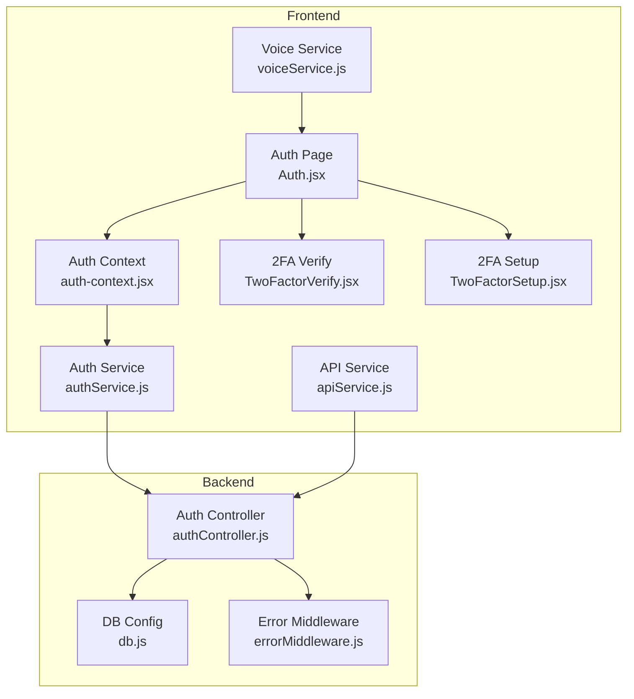
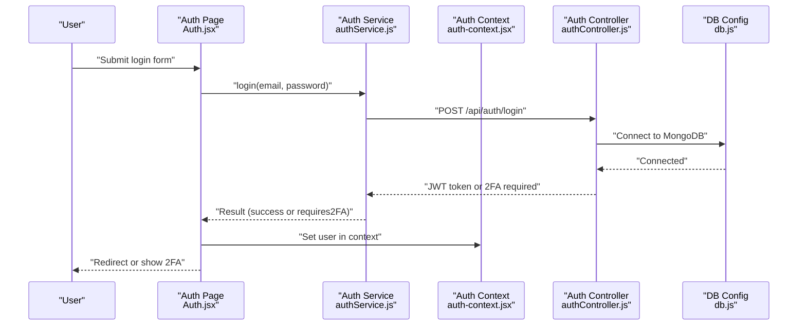
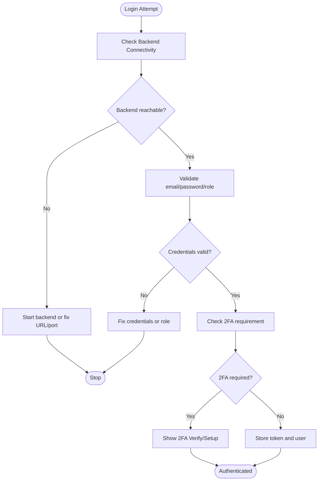
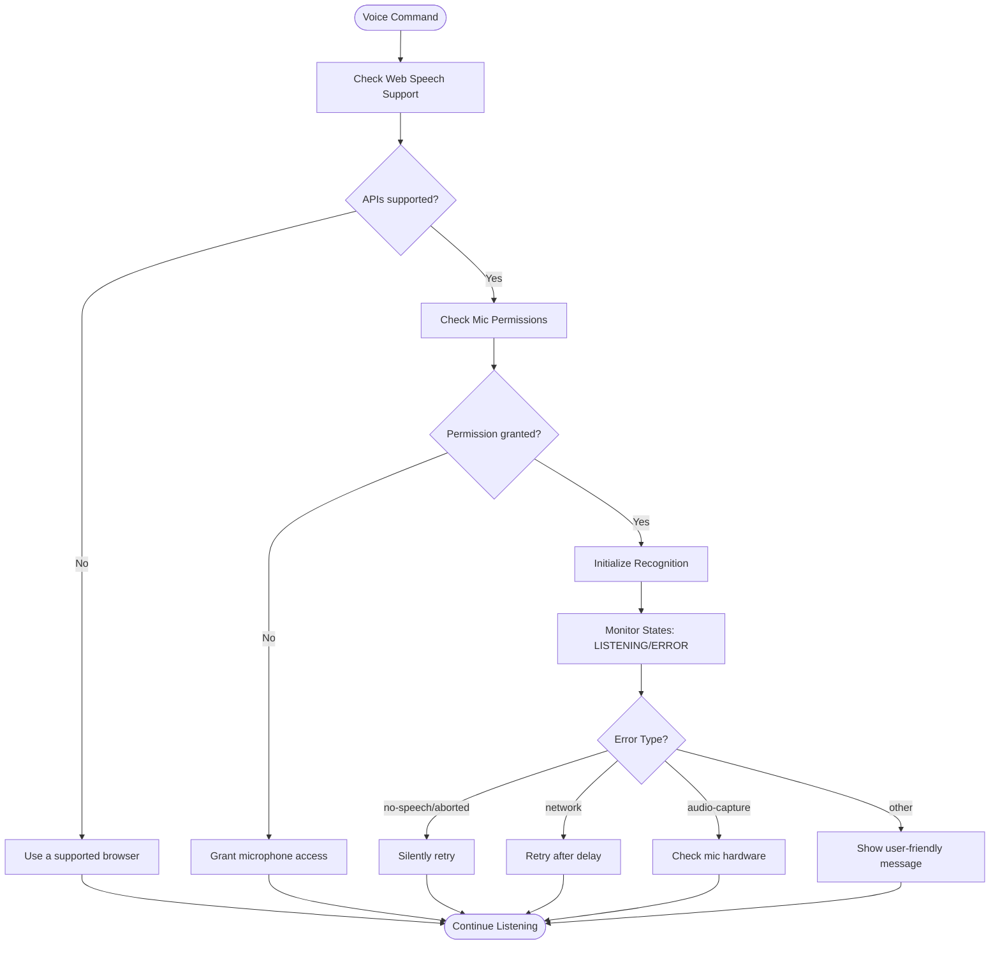
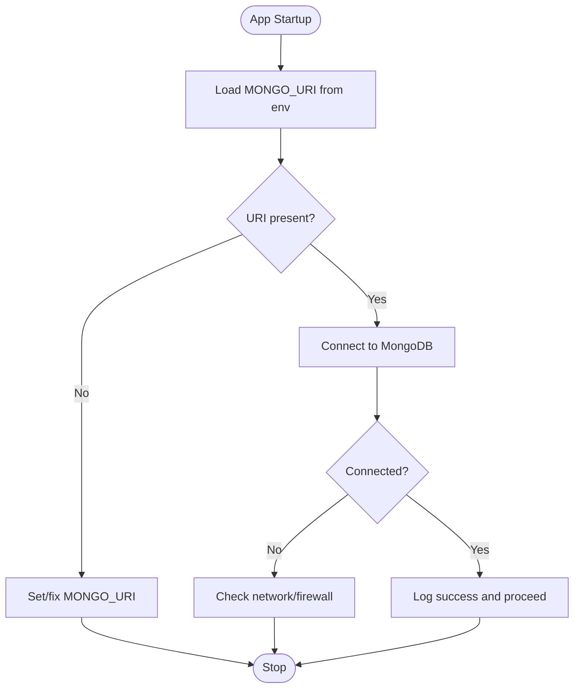

# Troubleshooting & FAQ

<cite>
**Referenced Files in This Document**
- [authService.js](file://Frontend/src/services/authService.js)
- [auth-context.jsx](file://Frontend/src/context/auth-context.jsx)
- [Auth.jsx](file://Frontend/src/pages/Auth.jsx)
- [TwoFactorVerify.jsx](file://Frontend/src/components/security/TwoFactorVerify.jsx)
- [TwoFactorSetup.jsx](file://Frontend/src/components/security/TwoFactorSetup.jsx)
- [db.js](file://backend/src/config/db.js)
- [errorMiddleware.js](file://backend/src/middleware/errorMiddleware.js)
- [authController.js](file://backend/src/controllers/authController.js)
- [voiceService.js](file://Frontend/src/services/voiceService.js)
- [apiService.js](file://Frontend/src/services/apiService.js)
- [package.json (Frontend)](file://Frontend/package.json)
- [package.json (Backend)](file://backend/package.json)
</cite>

## Table of Contents
1. [Introduction](#introduction)
2. [Project Structure](#project-structure)
3. [Core Components](#core-components)
4. [Architecture Overview](#architecture-overview)
5. [Detailed Component Analysis](#detailed-component-analysis)
6. [Dependency Analysis](#dependency-analysis)
7. [Performance Considerations](#performance-considerations)
8. [Troubleshooting Guide](#troubleshooting-guide)
9. [Conclusion](#conclusion)
10. [Appendices](#appendices)

## Introduction
This document provides comprehensive troubleshooting and FAQ guidance for the Smart City Grievance Redressal System. It focuses on diagnosing and resolving common issues around authentication, voice recognition, database connectivity, and performance. It also covers error handling strategies, debugging techniques, deployment pitfalls, environment configuration, browser compatibility, and monitoring/logging approaches. The goal is to help both technical and non-technical users resolve issues quickly and confidently.

## Project Structure
The system comprises:
- Frontend (React/Vite): Authentication, 2FA, voice services, analytics, and UI components.
- Backend (Node/Express/MongoDB): Authentication, 2FA, grievance management, analytics, and admin APIs.
- Supabase-related frontend integration files under the Frontend directory.

**Diagram sources**
- [authService.js:1-99](file://Frontend/src/services/authService.js#L1-L99)
- [auth-context.jsx:1-143](file://Frontend/src/context/auth-context.jsx#L1-L143)
- [Auth.jsx:1-443](file://Frontend/src/pages/Auth.jsx#L1-L443)
- [TwoFactorVerify.jsx:1-200](file://Frontend/src/components/security/TwoFactorVerify.jsx#L1-L200)
- [TwoFactorSetup.jsx:1-395](file://Frontend/src/components/security/TwoFactorSetup.jsx#L1-L395)
- [voiceService.js:1-778](file://Frontend/src/services/voiceService.js#L1-L778)
- [apiService.js:1-539](file://Frontend/src/services/apiService.js#L1-L539)
- [db.js:1-18](file://backend/src/config/db.js#L1-L18)
- [errorMiddleware.js:1-21](file://backend/src/middleware/errorMiddleware.js#L1-L21)
- [authController.js:1-237](file://backend/src/controllers/authController.js#L1-L237)

**Section sources**
- [authService.js:1-99](file://Frontend/src/services/authService.js#L1-L99)
- [auth-context.jsx:1-143](file://Frontend/src/context/auth-context.jsx#L1-L143)
- [Auth.jsx:1-443](file://Frontend/src/pages/Auth.jsx#L1-L443)
- [TwoFactorVerify.jsx:1-200](file://Frontend/src/components/security/TwoFactorVerify.jsx#L1-L200)
- [TwoFactorSetup.jsx:1-395](file://Frontend/src/components/security/TwoFactorSetup.jsx#L1-L395)
- [voiceService.js:1-778](file://Frontend/src/services/voiceService.js#L1-L778)
- [apiService.js:1-539](file://Frontend/src/services/apiService.js#L1-L539)
- [db.js:1-18](file://backend/src/config/db.js#L1-L18)
- [errorMiddleware.js:1-21](file://backend/src/middleware/errorMiddleware.js#L1-L21)
- [authController.js:1-237](file://backend/src/controllers/authController.js#L1-L237)

## Core Components
- Authentication Service: Manages registration, login, token storage, and 2FA integration.
- Auth Context: Centralizes authentication state, user roles, and synchronization with local storage.
- 2FA Components: Setup and verification flows for mandatory 2FA on user accounts.
- Voice Service: Speech recognition and TTS with language support, error handling, and retry logic.
- API Service: Unified HTTP client with bearer tokens and centralized error logging.
- Backend DB and Error Middleware: Environment-driven DB connection and standardized error responses.

Key responsibilities:
- Frontend: User session lifecycle, voice UX, API communication, and 2FA UX.
- Backend: Role-based login, 2FA gating, DB connectivity, and robust error reporting.

**Section sources**
- [authService.js:1-99](file://Frontend/src/services/authService.js#L1-L99)
- [auth-context.jsx:1-143](file://Frontend/src/context/auth-context.jsx#L1-L143)
- [TwoFactorVerify.jsx:1-200](file://Frontend/src/components/security/TwoFactorVerify.jsx#L1-L200)
- [TwoFactorSetup.jsx:1-395](file://Frontend/src/components/security/TwoFactorSetup.jsx#L1-L395)
- [voiceService.js:1-778](file://Frontend/src/services/voiceService.js#L1-L778)
- [apiService.js:1-539](file://Frontend/src/services/apiService.js#L1-L539)
- [db.js:1-18](file://backend/src/config/db.js#L1-L18)
- [errorMiddleware.js:1-21](file://backend/src/middleware/errorMiddleware.js#L1-L21)
- [authController.js:1-237](file://backend/src/controllers/authController.js#L1-L237)

## Architecture Overview
High-level flow for authentication and voice features:

**Diagram sources**
- [Auth.jsx:92-190](file://Frontend/src/pages/Auth.jsx#L92-L190)
- [authService.js:37-80](file://Frontend/src/services/authService.js#L37-L80)
- [auth-context.jsx:29-78](file://Frontend/src/context/auth-context.jsx#L29-L78)
- [authController.js:90-237](file://backend/src/controllers/authController.js#L90-L237)
- [db.js:3-15](file://backend/src/config/db.js#L3-L15)

## Detailed Component Analysis

### Authentication Troubleshooting
Common issues:
- Backend not running or unreachable
- Invalid credentials or disabled account
- Role mismatch (admin vs user)
- 2FA required or pending setup
- Token missing/expired

Diagnostic steps:
- Confirm backend is running on the expected port.
- Verify credentials and account status.
- Check role selection matches intended portal.
- Handle 2FA prompts and ensure backup codes are available.
- Inspect local storage for authToken and user.

**Diagram sources**
- [Auth.jsx:102-135](file://Frontend/src/pages/Auth.jsx#L102-L135)
- [authService.js:37-80](file://Frontend/src/services/authService.js#L37-L80)
- [authController.js:90-237](file://backend/src/controllers/authController.js#L90-L237)
- [TwoFactorVerify.jsx:21-100](file://Frontend/src/components/security/TwoFactorVerify.jsx#L21-L100)
- [TwoFactorSetup.jsx:32-75](file://Frontend/src/components/security/TwoFactorSetup.jsx#L32-L75)

**Section sources**
- [authService.js:1-99](file://Frontend/src/services/authService.js#L1-L99)
- [auth-context.jsx:1-143](file://Frontend/src/context/auth-context.jsx#L1-L143)
- [Auth.jsx:1-443](file://Frontend/src/pages/Auth.jsx#L1-L443)
- [TwoFactorVerify.jsx:1-200](file://Frontend/src/components/security/TwoFactorVerify.jsx#L1-L200)
- [TwoFactorSetup.jsx:1-395](file://Frontend/src/components/security/TwoFactorSetup.jsx#L1-L395)
- [authController.js:1-237](file://backend/src/controllers/authController.js#L1-L237)

### Voice Recognition Troubleshooting
Common issues:
- Browser lacks Web Speech API support
- Microphone permissions denied
- No speech detected or frequent timeouts
- Language not supported or misconfigured
- Network errors causing retries

Diagnostic steps:
- Verify browser supports SpeechRecognition and speechSynthesis.
- Allow microphone access and test with another app.
- Switch languages to supported ones and confirm preference persistence.
- Monitor recognition state transitions and error logs.
- Ensure backend voice endpoints are reachable if using server-side synthesis.

**Diagram sources**
- [voiceService.js:51-61](file://Frontend/src/services/voiceService.js#L51-L61)
- [voiceService.js:379-508](file://Frontend/src/services/voiceService.js#L379-L508)

**Section sources**
- [voiceService.js:1-778](file://Frontend/src/services/voiceService.js#L1-L778)

### Database Connectivity Troubleshooting
Common issues:
- Missing MONGO_URI environment variable
- Incorrect URI format or credentials
- Network connectivity or firewall blocking
- MongoDB server down or replica set issues

Diagnostic steps:
- Confirm MONGO_URI is present and correct.
- Test connectivity via mongo CLI or Compass.
- Review backend logs for connection errors.
- Ensure NODE_ENV and secrets are properly loaded.

**Diagram sources**
- [db.js:4-14](file://backend/src/config/db.js#L4-L14)

**Section sources**
- [db.js:1-18](file://backend/src/config/db.js#L1-L18)

### Error Handling and Logging Strategies
- Frontend: Centralized API and auth services log errors and surface user-friendly messages.
- Backend: Standardized 404/not found and generic error handlers with optional stack traces.

Recommendations:
- Capture and forward error details to a logging service in production.
- Use structured logs with correlation IDs for cross-service tracing.
- Avoid exposing sensitive stack traces in production.

**Section sources**
- [errorMiddleware.js:1-21](file://backend/src/middleware/errorMiddleware.js#L1-L21)
- [apiService.js:18-31](file://Frontend/src/services/apiService.js#L18-L31)
- [authService.js:31-34](file://Frontend/src/services/authService.js#L31-L34)

## Dependency Analysis
External dependencies relevant to troubleshooting:
- Frontend: React, Radix UI, Tailwind, Supabase JS, QR code, Framer Motion, Recharts, qrcode.react.
- Backend: Express, Mongoose, bcrypt, jsonwebtoken, morgan, nodemailer, qrcode, speakeasy, twilio.

Potential issues:
- Version mismatches between libraries and browser APIs.
- Missing polyfills for older browsers.
- CORS misconfiguration if integrating with external services.

**Section sources**
- [package.json (Frontend):1-92](file://Frontend/package.json#L1-L92)
- [package.json (Backend):1-28](file://backend/package.json#L1-L28)

## Performance Considerations
- Voice recognition: Keep interimResults disabled for stability; enable auto-restart with bounded retries to avoid resource exhaustion.
- API calls: Debounce repeated requests, cache non-sensitive data, and implement exponential backoff for transient failures.
- Rendering: Use memoization and lazy loading for heavy components.
- Database: Ensure proper indexing on auth and grievance collections; monitor slow queries.

[No sources needed since this section provides general guidance]

## Troubleshooting Guide

### Authentication Problems
Symptoms:
- Cannot connect to server
- Invalid credentials or disabled account
- Role mismatch leading to access denial
- 2FA modal keeps appearing

Resolutions:
- Ensure backend is running and reachable at the configured URL/port.
- Verify account is active and credentials match the selected role.
- Use the correct login portal (user/admin/ward admin).
- Complete 2FA setup or verification; keep backup codes safe.

**Section sources**
- [Auth.jsx:121-131](file://Frontend/src/pages/Auth.jsx#L121-L131)
- [authController.js:128-151](file://backend/src/controllers/authController.js#L128-L151)
- [TwoFactorVerify.jsx:53-80](file://Frontend/src/components/security/TwoFactorVerify.jsx#L53-L80)
- [TwoFactorSetup.jsx:103-116](file://Frontend/src/components/security/TwoFactorSetup.jsx#L103-L116)

### Voice Recognition Issues
Symptoms:
- “Speech not supported” warnings
- Microphone access denied
- Frequent “no speech” or network errors
- Incorrect language recognition

Resolutions:
- Use a supported browser (Chrome, Edge, Safari).
- Allow microphone access when prompted.
- Reduce ambient noise and speak clearly.
- Select a supported language; persist preference locally.
- If network errors occur, retry automatically; avoid manual restart loops.

**Section sources**
- [voiceService.js:51-61](file://Frontend/src/services/voiceService.js#L51-L61)
- [voiceService.js:468-508](file://Frontend/src/services/voiceService.js#L468-L508)
- [voiceService.js:692-702](file://Frontend/src/services/voiceService.js#L692-L702)

### Database Connectivity Problems
Symptoms:
- Application fails to start or crashes on boot
- Authentication or CRUD endpoints fail immediately

Resolutions:
- Set MONGO_URI in environment variables.
- Validate URI format and credentials.
- Test connectivity externally; check firewall and network policies.
- Review backend logs for connection errors.

**Section sources**
- [db.js:6-8](file://backend/src/config/db.js#L6-L8)
- [db.js:12-14](file://backend/src/config/db.js#L12-L14)

### Performance Optimization
Symptoms:
- Slow login or navigation
- Voice commands lag or drop frequently
- API calls timeout intermittently

Resolutions:
- Optimize rendering and reduce unnecessary re-renders.
- Debounce voice input and limit API polling frequency.
- Implement caching for static or slowly changing data.
- Monitor backend response times and database query performance.

[No sources needed since this section provides general guidance]

### Deployment and Environment Configuration
Common issues:
- Port conflicts or incorrect host binding
- Missing environment variables (JWT_SECRET, MONGO_URI)
- CORS errors when frontend and backend differ in origin/port
- Production secrets not loaded

Resolutions:
- Use environment files and CI/CD secret management.
- Bind backend to 0.0.0.0 for containerized deployments.
- Configure CORS whitelist for trusted origins.
- Validate environment-specific configurations before rollout.

[No sources needed since this section provides general guidance]

### Browser Compatibility Concerns
- SpeechRecognition and speechSynthesis are not universally supported.
- Some browsers require HTTPS for microphone access.
- Certain mobile browsers restrict background audio or autoplay.

Resolutions:
- Detect feature support and degrade gracefully.
- Prompt users to switch to supported browsers.
- Enforce HTTPS in production environments.

**Section sources**
- [voiceService.js:51-61](file://Frontend/src/services/voiceService.js#L51-L61)

### Troubleshooting Tools and Monitoring
- Frontend:
  - Browser devtools console/network for API and voice errors.
  - Local storage inspection for authToken and user.
- Backend:
  - Morgan logs for request traces.
  - Error middleware for unified error responses.
- Observability:
  - Integrate structured logging and metrics.
  - Use APM tools for latency and error rates.

**Section sources**
- [errorMiddleware.js:8-18](file://backend/src/middleware/errorMiddleware.js#L8-L18)
- [apiService.js:18-31](file://Frontend/src/services/apiService.js#L18-L31)

### Frequently Asked Questions

Q1: Why am I stuck in the 2FA step?
- Ensure you enter the correct 6-digit code from your authenticator app or the 8-digit backup code. If you lost access, use a backup code and then set up 2FA again.

Q2: How do I fix “Network error. Please check if backend is running.”?
- Confirm the backend is started and reachable at the configured URL/port. Check firewall and network connectivity.

Q3: Why does my voice command not work?
- Verify browser support for Web Speech APIs, grant microphone access, and try supported languages. Reduce background noise and speak clearly.

Q4: How do I reset my 2FA if I lost my authenticator?
- Use a backup code to log in, then reconfigure 2FA. Keep backup codes in a secure place.

Q5: What ports and URLs should I use?
- Frontend runs on localhost port as configured in the build tool; backend listens on the port specified in scripts. Ensure they match your environment.

Q6: How do I enable push notifications?
- Allow browser permission when prompted; the app requests permission automatically if supported.

Q7: Are there known unsupported browsers?
- Some browsers restrict microphone access or lack Web Speech API support. Use Chrome, Edge, or Safari for best results.

Q8: How do I check if the database is connected?
- Look for a “MongoDB connected” log on backend startup. If absent, verify MONGO_URI and network access.

Q9: How do I report a bug?
- Capture console logs, describe your browser/device, and include reproduction steps. Open an issue with the logs attached.

Q10: Can I run this locally without Docker?
- Yes, install dependencies for both frontend and backend, configure environment variables, and start both services.

**Section sources**
- [Auth.jsx:141-152](file://Frontend/src/pages/Auth.jsx#L141-L152)
- [TwoFactorVerify.jsx:189-192](file://Frontend/src/components/security/TwoFactorVerify.jsx#L189-L192)
- [voiceService.js:51-61](file://Frontend/src/services/voiceService.js#L51-L61)
- [db.js:14-14](file://backend/src/config/db.js#L14-L14)

## Conclusion
This guide consolidates actionable steps to diagnose and resolve common issues across authentication, voice recognition, database connectivity, and performance. By following the troubleshooting workflows, leveraging built-in logging, and applying the recommended best practices, most problems can be identified and resolved efficiently. For persistent issues, collect logs and environment details to escalate support.

[No sources needed since this section summarizes without analyzing specific files]

## Appendices

### Quick Checklist
- Backend running and reachable
- MONGO_URI set and correct
- JWT_SECRET configured
- Microphone permissions granted
- Supported browser and HTTPS
- 2FA codes available (backup)
- Logs reviewed in devtools and backend

[No sources needed since this section provides general guidance]