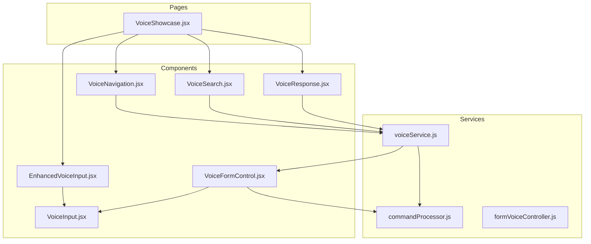
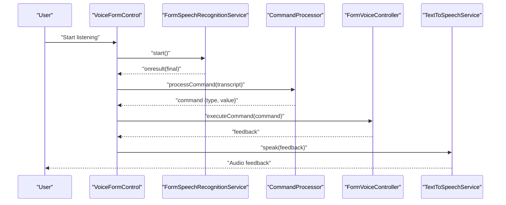
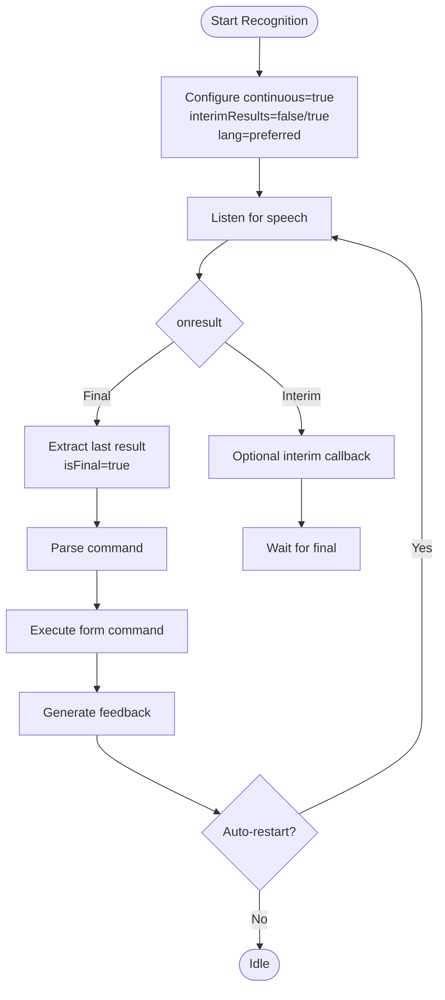
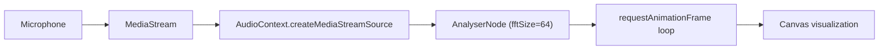
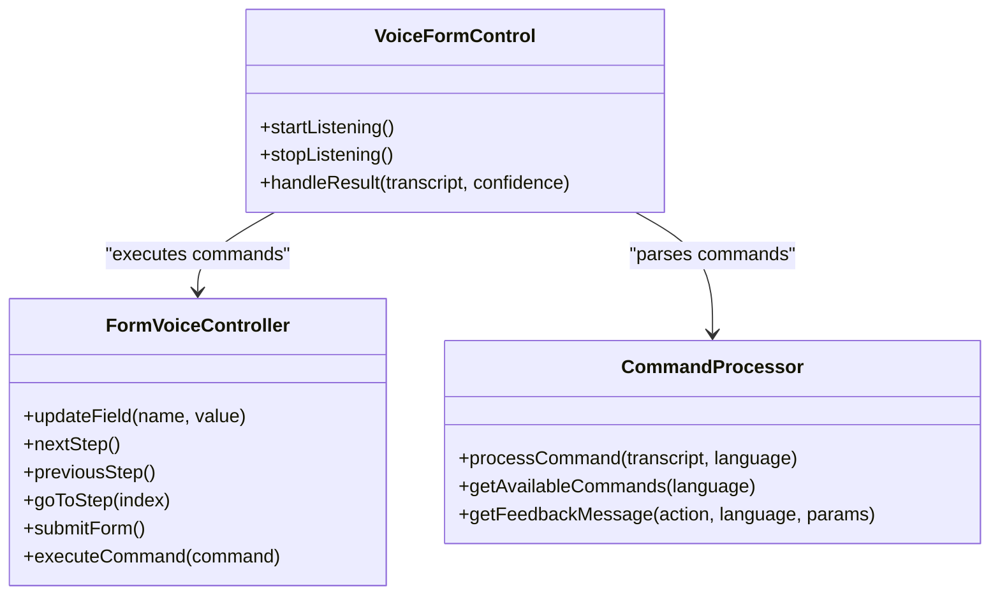
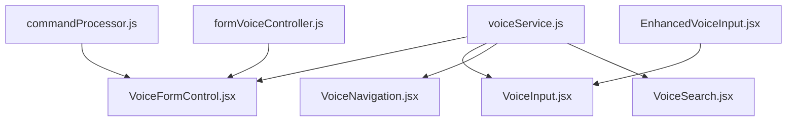

# Speech Processing and Recognition

<cite>
**Referenced Files in This Document**
- [voiceService.js](file://Frontend/src/services/voiceService.js)
- [VoiceInput.jsx](file://Frontend/src/components/VoiceInput.jsx)
- [EnhancedVoiceInput.jsx](file://Frontend/src/components/voice/EnhancedVoiceInput.jsx)
- [VoiceFormControl.jsx](file://Frontend/src/components/voice/VoiceFormControl.jsx)
- [VoiceNavigation.jsx](file://Frontend/src/components/voice/VoiceNavigation.jsx)
- [VoiceSearch.jsx](file://Frontend/src/components/voice/VoiceSearch.jsx)
- [VoiceResponse.jsx](file://Frontend/src/components/voice/VoiceResponse.jsx)
- [VoiceShowcase.jsx](file://Frontend/src/pages/VoiceShowcase.jsx)
- [formVoiceController.js](file://Frontend/src/services/formVoiceController.js)
- [commandProcessor.js](file://Frontend/src/services/commandProcessor.js)
</cite>

## Table of Contents
1. [Introduction](#introduction)
2. [Project Structure](#project-structure)
3. [Core Components](#core-components)
4. [Architecture Overview](#architecture-overview)
5. [Detailed Component Analysis](#detailed-component-analysis)
6. [Dependency Analysis](#dependency-analysis)
7. [Performance Considerations](#performance-considerations)
8. [Troubleshooting Guide](#troubleshooting-guide)
9. [Conclusion](#conclusion)

## Introduction
This document explains the speech processing and recognition pipeline implemented in the frontend. It covers Web Speech API integration for continuous recognition, interim versus final transcript handling, multilingual configuration, audio analysis using the Web Audio API, and robust error handling. It also documents the form-filling voice control system, including command parsing, state transitions, and accessibility features.

## Project Structure
The speech pipeline spans services, components, and pages:
- Services: centralized voice recognition, text-to-speech, command parsing, and form voice controller
- Components: reusable UI elements for voice input, navigation, search, and response
- Pages: showcase page demonstrating all voice features

**Diagram sources**
- [voiceService.js](file://Frontend/src/services/voiceService.js)
- [commandProcessor.js](file://Frontend/src/services/commandProcessor.js)
- [formVoiceController.js](file://Frontend/src/services/formVoiceController.js)
- [VoiceInput.jsx](file://Frontend/src/components/VoiceInput.jsx)
- [EnhancedVoiceInput.jsx](file://Frontend/src/components/voice/EnhancedVoiceInput.jsx)
- [VoiceFormControl.jsx](file://Frontend/src/components/voice/VoiceFormControl.jsx)
- [VoiceNavigation.jsx](file://Frontend/src/components/voice/VoiceNavigation.jsx)
- [VoiceSearch.jsx](file://Frontend/src/components/voice/VoiceSearch.jsx)
- [VoiceResponse.jsx](file://Frontend/src/components/voice/VoiceResponse.jsx)
- [VoiceShowcase.jsx](file://Frontend/src/pages/VoiceShowcase.jsx)

**Section sources**
- [VoiceShowcase.jsx](file://Frontend/src/pages/VoiceShowcase.jsx)
- [voiceService.js](file://Frontend/src/services/voiceService.js)

## Core Components
- Voice service: feature detection, language preferences, text-to-speech, and form speech recognition
- Voice input: continuous recognition with interim/final transcripts and real-time waveform visualization
- Voice form control: multilingual command processing, form state management, and feedback
- Voice navigation and search: single-sentence recognition for navigation and search
- Voice response: text-to-speech announcements for status updates

**Section sources**
- [voiceService.js](file://Frontend/src/services/voiceService.js)
- [VoiceInput.jsx](file://Frontend/src/components/VoiceInput.jsx)
- [VoiceFormControl.jsx](file://Frontend/src/components/voice/VoiceFormControl.jsx)
- [VoiceNavigation.jsx](file://Frontend/src/components/voice/VoiceNavigation.jsx)
- [VoiceSearch.jsx](file://Frontend/src/components/voice/VoiceSearch.jsx)
- [VoiceResponse.jsx](file://Frontend/src/components/voice/VoiceResponse.jsx)

## Architecture Overview
The system integrates Web Speech API for recognition and speech synthesis for TTS. The VoiceFormControl orchestrates continuous recognition, processes final transcripts, and executes form commands. The command processor normalizes and parses speech into structured intents. The audio analyzer renders a real-time waveform during listening.

**Diagram sources**
- [VoiceFormControl.jsx](file://Frontend/src/components/voice/VoiceFormControl.jsx)
- [voiceService.js](file://Frontend/src/services/voiceService.js)
- [commandProcessor.js](file://Frontend/src/services/commandProcessor.js)
- [formVoiceController.js](file://Frontend/src/services/formVoiceController.js)

## Detailed Component Analysis

### Web Speech API Integration and Continuous Recognition
- Feature detection checks for SpeechRecognition and webkitSpeechRecognition availability.
- Continuous recognition is configured with continuous=true and interimResults configurable.
- Final transcripts are extracted from the last result in the event, ensuring only completed utterances are processed.
- Auto-restart mechanism recovers from transient errors and maintains session continuity.

**Diagram sources**
- [voiceService.js](file://Frontend/src/services/voiceService.js)
- [VoiceFormControl.jsx](file://Frontend/src/components/voice/VoiceFormControl.jsx)

**Section sources**
- [voiceService.js](file://Frontend/src/services/voiceService.js)
- [VoiceFormControl.jsx](file://Frontend/src/components/voice/VoiceFormControl.jsx)

### Interim vs Final Transcript Handling
- Interim transcripts are captured when interimResults=true and shown to the user for immediate feedback.
- Final transcripts are processed for command execution, ensuring accuracy and completeness.
- The system distinguishes between recoverable errors (no-speech, aborted) and non-recoverable errors (not-allowed, audio-capture, network).

**Section sources**
- [VoiceInput.jsx](file://Frontend/src/components/VoiceInput.jsx)
- [VoiceFormControl.jsx](file://Frontend/src/components/voice/VoiceFormControl.jsx)
- [voiceService.js](file://Frontend/src/services/voiceService.js)

### Speech Recognition Configuration
- Language settings: preferred language is persisted and applied to recognition instances.
- Modes: continuous vs single-sentence modes are supported depending on the component.
- Result processing: confidence scoring and normalization improve robustness.

**Section sources**
- [voiceService.js](file://Frontend/src/services/voiceService.js)
- [VoiceNavigation.jsx](file://Frontend/src/components/voice/VoiceNavigation.jsx)
- [VoiceSearch.jsx](file://Frontend/src/components/voice/VoiceSearch.jsx)

### Audio Analysis with Web Audio API
- Real-time frequency domain visualization uses AnalyserNode with FFT size tuned for responsiveness.
- Canvas-based waveform rendering with gradient bars provides visual feedback during listening.
- Automatic cleanup stops microphone tracks and closes AudioContext to prevent resource leaks.

**Diagram sources**
- [VoiceInput.jsx](file://Frontend/src/components/VoiceInput.jsx)
- [VoiceFormControl.jsx](file://Frontend/src/components/voice/VoiceFormControl.jsx)

**Section sources**
- [VoiceInput.jsx](file://Frontend/src/components/VoiceInput.jsx)
- [VoiceFormControl.jsx](file://Frontend/src/components/voice/VoiceFormControl.jsx)

### Command Processing and Form Voice Controller
- Multi-language command patterns enable filling form fields, navigating steps, and submitting forms.
- Flexible matching prioritizes keyword-based detection for robustness, falling back to regex patterns.
- The form voice controller validates fields, manages step transitions, and generates contextual feedback.

**Diagram sources**
- [commandProcessor.js](file://Frontend/src/services/commandProcessor.js)
- [formVoiceController.js](file://Frontend/src/services/formVoiceController.js)
- [VoiceFormControl.jsx](file://Frontend/src/components/voice/VoiceFormControl.jsx)

**Section sources**
- [commandProcessor.js](file://Frontend/src/services/commandProcessor.js)
- [formVoiceController.js](file://Frontend/src/services/formVoiceController.js)
- [VoiceFormControl.jsx](file://Frontend/src/components/voice/VoiceFormControl.jsx)

### Text-to-Speech and Accessibility
- Text-to-speech service supports language-specific voices, rate/pitch/volume control, and interruption handling.
- Voice response toggles enable/disable announcements for complaint status updates.
- Navigation and search components provide audio feedback and error announcements.

**Section sources**
- [voiceService.js](file://Frontend/src/services/voiceService.js)
- [VoiceResponse.jsx](file://Frontend/src/components/voice/VoiceResponse.jsx)
- [VoiceNavigation.jsx](file://Frontend/src/components/voice/VoiceNavigation.jsx)
- [VoiceSearch.jsx](file://Frontend/src/components/voice/VoiceSearch.jsx)

### Error Handling Strategies
- Recoverable errors (no-speech, aborted) trigger silent recovery and auto-restart.
- Non-recoverable errors (not-allowed, audio-capture, network) surface user-visible errors and pause listening.
- Timeout handling: silence detection and auto-stop prevent indefinite listening.
- Automatic cleanup: recognition stop, audio context close, and media track termination.

**Section sources**
- [voiceService.js](file://Frontend/src/services/voiceService.js)
- [VoiceFormControl.jsx](file://Frontend/src/components/voice/VoiceFormControl.jsx)
- [VoiceInput.jsx](file://Frontend/src/components/VoiceInput.jsx)

### Examples and Patterns
- Processing partial transcripts: interim results are shown immediately while final results are executed.
- Handling interruptions: auto-restart and state transitions maintain continuity.
- Retry mechanisms: bounded auto-restart with exponential backoff-like delays.

**Section sources**
- [VoiceFormControl.jsx](file://Frontend/src/components/voice/VoiceFormControl.jsx)
- [voiceService.js](file://Frontend/src/services/voiceService.js)

### Browser Compatibility and Feature Detection
- Dual support for SpeechRecognition and webkitSpeechRecognition ensures broader browser coverage.
- Graceful degradation: components fail safely when unsupported, with user feedback.
- Feature flags guide UI behavior and messaging.

**Section sources**
- [voiceService.js](file://Frontend/src/services/voiceService.js)
- [VoiceShowcase.jsx](file://Frontend/src/pages/VoiceShowcase.jsx)

## Dependency Analysis
The voice pipeline exhibits low coupling and high cohesion:
- VoiceFormControl depends on FormSpeechRecognitionService, CommandProcessor, and FormVoiceController.
- VoiceInput and VoiceNavigation demonstrate independent usage of the voice service.
- EnhancedVoiceInput wraps VoiceInput without modifying core behavior.

**Diagram sources**
- [voiceService.js](file://Frontend/src/services/voiceService.js)
- [VoiceFormControl.jsx](file://Frontend/src/components/voice/VoiceFormControl.jsx)
- [VoiceInput.jsx](file://Frontend/src/components/VoiceInput.jsx)
- [VoiceNavigation.jsx](file://Frontend/src/components/voice/VoiceNavigation.jsx)
- [VoiceSearch.jsx](file://Frontend/src/components/voice/VoiceSearch.jsx)
- [commandProcessor.js](file://Frontend/src/services/commandProcessor.js)
- [formVoiceController.js](file://Frontend/src/services/formVoiceController.js)
- [EnhancedVoiceInput.jsx](file://Frontend/src/components/voice/EnhancedVoiceInput.jsx)

**Section sources**
- [voiceService.js](file://Frontend/src/services/voiceService.js)
- [VoiceFormControl.jsx](file://Frontend/src/components/voice/VoiceFormControl.jsx)
- [commandProcessor.js](file://Frontend/src/services/commandProcessor.js)
- [formVoiceController.js](file://Frontend/src/services/formVoiceController.js)
- [EnhancedVoiceInput.jsx](file://Frontend/src/components/voice/EnhancedVoiceInput.jsx)

## Performance Considerations
- Continuous recognition with interimResults=false reduces processing overhead by focusing on final results.
- Web Audio analyser fftSize=64 balances responsiveness and CPU usage.
- Auto-restart limits prevent excessive restart attempts; silence timeouts avoid unnecessary processing.
- Cleanup routines minimize memory and resource leaks.

## Troubleshooting Guide
Common issues and resolutions:
- Not allowed: prompt user to grant microphone permissions; surface actionable error messages.
- No speech: encourage retry and confirm environment conditions.
- Network errors: implement retry with backoff; inform user of temporary unavailability.
- Audio capture errors: verify device connectivity and permissions.
- Interruptions: rely on auto-restart and state transitions to resume seamlessly.

**Section sources**
- [voiceService.js](file://Frontend/src/services/voiceService.js)
- [VoiceFormControl.jsx](file://Frontend/src/components/voice/VoiceFormControl.jsx)
- [VoiceInput.jsx](file://Frontend/src/components/VoiceInput.jsx)

## Conclusion
The speech processing pipeline provides a robust, multilingual, and accessible voice interface. It leverages Web Speech API for recognition and synthesis, implements intelligent interim/final transcript handling, and offers comprehensive error management and cleanup. The modular design enables reuse across components and graceful fallbacks for diverse environments.