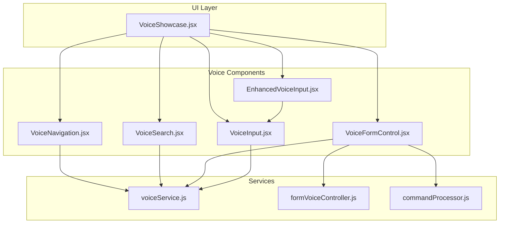
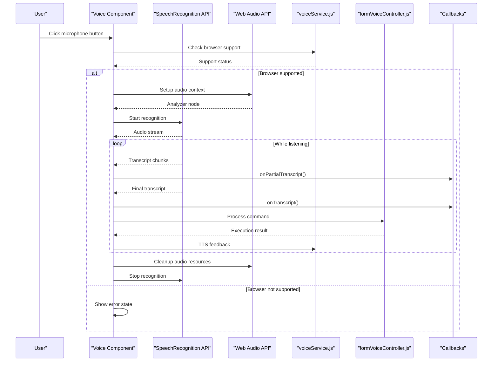
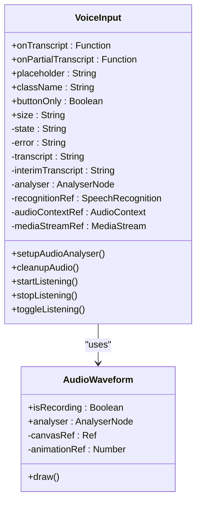
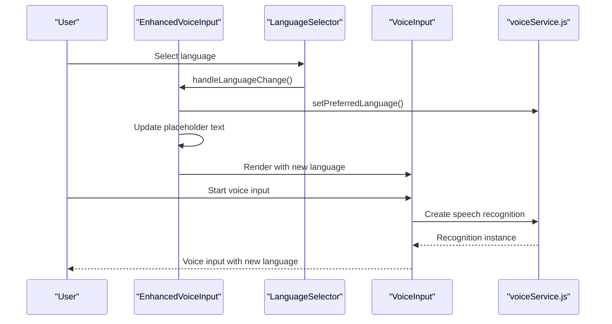
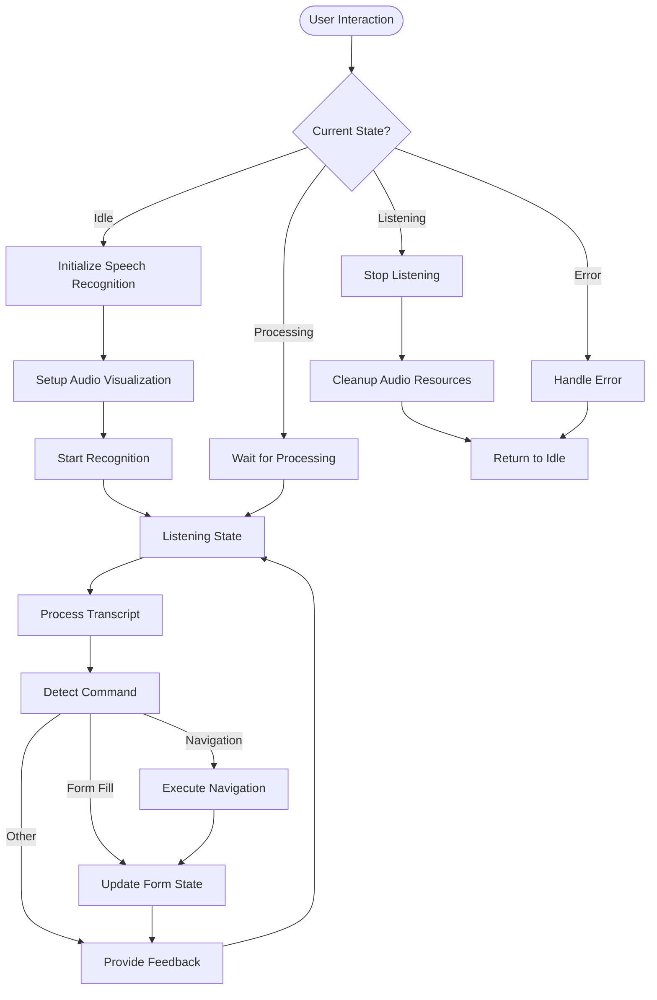
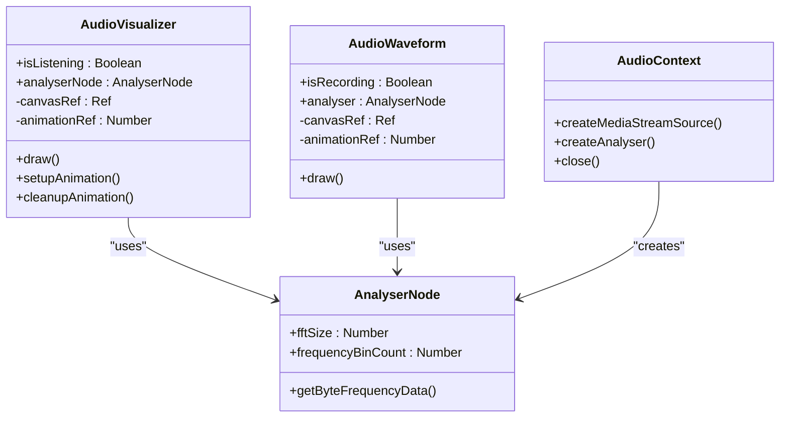
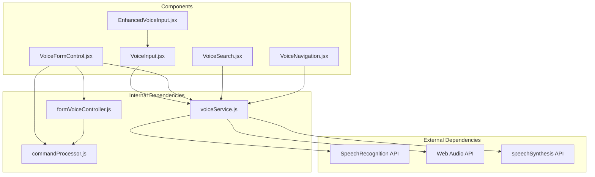

# Voice Input and Recording

<cite>
**Referenced Files in This Document**
- [VoiceInput.jsx](file://Frontend/src/components/VoiceInput.jsx)
- [EnhancedVoiceInput.jsx](file://Frontend/src/components/voice/EnhancedVoiceInput.jsx)
- [VoiceFormControl.jsx](file://Frontend/src/components/voice/VoiceFormControl.jsx)
- [VoiceSearch.jsx](file://Frontend/src/components/voice/VoiceSearch.jsx)
- [VoiceNavigation.jsx](file://Frontend/src/components/voice/VoiceNavigation.jsx)
- [voiceService.js](file://Frontend/src/services/voiceService.js)
- [formVoiceController.js](file://Frontend/src/services/formVoiceController.js)
- [commandProcessor.js](file://Frontend/src/services/commandProcessor.js)
- [VoiceShowcase.jsx](file://Frontend/src/pages/VoiceShowcase.jsx)
</cite>

## Table of Contents
1. [Introduction](#introduction)
2. [Project Structure](#project-structure)
3. [Core Components](#core-components)
4. [Architecture Overview](#architecture-overview)
5. [Detailed Component Analysis](#detailed-component-analysis)
6. [Dependency Analysis](#dependency-analysis)
7. [Performance Considerations](#performance-considerations)
8. [Troubleshooting Guide](#troubleshooting-guide)
9. [Conclusion](#conclusion)

## Introduction
This document provides comprehensive documentation for the voice input and recording system. It covers the SpeechRecognition API implementation, microphone access handling, audio context management, state management across different recording states (idle, listening, processing, error), error handling for microphone permissions and browser compatibility, and the audio analyzer setup for waveform visualization. It also documents component props including onTranscript and onPartialTranscript callbacks, buttonOnly mode for compact usage, and size variations. Implementation examples demonstrate proper microphone permission handling, fallback mechanisms for unsupported browsers, and cleanup procedures for audio resources. Accessibility considerations and user experience patterns for voice input activation are included.

## Project Structure
The voice system is organized around several key components and services:
- VoiceInput: Basic voice input with waveform visualization and state management
- EnhancedVoiceInput: Multilingual wrapper around VoiceInput with language selector
- VoiceFormControl: Advanced form control with continuous listening, audio visualization, and command processing
- VoiceSearch: Voice-enabled search with natural language processing
- VoiceNavigation: Voice-driven navigation with route mapping
- voiceService: Centralized speech recognition, text-to-speech, and state management
- formVoiceController: Form-specific command execution and validation
- commandProcessor: Intent detection and command parsing across multiple languages

**Diagram sources**
- [VoiceInput.jsx:131-458](file://Frontend/src/components/VoiceInput.jsx#L131-L458)
- [EnhancedVoiceInput.jsx:24-116](file://Frontend/src/components/voice/EnhancedVoiceInput.jsx#L24-L116)
- [VoiceFormControl.jsx:244-761](file://Frontend/src/components/voice/VoiceFormControl.jsx#L244-L761)
- [VoiceSearch.jsx:19-279](file://Frontend/src/components/voice/VoiceSearch.jsx#L19-L279)
- [VoiceNavigation.jsx:22-258](file://Frontend/src/components/voice/VoiceNavigation.jsx#L22-L258)
- [voiceService.js:1-778](file://Frontend/src/services/voiceService.js#L1-L778)
- [formVoiceController.js:117-571](file://Frontend/src/services/formVoiceController.js#L117-L571)
- [commandProcessor.js:1-1048](file://Frontend/src/services/commandProcessor.js#L1-L1048)
- [VoiceShowcase.jsx:1-407](file://Frontend/src/pages/VoiceShowcase.jsx#L1-L407)

**Section sources**
- [VoiceInput.jsx:1-458](file://Frontend/src/components/VoiceInput.jsx#L1-L458)
- [voiceService.js:1-778](file://Frontend/src/services/voiceService.js#L1-L778)

## Core Components
The voice system consists of several specialized components, each serving distinct purposes:

### VoiceInput Component
The foundational voice input component provides:
- SpeechRecognition API integration with continuous listening
- Real-time waveform visualization using Web Audio API
- State management for idle, listening, processing, and error states
- Microphone access handling with proper error reporting
- Support for buttonOnly mode and size variations
- Callbacks for final transcripts and partial transcripts

### EnhancedVoiceInput Component
Extends VoiceInput with multilingual capabilities:
- Language selector dropdown with flag icons
- Dynamic placeholder text based on selected language
- Preferred language persistence using localStorage
- Zero-regression design wrapping existing VoiceInput

### VoiceFormControl Component
Advanced form control with comprehensive voice interaction:
- Continuous listening mode for form filling
- Audio visualization with animated waveform display
- Command processing and form state management
- Multi-language support with TTS feedback
- Error handling and user feedback systems
- Compact mode for minimal UI footprint

### VoiceSearch Component
Natural language search with voice input:
- Standalone search interface with voice capability
- Real-time interim results during voice input
- Error handling and user feedback via toast notifications
- Integration with existing search functionality

### VoiceNavigation Component
Voice-driven application navigation:
- Route mapping for common navigation commands
- Text-to-speech feedback for navigation actions
- Error handling for unrecognized commands
- Integration with React Router for seamless navigation

**Section sources**
- [VoiceInput.jsx:131-458](file://Frontend/src/components/VoiceInput.jsx#L131-L458)
- [EnhancedVoiceInput.jsx:24-116](file://Frontend/src/components/voice/EnhancedVoiceInput.jsx#L24-L116)
- [VoiceFormControl.jsx:244-761](file://Frontend/src/components/voice/VoiceFormControl.jsx#L244-L761)
- [VoiceSearch.jsx:19-279](file://Frontend/src/components/voice/VoiceSearch.jsx#L19-L279)
- [VoiceNavigation.jsx:22-258](file://Frontend/src/components/voice/VoiceNavigation.jsx#L22-L258)

## Architecture Overview
The voice system follows a layered architecture with clear separation of concerns:

**Diagram sources**
- [VoiceInput.jsx:184-281](file://Frontend/src/components/VoiceInput.jsx#L184-L281)
- [voiceService.js:327-758](file://Frontend/src/services/voiceService.js#L327-L758)
- [formVoiceController.js:322-481](file://Frontend/src/services/formVoiceController.js#L322-L481)

The architecture ensures:
- **Separation of Concerns**: Each component handles specific responsibilities
- **Fallback Mechanisms**: Graceful degradation when features aren't available
- **Resource Management**: Proper cleanup of audio and speech recognition resources
- **State Management**: Consistent state handling across all components
- **Accessibility**: Comprehensive error handling and user feedback

## Detailed Component Analysis

### VoiceInput Component Analysis
The VoiceInput component serves as the foundation for voice input functionality:

**Diagram sources**
- [VoiceInput.jsx:131-458](file://Frontend/src/components/VoiceInput.jsx#L131-L458)
- [VoiceInput.jsx:14-84](file://Frontend/src/components/VoiceInput.jsx#L14-L84)

Key implementation patterns:
- **State Management**: Uses React state for tracking recording state, errors, and transcripts
- **Audio Context**: Creates AudioContext and analyser nodes for waveform visualization
- **Speech Recognition**: Implements SpeechRecognition API with proper error handling
- **Cleanup Procedures**: Ensures proper cleanup of audio resources and speech recognition instances

**Section sources**
- [VoiceInput.jsx:131-458](file://Frontend/src/components/VoiceInput.jsx#L131-L458)

### EnhancedVoiceInput Component Analysis
The EnhancedVoiceInput component wraps VoiceInput with multilingual capabilities:

**Diagram sources**
- [EnhancedVoiceInput.jsx:24-116](file://Frontend/src/components/voice/EnhancedVoiceInput.jsx#L24-L116)
- [voiceService.js:66-91](file://Frontend/src/services/voiceService.js#L66-L91)

**Section sources**
- [EnhancedVoiceInput.jsx:24-116](file://Frontend/src/components/voice/EnhancedVoiceInput.jsx#L24-L116)

### VoiceFormControl Component Analysis
The VoiceFormControl component provides the most comprehensive voice interaction:

**Diagram sources**
- [VoiceFormControl.jsx:434-478](file://Frontend/src/components/voice/VoiceFormControl.jsx#L434-L478)
- [VoiceFormControl.jsx:341-396](file://Frontend/src/components/voice/VoiceFormControl.jsx#L341-L396)

Key features:
- **Continuous Listening**: Maintains persistent listening session
- **Audio Visualization**: Real-time waveform display during recording
- **Command Processing**: Advanced command parsing and execution
- **Form Integration**: Seamless integration with form state management
- **Multi-language Support**: Complete language switching with TTS feedback

**Section sources**
- [VoiceFormControl.jsx:244-761](file://Frontend/src/components/voice/VoiceFormControl.jsx#L244-L761)

### Audio Visualization System
The audio visualization system provides real-time feedback during voice recording:

**Diagram sources**
- [VoiceFormControl.jsx:62-120](file://Frontend/src/components/voice/VoiceFormControl.jsx#L62-L120)
- [VoiceInput.jsx:14-84](file://Frontend/src/components/VoiceInput.jsx#L14-L84)

**Section sources**
- [VoiceFormControl.jsx:62-120](file://Frontend/src/components/voice/VoiceFormControl.jsx#L62-L120)
- [VoiceInput.jsx:14-84](file://Frontend/src/components/VoiceInput.jsx#L14-L84)

## Dependency Analysis
The voice system has well-defined dependencies between components and services:

**Diagram sources**
- [voiceService.js:1-778](file://Frontend/src/services/voiceService.js#L1-L778)
- [formVoiceController.js:1-571](file://Frontend/src/services/formVoiceController.js#L1-L571)
- [commandProcessor.js:1-1048](file://Frontend/src/services/commandProcessor.js#L1-L1048)

**Section sources**
- [voiceService.js:1-778](file://Frontend/src/services/voiceService.js#L1-L778)
- [formVoiceController.js:1-571](file://Frontend/src/services/formVoiceController.js#L1-L571)
- [commandProcessor.js:1-1048](file://Frontend/src/services/commandProcessor.js#L1-L1048)

## Performance Considerations
The voice system implements several performance optimizations:

### Resource Management
- **Audio Context Cleanup**: Proper closing of AudioContext instances
- **Media Stream Management**: Explicit stopping of media tracks
- **Animation Frame Cleanup**: Cancellation of animation frames
- **Speech Recognition Cleanup**: Proper stopping and destruction of recognition instances

### Memory Optimization
- **Lazy Initialization**: Audio contexts and analyzers created only when needed
- **Component Unmount Cleanup**: Comprehensive cleanup on component unmount
- **Event Listener Management**: Proper removal of event listeners

### Browser Compatibility
- **Feature Detection**: Runtime checking for Web Speech API support
- **Fallback Handling**: Graceful degradation when features aren't available
- **Cross-browser Support**: Compatibility with both SpeechRecognition and webkitSpeechRecognition

## Troubleshooting Guide

### Common Issues and Solutions

#### Microphone Permission Denied
**Symptoms**: Error message indicating microphone access denied
**Causes**: 
- User denied microphone access
- Browser security settings blocking microphone
- Existing microphone usage by other applications

**Solutions**:
- Request microphone access again
- Check browser permissions settings
- Close other applications using microphone
- Use HTTPS protocol (required for microphone access)

#### Browser Compatibility Issues
**Symptoms**: Voice features not working or showing "not supported"
**Causes**:
- Outdated browser version
- Unsupported browser
- Disabled Web Speech API

**Solutions**:
- Update to latest browser version
- Use Chrome, Edge, or Safari (Firefox has limited support)
- Enable Web Speech API in browser settings

#### Audio Context Issues
**Symptoms**: Audio visualization not working, distorted audio
**Causes**:
- Audio context not properly initialized
- Audio context suspended due to autoplay policies
- Multiple audio contexts conflicting

**Solutions**:
- Ensure proper initialization order
- Handle audio context suspension events
- Limit to single audio context per component

#### Recognition Errors
**Symptoms**: Frequent recognition failures or poor accuracy
**Causes**:
- Background noise interference
- Poor microphone quality
- Network connectivity issues
- Recognition timeout

**Solutions**:
- Reduce background noise
- Use external microphone if possible
- Check network connectivity
- Adjust recognition settings

**Section sources**
- [VoiceInput.jsx:231-255](file://Frontend/src/components/VoiceInput.jsx#L231-L255)
- [voiceService.js:468-508](file://Frontend/src/services/voiceService.js#L468-L508)

## Conclusion
The voice input and recording system provides a comprehensive, accessible, and user-friendly voice interaction experience. The system successfully integrates multiple voice technologies including SpeechRecognition, Web Audio API, and speechSynthesis to create a seamless voice-first interface. Key strengths include:

- **Robust Architecture**: Well-structured components with clear separation of concerns
- **Comprehensive Features**: From basic voice input to advanced form control and navigation
- **Accessibility Focus**: Proper error handling, visual indicators, and assistive technologies
- **Performance Optimization**: Efficient resource management and cleanup procedures
- **Browser Compatibility**: Graceful fallback mechanisms for unsupported environments

The system demonstrates zero-regression design principles, allowing for additive enhancements without modifying existing functionality. The multilingual support and TTS integration provide inclusive experiences for diverse user bases. Implementation examples throughout the codebase showcase best practices for microphone permission handling, error recovery, and resource cleanup.

Future enhancements could include support for additional languages, improved recognition accuracy through machine learning, and integration with cloud-based speech services for enhanced capabilities. The current architecture provides a solid foundation for such extensions while maintaining backward compatibility and performance standards.