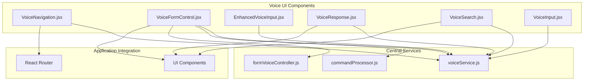
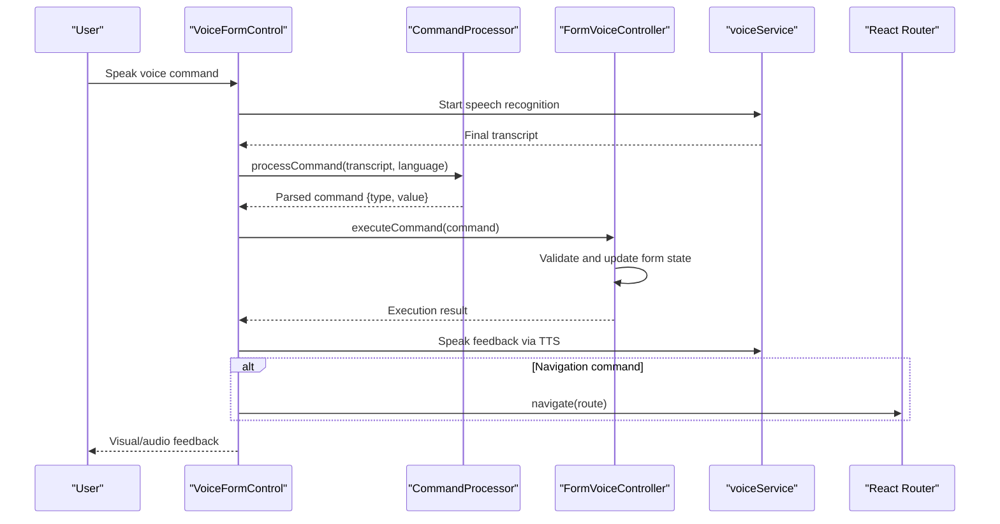
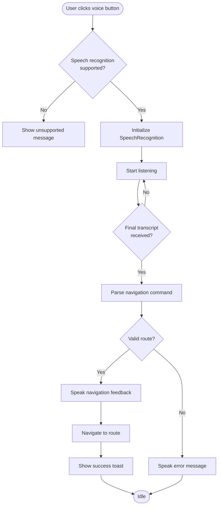
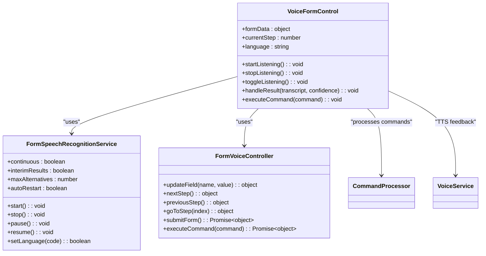
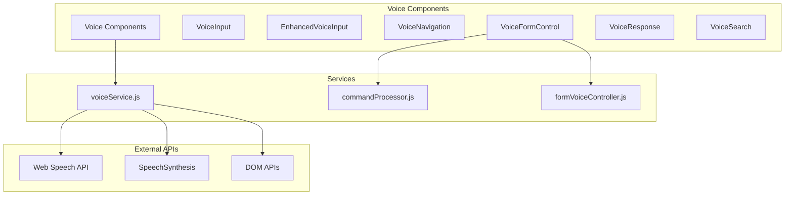

# Voice Navigation and Control

<cite>
**Referenced Files in This Document**
- [VoiceNavigation.jsx](file://Frontend/src/components/voice/VoiceNavigation.jsx)
- [VoiceFormControl.jsx](file://Frontend/src/components/voice/VoiceFormControl.jsx)
- [EnhancedVoiceInput.jsx](file://Frontend/src/components/voice/EnhancedVoiceInput.jsx)
- [VoiceResponse.jsx](file://Frontend/src/components/voice/VoiceResponse.jsx)
- [VoiceSearch.jsx](file://Frontend/src/components/voice/VoiceSearch.jsx)
- [VoiceInput.jsx](file://Frontend/src/components/VoiceInput.jsx)
- [voiceService.js](file://Frontend/src/services/voiceService.js)
- [commandProcessor.js](file://Frontend/src/services/commandProcessor.js)
- [formVoiceController.js](file://Frontend/src/services/formVoiceController.js)
- [VoiceShowcase.jsx](file://Frontend/src/pages/VoiceShowcase.jsx)
</cite>

## Table of Contents
1. [Introduction](#introduction)
2. [Project Structure](#project-structure)
3. [Core Components](#core-components)
4. [Architecture Overview](#architecture-overview)
5. [Detailed Component Analysis](#detailed-component-analysis)
6. [Dependency Analysis](#dependency-analysis)
7. [Performance Considerations](#performance-considerations)
8. [Troubleshooting Guide](#troubleshooting-guide)
9. [Conclusion](#conclusion)
10. [Appendices](#appendices)

## Introduction
This document provides comprehensive technical documentation for the voice navigation and control system implemented in the frontend. It explains how voice commands interpret application navigation, form control manipulation, and UI interactions. It covers the voice command parsing algorithms, intent recognition for navigation actions, integration with the application routing system, and the voice form control functionality for hands-free form filling. Accessibility features for users with mobility impairments are documented alongside command vocabulary, context-aware responses, and error recovery mechanisms. Implementation examples demonstrate voice command registration, custom command mapping, and integration with existing navigation components, along with strategies for improving voice recognition accuracy and user training patterns.

## Project Structure
The voice system is organized around modular React components and centralized services:
- Voice UI components: VoiceNavigation, VoiceFormControl, EnhancedVoiceInput, VoiceResponse, VoiceSearch, VoiceInput
- Centralized services: voiceService (speech recognition, TTS, state management), commandProcessor (intent parsing), formVoiceController (form state orchestration)
- Showcase page: VoiceShowcase demonstrates all voice features

**Diagram sources**
- [VoiceNavigation.jsx:1-258](file://Frontend/src/components/voice/VoiceNavigation.jsx#L1-L258)
- [VoiceFormControl.jsx:1-761](file://Frontend/src/components/voice/VoiceFormControl.jsx#L1-L761)
- [EnhancedVoiceInput.jsx:1-116](file://Frontend/src/components/voice/EnhancedVoiceInput.jsx#L1-L116)
- [VoiceResponse.jsx:1-156](file://Frontend/src/components/voice/VoiceResponse.jsx#L1-L156)
- [VoiceSearch.jsx:1-279](file://Frontend/src/components/voice/VoiceSearch.jsx#L1-L279)
- [VoiceInput.jsx:1-458](file://Frontend/src/components/VoiceInput.jsx#L1-L458)
- [voiceService.js:1-778](file://Frontend/src/services/voiceService.js#L1-L778)
- [commandProcessor.js:1-1048](file://Frontend/src/services/commandProcessor.js#L1-L1048)
- [formVoiceController.js:1-571](file://Frontend/src/services/formVoiceController.js#L1-L571)

**Section sources**
- [VoiceNavigation.jsx:1-258](file://Frontend/src/components/voice/VoiceNavigation.jsx#L1-L258)
- [VoiceFormControl.jsx:1-761](file://Frontend/src/components/voice/VoiceFormControl.jsx#L1-L761)
- [voiceService.js:1-778](file://Frontend/src/services/voiceService.js#L1-L778)
- [commandProcessor.js:1-1048](file://Frontend/src/services/commandProcessor.js#L1-L1048)
- [formVoiceController.js:1-571](file://Frontend/src/services/formVoiceController.js#L1-L571)

## Core Components
This section outlines the primary voice-enabled components and their responsibilities:

- VoiceNavigation: Provides voice-controlled navigation with route mapping and audio feedback
- VoiceFormControl: Hands-free form filling with multi-language support, step validation, and audio feedback
- EnhancedVoiceInput: Multilingual voice input with language selection and waveform visualization
- VoiceResponse: Optional audio feedback for status updates and notifications
- VoiceSearch: Natural language search using voice commands
- VoiceInput: Core voice input component with audio visualization and error handling

Each component integrates with voiceService for speech recognition and text-to-speech capabilities, ensuring consistent behavior and user experience across the application.

**Section sources**
- [VoiceNavigation.jsx:22-182](file://Frontend/src/components/voice/VoiceNavigation.jsx#L22-L182)
- [VoiceFormControl.jsx:244-586](file://Frontend/src/components/voice/VoiceFormControl.jsx#L244-L586)
- [EnhancedVoiceInput.jsx:24-113](file://Frontend/src/components/voice/EnhancedVoiceInput.jsx#L24-L113)
- [VoiceResponse.jsx:20-118](file://Frontend/src/components/voice/VoiceResponse.jsx#L20-L118)
- [VoiceSearch.jsx:19-151](file://Frontend/src/components/voice/VoiceSearch.jsx#L19-L151)
- [VoiceInput.jsx:131-304](file://Frontend/src/components/VoiceInput.jsx#L131-L304)

## Architecture Overview
The voice system follows a layered architecture:
- Presentation Layer: React components handle user interaction and visual feedback
- Processing Layer: CommandProcessor interprets voice intents and extracts structured data
- Control Layer: FormVoiceController manages form state transitions and validations
- Service Layer: voiceService provides speech recognition, TTS, and state management
- Integration Layer: Components integrate with React Router and UI libraries

**Diagram sources**
- [VoiceFormControl.jsx:342-396](file://Frontend/src/components/voice/VoiceFormControl.jsx#L342-L396)
- [commandProcessor.js:453-543](file://Frontend/src/services/commandProcessor.js#L453-L543)
- [formVoiceController.js:322-481](file://Frontend/src/services/formVoiceController.js#L322-L481)
- [voiceService.js:327-758](file://Frontend/src/services/voiceService.js#L327-L758)

**Section sources**
- [VoiceFormControl.jsx:342-396](file://Frontend/src/components/voice/VoiceFormControl.jsx#L342-L396)
- [commandProcessor.js:453-543](file://Frontend/src/services/commandProcessor.js#L453-L543)
- [formVoiceController.js:322-481](file://Frontend/src/services/formVoiceController.js#L322-L481)
- [voiceService.js:327-758](file://Frontend/src/services/voiceService.js#L327-L758)

## Detailed Component Analysis

### VoiceNavigation Component
VoiceNavigation enables application-wide navigation through voice commands with the following features:
- Route mapping for common application pages (home, dashboard, submit, track, services, leaderboard, settings, logout)
- Speech recognition with continuous listening and interim results
- Audio feedback using text-to-speech for navigation actions
- Real-time visual feedback with animated indicators
- Error handling for unsupported browsers and recognition errors

**Diagram sources**
- [VoiceNavigation.jsx:72-138](file://Frontend/src/components/voice/VoiceNavigation.jsx#L72-L138)
- [voiceService.js:96-109](file://Frontend/src/services/voiceService.js#L96-L109)

**Section sources**
- [VoiceNavigation.jsx:34-70](file://Frontend/src/components/voice/VoiceNavigation.jsx#L34-L70)
- [voiceService.js:25-46](file://Frontend/src/services/voiceService.js#L25-L46)
- [voiceService.js:96-109](file://Frontend/src/services/voiceService.js#L96-L109)

### VoiceFormControl Component
VoiceFormControl provides comprehensive hands-free form filling with:
- Multi-language support (English, Hindi, Marathi)
- Continuous speech recognition with auto-restart capability
- Step-by-step form navigation with validation
- Audio feedback for all actions and errors
- Visual audio waveform during recording
- Comprehensive help system with available commands

**Diagram sources**
- [VoiceFormControl.jsx:244-586](file://Frontend/src/components/voice/VoiceFormControl.jsx#L244-L586)
- [voiceService.js:327-758](file://Frontend/src/services/voiceService.js#L327-L758)
- [formVoiceController.js:117-532](file://Frontend/src/services/formVoiceController.js#L117-L532)
- [commandProcessor.js:15-34](file://Frontend/src/services/commandProcessor.js#L15-L34)

**Section sources**
- [VoiceFormControl.jsx:273-396](file://Frontend/src/components/voice/VoiceFormControl.jsx#L273-L396)
- [formVoiceController.js:117-532](file://Frontend/src/services/formVoiceController.js#L117-L532)
- [voiceService.js:327-758](file://Frontend/src/services/voiceService.js#L327-L758)

### EnhancedVoiceInput Component
EnhancedVoiceInput extends the base VoiceInput with:
- Language selection dropdown with emoji flags
- Dynamic placeholder text based on selected language
- Preferred language persistence using localStorage
- Integration with existing VoiceInput component

**Section sources**
- [EnhancedVoiceInput.jsx:24-113](file://Frontend/src/components/voice/EnhancedVoiceInput.jsx#L24-L113)
- [VoiceInput.jsx:131-304](file://Frontend/src/components/VoiceInput.jsx#L131-L304)

### VoiceResponse Component
VoiceResponse provides optional audio feedback for status updates:
- Toggle switch with persistent preference storage
- Visual speaking indicator with stop button
- Integration with useVoiceNotifications hook
- Support for complaint status announcements

**Section sources**
- [VoiceResponse.jsx:20-118](file://Frontend/src/components/voice/VoiceResponse.jsx#L20-L118)
- [VoiceResponse.jsx:125-153](file://Frontend/src/components/voice/VoiceResponse.jsx#L125-L153)

### VoiceSearch Component
VoiceSearch enables natural language search:
- Continuous speech recognition with interim results
- Real-time interim transcript display
- Automatic search execution on final results
- Error handling for various speech recognition scenarios

**Section sources**
- [VoiceSearch.jsx:34-121](file://Frontend/src/components/voice/VoiceSearch.jsx#L34-L121)
- [VoiceSearch.jsx:131-144](file://Frontend/src/components/voice/VoiceSearch.jsx#L131-L144)

## Dependency Analysis
The voice system exhibits strong modularity with clear separation of concerns:

**Diagram sources**
- [voiceService.js:51-61](file://Frontend/src/services/voiceService.js#L51-L61)
- [commandProcessor.js:1-13](file://Frontend/src/services/commandProcessor.js#L1-L13)
- [formVoiceController.js:1-8](file://Frontend/src/services/formVoiceController.js#L1-L8)

**Section sources**
- [voiceService.js:51-61](file://Frontend/src/services/voiceService.js#L51-L61)
- [commandProcessor.js:1-13](file://Frontend/src/services/commandProcessor.js#L1-L13)
- [formVoiceController.js:1-8](file://Frontend/src/services/formVoiceController.js#L1-L8)

## Performance Considerations
The voice system implements several performance optimizations:
- Auto-restart mechanism for speech recognition with configurable limits
- Continuous listening with interim results disabled for form control to reduce processing overhead
- Efficient audio visualization using requestAnimationFrame
- Debounced feedback display to prevent excessive re-renders
- Memory cleanup for audio contexts and media streams
- Local storage caching for language preferences

## Troubleshooting Guide
Common issues and their resolutions:

### Speech Recognition Issues
- **Browser Support**: Check browser compatibility using `isSpeechRecognitionSupported()`
- **Microphone Access**: Handle permission denials with user-friendly error messages
- **Network Errors**: Implement automatic retry with exponential backoff
- **Silence Detection**: Configure appropriate silence timeouts for different environments

### Text-to-Speech Problems
- **Voice Availability**: Verify `isTextToSpeechSupported()` before initialization
- **Audio Context**: Properly manage audio context lifecycle to prevent memory leaks
- **Language Mismatch**: Ensure language codes match supported voice configurations

### Form Control Challenges
- **Command Ambiguity**: Implement confidence scoring and fallback mechanisms
- **Validation Failures**: Provide clear error messages and suggestions
- **State Synchronization**: Maintain consistency between voice commands and UI state

**Section sources**
- [voiceService.js:468-508](file://Frontend/src/services/voiceService.js#L468-L508)
- [VoiceFormControl.jsx:412-421](file://Frontend/src/components/voice/VoiceFormControl.jsx#L412-L421)
- [commandProcessor.js:888-897](file://Frontend/src/services/commandProcessor.js#L888-L897)

## Conclusion
The voice navigation and control system provides a comprehensive, accessible, and user-friendly voice-first interface for the application. Through careful architecture design, multi-language support, robust error handling, and seamless integration with existing components, it delivers a reliable hands-free experience. The system's modular structure ensures maintainability and extensibility, while performance optimizations guarantee smooth operation across diverse environments.

## Appendices

### Command Vocabulary and Patterns
The system supports extensive command vocabularies across multiple languages:

#### Navigation Commands
- English: "go home", "dashboard", "submit complaint", "track complaint", "services", "leaderboard", "settings", "logout"
- Hindi: "होम पेज", "डैशबोर्ड", "शिकायत दर्ज करें", "शिकायत ट्रैक करें", "सेवाएं", "लीडरबोर्ड", "सेटिंग्स", "लॉग आउट"
- Marathi: "होम पेज", "डैशबोर्ड", "तक्रार दाखल करा", "तक्रार ट्रॅक करा", "सेवा", "लिडरबोर्ड", "सेटिंग्ज", "लॉग आउट"

#### Form Control Commands
- Personal Information: "My name is [name]", "My email is [email]", "My phone number is [number]"
- Issue Details: "Title is [title]", "Description is [description]", "Category is [category]"
- Location: "Address is [address]", "Ward [number]"
- Navigation: "Next", "Back", "Submit", "Clear [field]"
- Assistance: "Help", "Repeat", "Stop listening"

### Implementation Examples

#### Voice Command Registration
To add custom navigation commands:
1. Extend the routeMap in VoiceNavigation component
2. Add command patterns to NAVIGATION_COMMANDS in voiceService.js
3. Implement corresponding route handlers in the application

#### Custom Command Mapping
For form control extensions:
1. Define new command types in COMMAND_TYPES
2. Add regex patterns to COMMAND_PATTERNS
3. Implement field mapping in formVoiceController.js
4. Add feedback messages in getFeedbackMessage()

#### Integration with Existing Components
VoiceFormControl integrates seamlessly with existing form components through:
- Direct state updates to formData
- Step validation using FORM_FIELDS configuration
- Error handling through onError callbacks
- Feedback integration via onFeedback handlers

**Section sources**
- [VoiceNavigation.jsx:34-43](file://Frontend/src/components/voice/VoiceNavigation.jsx#L34-L43)
- [voiceService.js:25-46](file://Frontend/src/services/voiceService.js#L25-L46)
- [commandProcessor.js:16-34](file://Frontend/src/services/commandProcessor.js#L16-L34)
- [formVoiceController.js:10-69](file://Frontend/src/services/formVoiceController.js#L10-L69)

### Accessibility Features
The system includes comprehensive accessibility features:
- Screen reader support through aria-labels and semantic markup
- Keyboard navigation for all interactive elements
- High contrast mode compatibility
- Adjustable speech rates and volumes
- Visual indicators for all audio feedback
- Multilingual support for diverse user populations

### Voice Recognition Accuracy Improvements
Recommended strategies for enhancing recognition accuracy:
- Implement user training sessions with progressive difficulty
- Use confidence thresholds to filter low-quality inputs
- Provide contextual hints based on current form step
- Offer pronunciation guides for challenging words
- Implement adaptive learning for individual user speech patterns
- Provide manual correction mechanisms for misrecognized commands