# Voice Response and Interaction

<cite>
**Referenced Files in This Document**
- [VoiceResponse.jsx](file://Frontend/src/components/voice/VoiceResponse.jsx)
- [VoiceSearch.jsx](file://Frontend/src/components/voice/VoiceSearch.jsx)
- [EnhancedVoiceInput.jsx](file://Frontend/src/components/voice/EnhancedVoiceInput.jsx)
- [VoiceFormControl.jsx](file://Frontend/src/components/voice/VoiceFormControl.jsx)
- [VoiceNavigation.jsx](file://Frontend/src/components/voice/VoiceNavigation.jsx)
- [VoiceInput.jsx](file://Frontend/src/components/VoiceInput.jsx)
- [voiceService.js](file://Frontend/src/services/voiceService.js)
- [commandProcessor.js](file://Frontend/src/services/commandProcessor.js)
- [formVoiceController.js](file://Frontend/src/services/formVoiceController.js)
- [VoiceShowcase.jsx](file://Frontend/src/pages/VoiceShowcase.jsx)
- [AIChatbot.jsx](file://Frontend/src/components/AIChatbot.jsx)
- [ai-chatbot/index.ts](file://Frontend/supabase/functions/ai-chatbot/index.ts)
- [enhancedNLPService.js](file://backend/src/services/enhancedNLPService.js)
- [smartRoutingService.js](file://backend/src/services/smartRoutingService.js)
</cite>

## Table of Contents
1. [Introduction](#introduction)
2. [Project Structure](#project-structure)
3. [Core Components](#core-components)
4. [Architecture Overview](#architecture-overview)
5. [Detailed Component Analysis](#detailed-component-analysis)
6. [Dependency Analysis](#dependency-analysis)
7. [Performance Considerations](#performance-considerations)
8. [Troubleshooting Guide](#troubleshooting-guide)
9. [Conclusion](#conclusion)
10. [Appendices](#appendices)

## Introduction
This document provides comprehensive documentation for the voice response and interaction system. It covers text-to-speech implementation, synthesized voice generation, audio playback management, voice search functionality, response generation algorithms, natural language processing for conversational interfaces, contextual response handling, audio output management, speech rate and pitch control, pronunciation optimization, accessibility features for visually impaired users, voice quality optimization, and integration with screen readers and assistive technologies. Implementation examples demonstrate voice feedback integration, search result narration, and interactive voice assistance.

## Project Structure
The voice system spans frontend components and services, with backend AI functions and services supporting intelligent processing. Key areas include:
- Voice UI components: VoiceResponse, VoiceSearch, EnhancedVoiceInput, VoiceFormControl, VoiceNavigation, VoiceInput
- Voice services: voiceService (TTS, speech recognition, language support), commandProcessor (intent detection), formVoiceController (form automation)
- Backend AI: AI chatbot function, enhanced NLP service, smart routing service
- Showcase and integration: VoiceShowcase page, AIChatbot component

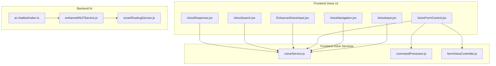

**Diagram sources**
- [VoiceResponse.jsx:1-156](file://Frontend/src/components/voice/VoiceResponse.jsx#L1-L156)
- [VoiceSearch.jsx:1-279](file://Frontend/src/components/voice/VoiceSearch.jsx#L1-L279)
- [EnhancedVoiceInput.jsx:1-116](file://Frontend/src/components/voice/EnhancedVoiceInput.jsx#L1-L116)
- [VoiceFormControl.jsx:1-761](file://Frontend/src/components/voice/VoiceFormControl.jsx#L1-L761)
- [VoiceNavigation.jsx:1-258](file://Frontend/src/components/voice/VoiceNavigation.jsx#L1-L258)
- [VoiceInput.jsx:1-458](file://Frontend/src/components/VoiceInput.jsx#L1-L458)
- [voiceService.js:1-778](file://Frontend/src/services/voiceService.js#L1-L778)
- [commandProcessor.js:1-1048](file://Frontend/src/services/commandProcessor.js#L1-L1048)
- [formVoiceController.js:1-571](file://Frontend/src/services/formVoiceController.js#L1-L571)
- [ai-chatbot/index.ts:1-117](file://Frontend/supabase/functions/ai-chatbot/index.ts#L1-L117)
- [enhancedNLPService.js:1-487](file://backend/src/services/enhancedNLPService.js#L1-L487)
- [smartRoutingService.js:1-199](file://backend/src/services/smartRoutingService.js#L1-L199)

**Section sources**
- [VoiceResponse.jsx:1-156](file://Frontend/src/components/voice/VoiceResponse.jsx#L1-L156)
- [VoiceSearch.jsx:1-279](file://Frontend/src/components/voice/VoiceSearch.jsx#L1-L279)
- [EnhancedVoiceInput.jsx:1-116](file://Frontend/src/components/voice/EnhancedVoiceInput.jsx#L1-L116)
- [VoiceFormControl.jsx:1-761](file://Frontend/src/components/voice/VoiceFormControl.jsx#L1-L761)
- [VoiceNavigation.jsx:1-258](file://Frontend/src/components/voice/VoiceNavigation.jsx#L1-L258)
- [VoiceInput.jsx:1-458](file://Frontend/src/components/VoiceInput.jsx#L1-L458)
- [voiceService.js:1-778](file://Frontend/src/services/voiceService.js#L1-L778)
- [commandProcessor.js:1-1048](file://Frontend/src/services/commandProcessor.js#L1-L1048)
- [formVoiceController.js:1-571](file://Frontend/src/services/formVoiceController.js#L1-L571)
- [VoiceShowcase.jsx:1-407](file://Frontend/src/pages/VoiceShowcase.jsx#L1-L407)
- [AIChatbot.jsx:1-653](file://Frontend/src/components/AIChatbot.jsx#L1-L653)
- [ai-chatbot/index.ts:1-117](file://Frontend/supabase/functions/ai-chatbot/index.ts#L1-L117)
- [enhancedNLPService.js:1-487](file://backend/src/services/enhancedNLPService.js#L1-L487)
- [smartRoutingService.js:1-199](file://backend/src/services/smartRoutingService.js#L1-L199)

## Core Components
- Text-to-Speech Service: Provides TTS with language selection, rate/pitch/volume control, and state management.
- Speech Recognition Service: Continuous listening with final-result processing, auto-restart, and error recovery.
- Voice Command Processing: Intent detection across multiple languages with flexible matching and value extraction.
- Form Voice Controller: Bridges voice commands to form state, validation, and navigation.
- Voice UI Components: VoiceResponse, VoiceSearch, EnhancedVoiceInput, VoiceFormControl, VoiceNavigation, VoiceInput.
- AI Chatbot Integration: Streaming chat with complaint detail extraction and auto-fill prompts.

**Section sources**
- [voiceService.js:114-224](file://Frontend/src/services/voiceService.js#L114-L224)
- [voiceService.js:327-765](file://Frontend/src/services/voiceService.js#L327-L765)
- [commandProcessor.js:453-543](file://Frontend/src/services/commandProcessor.js#L453-L543)
- [formVoiceController.js:117-531](file://Frontend/src/services/formVoiceController.js#L117-L531)
- [VoiceResponse.jsx:20-156](file://Frontend/src/components/voice/VoiceResponse.jsx#L20-L156)
- [VoiceSearch.jsx:19-279](file://Frontend/src/components/voice/VoiceSearch.jsx#L19-L279)
- [EnhancedVoiceInput.jsx:24-116](file://Frontend/src/components/voice/EnhancedVoiceInput.jsx#L24-L116)
- [VoiceFormControl.jsx:244-761](file://Frontend/src/components/voice/VoiceFormControl.jsx#L244-L761)
- [VoiceNavigation.jsx:22-258](file://Frontend/src/components/voice/VoiceNavigation.jsx#L22-L258)
- [VoiceInput.jsx:131-458](file://Frontend/src/components/VoiceInput.jsx#L131-L458)
- [AIChatbot.jsx:175-653](file://Frontend/src/components/AIChatbot.jsx#L175-L653)

## Architecture Overview
The voice system follows a layered architecture:
- Presentation Layer: Voice UI components manage user interaction and feedback.
- Service Layer: voiceService centralizes TTS and speech recognition; commandProcessor handles intent detection; formVoiceController manages form automation.
- Backend Layer: AI chatbot function integrates with external LLM; enhanced NLP service supports multilingual processing; smart routing service handles emergency detection and assignment.

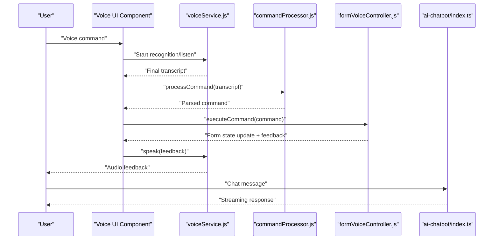

**Diagram sources**
- [VoiceFormControl.jsx:342-396](file://Frontend/src/components/voice/VoiceFormControl.jsx#L342-L396)
- [commandProcessor.js:453-543](file://Frontend/src/services/commandProcessor.js#L453-L543)
- [formVoiceController.js:322-481](file://Frontend/src/services/formVoiceController.js#L322-L481)
- [voiceService.js:114-224](file://Frontend/src/services/voiceService.js#L114-L224)
- [ai-chatbot/index.ts:40-116](file://Frontend/supabase/functions/ai-chatbot/index.ts#L40-L116)

## Detailed Component Analysis

### Text-to-Speech and Speech Recognition Services
- TextToSpeechService: Manages synthesis with language, rate, pitch, volume, and lifecycle control. Provides singleton access and convenience methods for common announcements.
- FormSpeechRecognitionService: Implements continuous listening with final-result processing, auto-restart, silence detection, and robust error handling.

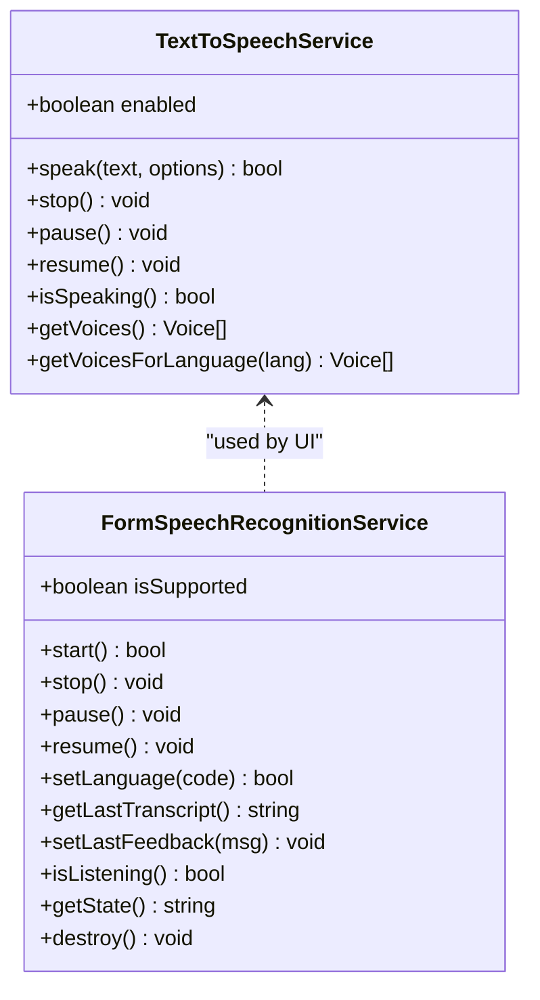

**Diagram sources**
- [voiceService.js:114-224](file://Frontend/src/services/voiceService.js#L114-L224)
- [voiceService.js:327-765](file://Frontend/src/services/voiceService.js#L327-L765)

**Section sources**
- [voiceService.js:114-224](file://Frontend/src/services/voiceService.js#L114-L224)
- [voiceService.js:327-765](file://Frontend/src/services/voiceService.js#L327-L765)

### Voice Response Component
Provides optional audio feedback for status updates and toggles voice responses on/off with persistence and visual indicators.

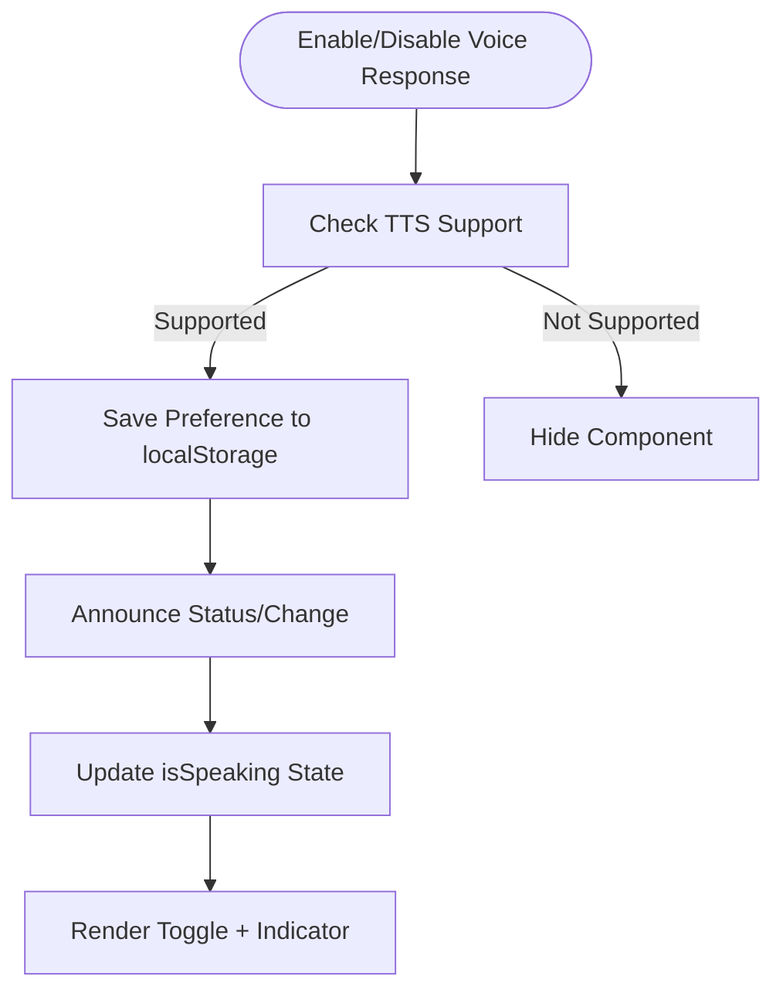

**Diagram sources**
- [VoiceResponse.jsx:31-66](file://Frontend/src/components/voice/VoiceResponse.jsx#L31-L66)
- [VoiceResponse.jsx:125-153](file://Frontend/src/components/voice/VoiceResponse.jsx#L125-L153)

**Section sources**
- [VoiceResponse.jsx:20-156](file://Frontend/src/components/voice/VoiceResponse.jsx#L20-L156)

### Voice Search Component
Implements natural language voice search with interim results, error handling, and visual feedback. Integrates TTS for announcements.

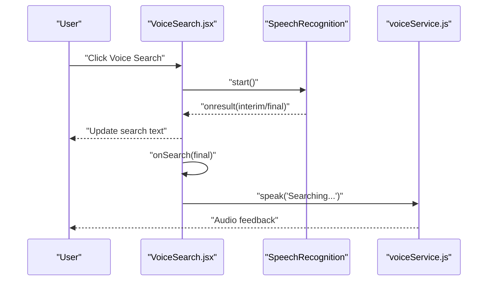

**Diagram sources**
- [VoiceSearch.jsx:34-121](file://Frontend/src/components/voice/VoiceSearch.jsx#L34-L121)
- [voiceService.js:114-224](file://Frontend/src/services/voiceService.js#L114-L224)

**Section sources**
- [VoiceSearch.jsx:19-279](file://Frontend/src/components/voice/VoiceSearch.jsx#L19-L279)

### Enhanced Voice Input Component
Wraps base VoiceInput with multilingual language selection and dynamic placeholders.

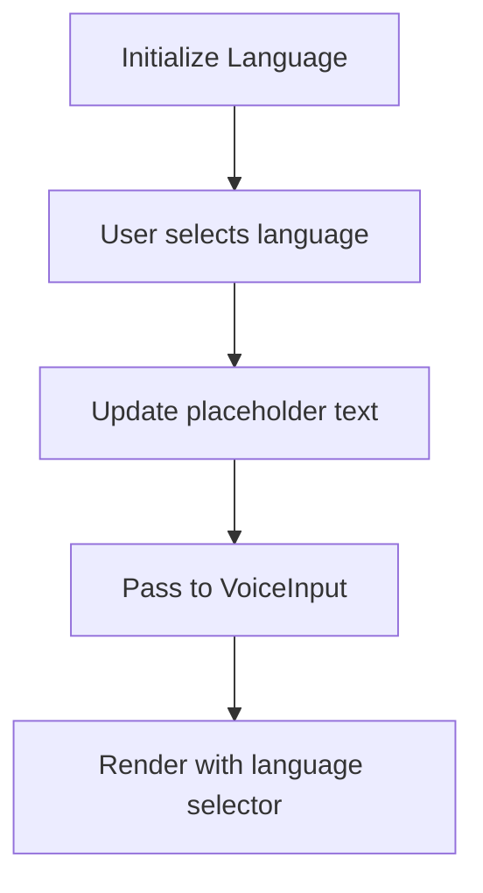

**Diagram sources**
- [EnhancedVoiceInput.jsx:35-48](file://Frontend/src/components/voice/EnhancedVoiceInput.jsx#L35-L48)
- [VoiceInput.jsx:131-458](file://Frontend/src/components/VoiceInput.jsx#L131-L458)

**Section sources**
- [EnhancedVoiceInput.jsx:24-116](file://Frontend/src/components/voice/EnhancedVoiceInput.jsx#L24-L116)
- [VoiceInput.jsx:131-458](file://Frontend/src/components/VoiceInput.jsx#L131-L458)

### Voice Navigation Component
Enables voice-controlled navigation with route mapping, error handling, and audio feedback.

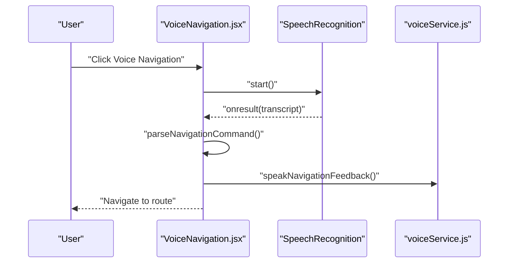

**Diagram sources**
- [VoiceNavigation.jsx:72-138](file://Frontend/src/components/voice/VoiceNavigation.jsx#L72-L138)
- [voiceService.js:254-286](file://Frontend/src/services/voiceService.js#L254-L286)

**Section sources**
- [VoiceNavigation.jsx:22-258](file://Frontend/src/components/voice/VoiceNavigation.jsx#L22-L258)

### Voice Form Control Component
Full-featured voice control for multi-step forms with continuous listening, audio visualization, feedback, and help dialogs.

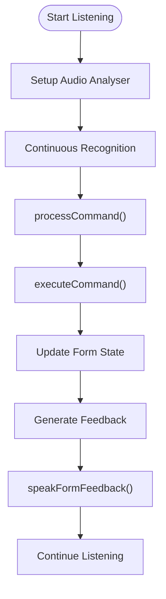

**Diagram sources**
- [VoiceFormControl.jsx:434-478](file://Frontend/src/components/voice/VoiceFormControl.jsx#L434-L478)
- [commandProcessor.js:453-543](file://Frontend/src/services/commandProcessor.js#L453-L543)
- [formVoiceController.js:322-481](file://Frontend/src/services/formVoiceController.js#L322-L481)
- [voiceService.js:769-777](file://Frontend/src/services/voiceService.js#L769-L777)

**Section sources**
- [VoiceFormControl.jsx:244-761](file://Frontend/src/components/voice/VoiceFormControl.jsx#L244-L761)

### Command Processing and Form Voice Controller
- Command Processing: Multi-language intent detection with flexible matching, regex fallback, value extraction, and implicit content handling.
- Form Voice Controller: Field mapping, validation, step navigation, and feedback generation.

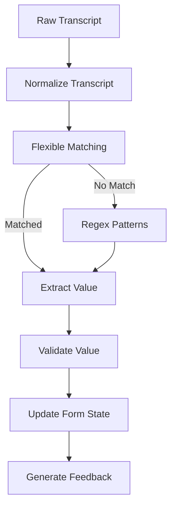

**Diagram sources**
- [commandProcessor.js:453-543](file://Frontend/src/services/commandProcessor.js#L453-L543)
- [formVoiceController.js:139-189](file://Frontend/src/services/formVoiceController.js#L139-L189)

**Section sources**
- [commandProcessor.js:453-800](file://Frontend/src/services/commandProcessor.js#L453-L800)
- [formVoiceController.js:117-531](file://Frontend/src/services/formVoiceController.js#L117-L531)

### AI Chatbot Integration
- Streaming chat with retry logic and offline handling.
- Complaint detail extraction and auto-fill prompts.
- Integration with backend AI chatbot function.

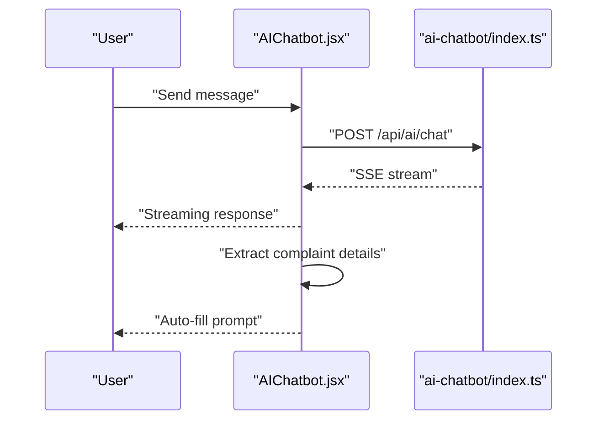

**Diagram sources**
- [AIChatbot.jsx:262-340](file://Frontend/src/components/AIChatbot.jsx#L262-L340)
- [ai-chatbot/index.ts:40-116](file://Frontend/supabase/functions/ai-chatbot/index.ts#L40-L116)

**Section sources**
- [AIChatbot.jsx:175-653](file://Frontend/src/components/AIChatbot.jsx#L175-L653)
- [ai-chatbot/index.ts:1-117](file://Frontend/supabase/functions/ai-chatbot/index.ts#L1-L117)

### Backend AI Services
- Enhanced NLP Service: Multilingual keyword detection, auto-ward detection, duplicate detection with advanced similarity metrics.
- Smart Routing Service: Emergency detection, priority-based routing, auto-assignment, and supervisor notifications.

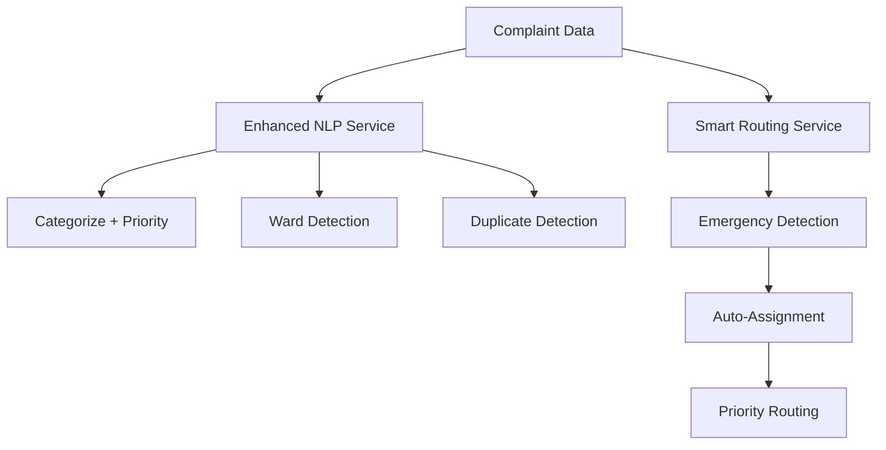

**Diagram sources**
- [enhancedNLPService.js:410-467](file://backend/src/services/enhancedNLPService.js#L410-L467)
- [smartRoutingService.js:160-190](file://backend/src/services/smartRoutingService.js#L160-L190)

**Section sources**
- [enhancedNLPService.js:1-487](file://backend/src/services/enhancedNLPService.js#L1-L487)
- [smartRoutingService.js:1-199](file://backend/src/services/smartRoutingService.js#L1-L199)

## Dependency Analysis
- UI components depend on voiceService for TTS and speech recognition.
- VoiceFormControl depends on commandProcessor and formVoiceController for intent handling and form state management.
- AIChatbot depends on backend ai-chatbot function for streaming responses.
- Backend services (enhancedNLPService, smartRoutingService) provide intelligence for complaint processing.

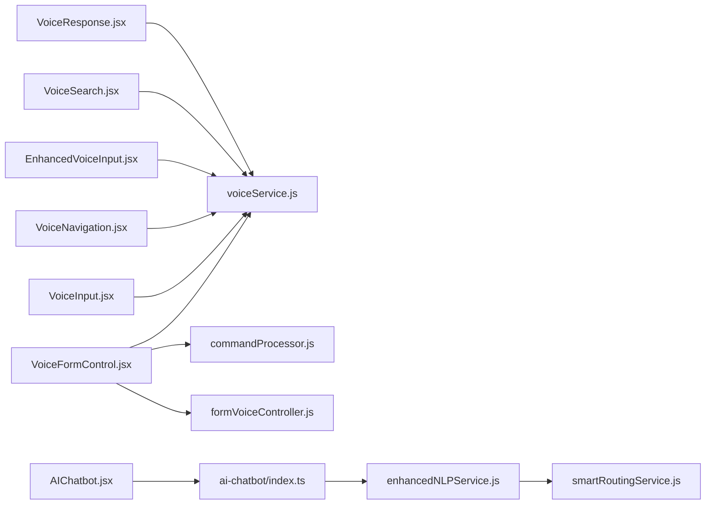

**Diagram sources**
- [VoiceResponse.jsx:1-12](file://Frontend/src/components/voice/VoiceResponse.jsx#L1-L12)
- [VoiceSearch.jsx:1-11](file://Frontend/src/components/voice/VoiceSearch.jsx#L1-L11)
- [EnhancedVoiceInput.jsx:1-16](file://Frontend/src/components/voice/EnhancedVoiceInput.jsx#L1-L16)
- [VoiceNavigation.jsx:1-14](file://Frontend/src/components/voice/VoiceNavigation.jsx#L1-L14)
- [VoiceInput.jsx:1-4](file://Frontend/src/components/VoiceInput.jsx#L1-L4)
- [VoiceFormControl.jsx:1-49](file://Frontend/src/components/voice/VoiceFormControl.jsx#L1-L49)
- [AIChatbot.jsx:1-11](file://Frontend/src/components/AIChatbot.jsx#L1-L11)
- [ai-chatbot/index.ts:1-6](file://Frontend/supabase/functions/ai-chatbot/index.ts#L1-L6)
- [enhancedNLPService.js:1-12](file://backend/src/services/enhancedNLPService.js#L1-L12)
- [smartRoutingService.js:1-3](file://backend/src/services/smartRoutingService.js#L1-L3)

**Section sources**
- [VoiceResponse.jsx:1-12](file://Frontend/src/components/voice/VoiceResponse.jsx#L1-L12)
- [VoiceSearch.jsx:1-11](file://Frontend/src/components/voice/VoiceSearch.jsx#L1-L11)
- [EnhancedVoiceInput.jsx:1-16](file://Frontend/src/components/voice/EnhancedVoiceInput.jsx#L1-L16)
- [VoiceNavigation.jsx:1-14](file://Frontend/src/components/voice/VoiceNavigation.jsx#L1-L14)
- [VoiceInput.jsx:1-4](file://Frontend/src/components/VoiceInput.jsx#L1-L4)
- [VoiceFormControl.jsx:1-49](file://Frontend/src/components/voice/VoiceFormControl.jsx#L1-L49)
- [AIChatbot.jsx:1-11](file://Frontend/src/components/AIChatbot.jsx#L1-L11)
- [ai-chatbot/index.ts:1-6](file://Frontend/supabase/functions/ai-chatbot/index.ts#L1-L6)
- [enhancedNLPService.js:1-12](file://backend/src/services/enhancedNLPService.js#L1-L12)
- [smartRoutingService.js:1-3](file://backend/src/services/smartRoutingService.js#L1-L3)

## Performance Considerations
- Continuous listening with auto-restart reduces interruptions; silence detection prevents unnecessary restarts.
- Final-result processing minimizes partial text processing overhead.
- Audio analyser and waveform visualization are only active during recording to conserve resources.
- Streaming AI responses reduce latency and memory usage compared to batch processing.
- Local storage for preferences avoids repeated initialization costs.

## Troubleshooting Guide
Common issues and resolutions:
- Browser support: Check SpeechRecognition and speechSynthesis availability; components gracefully fail if unsupported.
- Microphone access: Handle "not-allowed" errors with user-friendly messages and guidance.
- Network errors: Implement retry logic with exponential backoff for AI chatbot.
- Recognition errors: Silent recovery for "no-speech" and "aborted"; network/audio-capture handled with graceful degradation.
- Form voice control: Use feedback messages for validation errors; provide help dialog for available commands.

**Section sources**
- [VoiceSearch.jsx:87-120](file://Frontend/src/components/voice/VoiceSearch.jsx#L87-L120)
- [VoiceNavigation.jsx:110-137](file://Frontend/src/components/voice/VoiceNavigation.jsx#L110-L137)
- [VoiceFormControl.jsx:467-508](file://Frontend/src/components/voice/VoiceFormControl.jsx#L467-L508)
- [AIChatbot.jsx:274-284](file://Frontend/src/components/AIChatbot.jsx#L274-L284)

## Conclusion
The voice response and interaction system delivers a comprehensive, accessible, and user-friendly voice-first experience. It leverages Web Speech APIs for client-side processing, integrates AI-powered chatbot responses, and provides robust multilingual support. The modular architecture ensures zero-regression enhancements, excellent accessibility for visually impaired users, and seamless integration with assistive technologies.

## Appendices

### Accessibility Features
- Multilingual support with language selection and localized feedback.
- Audio announcements for navigation, form feedback, and status updates.
- Visual indicators for listening state, interim results, and errors.
- Keyboard navigation and screen reader compatibility through semantic markup.
- Voice input with waveform visualization for real-time feedback.

**Section sources**
- [VoiceFormControl.jsx:63-120](file://Frontend/src/components/voice/VoiceFormControl.jsx#L63-L120)
- [VoiceSearch.jsx:232-274](file://Frontend/src/components/voice/VoiceSearch.jsx#L232-L274)
- [VoiceNavigation.jsx:184-254](file://Frontend/src/components/voice/VoiceNavigation.jsx#L184-L254)

### Implementation Examples
- Voice feedback integration: Use VoiceResponse component and useVoiceNotifications hook for status updates.
- Search result narration: Integrate VoiceSearch with onSearch callback and TTS feedback.
- Interactive voice assistance: Deploy VoiceFormControl for guided form completion with audio feedback and help dialog.

**Section sources**
- [VoiceResponse.jsx:125-153](file://Frontend/src/components/voice/VoiceResponse.jsx#L125-L153)
- [VoiceSearch.jsx:131-136](file://Frontend/src/components/voice/VoiceSearch.jsx#L131-L136)
- [VoiceFormControl.jsx:283-301](file://Frontend/src/components/voice/VoiceFormControl.jsx#L283-L301)