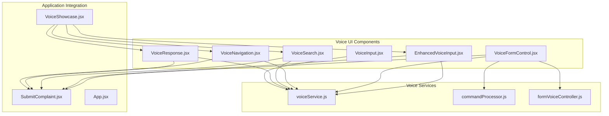
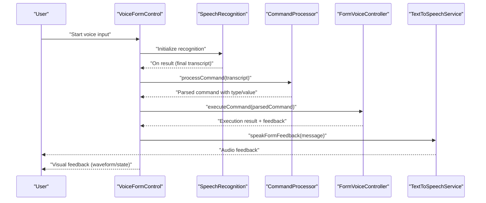
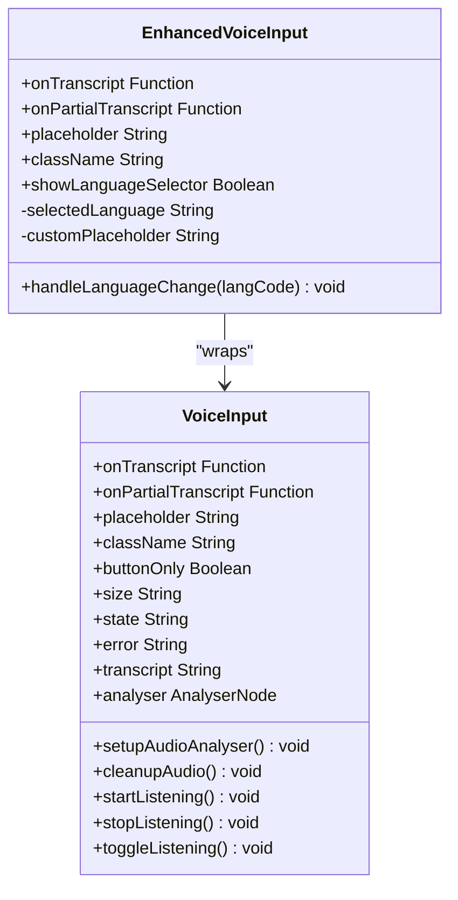
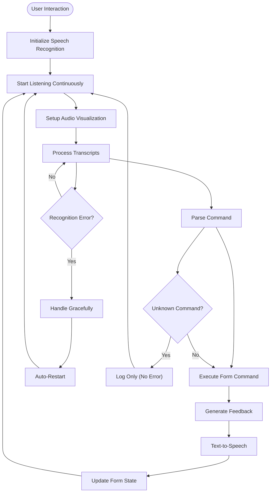
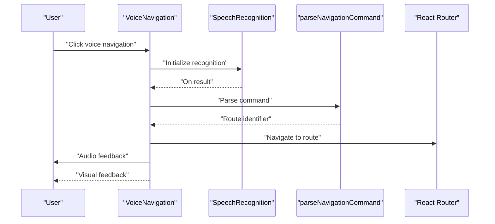
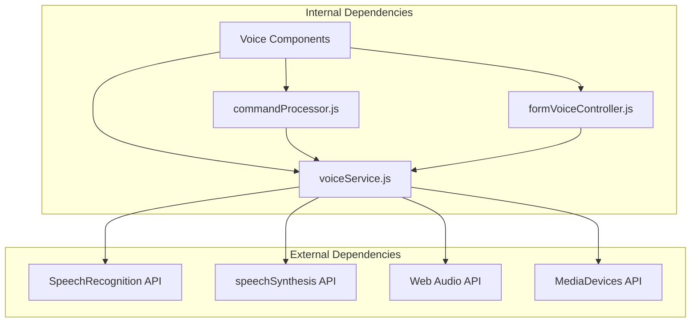

# Voice-Enabled Complaint System

<cite>
**Referenced Files in This Document**
- [EnhancedVoiceInput.jsx](file://Frontend/src/components/voice/EnhancedVoiceInput.jsx)
- [VoiceFormControl.jsx](file://Frontend/src/components/voice/VoiceFormControl.jsx)
- [VoiceNavigation.jsx](file://Frontend/src/components/voice/VoiceNavigation.jsx)
- [VoiceResponse.jsx](file://Frontend/src/components/voice/VoiceResponse.jsx)
- [VoiceSearch.jsx](file://Frontend/src/components/voice/VoiceSearch.jsx)
- [VoiceInput.jsx](file://Frontend/src/components/VoiceInput.jsx)
- [voiceService.js](file://Frontend/src/services/voiceService.js)
- [commandProcessor.js](file://Frontend/src/services/commandProcessor.js)
- [formVoiceController.js](file://Frontend/src/services/formVoiceController.js)
- [SubmitComplaint.jsx](file://Frontend/src/pages/SubmitComplaint.jsx)
- [VoiceShowcase.jsx](file://Frontend/src/pages/VoiceShowcase.jsx)
- [App.jsx](file://Frontend/src/App.jsx)
</cite>

## Table of Contents
1. [Introduction](#introduction)
2. [Project Structure](#project-structure)
3. [Core Components](#core-components)
4. [Architecture Overview](#architecture-overview)
5. [Detailed Component Analysis](#detailed-component-analysis)
6. [Dependency Analysis](#dependency-analysis)
7. [Performance Considerations](#performance-considerations)
8. [Troubleshooting Guide](#troubleshooting-guide)
9. [Conclusion](#conclusion)

## Introduction
This document provides comprehensive technical documentation for the voice-enabled complaint submission system. It explains the speech recognition implementation, audio processing pipeline, waveform visualization components, voice navigation, voice search, and voice response generation. The system integrates browser APIs for microphone access and text-to-speech synthesis, supports multilingual voice commands, and provides real-time audio feedback. The documentation covers browser API integration, microphone permissions, audio quality optimization, fallback mechanisms, error handling strategies, and accessibility considerations for users with disabilities.

## Project Structure
The voice system is organized around modular React components and centralized services:

- Voice UI Components: Enhanced voice input, voice form control, voice navigation, voice search, and voice response
- Voice Services: Speech recognition, text-to-speech, command processing, and form voice controller
- Application Integration: Voice components integrated into the complaint submission flow and showcase pages

**Diagram sources**
- [EnhancedVoiceInput.jsx:1-116](file://Frontend/src/components/voice/EnhancedVoiceInput.jsx#L1-L116)
- [VoiceFormControl.jsx:1-761](file://Frontend/src/components/voice/VoiceFormControl.jsx#L1-L761)
- [VoiceNavigation.jsx:1-258](file://Frontend/src/components/voice/VoiceNavigation.jsx#L1-L258)
- [VoiceSearch.jsx:1-279](file://Frontend/src/components/voice/VoiceSearch.jsx#L1-L279)
- [VoiceResponse.jsx:1-156](file://Frontend/src/components/voice/VoiceResponse.jsx#L1-L156)
- [VoiceInput.jsx:1-458](file://Frontend/src/components/VoiceInput.jsx#L1-L458)
- [voiceService.js:1-778](file://Frontend/src/services/voiceService.js#L1-L778)
- [commandProcessor.js:1-1048](file://Frontend/src/services/commandProcessor.js#L1-L1048)
- [formVoiceController.js:1-571](file://Frontend/src/services/formVoiceController.js#L1-L571)
- [SubmitComplaint.jsx:1-973](file://Frontend/src/pages/SubmitComplaint.jsx#L1-L973)
- [VoiceShowcase.jsx:1-407](file://Frontend/src/pages/VoiceShowcase.jsx#L1-L407)
- [App.jsx:1-218](file://Frontend/src/App.jsx#L1-L218)

**Section sources**
- [EnhancedVoiceInput.jsx:1-116](file://Frontend/src/components/voice/EnhancedVoiceInput.jsx#L1-L116)
- [VoiceFormControl.jsx:1-761](file://Frontend/src/components/voice/VoiceFormControl.jsx#L1-L761)
- [VoiceNavigation.jsx:1-258](file://Frontend/src/components/voice/VoiceNavigation.jsx#L1-L258)
- [VoiceSearch.jsx:1-279](file://Frontend/src/components/voice/VoiceSearch.jsx#L1-L279)
- [VoiceResponse.jsx:1-156](file://Frontend/src/components/voice/VoiceResponse.jsx#L1-L156)
- [VoiceInput.jsx:1-458](file://Frontend/src/components/VoiceInput.jsx#L1-L458)
- [voiceService.js:1-778](file://Frontend/src/services/voiceService.js#L1-L778)
- [commandProcessor.js:1-1048](file://Frontend/src/services/commandProcessor.js#L1-L1048)
- [formVoiceController.js:1-571](file://Frontend/src/services/formVoiceController.js#L1-L571)
- [SubmitComplaint.jsx:1-973](file://Frontend/src/pages/SubmitComplaint.jsx#L1-L973)
- [VoiceShowcase.jsx:1-407](file://Frontend/src/pages/VoiceShowcase.jsx#L1-L407)
- [App.jsx:1-218](file://Frontend/src/App.jsx#L1-L218)

## Core Components
This section documents the primary voice-enabled components and their responsibilities:

- EnhancedVoiceInput: Multilingual voice input wrapper extending the base VoiceInput with language selection and dynamic placeholders
- VoiceFormControl: Hands-free form control with continuous listening, audio visualization, command processing, and TTS feedback
- VoiceNavigation: Voice-driven navigation across application routes with error handling and audio feedback
- VoiceSearch: Natural language voice search with interim results and processing states
- VoiceResponse: Optional voice feedback for complaint status updates with persistence and manual control
- VoiceInput: Core voice input with waveform visualization, microphone permissions, and state management

**Section sources**
- [EnhancedVoiceInput.jsx:24-116](file://Frontend/src/components/voice/EnhancedVoiceInput.jsx#L24-L116)
- [VoiceFormControl.jsx:244-761](file://Frontend/src/components/voice/VoiceFormControl.jsx#L244-L761)
- [VoiceNavigation.jsx:22-258](file://Frontend/src/components/voice/VoiceNavigation.jsx#L22-L258)
- [VoiceSearch.jsx:19-279](file://Frontend/src/components/voice/VoiceSearch.jsx#L19-L279)
- [VoiceResponse.jsx:20-156](file://Frontend/src/components/voice/VoiceResponse.jsx#L20-L156)
- [VoiceInput.jsx:131-458](file://Frontend/src/components/VoiceInput.jsx#L131-L458)

## Architecture Overview
The voice system follows a layered architecture with clear separation of concerns:

- Presentation Layer: React components handling UI, user interactions, and visual feedback
- Service Layer: Centralized voice services managing speech recognition, text-to-speech, and command processing
- Business Logic Layer: Form voice controller orchestrating form state transitions and validations
- Integration Layer: Browser APIs for microphone access, audio analysis, and speech synthesis

**Diagram sources**
- [VoiceFormControl.jsx:342-396](file://Frontend/src/components/voice/VoiceFormControl.jsx#L342-L396)
- [commandProcessor.js:453-543](file://Frontend/src/services/commandProcessor.js#L453-L543)
- [formVoiceController.js:322-481](file://Frontend/src/services/formVoiceController.js#L322-L481)
- [voiceService.js:763-778](file://Frontend/src/services/voiceService.js#L763-L778)

**Section sources**
- [VoiceFormControl.jsx:342-432](file://Frontend/src/components/voice/VoiceFormControl.jsx#L342-L432)
- [commandProcessor.js:453-543](file://Frontend/src/services/commandProcessor.js#L453-L543)
- [formVoiceController.js:322-481](file://Frontend/src/services/formVoiceController.js#L322-L481)
- [voiceService.js:327-778](file://Frontend/src/services/voiceService.js#L327-L778)

## Detailed Component Analysis

### Enhanced Voice Input Component
The EnhancedVoiceInput extends the base VoiceInput with multilingual capabilities and dynamic language switching. It wraps the existing component without modifying core functionality, ensuring zero-regression.

Key features:
- Language selector dropdown with supported languages (English US/UK, Hindi, Marathi)
- Dynamic placeholder updates based on selected language
- Seamless integration with existing VoiceInput component
- Smooth animations using Framer Motion

**Diagram sources**
- [EnhancedVoiceInput.jsx:24-116](file://Frontend/src/components/voice/EnhancedVoiceInput.jsx#L24-L116)
- [VoiceInput.jsx:131-458](file://Frontend/src/components/VoiceInput.jsx#L131-L458)

**Section sources**
- [EnhancedVoiceInput.jsx:24-116](file://Frontend/src/components/voice/EnhancedVoiceInput.jsx#L24-L116)
- [VoiceInput.jsx:131-458](file://Frontend/src/components/VoiceInput.jsx#L131-L458)

### Voice Form Control Component
The VoiceFormControl provides comprehensive hands-free form control with continuous listening, audio visualization, and multilingual support. It serves as the central hub for voice-driven complaint submission.

Core functionality:
- Continuous speech recognition with auto-restart capability
- Real-time audio waveform visualization using Web Audio API
- Command processing with flexible matching and confidence scoring
- Form state management and validation
- Comprehensive error handling and user feedback
- Text-to-speech integration for accessibility

**Diagram sources**
- [VoiceFormControl.jsx:398-478](file://Frontend/src/components/voice/VoiceFormControl.jsx#L398-L478)
- [voiceService.js:327-758](file://Frontend/src/services/voiceService.js#L327-L758)
- [commandProcessor.js:453-543](file://Frontend/src/services/commandProcessor.js#L453-L543)

**Section sources**
- [VoiceFormControl.jsx:244-761](file://Frontend/src/components/voice/VoiceFormControl.jsx#L244-L761)
- [voiceService.js:327-778](file://Frontend/src/services/voiceService.js#L327-L778)
- [commandProcessor.js:453-543](file://Frontend/src/services/commandProcessor.js#L453-L543)

### Voice Navigation Component
The VoiceNavigation component enables hands-free navigation throughout the application using voice commands. It provides immediate audio feedback and graceful degradation when unsupported.

Key features:
- Route mapping for multiple application pages
- Natural language command parsing
- Real-time error handling and user notifications
- Audio feedback for successful navigation
- Graceful failure when browser APIs are unavailable

**Diagram sources**
- [VoiceNavigation.jsx:45-108](file://Frontend/src/components/voice/VoiceNavigation.jsx#L45-L108)
- [voiceService.js:96-109](file://Frontend/src/services/voiceService.js#L96-L109)

**Section sources**
- [VoiceNavigation.jsx:22-258](file://Frontend/src/components/voice/VoiceNavigation.jsx#L22-L258)
- [voiceService.js:25-46](file://Frontend/src/services/voiceService.js#L25-L46)

### Voice Search Component
The VoiceSearch component provides natural language voice search for complaints and issues. It supports both voice and text input modes with interim results and processing states.

Implementation highlights:
- Dual-mode operation (voice/text)
- Interim results display during speech
- Processing state indication
- Error handling for various speech recognition scenarios
- Microphone permission and availability checks

**Section sources**
- [VoiceSearch.jsx:19-279](file://Frontend/src/components/voice/VoiceSearch.jsx#L19-L279)
- [voiceService.js:51-61](file://Frontend/src/services/voiceService.js#L51-L61)

### Voice Response Component
The VoiceResponse component provides optional audio feedback for complaint status updates. It persists user preferences and offers manual control over audio announcements.

Features:
- Local storage persistence for user preferences
- Manual toggle control with visual indicators
- Stop button for active audio playback
- Accessibility-focused design with proper state monitoring

**Section sources**
- [VoiceResponse.jsx:20-156](file://Frontend/src/components/voice/VoiceResponse.jsx#L20-L156)

### Voice Input Component
The VoiceInput component provides core voice-to-text functionality with waveform visualization and comprehensive error handling.

Technical implementation:
- Web Audio API integration for real-time audio analysis
- Canvas-based waveform visualization with animated gradients
- State management for recording, processing, and error states
- Microphone permission handling and graceful degradation
- Smooth animations and visual feedback using Framer Motion

**Section sources**
- [VoiceInput.jsx:1-458](file://Frontend/src/components/VoiceInput.jsx#L1-L458)

## Dependency Analysis
The voice system exhibits well-structured dependencies with clear separation of concerns:

**Diagram sources**
- [voiceService.js:1-778](file://Frontend/src/services/voiceService.js#L1-L778)
- [commandProcessor.js:1-1048](file://Frontend/src/services/commandProcessor.js#L1-L1048)
- [formVoiceController.js:1-571](file://Frontend/src/services/formVoiceController.js#L1-L571)

**Section sources**
- [voiceService.js:1-778](file://Frontend/src/services/voiceService.js#L1-L778)
- [commandProcessor.js:1-1048](file://Frontend/src/services/commandProcessor.js#L1-L1048)
- [formVoiceController.js:1-571](file://Frontend/src/services/formVoiceController.js#L1-L571)

## Performance Considerations
The voice system implements several performance optimizations:

- Audio resource management: Proper cleanup of media streams and audio contexts to prevent memory leaks
- Auto-restart mechanism: Intelligent restart logic for speech recognition with configurable delays and limits
- Confidence scoring: Command parsing with confidence thresholds to reduce false positives
- Debounced AI categorization: 1.5-second debounce for AI-powered complaint categorization
- Efficient state updates: Minimal re-renders through selective state management
- Canvas optimization: RequestAnimationFrame-based drawing for smooth waveform visualization

## Troubleshooting Guide

### Common Issues and Solutions

**Speech Recognition Not Supported**
- Check browser compatibility and enable Web Speech API
- Verify HTTPS deployment for microphone access
- Test in supported browsers (Chrome, Edge, Safari)

**Microphone Access Denied**
- Ensure proper HTTPS deployment
- Check browser permissions settings
- Verify microphone hardware functionality
- Implement fallback to text input mode

**Audio Quality Issues**
- Test with different microphones and environments
- Adjust browser audio settings
- Implement echo cancellation and noise suppression
- Provide visual feedback for audio levels

**Command Recognition Failures**
- Improve ambient noise conditions
- Speak clearly and at normal pace
- Use predefined command phrases
- Implement retry mechanisms

**Text-to-Speech Problems**
- Check browser speech synthesis support
- Verify audio output device functionality
- Implement fallback to visual feedback
- Test with different voice options

**Section sources**
- [VoiceFormControl.jsx:412-421](file://Frontend/src/components/voice/VoiceFormControl.jsx#L412-L421)
- [VoiceInput.jsx:231-255](file://Frontend/src/components/VoiceInput.jsx#L231-L255)
- [voiceService.js:51-61](file://Frontend/src/services/voiceService.js#L51-L61)

## Conclusion
The voice-enabled complaint submission system demonstrates a comprehensive implementation of browser-based voice technologies. The system successfully integrates speech recognition, text-to-speech synthesis, and real-time audio feedback while maintaining accessibility and user experience. The modular architecture ensures maintainability and extensibility, with clear separation between presentation, service, and business logic layers. The implementation showcases best practices in error handling, performance optimization, and user interface design for voice-enabled applications.